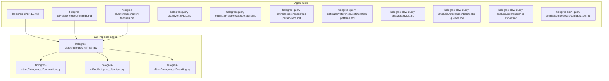
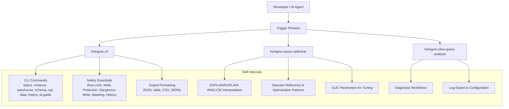
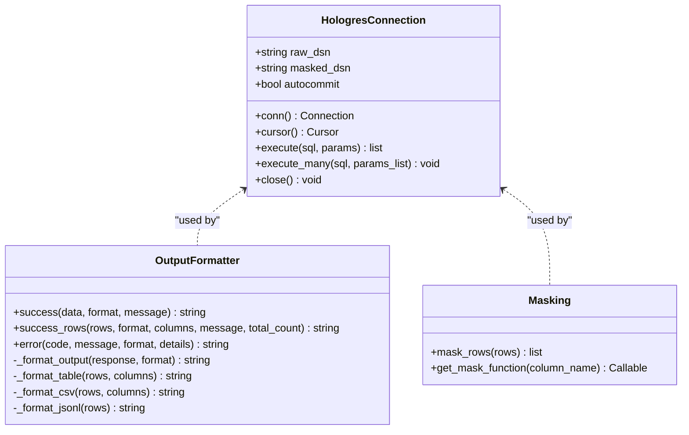
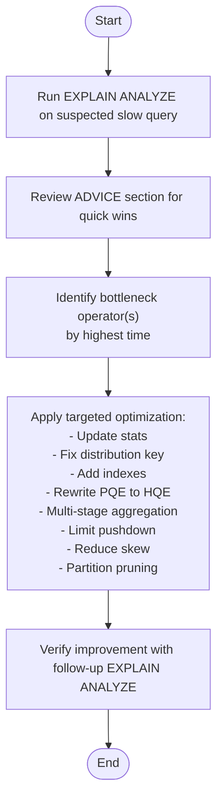
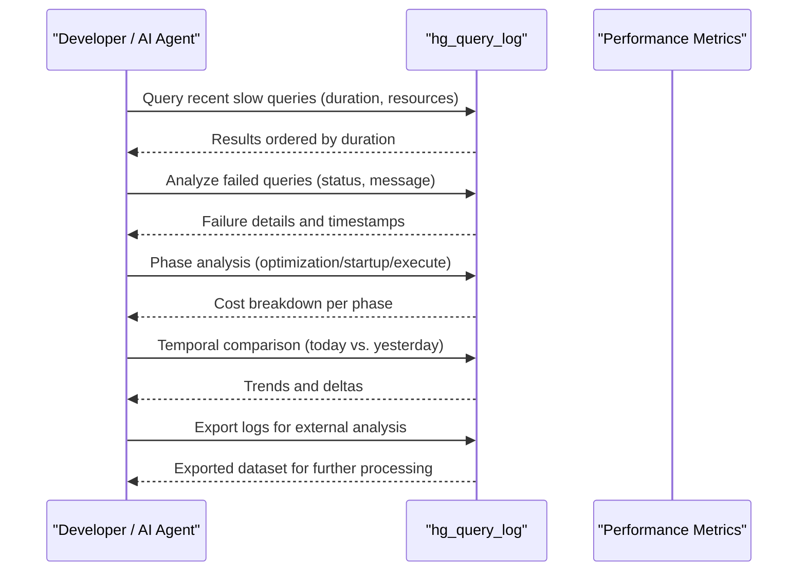
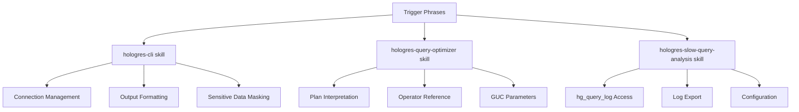

# AI Agent Skills

<cite>
**Referenced Files in This Document**
- [SKILL.md](file://agent-skills/skills/hologres-cli/SKILL.md)
- [commands.md](file://agent-skills/skills/hologres-cli/references/commands.md)
- [safety-features.md](file://agent-skills/skills/hologres-cli/references/safety-features.md)
- [SKILL.md](file://agent-skills/skills/hologres-query-optimizer/SKILL.md)
- [operators.md](file://agent-skills/skills/hologres-query-optimizer/references/operators.md)
- [guc-parameters.md](file://agent-skills/skills/hologres-query-optimizer/references/guc-parameters.md)
- [optimization-patterns.md](file://agent-skills/skills/hologres-query-optimizer/references/optimization-patterns.md)
- [SKILL.md](file://agent-skills/skills/hologres-slow-query-analysis/SKILL.md)
- [diagnostic-queries.md](file://agent-skills/skills/hologres-slow-query-analysis/references/diagnostic-queries.md)
- [log-export.md](file://agent-skills/skills/hologres-slow-query-analysis/references/log-export.md)
- [configuration.md](file://agent-skills/skills/hologres-slow-query-analysis/references/configuration.md)
- [main.py](file://hologres-cli/src/hologres_cli/main.py)
- [connection.py](file://hologres-cli/src/hologres_cli/connection.py)
- [output.py](file://hologres-cli/src/hologres_cli/output.py)
- [masking.py](file://hologres-cli/src/hologres_cli/masking.py)
</cite>

## Table of Contents
1. [Introduction](#introduction)
2. [Project Structure](#project-structure)
3. [Core Components](#core-components)
4. [Architecture Overview](#architecture-overview)
5. [Detailed Component Analysis](#detailed-component-analysis)
6. [Dependency Analysis](#dependency-analysis)
7. [Performance Considerations](#performance-considerations)
8. [Troubleshooting Guide](#troubleshooting-guide)
9. [Conclusion](#conclusion)
10. [Appendices](#appendices)

## Introduction
This document describes the AI Agent Skills collection designed to empower AI coding assistants and IDE copilots with domain-specific knowledge for Hologres database management. It explains how three pre-built skills enhance agent capabilities:
- hologres-cli: AI-agent-friendly CLI with safety guardrails and structured JSON output for database operations, schema inspection, SQL execution, and data import/export.
- hologres-query-optimizer: Execution plan analyzer and optimizer using EXPLAIN/EXPLAIN ANALYZE, operator interpretation, and optimization recommendations.
- hologres-slow-query-analysis: Diagnosis of slow and failed queries leveraging the hg_query_log system table, with diagnostic workflows and configuration guidance.

Each skill defines trigger phrases and activation patterns to integrate seamlessly with AI coding platforms. Practical examples illustrate how these skills reduce developer cognitive load and improve productivity when working with Hologres.

## Project Structure
The repository organizes skills under agent-skills/skills with detailed markdown documentation and references. The hologres-cli package provides the underlying CLI implementation used by the hologres-cli skill.

**Diagram sources**
- [SKILL.md](file://agent-skills/skills/hologres-cli/SKILL.md)
- [commands.md](file://agent-skills/skills/hologres-cli/references/commands.md)
- [safety-features.md](file://agent-skills/skills/hologres-cli/references/safety-features.md)
- [SKILL.md](file://agent-skills/skills/hologres-query-optimizer/SKILL.md)
- [operators.md](file://agent-skills/skills/hologres-query-optimizer/references/operators.md)
- [guc-parameters.md](file://agent-skills/skills/hologres-query-optimizer/references/guc-parameters.md)
- [optimization-patterns.md](file://agent-skills/skills/hologres-query-optimizer/references/optimization-patterns.md)
- [SKILL.md](file://agent-skills/skills/hologres-slow-query-analysis/SKILL.md)
- [diagnostic-queries.md](file://agent-skills/skills/hologres-slow-query-analysis/references/diagnostic-queries.md)
- [log-export.md](file://agent-skills/skills/hologres-slow-query-analysis/references/log-export.md)
- [configuration.md](file://agent-skills/skills/hologres-slow-query-analysis/references/configuration.md)
- [main.py](file://hologres-cli/src/hologres_cli/main.py)
- [connection.py](file://hologres-cli/src/hologres_cli/connection.py)
- [output.py](file://hologres-cli/src/hologres_cli/output.py)
- [masking.py](file://hologres-cli/src/hologres_cli/masking.py)

**Section sources**
- [SKILL.md](file://agent-skills/skills/hologres-cli/SKILL.md)
- [SKILL.md](file://agent-skills/skills/hologres-query-optimizer/SKILL.md)
- [SKILL.md](file://agent-skills/skills/hologres-slow-query-analysis/SKILL.md)
- [main.py](file://hologres-cli/src/hologres_cli/main.py)

## Core Components
- hologres-cli skill
  - Purpose: AI-agent-friendly CLI with safety guardrails and structured JSON output.
  - Key capabilities:
    - Connection configuration via DSN (CLI flag, environment variable, config file).
    - Core commands: status, instance, warehouse, schema (tables, describe, dump), sql (read-only and write), data (export, import, count), history, ai-guide.
    - Output formats: JSON (default), table, CSV, JSON Lines.
    - Safety features: row limit protection, write protection, dangerous write blocking, sensitive data masking, audit logging.
  - Trigger phrases: "hologres cli", "hologres command", "hologres database", "hologres查询".
  - Activation pattern: Natural-language prompts that map to CLI commands and options.

- hologres-query-optimizer skill
  - Purpose: Analyze and optimize Hologres SQL using EXPLAIN and EXPLAIN ANALYZE.
  - Key capabilities:
    - Interpreting estimated vs. actual plans, operators, and metrics.
    - Guidance on ADVICE, cost breakdown, and resource consumption.
    - Optimization workflow and patterns: statistics updates, distribution keys, indexes, join/order controls, PQE-to-HQE rewrites, multi-stage aggregation, limit pushdown, skew reduction, partition pruning.
    - GUC parameters for tuning.
  - Trigger phrases: "hologres explain", "query plan", "execution plan", "sql optimization", "query performance", "hologres performance", "slow query", "query optimizer", "explain analyze".

- hologres-slow-query-analysis skill
  - Purpose: Diagnose slow and failed queries using the hg_query_log system table.
  - Key capabilities:
    - Diagnostic workflows: find resource-heavy queries, failed queries, phase analysis, and temporal comparisons.
    - Key fields reference and configuration parameters (thresholds, retention).
    - Log export to internal or external tables.
  - Trigger phrases: "hologres slow query", "hg_query_log", "query diagnosis", "慢Query分析", "Hologres性能诊断".

**Section sources**
- [SKILL.md](file://agent-skills/skills/hologres-cli/SKILL.md)
- [commands.md](file://agent-skills/skills/hologres-cli/references/commands.md)
- [safety-features.md](file://agent-skills/skills/hologres-cli/references/safety-features.md)
- [SKILL.md](file://agent-skills/skills/hologres-query-optimizer/SKILL.md)
- [operators.md](file://agent-skills/skills/hologres-query-optimizer/references/operators.md)
- [guc-parameters.md](file://agent-skills/skills/hologres-query-optimizer/references/guc-parameters.md)
- [optimization-patterns.md](file://agent-skills/skills/hologres-query-optimizer/references/optimization-patterns.md)
- [SKILL.md](file://agent-skills/skills/hologres-slow-query-analysis/SKILL.md)
- [diagnostic-queries.md](file://agent-skills/skills/hologres-slow-query-analysis/references/diagnostic-queries.md)
- [log-export.md](file://agent-skills/skills/hologres-slow-query-analysis/references/log-export.md)
- [configuration.md](file://agent-skills/skills/hologres-slow-query-analysis/references/configuration.md)

## Architecture Overview
The skills are designed as declarative knowledge packages with trigger phrases and structured documentation. They integrate with AI coding platforms by recognizing natural-language activations and routing to relevant command sets or analytical workflows. The hologres-cli skill’s CLI implementation provides the operational foundation for the first skill.

[No sources needed since this diagram shows conceptual workflow, not actual code structure]

## Detailed Component Analysis

### hologres-cli Skill
The hologres-cli skill provides an AI-agent-friendly CLI with safety guardrails and structured JSON output. It supports database operations, schema inspection, SQL execution, and data import/export. The CLI resolves DSN from multiple sources, enforces safety rules, and formats output consistently.

**Diagram sources**
- [connection.py](file://hologres-cli/src/hologres_cli/connection.py)
- [output.py](file://hologres-cli/src/hologres_cli/output.py)
- [masking.py](file://hologres-cli/src/hologres_cli/masking.py)

Key capabilities and behaviors:
- Connection management
  - DSN resolution priority: CLI flag, environment variable, config file (~/.hologres/config.env).
  - DSN parsing and connection parameters with defaults and keepalives.
- Command surface
  - Core commands: status, instance, warehouse, schema (tables, describe, dump), sql (read-only and write), data (export, import, count), history, ai-guide.
  - Output formats: JSON (default), table, CSV, JSONL.
- Safety features
  - Row limit protection: queries without LIMIT returning >100 rows fail with a specific error code; can be disabled via option.
  - Write protection: mutation operations require an explicit flag; otherwise blocked with a specific error code.
  - Dangerous write blocking: DELETE/UPDATE without WHERE clause are blocked; intentional full-table operations require WHERE true or TRUNCATE.
  - Sensitive data masking: auto-masks by column name patterns; can be disabled per-command.
  - Audit logging: command history stored in a JSONL file for accountability.
- Error handling
  - Structured JSON responses with standardized error codes and messages.
  - Distinct error codes for connection, query, limit-required, write-guard, and dangerous-write scenarios.

Integration with AI coding platforms:
- Trigger phrases activate the skill; the agent translates natural language into CLI commands and options.
- Structured JSON output enables downstream automation and agent reasoning.
- Safety guardrails reduce risk during autonomous operations.

Practical examples:
- Quickly check connectivity and server info before running batch operations.
- Export large datasets using dedicated data export commands instead of ad-hoc SQL to bypass row limits.
- Generate an AI agent guide to tailor interactions to the current schema.

**Section sources**
- [SKILL.md](file://agent-skills/skills/hologres-cli/SKILL.md)
- [commands.md](file://agent-skills/skills/hologres-cli/references/commands.md)
- [safety-features.md](file://agent-skills/skills/hologres-cli/references/safety-features.md)
- [main.py](file://hologres-cli/src/hologres_cli/main.py)
- [connection.py](file://hologres-cli/src/hologres_cli/connection.py)
- [output.py](file://hologres-cli/src/hologres_cli/output.py)
- [masking.py](file://hologres-cli/src/hologres_cli/masking.py)

### hologres-query-optimizer Skill
The hologres-query-optimizer skill interprets execution plans and provides actionable optimization guidance. It leverages EXPLAIN and EXPLAIN ANALYZE, operator semantics, and GUC parameters to diagnose bottlenecks and suggest improvements.

**Diagram sources**
- [SKILL.md](file://agent-skills/skills/hologres-query-optimizer/SKILL.md)
- [operators.md](file://agent-skills/skills/hologres-query-optimizer/references/operators.md)
- [guc-parameters.md](file://agent-skills/skills/hologres-query-optimizer/references/guc-parameters.md)
- [optimization-patterns.md](file://agent-skills/skills/hologres-query-optimizer/references/optimization-patterns.md)

Key capabilities and behaviors:
- Plan interpretation
  - Distinguish estimated (EXPLAIN) vs. actual (EXPLAIN ANALYZE) plans.
  - Understand metrics: cost, rows, width, dop_in:dop_out, time, rows variance, mem, open, get_next.
  - ADVICE section highlights missing indexes, stats, and skew.
- Operator reference
  - Scan operators (Seq Scan, Index Scan, Index Seek).
  - Filter operators (Filter, Segment Filter, Cluster Filter, Bitmap Filter).
  - Data movement (Local Gather, Gather, Redistribution, Broadcast).
  - Join operators (Hash Join, Nested Loop, Cross Join).
  - Aggregation (HashAggregate, partial/final stages).
  - Others (Sort, Limit, ExecuteExternalSQL, Decode, Project, Append, Exchange, Forward, Shard Prune).
- Optimization workflow
  - Run EXPLAIN ANALYZE, apply suggested fixes, verify improvements.
  - Common patterns: update statistics, align distribution keys, add indexes, control join order, rewrite PQE to HQE, enforce multi-stage aggregation, push down Limit, address skew, leverage partition pruning.
- GUC parameters
  - Join order control, multi-stage aggregation, cross join rewrite, broadcast control, statement timeout, memory limits, scope (session, transaction, database).

Integration with AI coding platforms:
- Trigger phrases activate the skill; the agent guides the user through plan analysis and optimization steps.
- Structured guidance accelerates expert-level diagnostics for developers.

Practical examples:
- Identify high-memory operators and adjust join order or aggregation strategy.
- Detect Redistribution and fix distribution_key alignment with JOIN/GROUP BY keys.
- Replace PQE functions with HQE equivalents to improve performance.

**Section sources**
- [SKILL.md](file://agent-skills/skills/hologres-query-optimizer/SKILL.md)
- [operators.md](file://agent-skills/skills/hologres-query-optimizer/references/operators.md)
- [guc-parameters.md](file://agent-skills/skills/hologres-query-optimizer/references/guc-parameters.md)
- [optimization-patterns.md](file://agent-skills/skills/hologres-query-optimizer/references/optimization-patterns.md)

### hologres-slow-query-analysis Skill
The hologres-slow-query-analysis skill focuses on diagnosing slow and failed queries using the hg_query_log system table. It provides diagnostic workflows, configuration guidance, and log export procedures.

**Diagram sources**
- [SKILL.md](file://agent-skills/skills/hologres-slow-query-analysis/SKILL.md)
- [diagnostic-queries.md](file://agent-skills/skills/hologres-slow-query-analysis/references/diagnostic-queries.md)
- [log-export.md](file://agent-skills/skills/hologres-slow-query-analysis/references/log-export.md)
- [configuration.md](file://agent-skills/skills/hologres-slow-query-analysis/references/configuration.md)

Key capabilities and behaviors:
- Diagnostic workflows
  - Find resource-heavy queries by CPU/memory usage.
  - Identify failed queries within a time window.
  - Decompose total duration into optimization, startup, and execution phases.
  - Compare activity across time windows.
- Key fields reference
  - query_id, digest, duration, cpu_time_ms, memory_bytes, read_bytes, engine_type, optimization_cost, start_query_cost, get_next_cost.
- Configuration
  - Thresholds: log_min_duration_statement, log_min_duration_query_stats, log_min_duration_query_plan.
  - Retention: hg_query_log_retention_time_sec (V3.0.27+).
  - Compatibility fixes for older versions.
- Log export
  - Export to internal tables or external systems (e.g., MaxCompute/OSS) with recommended filtering and partitioning.

Integration with AI coding platforms:
- Trigger phrases activate the skill; the agent executes diagnostic queries and suggests corrective actions.
- Structured workflows streamline performance investigations.

Practical examples:
- Quickly locate top CPU-consuming fingerprints and correlate with application changes.
- Export logs for offline analysis and build dashboards.
- Tune thresholds to capture meaningful slowness while controlling storage overhead.

**Section sources**
- [SKILL.md](file://agent-skills/skills/hologres-slow-query-analysis/SKILL.md)
- [diagnostic-queries.md](file://agent-skills/skills/hologres-slow-query-analysis/references/diagnostic-queries.md)
- [log-export.md](file://agent-skills/skills/hologres-slow-query-analysis/references/log-export.md)
- [configuration.md](file://agent-skills/skills/hologres-slow-query-analysis/references/configuration.md)

## Dependency Analysis
The hologres-cli skill relies on the CLI implementation for connection management, output formatting, and masking. The skills are decoupled from each other and can be activated independently based on trigger phrases.

**Diagram sources**
- [main.py](file://hologres-cli/src/hologres_cli/main.py)
- [connection.py](file://hologres-cli/src/hologres_cli/connection.py)
- [output.py](file://hologres-cli/src/hologres_cli/output.py)
- [masking.py](file://hologres-cli/src/hologres_cli/masking.py)
- [SKILL.md](file://agent-skills/skills/hologres-cli/SKILL.md)
- [SKILL.md](file://agent-skills/skills/hologres-query-optimizer/SKILL.md)
- [SKILL.md](file://agent-skills/skills/hologres-slow-query-analysis/SKILL.md)

**Section sources**
- [main.py](file://hologres-cli/src/hologres_cli/main.py)
- [connection.py](file://hologres-cli/src/hologres_cli/connection.py)
- [output.py](file://hologres-cli/src/hologres_cli/output.py)
- [masking.py](file://hologres-cli/src/hologres_cli/masking.py)

## Performance Considerations
- hologres-cli
  - Prefer JSON output for automation and structured parsing.
  - Use dedicated data export/import commands for large datasets to avoid row limit checks.
  - Leverage output formats (table, CSV, JSONL) for human-readable or streaming consumption.
- hologres-query-optimizer
  - Always use EXPLAIN ANALYZE for production diagnostics.
  - Keep statistics fresh after significant data changes to improve row estimates.
  - Align distribution keys with JOIN/GROUP BY patterns to minimize data shuffles.
  - Favor HQE-compatible functions over PQE when possible.
- hologres-slow-query-analysis
  - Set thresholds to balance visibility and storage impact.
  - Use digest grouping to identify recurring performance issues.
  - Export logs periodically for trend analysis and capacity planning.

[No sources needed since this section provides general guidance]

## Troubleshooting Guide
- hologres-cli
  - CONNECTION_ERROR: Verify DSN configuration via CLI flag, environment variable, or config file.
  - QUERY_ERROR: Inspect SQL syntax and execution context.
  - LIMIT_REQUIRED: Add LIMIT clauses for large result sets or disable the check cautiously.
  - WRITE_GUARD_ERROR: Include the write flag for mutation operations.
  - DANGEROUS_WRITE_BLOCKED: Add WHERE clauses for DELETE/UPDATE or use TRUNCATE for full-table clears.
  - Sensitive data exposure: Disable masking only when necessary and review output sinks.
- hologres-query-optimizer
  - Poor estimates: run ANALYZE on affected tables.
  - Excessive Redistribution: adjust distribution_key to match join/group-by keys.
  - High memory usage: tune join order, enable multi-stage aggregation, or reduce cross joins.
  - PQE execution: rewrite to HQE-supported functions.
- hologres-slow-query-analysis
  - Insufficient logs: lower thresholds or adjust retention periods.
  - Export failures: ensure proper permissions and time-range filtering without expression wrappers on indexed columns.

**Section sources**
- [safety-features.md](file://agent-skills/skills/hologres-cli/references/safety-features.md)
- [output.py](file://hologres-cli/src/hologres_cli/output.py)
- [optimization-patterns.md](file://agent-skills/skills/hologres-query-optimizer/references/optimization-patterns.md)
- [configuration.md](file://agent-skills/skills/hologres-slow-query-analysis/references/configuration.md)

## Conclusion
These AI Agent Skills provide a cohesive toolkit for Hologres database management:
- The hologres-cli skill streamlines routine operations with safety and structured output.
- The hologres-query-optimizer skill accelerates performance analysis and optimization.
- The hologres-slow-query-analysis skill automates diagnosis and remediation using system logs.

By integrating trigger phrases and structured documentation, AI coding assistants can confidently assist developers in managing Hologres with reduced risk and improved outcomes.

[No sources needed since this section summarizes without analyzing specific files]

## Appendices

### Trigger Phrases and Activation Patterns
- hologres-cli
  - Trigger phrases: "hologres cli", "hologres command", "hologres database", "hologres查询".
  - Activation pattern: Natural-language prompts mapped to CLI commands and options (e.g., status, schema, sql, data).
- hologres-query-optimizer
  - Trigger phrases: "hologres explain", "query plan", "execution plan", "sql optimization", "query performance", "hologres performance", "slow query", "query optimizer", "explain analyze".
  - Activation pattern: Prompts requesting plan interpretation and optimization advice.
- hologres-slow-query-analysis
  - Trigger phrases: "hologres slow query", "hg_query_log", "query diagnosis", "慢Query分析", "Hologres性能诊断".
  - Activation pattern: Prompts for diagnosing slowness and failures using hg_query_log.

**Section sources**
- [SKILL.md](file://agent-skills/skills/hologres-cli/SKILL.md)
- [SKILL.md](file://agent-skills/skills/hologres-query-optimizer/SKILL.md)
- [SKILL.md](file://agent-skills/skills/hologres-slow-query-analysis/SKILL.md)