# Hologres CLI Skill

<cite>
**Referenced Files in This Document**
- [SKILL.md](file://agent-skills/skills/hologres-cli/SKILL.md)
- [commands.md](file://agent-skills/skills/hologres-cli/references/commands.md)
- [safety-features.md](file://agent-skills/skills/hologres-cli/references/safety-features.md)
- [README.md](file://hologres-cli/README.md)
- [pyproject.toml](file://hologres-cli/pyproject.toml)
- [main.py](file://hologres-cli/src/hologres_cli/main.py)
- [connection.py](file://hologres-cli/src/hologres_cli/connection.py)
- [masking.py](file://hologres-cli/src/hologres_cli/masking.py)
- [output.py](file://hologres-cli/src/hologres_cli/output.py)
- [logger.py](file://hologres-cli/src/hologres_cli/logger.py)
- [status.py](file://hologres-cli/src/hologres_cli/commands/status.py)
- [sql.py](file://hologres-cli/src/hologres_cli/commands/sql.py)
- [schema.py](file://hologres-cli/src/hologres_cli/commands/schema.py)
- [data.py](file://hologres-cli/src/hologres_cli/commands/data.py)
- [instance.py](file://hologres-cli/src/hologres_cli/commands/instance.py)
</cite>

## Table of Contents
1. [Introduction](#introduction)
2. [Project Structure](#project-structure)
3. [Core Components](#core-components)
4. [Architecture Overview](#architecture-overview)
5. [Detailed Component Analysis](#detailed-component-analysis)
6. [Dependency Analysis](#dependency-analysis)
7. [Performance Considerations](#performance-considerations)
8. [Troubleshooting Guide](#troubleshooting-guide)
9. [Conclusion](#conclusion)
10. [Appendices](#appendices)

## Introduction
The Hologres CLI AI Skill provides an AI-agent-friendly command-line interface for interacting with Alibaba Cloud Hologres databases. It enables AI agents to perform database operations, inspect schemas, execute SQL, import/export data, and manage instances and warehouses—using natural language prompts and structured JSON responses. The skill emphasizes safety through guardrails (row limits, write protection, dangerous write blocking) and sensitive data masking, while offering flexible output formats (JSON, table, CSV, JSONL) and audit logging for compliance and debugging.

Key trigger phrases for AI agents:
- hologres cli
- hologres command
- hologres database
- hologres查询

## Project Structure
The repository organizes the Hologres CLI skill into two primary areas:
- Agent skill documentation and references under agent-skills/skills/hologres-cli
- The CLI implementation under hologres-cli/src/hologres_cli, with tests and configuration under hologres-cli

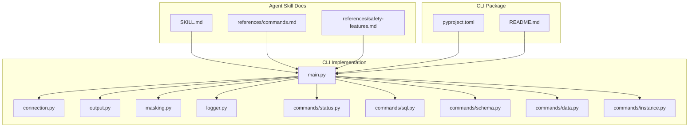

**Diagram sources**
- [main.py:15-50](file://hologres-cli/src/hologres_cli/main.py#L15-L50)
- [connection.py:178-229](file://hologres-cli/src/hologres_cli/connection.py#L178-L229)
- [output.py:16-21](file://hologres-cli/src/hologres_cli/output.py#L16-L21)
- [masking.py:1-93](file://hologres-cli/src/hologres_cli/masking.py#L1-L93)
- [logger.py:1-105](file://hologres-cli/src/hologres_cli/logger.py#L1-L105)
- [status.py:14-62](file://hologres-cli/src/hologres_cli/commands/status.py#L14-L62)
- [sql.py:34-199](file://hologres-cli/src/hologres_cli/commands/sql.py#L34-L199)
- [schema.py:36-301](file://hologres-cli/src/hologres_cli/commands/schema.py#L36-L301)
- [data.py:44-266](file://hologres-cli/src/hologres_cli/commands/data.py#L44-L266)
- [instance.py:14-71](file://hologres-cli/src/hologres_cli/commands/instance.py#L14-L71)
- [pyproject.toml:23-26](file://hologres-cli/pyproject.toml#L23-L26)
- [README.md:1-314](file://hologres-cli/README.md#L1-L314)

**Section sources**
- [SKILL.md:1-155](file://agent-skills/skills/hologres-cli/SKILL.md#L1-L155)
- [README.md:1-314](file://hologres-cli/README.md#L1-L314)
- [pyproject.toml:1-68](file://hologres-cli/pyproject.toml#L1-L68)

## Core Components
- CLI entry and command routing: Defines global options (DSN, output format), registers subcommands, and exposes ai-guide and history.
- Connection management: Resolves DSN from CLI flag, environment variable, or config file; parses DSN; manages connection lifecycle.
- Output formatting: Unified JSON response envelope with support for JSON, table, CSV, and JSONL formats.
- Safety guardrails: Enforces row limits, blocks write operations, and redacts sensitive data.
- Audit logging: Records operations to a rotating JSONL log with redacted SQL and metadata.
- Command modules: status, instance, warehouse, schema inspection, SQL execution, data import/export, and history.

**Section sources**
- [main.py:15-96](file://hologres-cli/src/hologres_cli/main.py#L15-L96)
- [connection.py:39-229](file://hologres-cli/src/hologres_cli/connection.py#L39-L229)
- [output.py:23-143](file://hologres-cli/src/hologres_cli/output.py#L23-L143)
- [logger.py:36-105](file://hologres-cli/src/hologres_cli/logger.py#L36-L105)
- [masking.py:73-93](file://hologres-cli/src/hologres_cli/masking.py#L73-L93)

## Architecture Overview
The CLI follows a modular architecture:
- Entry point registers Click groups and commands.
- Each command module encapsulates its own logic and interacts with shared connection, output, masking, and logging utilities.
- Output formatting ensures consistent JSON envelopes across all commands.
- Safety checks are centralized in the output and masking modules and enforced per-command.

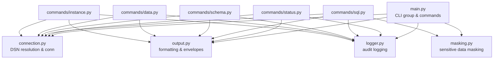

**Diagram sources**
- [main.py:15-50](file://hologres-cli/src/hologres_cli/main.py#L15-L50)
- [output.py:23-54](file://hologres-cli/src/hologres_cli/output.py#L23-L54)
- [connection.py:225-229](file://hologres-cli/src/hologres_cli/connection.py#L225-L229)
- [logger.py:36-74](file://hologres-cli/src/hologres_cli/logger.py#L36-L74)
- [masking.py:73-93](file://hologres-cli/src/hologres_cli/masking.py#L73-L93)
- [status.py:14-62](file://hologres-cli/src/hologres_cli/commands/status.py#L14-L62)
- [sql.py:66-135](file://hologres-cli/src/hologres_cli/commands/sql.py#L66-L135)
- [schema.py:42-81](file://hologres-cli/src/hologres_cli/commands/schema.py#L42-L81)
- [data.py:50-123](file://hologres-cli/src/hologres_cli/commands/data.py#L50-L123)
- [instance.py:14-71](file://hologres-cli/src/hologres_cli/commands/instance.py#L14-L71)

## Detailed Component Analysis

### CLI Entry and Command Routing
- Global options: --dsn, --format, version option.
- Registers subcommands: schema, sql, data, status, instance, warehouse.
- Provides ai-guide and history commands.

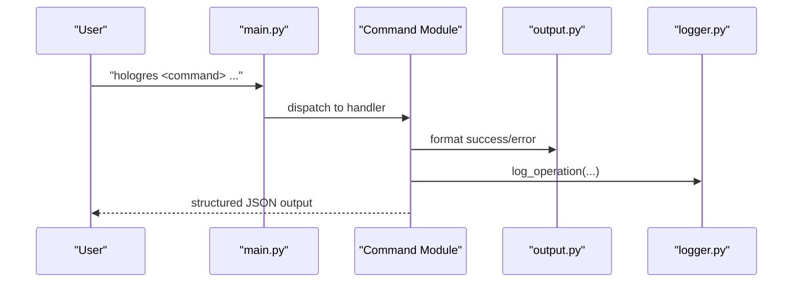

**Diagram sources**
- [main.py:15-50](file://hologres-cli/src/hologres_cli/main.py#L15-L50)
- [output.py:23-63](file://hologres-cli/src/hologres_cli/output.py#L23-L63)
- [logger.py:36-74](file://hologres-cli/src/hologres_cli/logger.py#L36-L74)

**Section sources**
- [main.py:15-96](file://hologres-cli/src/hologres_cli/main.py#L15-L96)

### Connection Management
- Resolves DSN from CLI flag, HOLOGRES_DSN, or ~/.hologres/config.env.
- Parses DSN into connection parameters with defaults for keepalives.
- Provides a connection wrapper with dict-row cursors and safe execution helpers.

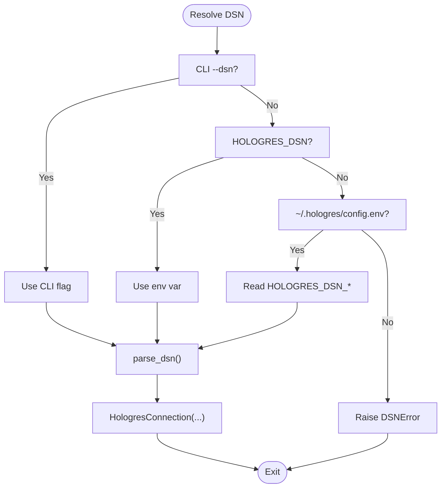

**Diagram sources**
- [connection.py:39-117](file://hologres-cli/src/hologres_cli/connection.py#L39-L117)
- [connection.py:120-170](file://hologres-cli/src/hologres_cli/connection.py#L120-L170)
- [connection.py:178-229](file://hologres-cli/src/hologres_cli/connection.py#L178-L229)

**Section sources**
- [connection.py:39-117](file://hologres-cli/src/hologres_cli/connection.py#L39-L117)
- [connection.py:120-170](file://hologres-cli/src/hologres_cli/connection.py#L120-L170)
- [connection.py:178-229](file://hologres-cli/src/hologres_cli/connection.py#L178-L229)

### Output Formatting and Response Envelope
- Standardized JSON envelope: {"ok": true/false, "data": ..., "error": ...}.
- Supports JSON, table, CSV, JSONL formats.
- Helpers for success, success_rows, error, and printing.

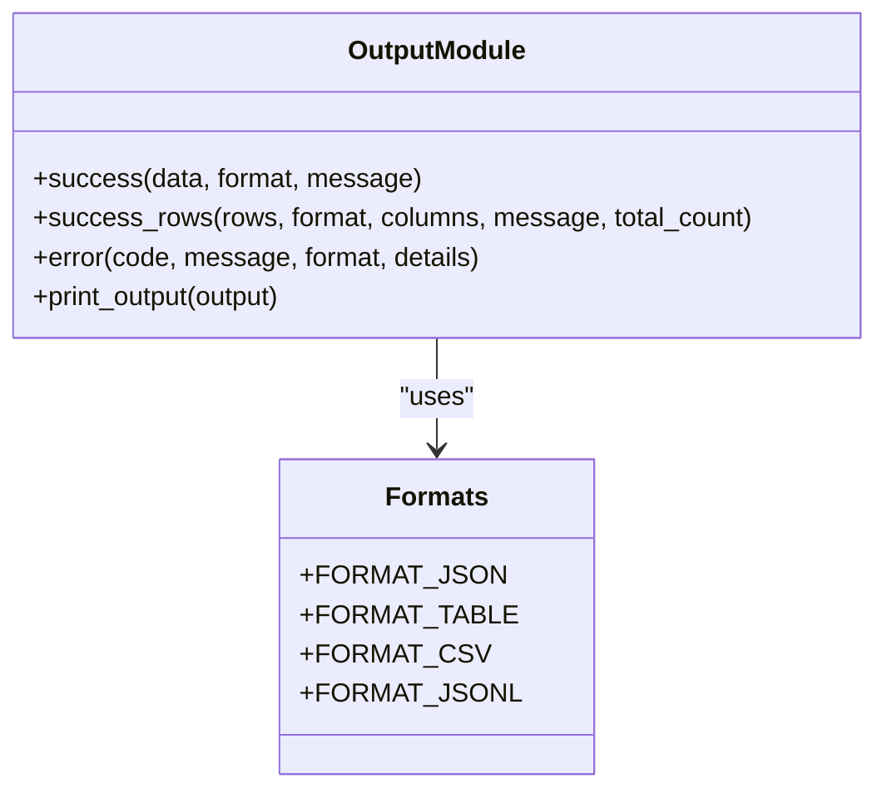

**Diagram sources**
- [output.py:23-63](file://hologres-cli/src/hologres_cli/output.py#L23-L63)
- [output.py:91-118](file://hologres-cli/src/hologres_cli/output.py#L91-L118)

**Section sources**
- [output.py:23-63](file://hologres-cli/src/hologres_cli/output.py#L23-L63)
- [output.py:91-118](file://hologres-cli/src/hologres_cli/output.py#L91-L118)

### Safety Guardrails and Sensitive Data Masking
- Row limit protection: SELECT without LIMIT returning >100 rows fails with LIMIT_REQUIRED.
- Write protection: All write operations are blocked by default.
- Dangerous write blocking: DELETE/UPDATE without WHERE are blocked.
- Sensitive data masking: Masks phone, email, password, ID card, bank card fields by column name patterns.
- Audit logging: Logs operations to ~/.hologres/sql-history.jsonl with redacted SQL and metadata.

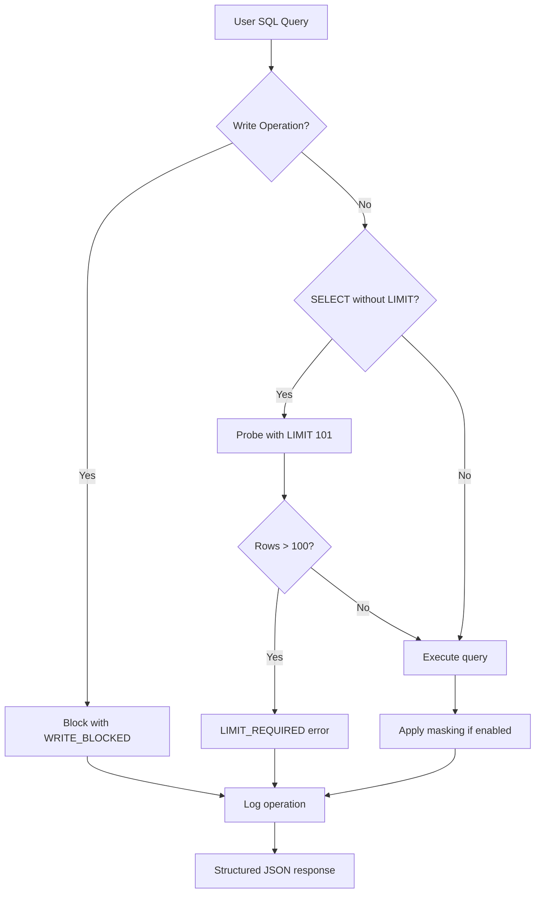

**Diagram sources**
- [sql.py:66-135](file://hologres-cli/src/hologres_cli/commands/sql.py#L66-L135)
- [output.py:133-142](file://hologres-cli/src/hologres_cli/output.py#L133-L142)
- [masking.py:73-93](file://hologres-cli/src/hologres_cli/masking.py#L73-L93)
- [logger.py:36-74](file://hologres-cli/src/hologres_cli/logger.py#L36-L74)

**Section sources**
- [safety-features.md:5-90](file://agent-skills/skills/hologres-cli/references/safety-features.md#L5-L90)
- [sql.py:66-135](file://hologres-cli/src/hologres_cli/commands/sql.py#L66-L135)
- [masking.py:73-93](file://hologres-cli/src/hologres_cli/masking.py#L73-L93)
- [logger.py:36-74](file://hologres-cli/src/hologres_cli/logger.py#L36-L74)

### Status Command
- Checks connectivity, retrieves server version, current database, current user, and server address/port.
- Logs operation with timing and masked DSN.

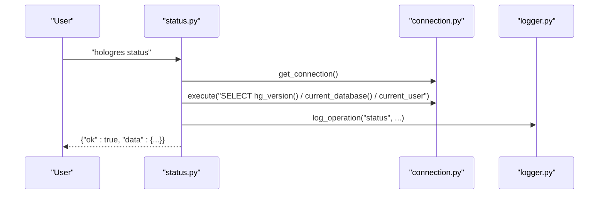

**Diagram sources**
- [status.py:14-62](file://hologres-cli/src/hologres_cli/commands/status.py#L14-L62)
- [connection.py:225-229](file://hologres-cli/src/hologres_cli/connection.py#L225-L229)
- [logger.py:36-74](file://hologres-cli/src/hologres_cli/logger.py#L36-L74)

**Section sources**
- [status.py:14-62](file://hologres-cli/src/hologres_cli/commands/status.py#L14-L62)

### SQL Command
- Executes read-only queries with safety checks.
- Supports multiple statements separated by semicolons.
- Applies row limit probing, masking, and logging.

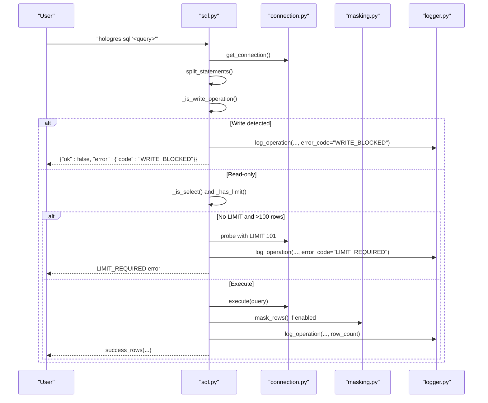

**Diagram sources**
- [sql.py:34-135](file://hologres-cli/src/hologres_cli/commands/sql.py#L34-L135)
- [masking.py:73-93](file://hologres-cli/src/hologres_cli/masking.py#L73-L93)
- [logger.py:36-74](file://hologres-cli/src/hologres_cli/logger.py#L36-L74)

**Section sources**
- [sql.py:34-199](file://hologres-cli/src/hologres_cli/commands/sql.py#L34-L199)

### Schema Commands
- tables: Lists user tables excluding system schemas.
- describe: Retrieves column metadata and primary keys.
- dump: Exports DDL using hg_dump_script with safe identifier handling.
- size: Reports pretty-printed and byte sizes for a table.

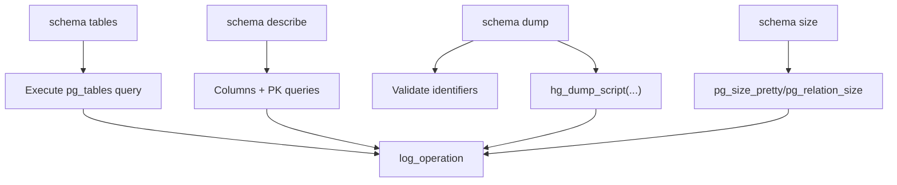

**Diagram sources**
- [schema.py:42-81](file://hologres-cli/src/hologres_cli/commands/schema.py#L42-L81)
- [schema.py:83-153](file://hologres-cli/src/hologres_cli/commands/schema.py#L83-L153)
- [schema.py:155-221](file://hologres-cli/src/hologres_cli/commands/schema.py#L155-L221)
- [schema.py:223-301](file://hologres-cli/src/hologres_cli/commands/schema.py#L223-L301)

**Section sources**
- [schema.py:42-301](file://hologres-cli/src/hologres_cli/commands/schema.py#L42-L301)

### Data Commands
- export: Uses COPY TO STDOUT for CSV export from a table or custom query.
- import: Uses COPY FROM STDIN for CSV import; supports optional truncate.
- count: Counts rows with optional WHERE clause.

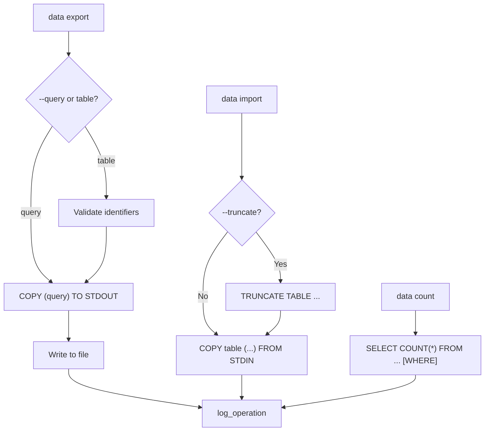

**Diagram sources**
- [data.py:50-123](file://hologres-cli/src/hologres_cli/commands/data.py#L50-L123)
- [data.py:125-214](file://hologres-cli/src/hologres_cli/commands/data.py#L125-L214)
- [data.py:216-266](file://hologres-cli/src/hologres_cli/commands/data.py#L216-L266)

**Section sources**
- [data.py:50-266](file://hologres-cli/src/hologres_cli/commands/data.py#L50-L266)

### Instance Command
- Resolves DSN for a named instance from environment or config file.
- Queries Hologres version and max connections.

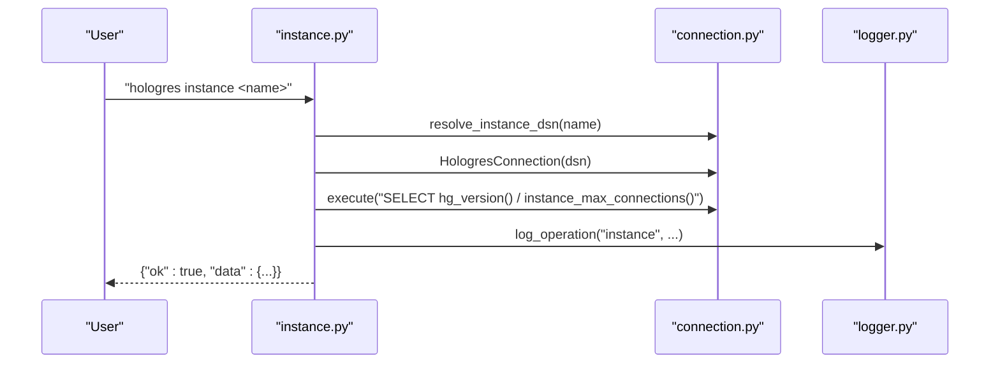

**Diagram sources**
- [instance.py:14-71](file://hologres-cli/src/hologres_cli/commands/instance.py#L14-L71)
- [connection.py:89-117](file://hologres-cli/src/hologres_cli/connection.py#L89-L117)
- [connection.py:178-229](file://hologres-cli/src/hologres_cli/connection.py#L178-L229)
- [logger.py:36-74](file://hologres-cli/src/hologres_cli/logger.py#L36-L74)

**Section sources**
- [instance.py:14-71](file://hologres-cli/src/hologres_cli/commands/instance.py#L14-L71)

### History Command
- Reads recent entries from ~/.hologres/sql-history.jsonl and prints them in selected format.

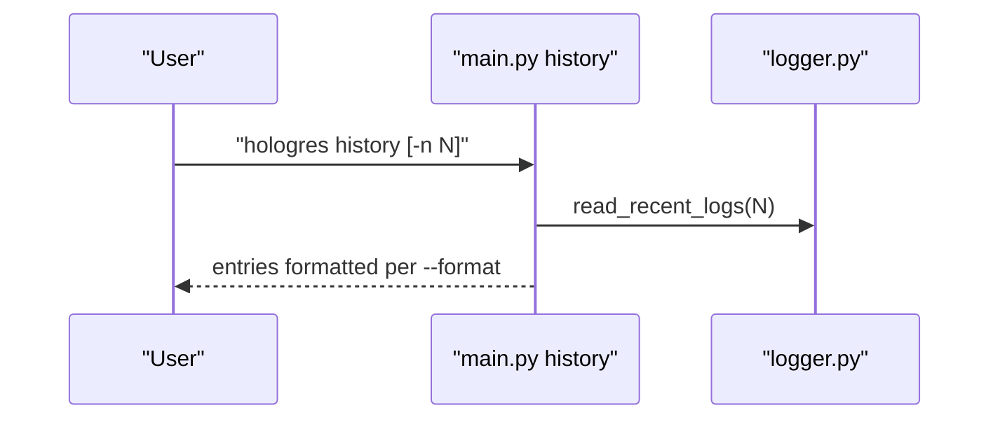

**Diagram sources**
- [main.py:86-96](file://hologres-cli/src/hologres_cli/main.py#L86-L96)
- [logger.py:89-105](file://hologres-cli/src/hologres_cli/logger.py#L89-L105)

**Section sources**
- [main.py:86-96](file://hologres-cli/src/hologres_cli/main.py#L86-L96)
- [logger.py:89-105](file://hologres-cli/src/hologres_cli/logger.py#L89-L105)

## Dependency Analysis
- CLI entry depends on Click for command routing and exposes scripts "hologres" and "hologres-cli".
- Commands depend on connection.py for DSN resolution and psycopg3 for database operations.
- Output formatting is centralized in output.py; masking in masking.py; logging in logger.py.
- Tests are organized under tests/ with markers for unit/integration/slow.

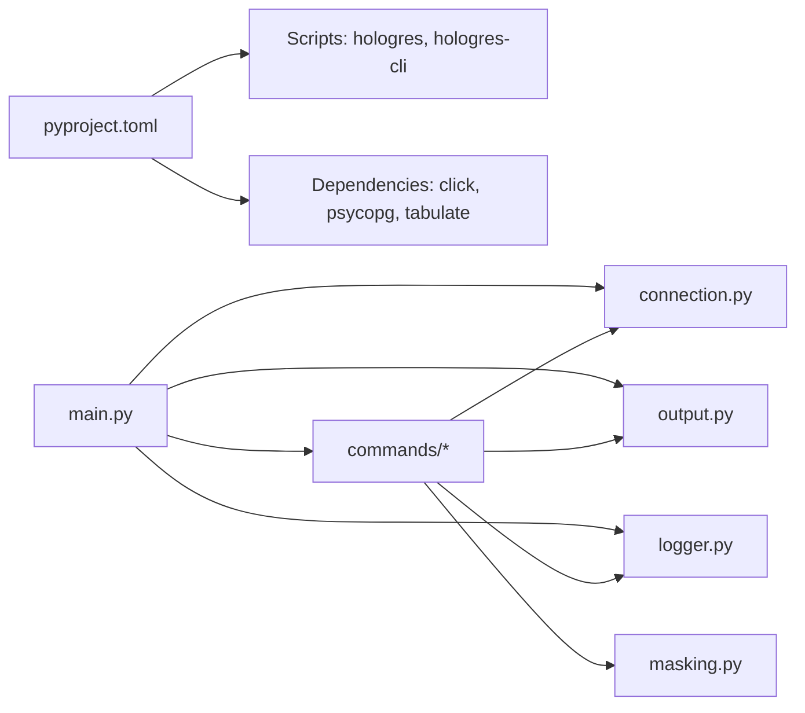

**Diagram sources**
- [pyproject.toml:23-26](file://hologres-cli/pyproject.toml#L23-L26)
- [pyproject.toml:6-10](file://hologres-cli/pyproject.toml#L6-L10)
- [main.py:15-50](file://hologres-cli/src/hologres_cli/main.py#L15-L50)

**Section sources**
- [pyproject.toml:1-68](file://hologres-cli/pyproject.toml#L1-L68)
- [main.py:15-50](file://hologres-cli/src/hologres_cli/main.py#L15-L50)

## Performance Considerations
- Row limit probing prevents large result sets from overwhelming clients.
- COPY protocol is used for efficient import/export operations.
- Keepalives are configured to maintain stable connections.
- JSONL logging avoids buffering large payloads and supports streaming.

## Troubleshooting Guide
Common issues and resolutions:
- CONNECTION_ERROR: Verify DSN via --dsn, HOLOGRES_DSN, or ~/.hologres/config.env.
- QUERY_ERROR: Inspect SQL syntax and permissions.
- LIMIT_REQUIRED: Add LIMIT or use --no-limit-check for controlled scenarios.
- WRITE_BLOCKED: Use appropriate commands or flags for write operations.
- DANGEROUS_WRITE_BLOCKED: Include WHERE clauses for DELETE/UPDATE.
- EXPORT_ERROR/IMPORT_ERROR: Validate file paths and CSV formats.

Operational tips:
- Use "hologres status" before batch operations.
- Prefer JSON output for automation and JSONL for streaming logs.
- Review ~/.hologres/sql-history.jsonl for audit trails.

**Section sources**
- [SKILL.md:122-131](file://agent-skills/skills/hologres-cli/SKILL.md#L122-L131)
- [safety-features.md:136-145](file://agent-skills/skills/hologres-cli/references/safety-features.md#L136-L145)
- [logger.py:36-74](file://hologres-cli/src/hologres_cli/logger.py#L36-L74)

## Conclusion
The Hologres CLI AI Skill delivers a robust, safe, and AI-friendly interface for Hologres operations. Its structured JSON responses, multiple output formats, comprehensive safety guardrails, and audit logging make it suitable for both interactive use and integration with AI coding platforms. By adhering to best practices—such as using LIMIT, explicit WHERE clauses, and JSON output—the skill enables reliable, secure, and efficient database interactions.

## Appendices

### Command Reference Summary
- Status: Check connection and server info.
- Instance: Query version and max connections for a named instance.
- Warehouse: List or query compute warehouses.
- Schema: tables, describe, dump, size.
- SQL: Execute read-only queries with safety checks.
- Data: export, import, count.
- History: Show recent command history.
- AI Guide: Generate a guide tailored for AI agents.

**Section sources**
- [commands.md:14-220](file://agent-skills/skills/hologres-cli/references/commands.md#L14-L220)

### Output Formats
- json: Default structured JSON envelope.
- table: Human-readable table.
- csv: Comma-separated values.
- jsonl: JSON Lines for streaming.

**Section sources**
- [output.py:16-21](file://hologres-cli/src/hologres_cli/output.py#L16-L21)
- [commands.md:69-76](file://agent-skills/skills/hologres-cli/references/commands.md#L69-L76)

### Safety Features Details
- Row limit protection: Prevents unintentional large fetches.
- Write protection: Blocks mutation operations by default.
- Dangerous write blocking: Requires WHERE for DELETE/UPDATE.
- Sensitive data masking: Masks by column name patterns.
- Audit logging: Rotating JSONL logs with redacted SQL.

**Section sources**
- [safety-features.md:5-145](file://agent-skills/skills/hologres-cli/references/safety-features.md#L5-L145)
- [sql.py:66-135](file://hologres-cli/src/hologres_cli/commands/sql.py#L66-L135)
- [masking.py:73-93](file://hologres-cli/src/hologres_cli/masking.py#L73-L93)
- [logger.py:29-33](file://hologres-cli/src/hologres_cli/logger.py#L29-L33)

### DSN Configuration and Installation
- DSN format: hologres://[user[:password]@]host[:port]/database
- Configuration priority: CLI flag, HOLOGRES_DSN, ~/.hologres/config.env
- Installation: pip install -e . or uv venv with Python 3.11+

**Section sources**
- [SKILL.md:24-35](file://agent-skills/skills/hologres-cli/SKILL.md#L24-L35)
- [README.md:89-106](file://hologres-cli/README.md#L89-L106)
- [pyproject.toml:5-5](file://hologres-cli/pyproject.toml#L5-L5)