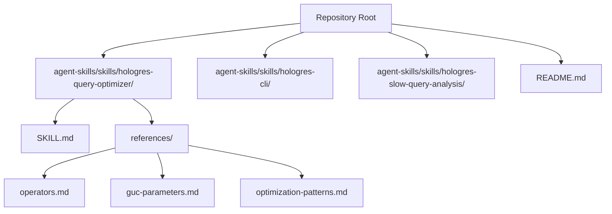
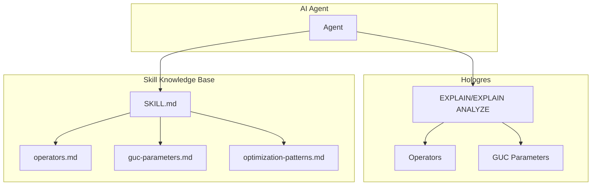
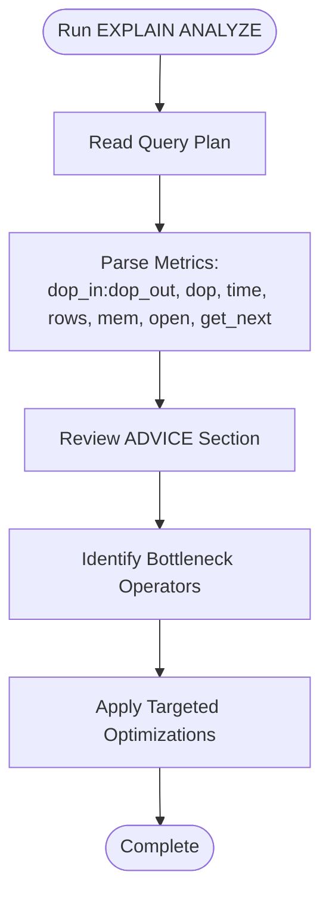
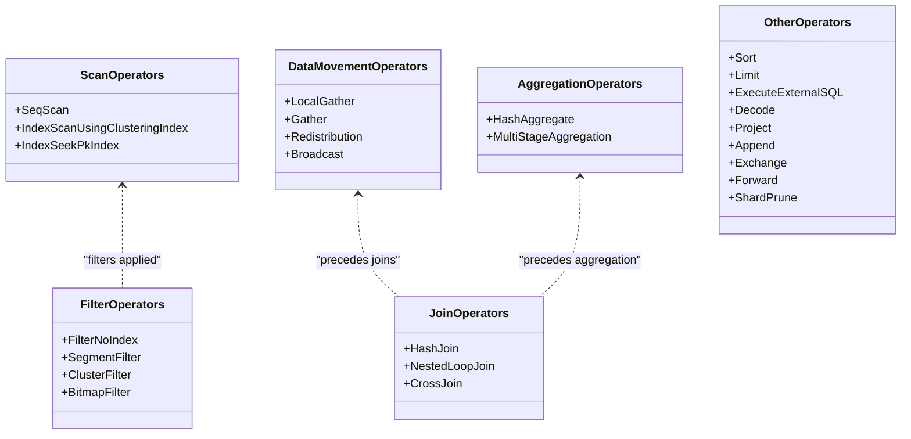
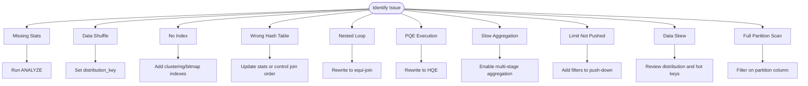
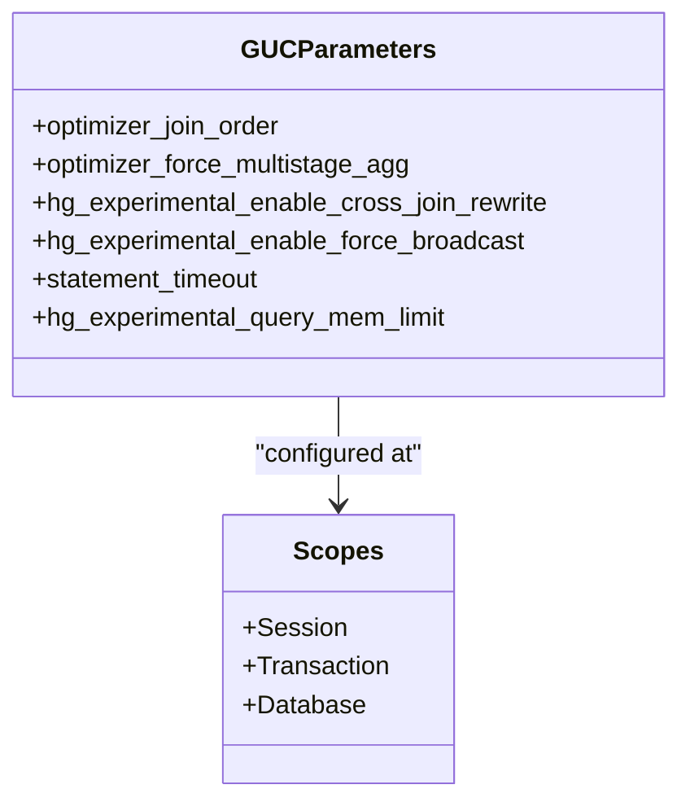
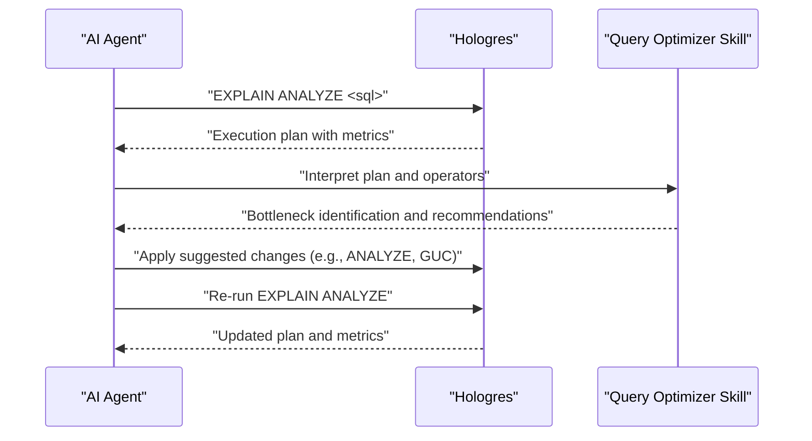
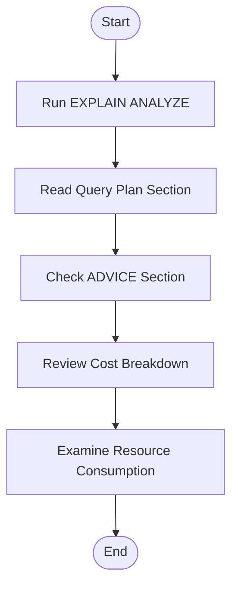
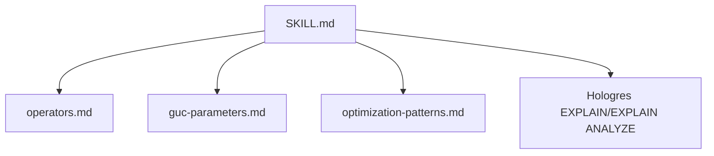

# Query Optimizer Skill

<cite>
**Referenced Files in This Document**
- [SKILL.md](file://agent-skills/skills/hologres-query-optimizer/SKILL.md)
- [operators.md](file://agent-skills/skills/hologres-query-optimizer/references/operators.md)
- [guc-parameters.md](file://agent-skills/skills/hologres-query-optimizer/references/guc-parameters.md)
- [optimization-patterns.md](file://agent-skills/skills/hologres-query-optimizer/references/optimization-patterns.md)
- [README.md](file://README.md)
- [hologres-cli SKILL.md](file://agent-skills/skills/hologres-cli/SKILL.md)
- [hologres-slow-query-analysis SKILL.md](file://agent-skills/skills/hologres-slow-query-analysis/SKILL.md)
</cite>

## Table of Contents
1. [Introduction](#introduction)
2. [Project Structure](#project-structure)
3. [Core Components](#core-components)
4. [Architecture Overview](#architecture-overview)
5. [Detailed Component Analysis](#detailed-component-analysis)
6. [Dependency Analysis](#dependency-analysis)
7. [Performance Considerations](#performance-considerations)
8. [Troubleshooting Guide](#troubleshooting-guide)
9. [Conclusion](#conclusion)
10. [Appendices](#appendices)

## Introduction
This document describes the Hologres Query Optimizer AI Skill, designed to help AI agents analyze and optimize Hologres SQL query execution plans. It focuses on interpreting EXPLAIN and EXPLAIN ANALYZE output, identifying performance bottlenecks, and providing actionable optimization recommendations. The skill integrates with Hologres’ native EXPLAIN capabilities and offers guidance on operators, GUC parameters, and common optimization patterns tailored to Hologres’ distributed, columnar architecture.

## Project Structure
The skill is part of a broader set of AI agent-friendly tools for Hologres, alongside a CLI and a slow query analysis skill. The repository organizes materials by capability: a top-level README introduces the ecosystem, while the skill’s own documentation and references provide in-depth guidance.

**Diagram sources**
- [README.md:5-15](file://README.md#L5-L15)
- [SKILL.md:1-187](file://agent-skills/skills/hologres-query-optimizer/SKILL.md#L1-L187)

**Section sources**
- [README.md:5-15](file://README.md#L5-L15)
- [SKILL.md:1-187](file://agent-skills/skills/hologres-query-optimizer/SKILL.md#L1-L187)

## Core Components
- Skill overview and triggers: The skill’s purpose is to analyze SQL performance issues, understand EXPLAIN/EXPLAIN ANALYZE output, interpret operators, and provide optimization recommendations.
- EXPLAIN vs EXPLAIN ANALYZE: The skill distinguishes between estimated plans (EXPLAIN) and actual plans with runtime metrics (EXPLAIN ANALYZE).
- Reading EXPLAIN ANALYZE: The skill documents the four sections (Query Plan, ADVICE, Cost, Resource) and explains key metrics such as dop_in:dop_out, dop, time, rows, mem, open, and get_next.
- Common operators: The skill catalogs scan, filter, data movement, join, aggregation, and other operators with performance characteristics and optimization tips.
- Optimization workflow: The skill prescribes a repeatable process: run EXPLAIN ANALYZE, review ADVICE, identify bottlenecks, and apply targeted fixes.
- GUC parameters: The skill lists and explains key Hologres GUC parameters that influence query execution and optimization.

**Section sources**
- [SKILL.md:13-187](file://agent-skills/skills/hologres-query-optimizer/SKILL.md#L13-L187)

## Architecture Overview
The skill acts as a knowledge base for AI agents, enabling them to:
- Prompt Hologres to produce EXPLAIN/EXPLAIN ANALYZE output.
- Parse and interpret the output using operator and metric references.
- Suggest corrective actions grounded in operator behavior and GUC parameters.
- Coordinate with complementary skills (CLI and slow query analysis) for end-to-end performance diagnostics.

**Diagram sources**
- [SKILL.md:13-187](file://agent-skills/skills/hologres-query-optimizer/SKILL.md#L13-L187)
- [operators.md:1-306](file://agent-skills/skills/hologres-query-optimizer/references/operators.md#L1-L306)
- [guc-parameters.md:1-111](file://agent-skills/skills/hologres-query-optimizer/references/guc-parameters.md#L1-L111)
- [optimization-patterns.md:1-165](file://agent-skills/skills/hologres-query-optimizer/references/optimization-patterns.md#L1-L165)

## Detailed Component Analysis

### EXPLAIN Output Interpretation
- Bottom-up reading: Arrows represent nodes; parents include child costs.
- Key metrics:
  - cost: startup_cost..total_cost; parent aggregates child costs.
  - rows: estimated output rows; default 1000 often indicates missing stats.
  - width: estimated average output width (bytes).
- ADVICE section: System-generated hints for missing indexes, missing stats, and data skew.

**Diagram sources**
- [SKILL.md:34-91](file://agent-skills/skills/hologres-query-optimizer/SKILL.md#L34-L91)

**Section sources**
- [SKILL.md:34-91](file://agent-skills/skills/hologres-query-optimizer/SKILL.md#L34-L91)

### Operator Reference and Performance Characteristics
- Scan operators:
  - Seq Scan: Full table scan; avoid when possible.
  - Index Scan using Clustering_index: Column-store index scan; requires proper clustering and bitmap columns.
  - Index Seek (pk_index): Row-store primary key scan for point queries.
- Filter operators:
  - Filter (No Index): Indicates lack of index; add clustering/bitmap indexes.
  - Segment Filter: Uses event_time_column (segment key).
  - Cluster Filter: Uses clustering_key.
  - Bitmap Filter: Uses bitmap_columns.
- Data movement:
  - Local Gather: Merge files within shard.
  - Gather: Merge shards to final result.
  - Redistribution: Data shuffle; often caused by mismatched distribution_key.
  - Broadcast: Small table broadcast; watch for outdated stats.
- Join operators:
  - Hash Join: Prefer small table as hash table; ensure statistics are fresh.
  - Nested Loop Join: Avoid for large data; consider rewriting to equi-joins.
  - Cross Join (V3.0+): Optimized non-equi join; trade-off memory vs speed.
- Aggregation:
  - HashAggregate: GROUP BY aggregation.
  - Multi-stage aggregation: Partial + Final stages; can be forced via GUC.
- Other operators:
  - Sort: ORDER BY; consider clustering_key alignment.
  - Limit: Row limit; check push-down to scan.
  - ExecuteExternalSQL: PQE execution; rewrite to HQE functions.
  - Decode, Project, Append, Exchange, Forward, Shard Prune/Shards Selected: Engine and pruning specifics.

**Diagram sources**
- [operators.md:5-306](file://agent-skills/skills/hologres-query-optimizer/references/operators.md#L5-L306)

**Section sources**
- [operators.md:5-306](file://agent-skills/skills/hologres-query-optimizer/references/operators.md#L5-L306)

### Optimization Patterns and Recommendations
- Update statistics: Run ANALYZE after significant data changes to improve row estimates.
- Fix distribution key: Align distribution_key with JOIN/GROUP BY keys to avoid redistribution.
- Add indexes: Configure clustering_key, event_time_column, and bitmap_columns for efficient filtering.
- Optimize hash joins: Ensure small table is hash table; update statistics or control join order.
- Avoid nested loops: Prefer equi-joins; rewrite non-equi joins when possible.
- PQE to HQE rewrites: Replace PQE functions with HQE equivalents to reduce engine overhead.
- Multi-stage aggregation: Force partial + final aggregation for large datasets.
- Push down limit: Add filters to enable push-down and reduce scan volume.
- Reduce data skew: Review distribution keys, handle hot keys, and consider composite keys.
- Partition pruning: Filter directly on partition columns to avoid full scans.

**Diagram sources**
- [optimization-patterns.md:5-165](file://agent-skills/skills/hologres-query-optimizer/references/optimization-patterns.md#L5-L165)

**Section sources**
- [optimization-patterns.md:5-165](file://agent-skills/skills/hologres-query-optimizer/references/optimization-patterns.md#L5-L165)

### Hologres GUC Parameters That Affect Query Execution
- Join optimization:
  - optimizer_join_order: exhaustive (default), query, greedy.
- Aggregation:
  - optimizer_force_multistage_agg: forces multi-stage aggregation.
- Join type control:
  - hg_experimental_enable_cross_join_rewrite: enables/disables Cross Join optimization.
- Broadcast control:
  - hg_experimental_enable_force_broadcast: forces broadcast for small tables.
- Query limits:
  - statement_timeout: controls query timeout.
- Memory control:
  - hg_experimental_query_mem_limit: sets memory limit for queries.
- Scope and reset:
  - Session, transaction, and database scopes; RESET to defaults.

**Diagram sources**
- [guc-parameters.md:1-111](file://agent-skills/skills/hologres-query-optimizer/references/guc-parameters.md#L1-L111)

**Section sources**
- [guc-parameters.md:1-111](file://agent-skills/skills/hologres-query-optimizer/references/guc-parameters.md#L1-L111)

### Practical Examples and Step-by-Step Workflows
- Example scenario 1: High-cost Filter operator
  - Symptom: Filter operator dominates time.
  - Action: Add clustering/bitmap indexes aligned with filter predicates.
- Example scenario 2: Redistribution operator
  - Symptom: Redistribution appears frequently.
  - Action: Set distribution_key to match JOIN/GROUP BY keys; re-analyze.
- Example scenario 3: ExecuteExternalSQL
  - Symptom: PQE execution detected.
  - Action: Rewrite to HQE-supported functions.
- Step-by-step optimization workflow:
  1. Run EXPLAIN ANALYZE on the slow query.
  2. Review ADVICE section for immediate fixes.
  3. Identify bottleneck operator(s) by highest time (consider cumulative time).
  4. Apply targeted optimization pattern based on operator and symptoms.
  5. Re-run EXPLAIN ANALYZE to validate improvements.

**Diagram sources**
- [SKILL.md:139-154](file://agent-skills/skills/hologres-query-optimizer/SKILL.md#L139-L154)

**Section sources**
- [SKILL.md:139-154](file://agent-skills/skills/hologres-query-optimizer/SKILL.md#L139-L154)

### Integration with Hologres EXPLAIN Capabilities
- The skill emphasizes using EXPLAIN ANALYZE for production analysis, as it includes runtime metrics and system advice.
- It provides a quick-start example of EXPLAIN and EXPLAIN ANALYZE usage.
- It explains how to read the Query Plan, ADVICE, Cost, and Resource sections, and how to interpret metrics like dop_in:dop_out, dop, time, rows, mem, open, and get_next.

**Diagram sources**
- [SKILL.md:24-91](file://agent-skills/skills/hologres-query-optimizer/SKILL.md#L24-L91)

**Section sources**
- [SKILL.md:24-91](file://agent-skills/skills/hologres-query-optimizer/SKILL.md#L24-L91)

## Dependency Analysis
The Query Optimizer skill depends on:
- Hologres EXPLAIN/EXPLAIN ANALYZE output for actionable insights.
- Operator reference material for operator semantics and optimization tips.
- GUC parameter documentation for configuration-driven tuning.
- Optimization patterns for practical, repeatable fixes.

**Diagram sources**
- [SKILL.md:13-187](file://agent-skills/skills/hologres-query-optimizer/SKILL.md#L13-L187)
- [operators.md:1-306](file://agent-skills/skills/hologres-query-optimizer/references/operators.md#L1-L306)
- [guc-parameters.md:1-111](file://agent-skills/skills/hologres-query-optimizer/references/guc-parameters.md#L1-L111)
- [optimization-patterns.md:1-165](file://agent-skills/skills/hologres-query-optimizer/references/optimization-patterns.md#L1-L165)

**Section sources**
- [SKILL.md:13-187](file://agent-skills/skills/hologres-query-optimizer/SKILL.md#L13-L187)

## Performance Considerations
- Always use EXPLAIN ANALYZE for production analysis to capture runtime metrics.
- Keep statistics fresh after significant data changes to improve row estimates.
- Design distribution_key based on JOIN/GROUP BY patterns to minimize data movement.
- Set clustering_key for range query columns and bitmap_columns for equality filters.
- Ensure small tables are used as hash tables in joins.
- Avoid non-equi joins when possible; prefer equi-joins.
- Rewrite PQE functions to HQE alternatives to reduce engine overhead.
- Consider multi-stage aggregation for large datasets.

[No sources needed since this section provides general guidance]

## Troubleshooting Guide
- Missing statistics symptom: rows=1000 indicates default estimate; run ANALYZE on affected tables.
- Data shuffle symptom: Redistribution operator; adjust distribution_key to align with JOIN/GROUP BY keys.
- Wrong hash table: Large table used as hash table; update statistics or control join order.
- No index: Filter operator only; add clustering/bitmap indexes.
- PQE execution: ExecuteExternalSQL detected; rewrite to HQE functions.
- Data skew: Large variance in rows/time across workers; review distribution and handle hot keys.
- Slow aggregation: Long aggregation time; enable multi-stage aggregation.

**Section sources**
- [SKILL.md:146-154](file://agent-skills/skills/hologres-query-optimizer/SKILL.md#L146-L154)
- [operators.md:124-132](file://agent-skills/skills/hologres-query-optimizer/references/operators.md#L124-L132)
- [optimization-patterns.md:155-165](file://agent-skills/skills/hologres-query-optimizer/references/optimization-patterns.md#L155-L165)

## Conclusion
The Hologres Query Optimizer AI Skill provides a structured, operator-centric approach to diagnosing and optimizing query performance. By combining EXPLAIN ANALYZE insights, operator semantics, and targeted optimization patterns, AI agents can automatically identify bottlenecks, suggest precise fixes, and validate improvements. Integrating with Hologres’ GUC parameters and complementary skills (CLI and slow query analysis) enables a comprehensive performance-tuning workflow.

[No sources needed since this section summarizes without analyzing specific files]

## Appendices

### Best Practices Checklist
- Always use EXPLAIN ANALYZE for production analysis.
- Run ANALYZE after significant data changes.
- Design distribution_key based on JOIN/GROUP BY patterns.
- Set clustering_key for range query columns.
- Use bitmap indexes for low-cardinality filters.
- Ensure small table is hash table in joins.
- Avoid non-equi joins when possible.
- Rewrite PQE functions to HQE alternatives.

**Section sources**
- [SKILL.md:169-179](file://agent-skills/skills/hologres-query-optimizer/SKILL.md#L169-L179)

### Related Skills and Tools
- Hologres CLI: Structured JSON output, safety guardrails, and schema/data operations.
- Slow Query Analysis: Diagnoses slow and failed queries using the hg_query_log system table.

**Section sources**
- [hologres-cli SKILL.md:1-155](file://agent-skills/skills/hologres-cli/SKILL.md#L1-L155)
- [hologres-slow-query-analysis SKILL.md:1-160](file://agent-skills/skills/hologres-slow-query-analysis/SKILL.md#L1-L160)