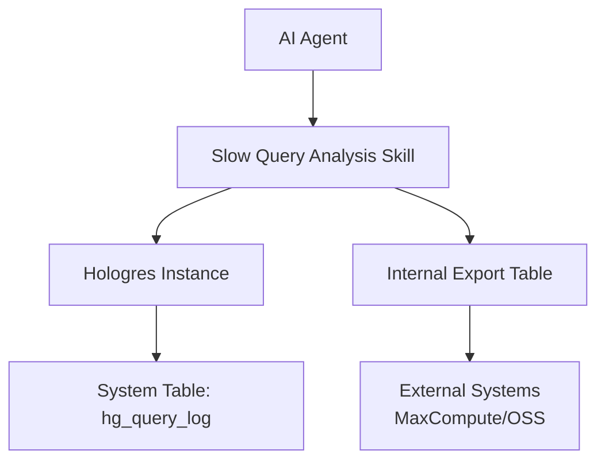
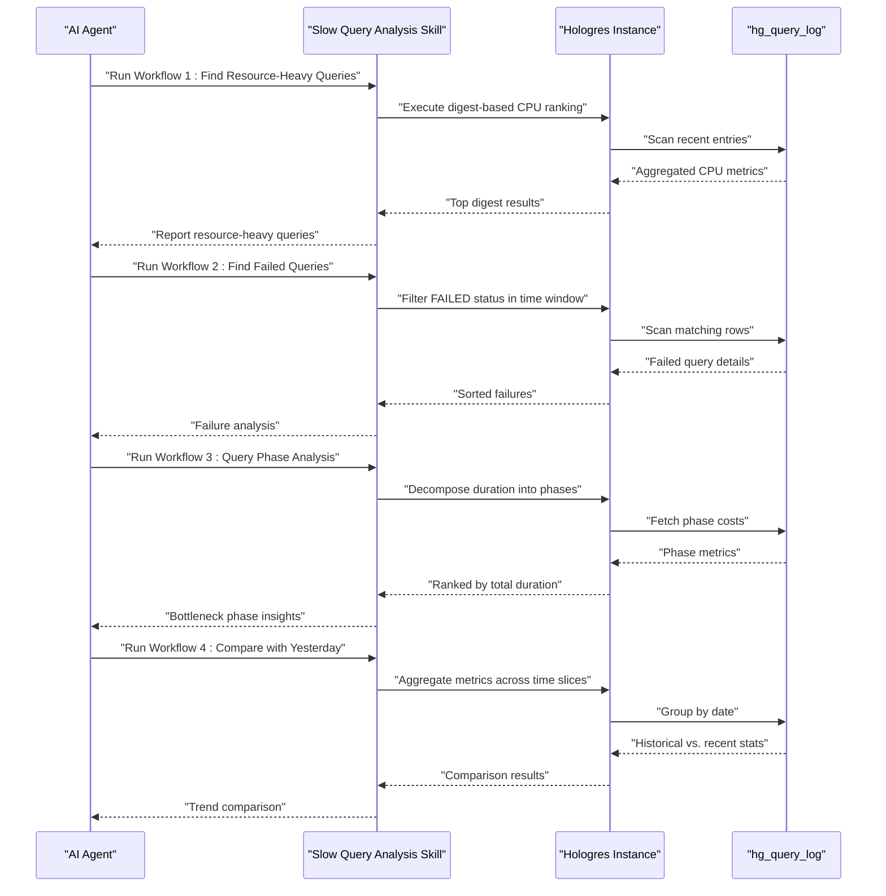
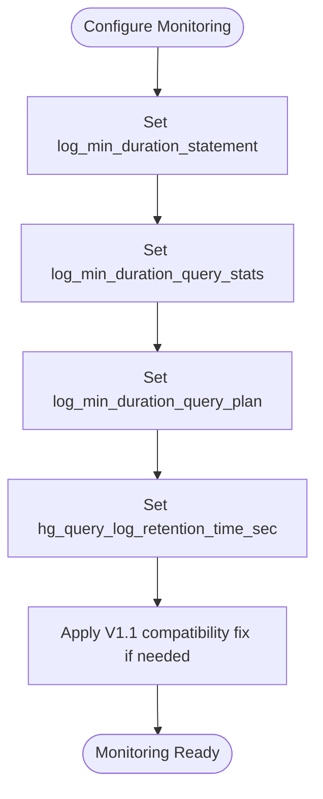
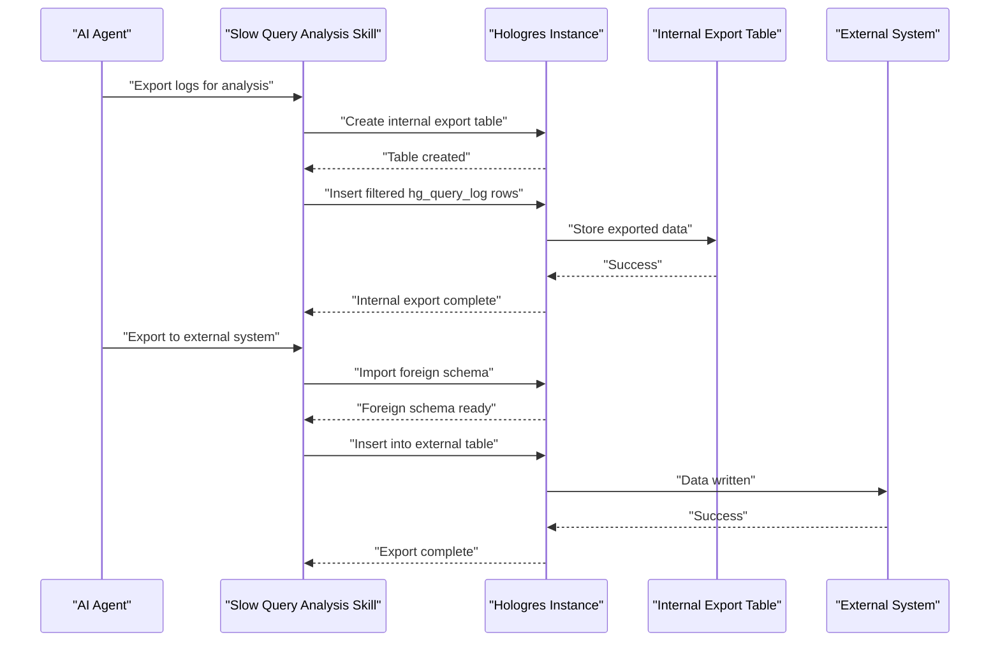
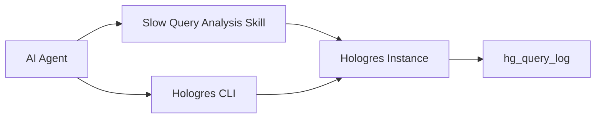

# Slow Query Analysis Skill

<cite>
**Referenced Files in This Document**
- [SKILL.md](file://agent-skills/skills/hologres-slow-query-analysis/SKILL.md)
- [configuration.md](file://agent-skills/skills/hologres-slow-query-analysis/references/configuration.md)
- [diagnostic-queries.md](file://agent-skills/skills/hologres-slow-query-analysis/references/diagnostic-queries.md)
- [log-export.md](file://agent-skills/skills/hologres-slow-query-analysis/references/log-export.md)
- [README.md](file://README.md)
- [hologres-cli README.md](file://hologres-cli/README.md)
</cite>

## Table of Contents
1. [Introduction](#introduction)
2. [Project Structure](#project-structure)
3. [Core Components](#core-components)
4. [Architecture Overview](#architecture-overview)
5. [Detailed Component Analysis](#detailed-component-analysis)
6. [Dependency Analysis](#dependency-analysis)
7. [Performance Considerations](#performance-considerations)
8. [Troubleshooting Guide](#troubleshooting-guide)
9. [Conclusion](#conclusion)
10. [Appendices](#appendices)

## Introduction
This document describes the Hologres Slow Query Analysis AI Skill, which equips AI agents to diagnose and troubleshoot performance issues in Alibaba Cloud Hologres by analyzing slow query patterns and execution metrics from the `hologres.hg_query_log` system table. It covers diagnostic workflows, configuration options for enabling monitoring, log export mechanisms, and best practices for proactive performance maintenance. The skill enables systematic investigation of query execution times, identification of resource-intensive operations, and automated diagnostic processes aligned with Hologres logging capabilities.

## Project Structure
The Hologres AI Plugins project provides:
- A Hologres CLI with safety guardrails and structured output for database operations
- AI agent skills for domain-specific tasks, including slow query analysis

The slow query analysis skill resides under agent-skills/skills/hologres-slow-query-analysis and includes:
- A skill definition and quick-start guidance
- Reference documents for configuration, diagnostic queries, and log export

```mermaid
graph TB
subgraph "Agent Skills"
SQ["hologres-slow-query-analysis/SKILL.md"]
CFG["references/configuration.md"]
DIAG["references/diagnostic-queries.md"]
EXPORT["references/log-export.md"]
end
subgraph "CLI Tool"
CLI_README["hologres-cli/README.md"]
end
SQ --> CFG
SQ --> DIAG
SQ --> EXPORT
CLI_README -. "complements skill usage" .-> SQ
```

**Diagram sources**
- [SKILL.md:1-160](file://agent-skills/skills/hologres-slow-query-analysis/SKILL.md#L1-L160)
- [configuration.md:1-122](file://agent-skills/skills/hologres-slow-query-analysis/references/configuration.md#L1-L122)
- [diagnostic-queries.md:1-176](file://agent-skills/skills/hologres-slow-query-analysis/references/diagnostic-queries.md#L1-L176)
- [log-export.md:1-140](file://agent-skills/skills/hologres-slow-query-analysis/references/log-export.md#L1-L140)
- [hologres-cli README.md:1-314](file://hologres-cli/README.md#L1-L314)

**Section sources**
- [README.md:1-142](file://README.md#L1-L142)
- [SKILL.md:1-160](file://agent-skills/skills/hologres-slow-query-analysis/SKILL.md#L1-L160)

## Core Components
- Skill definition and quick start: outlines triggers, permissions, and basic queries for recent slow queries.
- Diagnostic workflows: four core workflows to find resource-heavy queries, failed queries, analyze query phases, and compare performance across time windows.
- Key fields reference: explains essential columns in hg_query_log for performance analysis.
- Configuration: parameters controlling slow query thresholds, statistics recording, plan recording, retention, and compatibility fixes.
- Diagnostic SQL collection: extensive query templates for user statistics, new query analysis, aggregation, traffic analysis, and high-resource period analysis.
- Log export: guidance for exporting logs to internal tables and external systems (MaxCompute/OSS), including prerequisites and best practices.

**Section sources**
- [SKILL.md:11-160](file://agent-skills/skills/hologres-slow-query-analysis/SKILL.md#L11-L160)
- [configuration.md:1-122](file://agent-skills/skills/hologres-slow-query-analysis/references/configuration.md#L1-L122)
- [diagnostic-queries.md:1-176](file://agent-skills/skills/hologres-slow-query-analysis/references/diagnostic-queries.md#L1-L176)
- [log-export.md:1-140](file://agent-skills/skills/hologres-slow-query-analysis/references/log-export.md#L1-L140)

## Architecture Overview
The slow query analysis skill integrates with Hologres logging and monitoring through the hg_query_log system table. AI agents use the skill to:
- Query recent slow queries and resource metrics
- Group queries by fingerprints (digest) to identify repeated bottlenecks
- Export logs for offline analysis and long-term trend tracking
- Configure thresholds and retention to balance observability and storage cost

**Diagram sources**
- [SKILL.md:11-160](file://agent-skills/skills/hologres-slow-query-analysis/SKILL.md#L11-L160)
- [log-export.md:1-140](file://agent-skills/skills/hologres-slow-query-analysis/references/log-export.md#L1-L140)

## Detailed Component Analysis

### Diagnostic Workflows
The skill defines four primary workflows to investigate performance issues systematically:

1) Find Resource-Heavy Queries
- Purpose: Identify top CPU-consuming SQL fingerprints over a recent period.
- Typical use: High CPU usage scenarios.
- Key insight: Use digest grouping to uncover repeated heavy queries.

2) Find Failed Queries
- Purpose: Locate failed queries within a specific time window and inspect error messages.
- Typical use: Post-mortem analysis after incidents.
- Key insight: Combine status filtering with precise time ranges.

3) Query Phase Analysis
- Purpose: Decompose total duration into optimization, startup, and execution phases.
- Typical use: Understanding where time is spent during query lifecycle.
- Key insight: Focus on startup vs. execution to decide between concurrency tuning and SQL optimization.

4) Compare with Yesterday
- Purpose: Compare recent activity against historical baselines.
- Typical use: Detect regressions or temporary spikes.
- Key insight: Use grouped aggregations across time slices to spot anomalies.

**Diagram sources**
- [SKILL.md:60-114](file://agent-skills/skills/hologres-slow-query-analysis/SKILL.md#L60-L114)

**Section sources**
- [SKILL.md:60-114](file://agent-skills/skills/hologres-slow-query-analysis/SKILL.md#L60-L114)

### Key Fields Reference
Essential hg_query_log fields for performance diagnostics:
- query_id: Unique query identifier
- digest: SQL fingerprint (MD5 hash)
- duration: Total query time (ms)
- cpu_time_ms: CPU time consumed
- memory_bytes: Peak memory usage
- read_bytes: Data read volume
- engine_type: Query engine (HQE/PQE/SDK/PG)
- optimization_cost: Plan generation time
- start_query_cost: Query startup time
- get_next_cost: Execution time

These fields support resource profiling, phase breakdown, and fingerprint-based grouping.

**Section sources**
- [SKILL.md:116-130](file://agent-skills/skills/hologres-slow-query-analysis/SKILL.md#L116-L130)

### Configuration Options
The skill’s effectiveness depends on proper configuration of logging and retention parameters:

- log_min_duration_statement
  - Controls minimum query duration to be logged.
  - Defaults vary by Hologres version; can be set at DB or session level.
  - Notes: Affects new queries only; DDL and failed queries are always logged.

- log_min_duration_query_stats
  - Controls recording of query execution statistics.
  - Higher values increase storage consumption and may slow log queries.

- log_min_duration_query_plan
  - Controls recording of query execution plans.
  - Plans can be obtained via EXPLAIN anytime; usually unnecessary to record.

- hg_query_log_retention_time_sec (V3.0.27+)
  - Controls log retention period (3–30 days).
  - Only affects new logs; expired logs are cleaned immediately.

- V1.1 Compatibility Fix
  - Enable complete statistics display for specific V1.1.x versions.

**Diagram sources**
- [configuration.md:5-122](file://agent-skills/skills/hologres-slow-query-analysis/references/configuration.md#L5-L122)

**Section sources**
- [configuration.md:1-122](file://agent-skills/skills/hologres-slow-query-analysis/references/configuration.md#L1-L122)

### Diagnostic SQL Collection
The diagnostic queries reference provides a comprehensive set of SQL templates for:
- User statistics: query counts per user
- New query analysis: count and details of new digests introduced yesterday
- Aggregation: slow query frequency by digest and top memory consumers
- Traffic analysis: hourly access volume and resource consumption
- High-resource period analysis: CPU consumption by digest in specific time ranges
- SQL fingerprint rules: normalization and hashing behavior

These templates support proactive trend analysis, anomaly detection, and targeted optimization.

**Section sources**
- [diagnostic-queries.md:1-176](file://agent-skills/skills/hologres-slow-query-analysis/references/diagnostic-queries.md#L1-L176)

### Log Export Mechanisms
The skill supports exporting hg_query_log data for offline analysis and long-term retention:

- Internal table export
  - Create a target table with all hg_query_log columns.
  - Insert filtered data using query_start for efficient index usage.

- External table export (MaxCompute)
  - Create a MaxCompute table with compatible schema.
  - Import foreign schema and insert data partitioned by date.

Best practices:
- Always filter by query_start for performance.
- Avoid wrapping query_start in expressions to preserve index usage.
- Use partitioning for external systems to manage scale.

**Diagram sources**
- [log-export.md:18-140](file://agent-skills/skills/hologres-slow-query-analysis/references/log-export.md#L18-L140)

**Section sources**
- [log-export.md:1-140](file://agent-skills/skills/hologres-slow-query-analysis/references/log-export.md#L1-L140)

### Practical Investigation Scenarios
- Proactive baseline checks: Use hourly traffic analysis to detect unusual spikes.
- Incident response: Apply failed query workflow to locate root causes quickly.
- Regression detection: Compare recent metrics with historical baselines using the “Compare with Yesterday” workflow.
- Fingerprint-driven optimization: Group by digest to identify repeated heavy queries and prioritize indexing or rewriting.

[No sources needed since this section provides scenario guidance]

### Automated Diagnostic Processes
- Scheduled aggregation: Run digest-based CPU ranking on a schedule to surface recurring bottlenecks.
- Threshold-based alerts: Combine retention and threshold settings to reduce noise while capturing meaningful events.
- Trend tracking: Export logs periodically to build long-term performance baselines.

[No sources needed since this section provides process guidance]

## Dependency Analysis
The slow query analysis skill depends on:
- Hologres hg_query_log system table for performance data
- Proper permissions (superuser or pg_read_all_stats) for full instance visibility
- CLI tool for safe, structured database interactions when needed

**Diagram sources**
- [SKILL.md:24-35](file://agent-skills/skills/hologres-slow-query-analysis/SKILL.md#L24-L35)
- [hologres-cli README.md:1-314](file://hologres-cli/README.md#L1-L314)

**Section sources**
- [SKILL.md:24-35](file://agent-skills/skills/hologres-slow-query-analysis/SKILL.md#L24-L35)
- [README.md:71-96](file://README.md#L71-L96)

## Performance Considerations
- Filter early and often: Always filter by query_start to leverage indexes and reduce scan cost.
- Use digest grouping: Aggregate by digest to identify repeated heavy queries efficiently.
- Tune thresholds: Adjust log_min_duration_statement to balance observability and overhead.
- Control retention: Set hg_query_log_retention_time_sec to manage storage growth.
- Avoid expensive expressions: Do not wrap query_start in functions to preserve index usage.

[No sources needed since this section provides general guidance]

## Troubleshooting Guide
Common issues and resolutions:
- Insufficient permissions: Ensure superuser or pg_read_all_stats access for full instance logs.
- Poor query performance: Add query_start filters and avoid expressions on indexed columns.
- Excessive storage: Lower log_min_duration_query_stats or shorten retention.
- Missing statistics: Apply V1.1 compatibility fix if applicable.

**Section sources**
- [SKILL.md:24-35](file://agent-skills/skills/hologres-slow-query-analysis/SKILL.md#L24-L35)
- [configuration.md:111-122](file://agent-skills/skills/hologres-slow-query-analysis/references/configuration.md#L111-L122)
- [log-export.md:11-17](file://agent-skills/skills/hologres-slow-query-analysis/references/log-export.md#L11-L17)

## Conclusion
The Hologres Slow Query Analysis AI Skill provides a structured, automated approach to diagnosing and troubleshooting performance issues. By leveraging hg_query_log, digest-based grouping, and configurable thresholds, AI agents can identify resource-intensive operations, analyze query phases, export logs for deeper analysis, and establish proactive monitoring practices. Combined with the Hologres CLI’s safety features, this skill enables reliable, repeatable performance investigations.

[No sources needed since this section summarizes without analyzing specific files]

## Appendices

### Best Practices Checklist
- Always filter by query_start for performance
- Use digest to group similar queries for pattern analysis
- Check engine_type—PQE queries may need optimization
- Investigate high start_query_cost for locks or resource contention
- Investigate high get_next_cost for SQL optimization or index additions
- Regular cleanup: set appropriate retention period

**Section sources**
- [SKILL.md:152-160](file://agent-skills/skills/hologres-slow-query-analysis/SKILL.md#L152-L160)