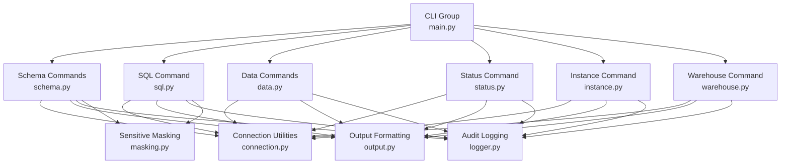
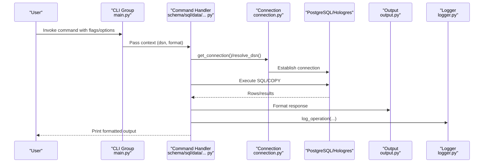
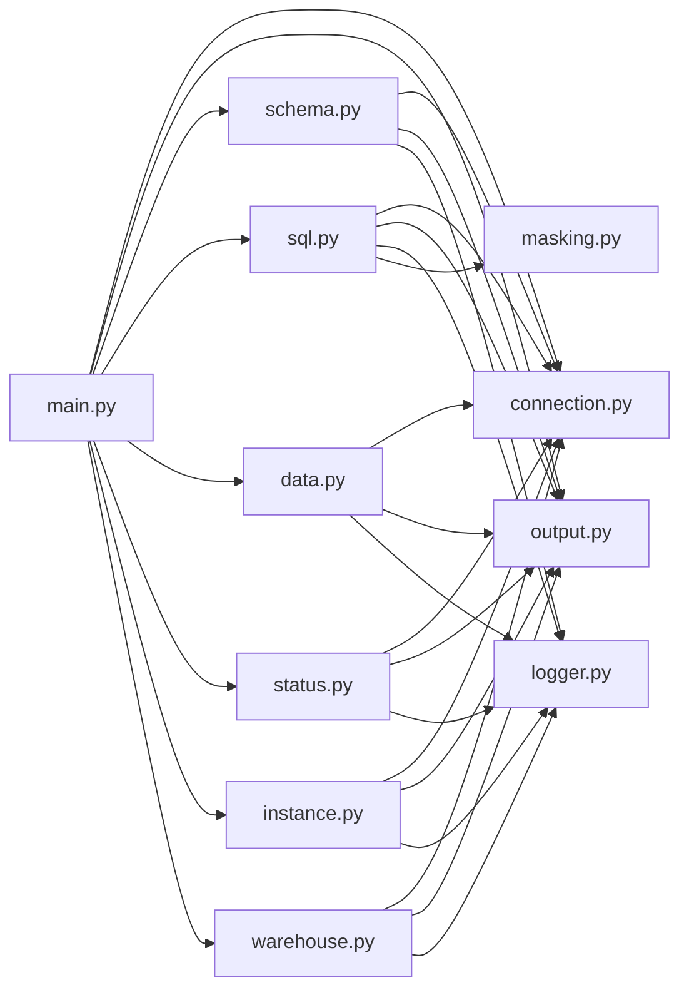

# API Reference

<cite>
**Referenced Files in This Document**
- [main.py](file://hologres-cli/src/hologres_cli/main.py)
- [connection.py](file://hologres-cli/src/hologres_cli/connection.py)
- [output.py](file://hologres-cli/src/hologres_cli/output.py)
- [logger.py](file://hologres-cli/src/hologres_cli/logger.py)
- [masking.py](file://hologres-cli/src/hologres_cli/masking.py)
- [schema.py](file://hologres-cli/src/hologres_cli/commands/schema.py)
- [sql.py](file://hologres-cli/src/hologres_cli/commands/sql.py)
- [data.py](file://hologres-cli/src/hologres_cli/commands/data.py)
- [status.py](file://hologres-cli/src/hologres_cli/commands/status.py)
- [instance.py](file://hologres-cli/src/hologres_cli/commands/instance.py)
- [warehouse.py](file://hologres-cli/src/hologres_cli/commands/warehouse.py)
- [README.md](file://hologres-cli/README.md)
- [pyproject.toml](file://hologres-cli/pyproject.toml)
</cite>

## Table of Contents
1. [Introduction](#introduction)
2. [Project Structure](#project-structure)
3. [Core Components](#core-components)
4. [Architecture Overview](#architecture-overview)
5. [Detailed Component Analysis](#detailed-component-analysis)
6. [Dependency Analysis](#dependency-analysis)
7. [Performance Considerations](#performance-considerations)
8. [Troubleshooting Guide](#troubleshooting-guide)
9. [Conclusion](#conclusion)
10. [Appendices](#appendices)

## Introduction
This document provides a comprehensive API reference for the Hologres CLI tool. It covers the command-line interface specification, connection management, output formatting, audit logging, safety guardrails, error handling, security considerations, and performance optimization guidelines. It also includes examples of programmatic usage and integration patterns.

## Project Structure
The CLI is organized around a central Click group with subcommands for schema inspection, SQL execution, data import/export, status checks, instance queries, and warehouse information. Shared utilities handle connection management, output formatting, logging, and sensitive data masking.

**Diagram sources**
- [main.py:15-49](file://hologres-cli/src/hologres_cli/main.py#L15-L49)
- [schema.py:36-301](file://hologres-cli/src/hologres_cli/commands/schema.py#L36-L301)
- [sql.py:34-199](file://hologres-cli/src/hologres_cli/commands/sql.py#L34-L199)
- [data.py:44-266](file://hologres-cli/src/hologres_cli/commands/data.py#L44-L266)
- [status.py:14-62](file://hologres-cli/src/hologres_cli/commands/status.py#L14-L62)
- [instance.py:14-71](file://hologres-cli/src/hologres_cli/commands/instance.py#L14-L71)
- [warehouse.py:22-106](file://hologres-cli/src/hologres_cli/commands/warehouse.py#L22-L106)
- [connection.py:178-229](file://hologres-cli/src/hologres_cli/connection.py#L178-L229)
- [output.py:16-143](file://hologres-cli/src/hologres_cli/output.py#L16-L143)
- [logger.py:36-105](file://hologres-cli/src/hologres_cli/logger.py#L36-L105)
- [masking.py:73-93](file://hologres-cli/src/hologres_cli/masking.py#L73-L93)

**Section sources**
- [main.py:15-49](file://hologres-cli/src/hologres_cli/main.py#L15-L49)
- [pyproject.toml:23-25](file://hologres-cli/pyproject.toml#L23-L25)

## Core Components
- CLI entry point and global options: defines the main Click group, global DSN and format options, and registers subcommands.
- Connection management: resolves DSN from CLI flag, environment variable, or config file; parses DSN into connection parameters; wraps psycopg3 connection with helper methods.
- Output formatting: supports JSON, table, CSV, and JSONL; standardizes success/error response envelopes.
- Audit logging: writes structured JSONL entries with timestamps, operation metadata, and optional redactions.
- Sensitive data masking: masks fields by column name patterns for common PII categories.

**Section sources**
- [main.py:15-49](file://hologres-cli/src/hologres_cli/main.py#L15-L49)
- [connection.py:39-229](file://hologres-cli/src/hologres_cli/connection.py#L39-L229)
- [output.py:16-143](file://hologres-cli/src/hologres_cli/output.py#L16-L143)
- [logger.py:36-105](file://hologres-cli/src/hologres_cli/logger.py#L36-L105)
- [masking.py:73-93](file://hologres-cli/src/hologres_cli/masking.py#L73-L93)

## Architecture Overview
The CLI follows a modular architecture:
- Central CLI group initializes context with DSN and format.
- Subcommands depend on shared connection utilities and output/log/mask modules.
- SQL command applies safety guardrails before execution.
- Data commands leverage PostgreSQL COPY protocol for efficient I/O.

**Diagram sources**
- [main.py:15-49](file://hologres-cli/src/hologres_cli/main.py#L15-L49)
- [schema.py:42-81](file://hologres-cli/src/hologres_cli/commands/schema.py#L42-L81)
- [sql.py:34-64](file://hologres-cli/src/hologres_cli/commands/sql.py#L34-L64)
- [data.py:50-123](file://hologres-cli/src/hologres_cli/commands/data.py#L50-L123)
- [connection.py:225-229](file://hologres-cli/src/hologres_cli/connection.py#L225-L229)
- [output.py:23-89](file://hologres-cli/src/hologres_cli/output.py#L23-L89)
- [logger.py:36-74](file://hologres-cli/src/hologres_cli/logger.py#L36-L74)

## Detailed Component Analysis

### CLI Specification
- Global options
  - --dsn: DSN string; supports hologres:// scheme.
  - --format/-f: Output format among json, table, csv, jsonl.
  - --version: Prints version and exits.
- Commands
  - schema: tables, describe, dump, size
  - sql: read-only SQL execution with guardrails
  - data: export, import, count
  - status: connection and server info
  - instance: instance version and max connections
  - warehouse: list/query compute groups
  - ai-guide: prints a guide string
  - history: prints recent audit log entries

Exit codes
- 0 on success
- 1 on DSN or internal errors

**Section sources**
- [main.py:15-49](file://hologres-cli/src/hologres_cli/main.py#L15-L49)
- [main.py:98-107](file://hologres-cli/src/hologres_cli/main.py#L98-L107)
- [README.md:262-270](file://hologres-cli/README.md#L262-L270)

### Connection Management API
- DSN resolution
  - Priority: CLI --dsn, HOLOGRES_DSN env var, ~/.hologres/config.env key.
  - Throws DSNError if none found.
- Named instance DSN resolution
  - Uses HOLOGRES_DSN_<name> from env or config file.
- DSN parsing
  - Accepts hologres://, postgresql://, or postgres://.
  - Normalizes scheme, extracts host/port/dbname, optional credentials, and query parameters.
  - Applies keepalives defaults; validates presence of hostname and database.
- Connection wrapper
  - HologresConnection: lazy connection creation, dict-row cursor, execute/executemany helpers, context manager semantics.
  - get_connection(): resolves DSN and returns a connection instance.

Security features
- Password redaction in masked DSN for logging.
- Keepalives enabled by default for robust connections.

**Section sources**
- [connection.py:39-118](file://hologres-cli/src/hologres_cli/connection.py#L39-L118)
- [connection.py:120-171](file://hologres-cli/src/hologres_cli/connection.py#L120-L171)
- [connection.py:178-229](file://hologres-cli/src/hologres_cli/connection.py#L178-L229)
- [main.py:16-18](file://hologres-cli/src/hologres_cli/main.py#L16-L18)

### Output Formatting API
Formats
- json: default; wraps data in {"ok": true, "data": ...} or {"ok": false, "error": {...}}.
- table: human-readable table via tabulate.
- csv: CSV with header.
- jsonl: newline-delimited JSON per row.

Response schemas
- Success envelope: {"ok": true, "data": any[, "message": string][, "total_count": number]}
- Row data envelope: {"ok": true, "data": {"rows": [...], "count": n}[,...]}
- Error envelope: {"ok": false, "error": {"code": string, "message": string[, "details": object]}}

Helpers
- success(), success_rows(), error(), print_output(), and specialized error formatters.

**Section sources**
- [output.py:16-55](file://hologres-cli/src/hologres_cli/output.py#L16-L55)
- [output.py:57-89](file://hologres-cli/src/hologres_cli/output.py#L57-L89)
- [output.py:120-143](file://hologres-cli/src/hologres_cli/output.py#L120-L143)
- [README.md:211-234](file://hologres-cli/README.md#L211-L234)

### Audit Logging API
- Log location: ~/.hologres/sql-history.jsonl
- Rotation: rotates when size exceeds threshold; creates backup file.
- Entry fields: timestamp (UTC ISO), operation, success, optional sql, dsn, row_count, error_code, error_message, duration_ms, extra.
- Redaction: sensitive literals are redacted before writing.
- Operations: schema.tables, schema.describe, schema.dump, schema.size, data.export, data.import, data.count, status, instance, warehouse, sql.

Usage
- log_operation(...) called by each command after execution.
- read_recent_logs(count) returns last N entries.

**Section sources**
- [logger.py:36-105](file://hologres-cli/src/hologres_cli/logger.py#L36-L105)
- [schema.py:71-78](file://hologres-cli/src/hologres_cli/commands/schema.py#L71-L78)
- [sql.py:113-130](file://hologres-cli/src/hologres_cli/commands/sql.py#L113-L130)
- [data.py:107-121](file://hologres-cli/src/hologres_cli/commands/data.py#L107-L121)
- [status.py:43-59](file://hologres-cli/src/hologres_cli/commands/status.py#L43-L59)
- [instance.py:53-68](file://hologres-cli/src/hologres_cli/commands/instance.py#L53-L68)
- [warehouse.py:69-103](file://hologres-cli/src/hologres_cli/commands/warehouse.py#L69-L103)

### Safety Guardrail API
- Row limit protection
  - For SELECT without LIMIT, probes with a small limit; if result > threshold, blocks with LIMIT_REQUIRED error.
  - Can be disabled with a flag for advanced users.
- Write operation blocking
  - All DML/DCL/Ddl-like keywords are blocked by default.
- Dangerous write detection
  - DELETE/UPDATE without WHERE are blocked with a specific error code.
- Sensitive data masking
  - Automatic masking of fields inferred as PII by column name patterns; can be disabled.

**Section sources**
- [sql.py:25-31](file://hologres-cli/src/hologres_cli/commands/sql.py#L25-L31)
- [sql.py:78-102](file://hologres-cli/src/hologres_cli/commands/sql.py#L78-L102)
- [sql.py:164-178](file://hologres-cli/src/hologres_cli/commands/sql.py#L164-L178)
- [output.py:133-142](file://hologres-cli/src/hologres_cli/output.py#L133-L142)
- [masking.py:73-93](file://hologres-cli/src/hologres_cli/masking.py#L73-L93)

### Schema Commands
- schema tables [--schema]: lists tables with owner; supports schema filter.
- schema describe <table>: describes columns and primary keys; supports schema.table notation.
- schema dump <schema.table>: exports DDL via a helper function; validates identifiers safely.
- schema size <schema.table>: reports pretty and raw sizes.

Key behaviors
- Uses psycopg.sql.Identifier for safe identifier handling.
- Logs operations with timing and row counts.

**Section sources**
- [schema.py:42-81](file://hologres-cli/src/hologres_cli/commands/schema.py#L42-L81)
- [schema.py:83-153](file://hologres-cli/src/hologres_cli/commands/schema.py#L83-L153)
- [schema.py:155-221](file://hologres-cli/src/hologres_cli/commands/schema.py#L155-L221)
- [schema.py:223-301](file://hologres-cli/src/hologres_cli/commands/schema.py#L223-L301)

### SQL Command
- hologres sql "<query>"
  - Read-only by default; write operations are blocked.
  - Automatically probes for row limits if no LIMIT present.
  - Optional flags:
    - --with-schema: include inferred schema metadata in JSON output.
    - --no-limit-check: disables automatic row limit probing.
    - --no-mask: disables sensitive field masking.
- Large field truncation: long strings/binary truncated for safety.

**Section sources**
- [sql.py:34-64](file://hologres-cli/src/hologres_cli/commands/sql.py#L34-L64)
- [sql.py:66-135](file://hologres-cli/src/hologres_cli/commands/sql.py#L66-L135)
- [sql.py:186-199](file://hologres-cli/src/hologres_cli/commands/sql.py#L186-L199)

### Data Commands
- data export <table> -f <file> [--query] [--delimiter]
  - Exports CSV using COPY TO STDOUT; supports custom SELECT query or table export.
- data import <table> -f <file> [--delimiter] [--truncate]
  - Imports CSV using COPY FROM STDIN; optionally truncates table before import.
- data count <table> [--where]
  - Counts rows with optional WHERE clause.

Key behaviors
- Validates identifiers safely; uses psycopg.sql.Identifier.
- Logs row counts and durations; handles file I/O efficiently.

**Section sources**
- [data.py:50-123](file://hologres-cli/src/hologres_cli/commands/data.py#L50-L123)
- [data.py:125-214](file://hologres-cli/src/hologres_cli/commands/data.py#L125-L214)
- [data.py:216-266](file://hologres-cli/src/hologres_cli/commands/data.py#L216-L266)

### Status Command
- hologres status
  - Returns connection status, version, database, user, server address/port, and masked DSN.

**Section sources**
- [status.py:14-62](file://hologres-cli/src/hologres_cli/commands/status.py#L14-L62)

### Instance Command
- hologres instance <instance_name>
  - Queries version and max connections for a named instance using HOLOGRES_DSN_<name>.

**Section sources**
- [instance.py:14-71](file://hologres-cli/src/hologres_cli/commands/instance.py#L14-L71)

### Warehouse Command
- hologres warehouse [<warehouse_name>]
  - Lists all compute groups or filters by name; enriches status codes with descriptions.

**Section sources**
- [warehouse.py:22-106](file://hologres-cli/src/hologres_cli/commands/warehouse.py#L22-L106)

### Programmatic Usage and Integration Patterns
- CLI invocation
  - Use the script entry point to run commands programmatically via subprocess.
- Structured output
  - Default JSON output enables easy parsing in scripts and AI agents.
- Safety-first design
  - Integrate with guardrails by ensuring queries include LIMIT and appropriate flags for write operations.
- Audit logging
  - Monitor operations via ~/.hologres/sql-history.jsonl; apply filtering and rotation as needed.

**Section sources**
- [pyproject.toml:23-25](file://hologres-cli/pyproject.toml#L23-L25)
- [README.md:289-309](file://hologres-cli/README.md#L289-L309)

## Dependency Analysis
External dependencies
- click: CLI framework.
- psycopg[binary]: PostgreSQL driver with binary support.
- tabulate: table formatting.

Internal module dependencies
- main.py depends on connection, output, and registers commands.
- Commands depend on connection, output, logger, and masking (as applicable).

**Diagram sources**
- [main.py:42-49](file://hologres-cli/src/hologres_cli/main.py#L42-L49)
- [schema.py:12-22](file://hologres-cli/src/hologres_cli/commands/schema.py#L12-L22)
- [sql.py:11-23](file://hologres-cli/src/hologres_cli/commands/sql.py#L11-L23)
- [data.py:13-22](file://hologres-cli/src/hologres_cli/commands/data.py#L13-L22)
- [status.py:9-11](file://hologres-cli/src/hologres_cli/commands/status.py#L9-L11)
- [instance.py:9-11](file://hologres-cli/src/hologres_cli/commands/instance.py#L9-L11)
- [warehouse.py:10-19](file://hologres-cli/src/hologres_cli/commands/warehouse.py#L10-L19)

**Section sources**
- [pyproject.toml:6-10](file://hologres-cli/pyproject.toml#L6-L10)

## Performance Considerations
- Prefer JSON output for machine processing and minimal parsing overhead.
- Use LIMIT clauses to avoid scanning large datasets unnecessarily.
- For data export/import, leverage COPY protocol for efficient streaming I/O.
- Enable keepalives and proper timeouts via DSN query parameters when needed.
- Batch operations: check status first and use JSON output for downstream processing.

[No sources needed since this section provides general guidance]

## Troubleshooting Guide
Common errors and resolutions
- CONNECTION_ERROR: Verify DSN via --dsn, HOLOGRES_DSN, or ~/.hologres/config.env.
- QUERY_ERROR: Inspect SQL syntax and permissions; check logs for details.
- LIMIT_REQUIRED: Add LIMIT to queries returning large result sets.
- WRITE_BLOCKED: Use write-capable commands or flags as applicable.
- EXPORT_ERROR/IMPORT_ERROR: Validate file paths and permissions; ensure CSV headers match table columns.
- INVALID_INPUT: Confirm table/schema names and identifiers meet validation rules.

Audit logs
- Review ~/.hologres/sql-history.jsonl for operation details, row counts, and error codes.
- Rotate or prune logs as needed to manage disk usage.

**Section sources**
- [output.py:125-142](file://hologres-cli/src/hologres_cli/output.py#L125-L142)
- [logger.py:36-105](file://hologres-cli/src/hologres_cli/logger.py#L36-L105)
- [README.md:262-270](file://hologres-cli/README.md#L262-L270)

## Conclusion
The Hologres CLI provides a secure, structured, and extensible interface for database operations. Its guardrails, standardized output, and audit logging make it suitable for both interactive use and automated workflows. By following the documented patterns and best practices, users can integrate the CLI effectively into scripts and AI agents.

[No sources needed since this section summarizes without analyzing specific files]

## Appendices

### Command Reference Summary
- Global
  - --dsn, --format/-f, --version
- schema
  - tables [--schema], describe <table>, dump <schema.table>, size <schema.table>
- sql
  - "<query>" with guardrails; optional flags for schema, limit check, and masking
- data
  - export <table> -f <file> [--query] [--delimiter], import <table> -f <file> [--delimiter] [--truncate], count <table> [--where]
- status, instance, warehouse
  - status, instance <name>, warehouse [<name>]
- Utilities
  - ai-guide, history [--count]

**Section sources**
- [main.py:15-49](file://hologres-cli/src/hologres_cli/main.py#L15-L49)
- [schema.py:42-301](file://hologres-cli/src/hologres_cli/commands/schema.py#L42-L301)
- [sql.py:34-199](file://hologres-cli/src/hologres_cli/commands/sql.py#L34-L199)
- [data.py:50-266](file://hologres-cli/src/hologres_cli/commands/data.py#L50-L266)
- [status.py:14-62](file://hologres-cli/src/hologres_cli/commands/status.py#L14-L62)
- [instance.py:14-71](file://hologres-cli/src/hologres_cli/commands/instance.py#L14-L71)
- [warehouse.py:22-106](file://hologres-cli/src/hologres_cli/commands/warehouse.py#L22-L106)

### Safety Feature Details
- Row limit: default threshold triggers LIMIT_REQUIRED error.
- Write protection: blocks DML/DCL/DDL keywords.
- Dangerous write: blocks DELETE/UPDATE without WHERE.
- Masking: auto-masks PII fields by column name patterns.

**Section sources**
- [sql.py:25-31](file://hologres-cli/src/hologres_cli/commands/sql.py#L25-L31)
- [sql.py:164-178](file://hologres-cli/src/hologres_cli/commands/sql.py#L164-L178)
- [masking.py:73-93](file://hologres-cli/src/hologres_cli/masking.py#L73-L93)

### Output Format Examples
- JSON: default success envelope with data and optional message/total_count.
- Table: human-readable table via tabulate.
- CSV: header plus rows.
- JSONL: newline-delimited JSON per row.

**Section sources**
- [output.py:16-55](file://hologres-cli/src/hologres_cli/output.py#L16-L55)
- [output.py:66-118](file://hologres-cli/src/hologres_cli/output.py#L66-L118)
- [README.md:200-234](file://hologres-cli/README.md#L200-L234)