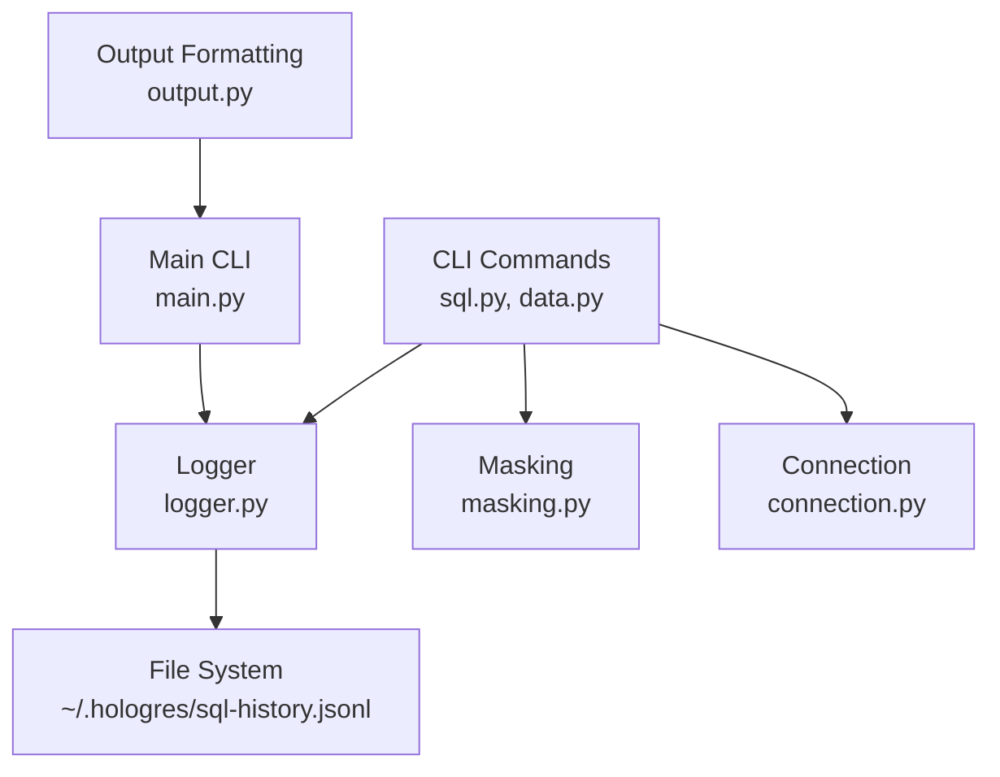
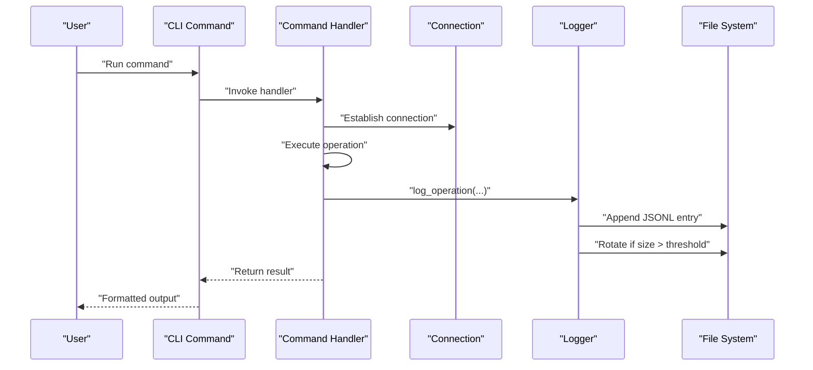
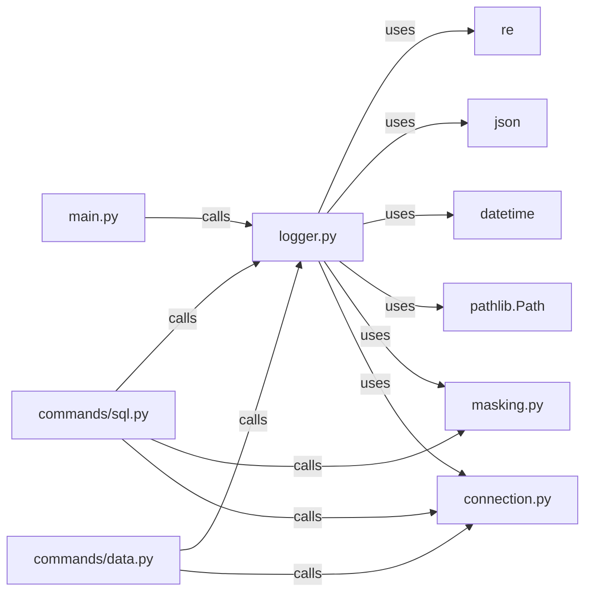

# Audit Logging API

<cite>
**Referenced Files in This Document**
- [logger.py](file://hologres-cli/src/hologres_cli/logger.py)
- [masking.py](file://hologres-cli/src/hologres_cli/masking.py)
- [connection.py](file://hologres-cli/src/hologres_cli/connection.py)
- [main.py](file://hologres-cli/src/hologres_cli/main.py)
- [sql.py](file://hologres-cli/src/hologres_cli/commands/sql.py)
- [data.py](file://hologres-cli/src/hologres_cli/commands/data.py)
- [output.py](file://hologres-cli/src/hologres_cli/output.py)
- [README.md](file://hologres-cli/README.md)
- [pyproject.toml](file://hologres-cli/pyproject.toml)
- [test_logger.py](file://hologres-cli/tests/test_logger.py)
- [test_masking.py](file://hologres-cli/tests/test_masking.py)
</cite>

## Table of Contents
1. [Introduction](#introduction)
2. [Project Structure](#project-structure)
3. [Core Components](#core-components)
4. [Architecture Overview](#architecture-overview)
5. [Detailed Component Analysis](#detailed-component-analysis)
6. [Dependency Analysis](#dependency-analysis)
7. [Performance Considerations](#performance-considerations)
8. [Troubleshooting Guide](#troubleshooting-guide)
9. [Conclusion](#conclusion)
10. [Appendices](#appendices)

## Introduction
This document describes the audit logging API for the Hologres CLI tool. It explains the log entry structure, timestamp formats, metadata inclusion, filtering and search capabilities, log rotation policies, sensitive data handling, file locations and permissions, and practical examples for log analysis, compliance reporting, and integration with log management systems. It also covers performance impact, configurable verbosity, and troubleshooting.

## Project Structure
The logging system is implemented in a dedicated module and integrated across CLI commands. The main components are:
- Logger module: writes JSONL entries, rotates logs, reads recent entries
- Masking module: sensitive field masking for output and logs
- Connection module: DSN resolution and masked DSN for logging
- Command modules: SQL and data commands that call the logger
- Main module: exposes the history command to read recent logs
- Output module: formatting helpers used by commands and history

**Diagram sources**
- [logger.py:1-105](file://hologres-cli/src/hologres_cli/logger.py#L1-L105)
- [masking.py:1-93](file://hologres-cli/src/hologres_cli/masking.py#L1-L93)
- [connection.py:1-229](file://hologres-cli/src/hologres_cli/connection.py#L1-L229)
- [sql.py:1-199](file://hologres-cli/src/hologres_cli/commands/sql.py#L1-L199)
- [data.py:1-266](file://hologres-cli/src/hologres_cli/commands/data.py#L1-L266)
- [main.py:86-96](file://hologres-cli/src/hologres_cli/main.py#L86-L96)
- [output.py:1-143](file://hologres-cli/src/hologres_cli/output.py#L1-L143)

**Section sources**
- [logger.py:1-105](file://hologres-cli/src/hologres_cli/logger.py#L1-L105)
- [masking.py:1-93](file://hologres-cli/src/hologres_cli/masking.py#L1-L93)
- [connection.py:1-229](file://hologres-cli/src/hologres_cli/connection.py#L1-L229)
- [sql.py:1-199](file://hologres-cli/src/hologres_cli/commands/sql.py#L1-L199)
- [data.py:1-266](file://hologres-cli/src/hologres_cli/commands/data.py#L1-L266)
- [main.py:86-96](file://hologres-cli/src/hologres_cli/main.py#L86-L96)
- [output.py:1-143](file://hologres-cli/src/hologres_cli/output.py#L1-L143)

## Core Components
- Logger: writes JSONL entries with standardized fields, redacts SQL literals, rotates logs when size exceeds threshold, and provides a reader for recent entries.
- Masking: provides sensitive field masking for output rows and SQL literal redaction for logs.
- Connection: resolves DSN from multiple sources and provides a masked DSN suitable for logging.
- Commands: integrate logging into SQL and data operations, capturing success/failure, durations, row counts, and errors.
- Main/history: exposes a command to read recent log entries.

Key responsibilities:
- Log entry creation and redaction
- Log rotation policy
- Access to recent logs for analysis
- Consistent DSN masking for security

**Section sources**
- [logger.py:36-105](file://hologres-cli/src/hologres_cli/logger.py#L36-L105)
- [masking.py:66-93](file://hologres-cli/src/hologres_cli/masking.py#L66-L93)
- [connection.py:173-176](file://hologres-cli/src/hologres_cli/connection.py#L173-L176)
- [sql.py:66-135](file://hologres-cli/src/hologres_cli/commands/sql.py#L66-L135)
- [data.py:107-213](file://hologres-cli/src/hologres_cli/commands/data.py#L107-L213)
- [main.py:86-96](file://hologres-cli/src/hologres_cli/main.py#L86-L96)

## Architecture Overview
The audit logging pipeline integrates with CLI commands to capture operation metadata and sensitive SQL content. The logger ensures secure logging by redacting sensitive literals and rotating logs when necessary.

**Diagram sources**
- [sql.py:66-135](file://hologres-cli/src/hologres_cli/commands/sql.py#L66-L135)
- [data.py:107-213](file://hologres-cli/src/hologres_cli/commands/data.py#L107-L213)
- [logger.py:36-87](file://hologres-cli/src/hologres_cli/logger.py#L36-L87)

## Detailed Component Analysis

### Logger Module
The logger module defines:
- Log directory and file path under the user’s home directory
- Maximum log size threshold for rotation
- Redaction patterns for sensitive SQL literals
- Functions to ensure log directory exists, redact SQL, write entries, rotate logs, and read recent entries

Log entry fields:
- timestamp: UTC ISO 8601 string
- operation: command or operation type
- success: boolean indicating outcome
- sql: redacted SQL (optional)
- dsn: masked DSN (optional)
- row_count: number of rows affected or returned (optional)
- error_code: error code string (optional)
- error_message: error message (optional)
- duration_ms: execution time rounded to two decimals (optional)
- extra: arbitrary metadata dictionary (optional)

Log rotation:
- When the log file exceeds the size threshold, the current file is renamed to a backup with a suffix, replacing any existing backup.

Reading recent logs:
- Reads the file line-by-line, skipping invalid JSON lines, returning the last N entries.

**Section sources**
- [logger.py:11-13](file://hologres-cli/src/hologres_cli/logger.py#L11-L13)
- [logger.py:15-22](file://hologres-cli/src/hologres_cli/logger.py#L15-L22)
- [logger.py:25-27](file://hologres-cli/src/hologres_cli/logger.py#L25-L27)
- [logger.py:29-33](file://hologres-cli/src/hologres_cli/logger.py#L29-L33)
- [logger.py:36-73](file://hologres-cli/src/hologres_cli/logger.py#L36-L73)
- [logger.py:76-86](file://hologres-cli/src/hologres_cli/logger.py#L76-L86)
- [logger.py:89-104](file://hologres-cli/src/hologres_cli/logger.py#L89-L104)

### Masking Module
The masking module provides:
- Pattern-based detection of sensitive columns by name
- Masking functions for phone, email, password, ID card, and bank card
- A function to apply masking to rows returned by queries

Masking behavior:
- Phone: retains first 3 and last 4 digits, masks middle digits
- Email: masks local part leaving first character, keeps domain
- Password/Secret/Token: replaced with fixed mask
- ID Card: retains first 3 and last 4 digits
- Bank Card: retains last 4 digits

Row masking is applied by the SQL command before logging and printing output, unless disabled.

**Section sources**
- [masking.py:8-64](file://hologres-cli/src/hologres_cli/masking.py#L8-L64)
- [masking.py:66-93](file://hologres-cli/src/hologres_cli/masking.py#L66-L93)

### Connection Module
The connection module:
- Resolves DSN from CLI flag, environment variable, or config file
- Parses DSN into connection parameters
- Provides a masked DSN for logging by hiding passwords

This ensures that sensitive credentials are not written to logs.

**Section sources**
- [connection.py:39-64](file://hologres-cli/src/hologres_cli/connection.py#L39-L64)
- [connection.py:120-171](file://hologres-cli/src/hologres_cli/connection.py#L120-L171)
- [connection.py:173-176](file://hologres-cli/src/hologres_cli/connection.py#L173-L176)

### Commands Integration
SQL command:
- Blocks write operations and logs failures with error codes
- Logs successful queries with row counts and durations
- Logs limit-required scenarios and query errors with details

Data commands:
- Export/import/count operations log SQL, success/failure, row counts, and durations
- Uses validated identifiers and safe COPY statements to prevent injection

**Section sources**
- [sql.py:78-86](file://hologres-cli/src/hologres_cli/commands/sql.py#L78-L86)
- [sql.py:91-101](file://hologres-cli/src/hologres_cli/commands/sql.py#L91-L101)
- [sql.py:106-132](file://hologres-cli/src/hologres_cli/commands/sql.py#L106-L132)
- [data.py:107-122](file://hologres-cli/src/hologres_cli/commands/data.py#L107-L122)
- [data.py:198-213](file://hologres-cli/src/hologres_cli/commands/data.py#L198-L213)
- [data.py:251-265](file://hologres-cli/src/hologres_cli/commands/data.py#L251-L265)

### Main/history Command
The history command:
- Reads recent log entries from the JSONL file
- Prints them in the selected output format

**Section sources**
- [main.py:86-96](file://hologres-cli/src/hologres_cli/main.py#L86-L96)
- [logger.py:89-104](file://hologres-cli/src/hologres_cli/logger.py#L89-L104)

## Dependency Analysis
The logger depends on:
- Standard library modules for file operations, JSON, regex, datetime, and pathlib
- Masking module for SQL redaction
- Connection module for masked DSN

Commands depend on:
- Logger for audit logging
- Masking for output masking
- Connection for DSN resolution and masked DSN

**Diagram sources**
- [logger.py:3-9](file://hologres-cli/src/hologres_cli/logger.py#L3-L9)
- [masking.py:5-6](file://hologres-cli/src/hologres_cli/masking.py#L5-L6)
- [connection.py:12-15](file://hologres-cli/src/hologres_cli/connection.py#L12-L15)
- [sql.py:12-23](file://hologres-cli/src/hologres_cli/commands/sql.py#L12-L23)
- [data.py:14-22](file://hologres-cli/src/hologres_cli/commands/data.py#L14-L22)
- [main.py:91-95](file://hologres-cli/src/hologres_cli/main.py#L91-L95)

**Section sources**
- [logger.py:3-9](file://hologres-cli/src/hologres_cli/logger.py#L3-L9)
- [masking.py:5-6](file://hologres-cli/src/hologres_cli/masking.py#L5-L6)
- [connection.py:12-15](file://hologres-cli/src/hologres_cli/connection.py#L12-L15)
- [sql.py:12-23](file://hologres-cli/src/hologres_cli/commands/sql.py#L12-L23)
- [data.py:14-22](file://hologres-cli/src/hologres_cli/commands/data.py#L14-L22)
- [main.py:91-95](file://hologres-cli/src/hologres_cli/main.py#L91-L95)

## Performance Considerations
- Logging overhead: Each operation appends a single JSON line to disk. The cost is minimal compared to network/database operations.
- Redaction cost: SQL literal redaction runs regex replacements; negligible for typical query sizes.
- Rotation cost: Occurs only when the file exceeds the size threshold; infrequent.
- Output masking: Applied to rows before logging/printing; overhead proportional to row count and column count.
- Recommendations:
  - Use the default log size threshold; adjust only if disk space is constrained.
  - Avoid disabling masking unless necessary for debugging.
  - Prefer JSONL output for machine parsing to minimize post-processing overhead.

[No sources needed since this section provides general guidance]

## Troubleshooting Guide
Common issues and resolutions:
- Permission denied writing to log file:
  - Ensure the user has write permission to the configuration directory.
  - The logger creates the directory if missing.
- Log file not rotating:
  - Verify the size threshold and that the file grows beyond the limit.
  - Check for filesystem constraints or read-only mounts.
- History command returns empty:
  - Confirm the log file exists and is readable.
  - Use the default count or increase the count parameter.
- Sensitive data still visible:
  - Verify that masking is enabled (default) and that column names match expected patterns.
  - For SQL redaction, ensure the query contains sensitive literals.

Validation references:
- Directory creation and file writing behavior
- Rotation behavior and backup replacement
- Reading recent logs with error handling
- Masking function selection and row masking

**Section sources**
- [logger.py:25-27](file://hologres-cli/src/hologres_cli/logger.py#L25-L27)
- [logger.py:76-86](file://hologres-cli/src/hologres_cli/logger.py#L76-L86)
- [logger.py:89-104](file://hologres-cli/src/hologres_cli/logger.py#L89-L104)
- [test_logger.py:97-114](file://hologres-cli/tests/test_logger.py#L97-L114)
- [test_logger.py:255-311](file://hologres-cli/tests/test_logger.py#L255-L311)
- [test_logger.py:313-382](file://hologres-cli/tests/test_logger.py#L313-L382)
- [test_masking.py:227-354](file://hologres-cli/tests/test_masking.py#L227-L354)
- [test_masking.py:355-455](file://hologres-cli/tests/test_masking.py#L355-L455)

## Conclusion
The Hologres CLI audit logging API provides a secure, structured, and efficient way to track operations. It redacts sensitive data, enforces rotation, and offers a simple history interface for analysis. The design balances security, performance, and usability, enabling compliance reporting and integration with external log management systems.

[No sources needed since this section summarizes without analyzing specific files]

## Appendices

### Log Entry Structure Reference
- Fields: timestamp, operation, success, sql, dsn, row_count, error_code, error_message, duration_ms, extra
- Timestamp format: UTC ISO 8601 string
- SQL redaction: performed before logging
- DSN masking: password portion replaced with placeholder

**Section sources**
- [logger.py:51-69](file://hologres-cli/src/hologres_cli/logger.py#L51-L69)
- [logger.py:52](file://hologres-cli/src/hologres_cli/logger.py#L52)
- [logger.py:29-33](file://hologres-cli/src/hologres_cli/logger.py#L29-L33)
- [connection.py:173-176](file://hologres-cli/src/hologres_cli/connection.py#L173-L176)

### Log Filtering and Search
- Recent entries: use the history command with a count parameter to limit results.
- Manual filtering: process the JSONL file with standard tools or scripts.
- Field-based filtering: search for specific operations, error codes, or presence of fields.

**Section sources**
- [main.py:86-96](file://hologres-cli/src/hologres_cli/main.py#L86-L96)
- [logger.py:89-104](file://hologres-cli/src/hologres_cli/logger.py#L89-L104)

### Log Rotation Policy
- Threshold: maximum file size before rotation
- Behavior: rename current file to backup, replacing any existing backup
- Exception handling: if rotation fails, attempts to clear the file

**Section sources**
- [logger.py:13](file://hologres-cli/src/hologres_cli/logger.py#L13)
- [logger.py:76-86](file://hologres-cli/src/hologres_cli/logger.py#L76-L86)

### Sensitive Data Handling
- SQL literal redaction: phone numbers, emails, ID cards, bank cards, and assignments of password/token/secret
- Output masking: applies to rows returned by queries based on column names
- DSN masking: hides password in connection strings

**Section sources**
- [logger.py:15-22](file://hologres-cli/src/hologres_cli/logger.py#L15-L22)
- [masking.py:8-64](file://hologres-cli/src/hologres_cli/masking.py#L8-L64)
- [connection.py:173-176](file://hologres-cli/src/hologres_cli/connection.py#L173-L176)

### Log File Locations and Permissions
- Location: user home directory under a hidden folder
- Permissions: created by the user; ensure appropriate umask and ownership
- Access controls: rely on OS-level file permissions

**Section sources**
- [logger.py:11-12](file://hologres-cli/src/hologres_cli/logger.py#L11-L12)
- [connection.py:17-18](file://hologres-cli/src/hologres_cli/connection.py#L17-L18)

### Examples

#### Viewing Recent History
- Use the history command to list recent entries with a specified count.

**Section sources**
- [main.py:86-96](file://hologres-cli/src/hologres_cli/main.py#L86-L96)

#### Compliance Reporting
- Export recent entries to a file for review or upload to compliance tools.
- Filter by operation type, error codes, or time window using external tools.

[No sources needed since this section provides general guidance]

#### Integration with Log Management Systems
- Stream the JSONL file to log collectors (e.g., filebeat, fluent-bit).
- Use standard JSON parsing to extract fields for dashboards and alerts.

[No sources needed since this section provides general guidance]

### API Reference

#### Logger Functions
- ensure_log_dir(): Creates the log directory if missing
- redact_sql(sql): Returns SQL with sensitive literals redacted
- log_operation(operation, sql, dsn_masked, success, row_count, error_code, error_message, duration_ms, extra): Writes a log entry
- _rotate_log(): Rotates the log file to a backup
- read_recent_logs(count): Reads the last N log entries

**Section sources**
- [logger.py:25-27](file://hologres-cli/src/hologres_cli/logger.py#L25-L27)
- [logger.py:29-33](file://hologres-cli/src/hologres_cli/logger.py#L29-L33)
- [logger.py:36-73](file://hologres-cli/src/hologres_cli/logger.py#L36-L73)
- [logger.py:76-86](file://hologres-cli/src/hologres_cli/logger.py#L76-L86)
- [logger.py:89-104](file://hologres-cli/src/hologres_cli/logger.py#L89-L104)

#### Masking Functions
- get_mask_function(column_name): Returns a mask function for a given column name
- mask_rows(rows): Applies masking to sensitive columns in rows

**Section sources**
- [masking.py:66-70](file://hologres-cli/src/hologres_cli/masking.py#L66-L70)
- [masking.py:73-92](file://hologres-cli/src/hologres_cli/masking.py#L73-L92)

#### Connection Utilities
- mask_dsn_password(dsn): Masks password in DSN for logging

**Section sources**
- [connection.py:173-176](file://hologres-cli/src/hologres_cli/connection.py#L173-L176)

### Security Notes
- SQL literal redaction protects sensitive values embedded in queries.
- Output masking prevents accidental exposure of sensitive fields in results.
- DSN masking avoids credential leakage in logs.

**Section sources**
- [logger.py:15-22](file://hologres-cli/src/hologres_cli/logger.py#L15-L22)
- [masking.py:8-64](file://hologres-cli/src/hologres_cli/masking.py#L8-L64)
- [connection.py:173-176](file://hologres-cli/src/hologres_cli/connection.py#L173-L176)