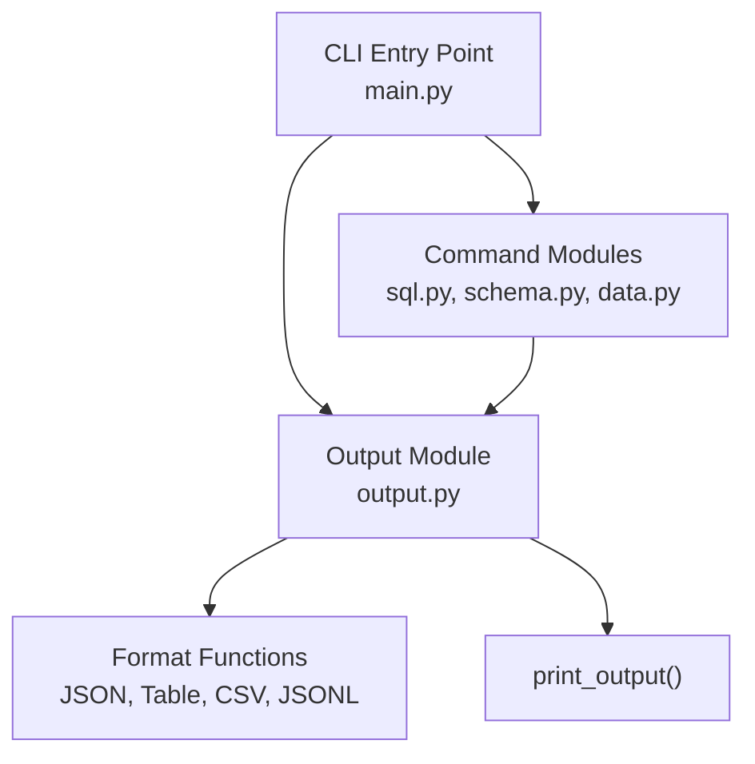
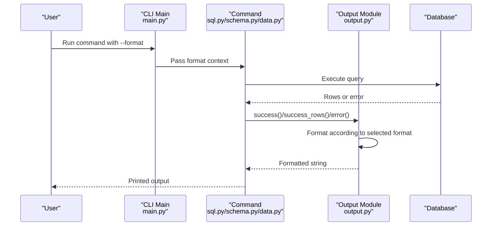
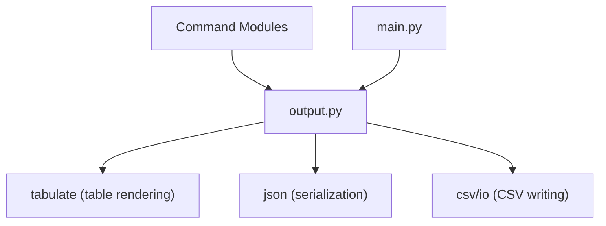

# Output Formatting API

<cite>
**Referenced Files in This Document**
- [output.py](file://hologres-cli/src/hologres_cli/output.py)
- [main.py](file://hologres-cli/src/hologres_cli/main.py)
- [sql.py](file://hologres-cli/src/hologres_cli/commands/sql.py)
- [schema.py](file://hologres-cli/src/hologres_cli/commands/schema.py)
- [data.py](file://hologres-cli/src/hologres_cli/commands/data.py)
- [test_output.py](file://hologres-cli/tests/test_output.py)
- [test_output_format_live.py](file://hologres-cli/tests/integration/test_output_format_live.py)
- [README.md](file://hologres-cli/README.md)
</cite>

## Table of Contents
1. [Introduction](#introduction)
2. [Project Structure](#project-structure)
3. [Core Components](#core-components)
4. [Architecture Overview](#architecture-overview)
5. [Detailed Component Analysis](#detailed-component-analysis)
6. [Dependency Analysis](#dependency-analysis)
7. [Performance Considerations](#performance-considerations)
8. [Troubleshooting Guide](#troubleshooting-guide)
9. [Conclusion](#conclusion)

## Introduction
This document provides comprehensive output formatting API documentation for the Hologres CLI tool. It explains the unified output formatting system that supports JSON, table, CSV, and JSONL formats, along with the standardized response structure, format-specific options, column formatting capabilities, and data type handling. It also covers programmatic output processing, integration patterns with downstream systems, and performance considerations for large result sets.

## Project Structure
The output formatting system is implemented in a dedicated module and integrated across all CLI commands. The main entry point defines the global format option, while individual command modules delegate formatted output to the output module.

**Diagram sources**
- [main.py:15-49](file://hologres-cli/src/hologres_cli/main.py#L15-L49)
- [output.py:23-143](file://hologres-cli/src/hologres_cli/output.py#L23-L143)
- [sql.py:14-23](file://hologres-cli/src/hologres_cli/commands/sql.py#L14-L23)
- [schema.py:14-22](file://hologres-cli/src/hologres_cli/commands/schema.py#L14-L22)
- [data.py:15-22](file://hologres-cli/src/hologres_cli/commands/data.py#L15-L22)

**Section sources**
- [main.py:15-49](file://hologres-cli/src/hologres_cli/main.py#L15-L49)
- [output.py:16-20](file://hologres-cli/src/hologres_cli/output.py#L16-L20)

## Core Components
The output formatting API consists of:
- Unified response structure with success and error indicators
- Four output formats: JSON, table, CSV, and JSONL
- Helper functions for success responses, error responses, and printing
- Format-specific formatters for rows and scalar data
- Global format selection via CLI option

Key elements:
- Response envelope: ok indicator, data payload, optional message, optional error object
- Row-based data: rows array and count for JSON format; custom columns support for table and CSV
- Scalar data: direct formatting for table and CSV; JSON serialization for others
- Error responses: standardized error object with code and message, optional details

**Section sources**
- [output.py:23-63](file://hologres-cli/src/hologres_cli/output.py#L23-L63)
- [output.py:91-117](file://hologres-cli/src/hologres_cli/output.py#L91-L117)
- [README.md:211-233](file://hologres-cli/README.md#L211-L233)

## Architecture Overview
The output formatting architecture ensures consistent response formatting across all commands. The CLI sets the global format, and each command uses the output module to format results.

**Diagram sources**
- [main.py:17-39](file://hologres-cli/src/hologres_cli/main.py#L17-L39)
- [sql.py:50-63](file://hologres-cli/src/hologres_cli/commands/sql.py#L50-L63)
- [schema.py:48-73](file://hologres-cli/src/hologres_cli/commands/schema.py#L48-L73)
- [data.py:60-110](file://hologres-cli/src/hologres_cli/commands/data.py#L60-L110)
- [output.py:23-54](file://hologres-cli/src/hologres_cli/output.py#L23-L54)

## Detailed Component Analysis

### Standardized Response Structure
All outputs follow a consistent envelope:
- Success: ok: true, data: payload, optional message
- Error: ok: false, error: { code, message, optional details }

Additional metadata fields:
- JSON success_rows: data.rows, data.count, optional data.total_count, optional message

Data type handling:
- JSON: Full serialization with default str conversion for non-serializable types
- Table: Uses tabulate for human-readable rendering; scalar values rendered directly
- CSV: Uses DictWriter with header and rows; extra fields ignored per extrasaction policy
- JSONL: Line-delimited JSON with newline separation

**Section sources**
- [output.py:23-63](file://hologres-cli/src/hologres_cli/output.py#L23-L63)
- [output.py:91-117](file://hologres-cli/src/hologres_cli/output.py#L91-L117)
- [README.md:211-233](file://hologres-cli/README.md#L211-L233)

### JSON Format
- Purpose: Structured, machine-readable output suitable for downstream systems
- Success payload: data.rows (array), data.count (integer), optional data.total_count, optional message
- Error payload: error.code (string), error.message (string), optional error.details (object)
- Data type handling: JSON serialization with default str conversion for complex types

Use cases:
- Programmatic consumption by scripts and applications
- Integration with monitoring and alerting systems
- Pipeline processing with standard JSON parsers

**Section sources**
- [output.py:46-54](file://hologres-cli/src/hologres_cli/output.py#L46-L54)
- [test_output.py:83-90](file://hologres-cli/tests/test_output.py#L83-L90)

### Table Format
- Purpose: Human-readable presentation of tabular data
- Behavior:
  - Rows: renders as a simple table with headers
  - Dictionary data: converts to key/value pairs for display
  - Scalar data: printed as-is
  - Empty rows: "(no rows)" placeholder
- Column customization: optional columns parameter restricts output to specified columns

Use cases:
- Interactive terminal sessions
- Quick inspection and reporting
- Debugging and ad-hoc analysis

**Section sources**
- [output.py:66-88](file://hologres-cli/src/hologres_cli/output.py#L66-L88)
- [output.py:91-98](file://hologres-cli/src/hologres_cli/output.py#L91-L98)
- [test_output.py:171-182](file://hologres-cli/tests/test_output.py#L171-L182)

### CSV Format
- Purpose: Comma-separated values for spreadsheet and analytics tools
- Behavior:
  - Header row with column names
  - Data rows with values
  - Empty rows produce empty string
  - Custom columns: only specified columns included
  - Extra fields per row are ignored (extrasaction='ignore')
- Special characters: properly quoted and escaped by DictWriter

Use cases:
- Import into Excel, Google Sheets, and BI tools
- Data exchange with external systems
- Batch processing pipelines

**Section sources**
- [output.py:77-81](file://hologres-cli/src/hologres_cli/output.py#L77-L81)
- [output.py:101-111](file://hologres-cli/src/hologres_cli/output.py#L101-L111)
- [test_output.py:215-225](file://hologres-cli/tests/test_output.py#L215-L225)

### JSONL Format
- Purpose: Line-delimited JSON for streaming and event processing
- Behavior:
  - Each row serialized as a separate JSON line
  - Empty rows produce empty string
  - Unicode preservation maintained
- Use cases:
  - Streaming ingestion into log processors
  - Event-driven architectures
  - Large dataset processing with memory constraints

**Section sources**
- [output.py:82-86](file://hologres-cli/src/hologres_cli/output.py#L82-L86)
- [output.py:114-117](file://hologres-cli/src/hologres_cli/output.py#L114-L117)
- [test_output.py:262-274](file://hologres-cli/tests/test_output.py#L262-L274)

### Format-Specific Options and Column Formatting
- Custom columns: success_rows accepts columns parameter for table and CSV formats
- Total count: success_rows supports total_count for indicating overall result set size
- Message: optional message field for both success and success_rows
- Error details: optional details object for richer error context

Integration patterns:
- Downstream systems can parse JSON envelopes and extract rows or metadata
- CSV consumers can rely on stable header names
- JSONL enables streaming processing with line-by-line parsing

**Section sources**
- [output.py:31-54](file://hologres-cli/src/hologres_cli/output.py#L31-L54)
- [test_output.py:113-125](file://hologres-cli/tests/test_output.py#L113-L125)
- [test_output.py:127-140](file://hologres-cli/tests/test_output.py#L127-L140)

### Command Integration and Usage
- Global format option: --format/-f selects output format for all commands
- Command-specific behavior:
  - SQL: success_rows for SELECT results; schema info available with --with-schema
  - Schema: success_rows for table listings; success for describe/dump
  - Data: success for export/import/count operations
- Error helpers: connection_error, query_error, limit_required_error, write_guard_error, dangerous_write_error

**Section sources**
- [main.py:17-39](file://hologres-cli/src/hologres_cli/main.py#L17-L39)
- [sql.py:116-123](file://hologres-cli/src/hologres_cli/commands/sql.py#L116-L123)
- [schema.py:73](file://hologres-cli/src/hologres_cli/commands/schema.py#L73)
- [data.py:110](file://hologres-cli/src/hologres_cli/commands/data.py#L110)
- [output.py:125-142](file://hologres-cli/src/hologres_cli/output.py#L125-L142)

## Dependency Analysis
The output formatting system has minimal external dependencies and clear internal boundaries.

**Diagram sources**
- [output.py:14-14](file://hologres-cli/src/hologres_cli/output.py#L14-L14)
- [output.py:10-11](file://hologres-cli/src/hologres_cli/output.py#L10-L11)
- [output.py:8-9](file://hologres-cli/src/hologres_cli/output.py#L8-L9)

**Section sources**
- [output.py:14-14](file://hologres-cli/src/hologres_cli/output.py#L14-L14)
- [output.py:10-11](file://hologres-cli/src/hologres_cli/output.py#L10-L11)
- [output.py:8-9](file://hologres-cli/src/hologres_cli/output.py#L8-L9)

## Performance Considerations
- JSON format: Best for downstream systems; includes row arrays and counts; suitable for small to medium datasets
- Table format: Human-readable but requires full rendering; may be slower for large datasets
- CSV format: Efficient for spreadsheet tools; header overhead; extra fields ignored for stability
- JSONL format: Optimal for streaming and large datasets; line-delimited allows incremental processing
- Memory usage: Table and CSV renderers materialize data; JSONL streams line-by-line
- Large result sets: Consider JSONL for streaming, or JSON with pagination and total_count metadata

[No sources needed since this section provides general guidance]

## Troubleshooting Guide
Common issues and resolutions:
- Invalid format selection: Ensure format is one of json, table, csv, jsonl
- Empty result sets: Table returns "(no rows)"; CSV returns ""; JSONL returns ""
- Large result sets: Add LIMIT clauses or use JSONL streaming
- Write operations blocked: Use --write flag for allowed write operations
- Dangerous write operations: Add WHERE clauses for DELETE/UPDATE
- Connection errors: Verify DSN configuration and network connectivity

Validation and testing:
- Unit tests cover all format variants and edge cases
- Integration tests validate format behavior across commands
- Error helpers provide consistent error responses

**Section sources**
- [test_output.py:143-166](file://hologres-cli/tests/test_output.py#L143-L166)
- [test_output_format_live.py:17-42](file://hologres-cli/tests/integration/test_output_format_live.py#L17-L42)
- [output.py:125-142](file://hologres-cli/src/hologres_cli/output.py#L125-L142)

## Conclusion
The Hologres CLI output formatting API provides a consistent, structured approach to presenting query results across multiple formats. The standardized response envelope simplifies programmatic consumption, while format-specific options enable tailored output for different use cases. The system integrates seamlessly with CLI commands and supports both interactive and automated workflows, with performance considerations for large datasets and streaming scenarios.