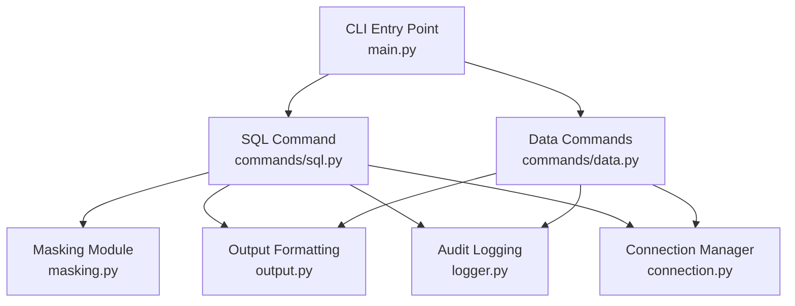
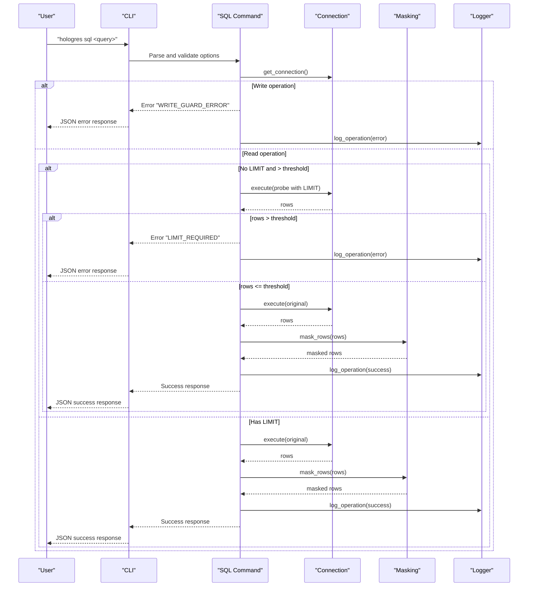
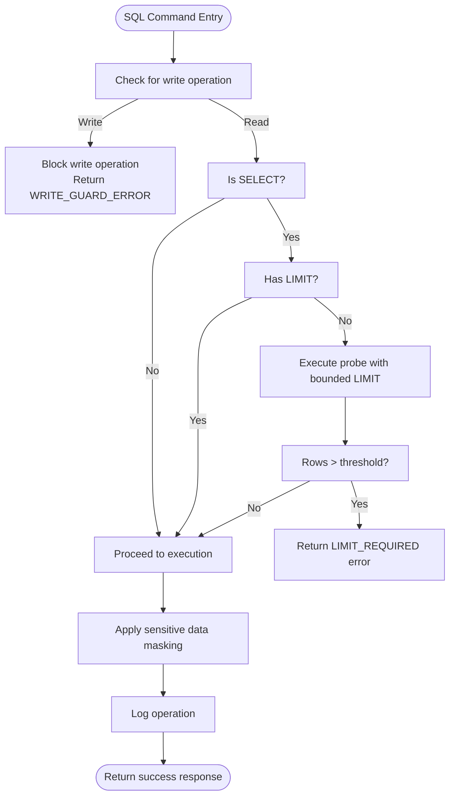
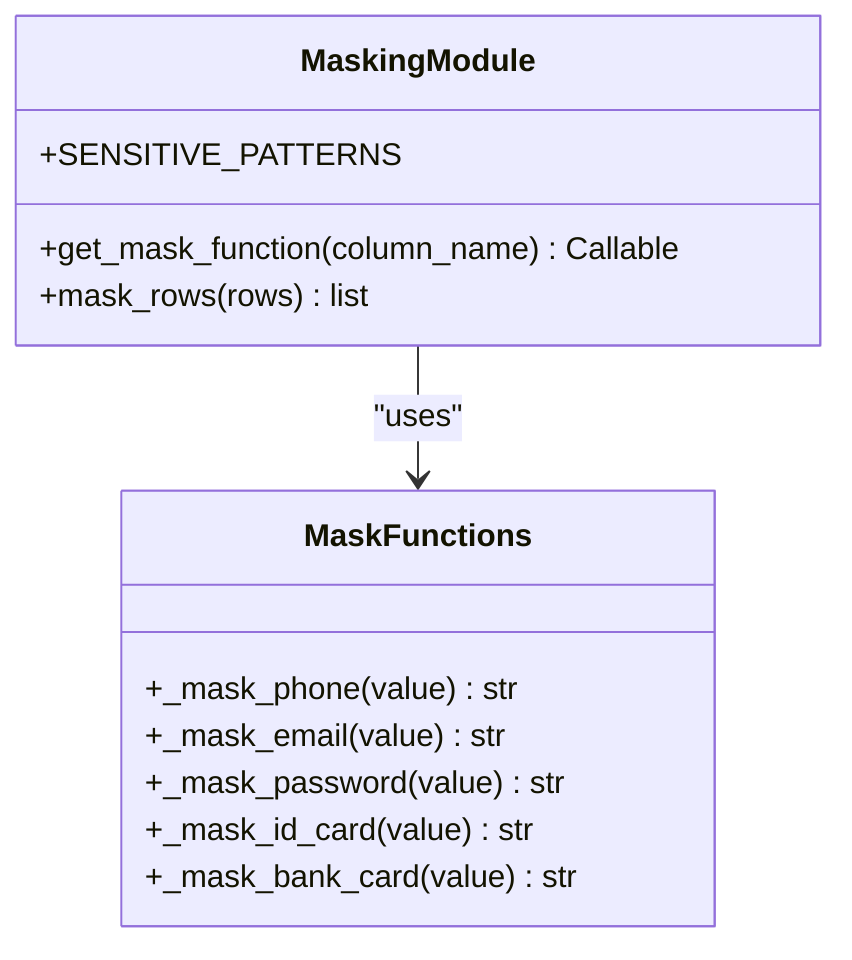
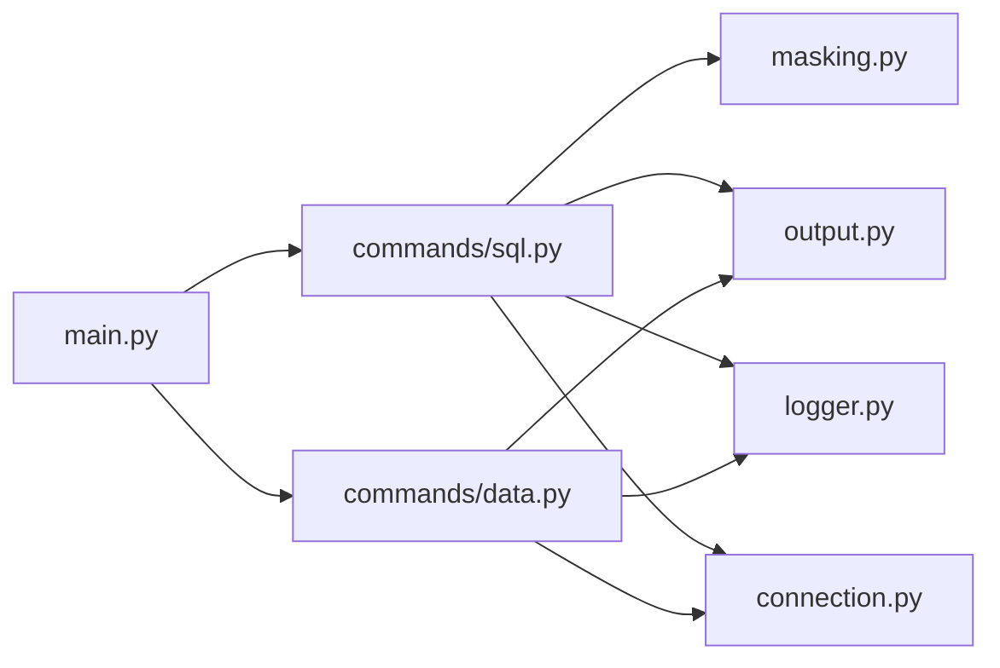

# Safety Guardrail API

<cite>
**Referenced Files in This Document**
- [safety-features.md](file://agent-skills/skills/hologres-cli/references/safety-features.md)
- [masking.py](file://hologres-cli/src/hologres_cli/masking.py)
- [sql.py](file://hologres-cli/src/hologres_cli/commands/sql.py)
- [logger.py](file://hologres-cli/src/hologres_cli/logger.py)
- [output.py](file://hologres-cli/src/hologres_cli/output.py)
- [connection.py](file://hologres-cli/src/hologres_cli/connection.py)
- [main.py](file://hologres-cli/src/hologres_cli/main.py)
- [README.md](file://hologres-cli/README.md)
- [SKILL.md](file://agent-skills/skills/hologres-cli/SKILL.md)
- [test_sql.py](file://hologres-cli/tests/test_commands/test_sql.py)
- [test_masking.py](file://hologres-cli/tests/test_masking.py)
</cite>

## Table of Contents
1. [Introduction](#introduction)
2. [Project Structure](#project-structure)
3. [Core Components](#core-components)
4. [Architecture Overview](#architecture-overview)
5. [Detailed Component Analysis](#detailed-component-analysis)
6. [Dependency Analysis](#dependency-analysis)
7. [Performance Considerations](#performance-considerations)
8. [Troubleshooting Guide](#troubleshooting-guide)
9. [Conclusion](#conclusion)
10. [Appendices](#appendices)

## Introduction
This document describes the Safety Guardrail API for the Hologres CLI tool. It explains how the CLI enforces row limits, blocks unsafe write operations, detects and mitigates dangerous SQL patterns, and protects sensitive data through automatic masking. It also documents error handling, warning systems, compliance reporting via audit logging, and performance implications of safety checks.

## Project Structure
The Safety Guardrail API spans several modules:
- SQL command module: enforces row limits, write protection, and dangerous write blocking
- Sensitive data masking module: auto-detects and masks sensitive columns
- Audit logging module: records operations for compliance and debugging
- Output formatting module: standardizes error and success responses
- Connection module: resolves DSN and manages database connectivity
- Main CLI entry point: orchestrates commands and global options

**Diagram sources**
- [main.py:1-111](file://hologres-cli/src/hologres_cli/main.py#L1-L111)
- [sql.py:1-199](file://hologres-cli/src/hologres_cli/commands/sql.py#L1-L199)
- [masking.py:1-93](file://hologres-cli/src/hologres_cli/masking.py#L1-L93)
- [logger.py:1-105](file://hologres-cli/src/hologres_cli/logger.py#L1-L105)
- [output.py:1-143](file://hologres-cli/src/hologres_cli/output.py#L1-L143)
- [connection.py:1-229](file://hologres-cli/src/hologres_cli/connection.py#L1-L229)

**Section sources**
- [README.md:1-314](file://hologres-cli/README.md#L1-L314)
- [SKILL.md:1-155](file://agent-skills/skills/hologres-cli/SKILL.md#L1-L155)

## Core Components
- Row Limit Enforcement: Prevents unintentional retrieval of large result sets by requiring a LIMIT clause for queries returning more than a threshold number of rows.
- Write Operation Blocking: Blocks all write operations by default; requires explicit opt-in to enable writes.
- Dangerous Write Detection: Prohibits DELETE/UPDATE without a WHERE clause to prevent mass data modification.
- Sensitive Data Masking: Automatically masks sensitive columns based on column name patterns; can be disabled per-query.
- Audit Logging: Logs all operations to a JSONL history file with redacted SQL and metadata for compliance and debugging.
- Error Handling and Warnings: Standardized error codes and messages for safety violations; warnings for large result sets and sensitive data exposure risks.

**Section sources**
- [safety-features.md:5-145](file://agent-skills/skills/hologres-cli/references/safety-features.md#L5-L145)
- [sql.py:25-31](file://hologres-cli/src/hologres_cli/commands/sql.py#L25-L31)
- [output.py:125-143](file://hologres-cli/src/hologres_cli/output.py#L125-L143)
- [logger.py:36-74](file://hologres-cli/src/hologres_cli/logger.py#L36-L74)

## Architecture Overview
The Safety Guardrail API integrates with the SQL command pipeline to enforce safety policies before executing queries. It performs:
- Pre-execution checks for write operations and row limits
- Post-execution masking of sensitive data
- Logging of all operations with redacted SQL
- Consistent error reporting across all safety violations

**Diagram sources**
- [sql.py:66-135](file://hologres-cli/src/hologres_cli/commands/sql.py#L66-L135)
- [masking.py:73-93](file://hologres-cli/src/hologres_cli/masking.py#L73-L93)
- [logger.py:36-74](file://hologres-cli/src/hologres_cli/logger.py#L36-L74)
- [output.py:125-143](file://hologres-cli/src/hologres_cli/output.py#L125-L143)

## Detailed Component Analysis

### Row Limit Enforcement Mechanism
Purpose:
- Prevent accidental retrieval of large result sets that could consume memory, slow clients, or transfer unnecessary data.

Behavior:
- Queries without a LIMIT clause that return more than a configured threshold are blocked with a specific error code.
- A probe query is executed to determine row count before deciding whether to allow the original query.

Key constants and thresholds:
- Default row limit threshold and probe limit define the enforcement window.

Implementation highlights:
- Detects SELECT statements and absence of LIMIT.
- Executes a probe query with a bounded LIMIT to estimate row count.
- Enforces the limit requirement and returns standardized error codes.

Bypass mechanism:
- A dedicated flag disables the row limit check for scenarios where large exports or controlled scans are intentional.

Examples:
- Queries exceeding the threshold without LIMIT fail with a limit-required error.
- Adding LIMIT or using the bypass flag allows execution.

**Section sources**
- [safety-features.md:13-29](file://agent-skills/skills/hologres-cli/references/safety-features.md#L13-L29)
- [sql.py:25-31](file://hologres-cli/src/hologres_cli/commands/sql.py#L25-L31)
- [sql.py:88-104](file://hologres-cli/src/hologres_cli/commands/sql.py#L88-L104)
- [output.py:133-134](file://hologres-cli/src/hologres_cli/output.py#L133-L134)
- [test_sql.py:453-475](file://hologres-cli/tests/test_commands/test_sql.py#L453-L475)

**Diagram sources**
- [sql.py:66-135](file://hologres-cli/src/hologres_cli/commands/sql.py#L66-L135)
- [masking.py:73-93](file://hologres-cli/src/hologres_cli/masking.py#L73-L93)
- [logger.py:36-74](file://hologres-cli/src/hologres_cli/logger.py#L36-L74)

### Write Operation Blocking Policies
Purpose:
- Prevent accidental write operations by requiring explicit intent.

Behavior:
- All write operations (INSERT, UPDATE, DELETE, DROP, CREATE, ALTER, TRUNCATE, GRANT, REVOKE) are blocked by default.
- An explicit flag is required to enable write operations.

Detection logic:
- Keywords are matched at the beginning of the statement to classify as write operations.

Bypass mechanism:
- A dedicated flag enables write operations when explicitly intended.

Examples:
- Attempting a write without the flag fails with a write-guard error.
- Using the flag with a write operation succeeds.

**Section sources**
- [safety-features.md:36-54](file://agent-skills/skills/hologres-cli/references/safety-features.md#L36-L54)
- [sql.py:164-168](file://hologres-cli/src/hologres_cli/commands/sql.py#L164-L168)
- [output.py:137-138](file://hologres-cli/src/hologres_cli/output.py#L137-L138)
- [test_sql.py:424-452](file://hologres-cli/tests/test_commands/test_sql.py#L424-L452)

### Dangerous Write Blocking Algorithm
Purpose:
- Prevent mass data modifications that could cause data loss.

Behavior:
- DELETE and UPDATE without a WHERE clause are blocked.
- The system identifies potentially dangerous operations and returns a specific error code.

Detection logic:
- The algorithm inspects the statement for DELETE/UPDATE and presence of WHERE clauses.
- Matching is case-insensitive and accounts for comments and subqueries.

Bypass mechanism:
- Intentionally affecting all rows requires an explicit WHERE condition or alternative operations like TRUNCATE.

Examples:
- DELETE/UPDATE without WHERE are blocked.
- Specific-row operations succeed.

**Section sources**
- [safety-features.md:56-90](file://agent-skills/skills/hologres-cli/references/safety-features.md#L56-L90)
- [test_sql.py:182-234](file://hologres-cli/tests/test_commands/test_sql.py#L182-L234)

### Pattern-Based Security Rules and Customization
Pattern-based detection:
- The masking module registers sensitive column name patterns and associates them with masking functions.
- Patterns are compiled with case-insensitive matching.

Supported sensitive categories:
- Phone numbers, emails, passwords, ID cards, and bank cards.

Customization:
- The masking registry can be extended to add new patterns and masking strategies.
- Per-query control allows disabling masking when needed.

**Section sources**
- [masking.py:8-63](file://hologres-cli/src/hologres_cli/masking.py#L8-L63)
- [masking.py:66-70](file://hologres-cli/src/hologres_cli/masking.py#L66-L70)
- [masking.py:73-93](file://hologres-cli/src/hologres_cli/masking.py#L73-L93)
- [test_masking.py:227-354](file://hologres-cli/tests/test_masking.py#L227-L354)

**Diagram sources**
- [masking.py:1-93](file://hologres-cli/src/hologres_cli/masking.py#L1-L93)

### Sensitive Data Masking Capabilities
Automatic detection:
- Masks values in columns whose names match sensitive patterns.
- Preserves None values and non-sensitive columns.

Manual configuration:
- Per-query flag disables masking for specific operations.
- Extensible pattern registry allows adding new sensitive categories.

Masking strategies:
- Partial masking for phone numbers and ID cards.
- Initial character retention for emails.
- Full masking for passwords and tokens.
- Tail truncation for bank cards.

**Section sources**
- [safety-features.md:92-114](file://agent-skills/skills/hologres-cli/references/safety-features.md#L92-L114)
- [masking.py:15-56](file://hologres-cli/src/hologres_cli/masking.py#L15-L56)
- [test_masking.py:18-455](file://hologres-cli/tests/test_masking.py#L18-L455)

### Audit Logging and Compliance Reporting
Purpose:
- Maintain a tamper-evident record of all operations for accountability and debugging.

Behavior:
- Logs include timestamp, operation, SQL (redacted), success status, row count, error code/message, and duration.
- SQL literals are redacted using pattern-based replacements.

Log format:
- JSON Lines with UTC timestamps and compact entries.

Viewing history:
- Dedicated command lists recent entries with configurable count.

**Section sources**
- [safety-features.md:115-135](file://agent-skills/skills/hologres-cli/references/safety-features.md#L115-L135)
- [logger.py:36-74](file://hologres-cli/src/hologres_cli/logger.py#L36-L74)
- [logger.py:89-105](file://hologres-cli/src/hologres_cli/logger.py#L89-L105)
- [main.py:86-96](file://hologres-cli/src/hologres_cli/main.py#L86-L96)

### Error Handling for Safety Violations
Standardized error codes:
- CONNECTION_ERROR: DSN resolution or connection failure.
- QUERY_ERROR: SQL syntax or execution error.
- LIMIT_REQUIRED: SELECT without LIMIT exceeding threshold.
- WRITE_GUARD_ERROR: Write operation without explicit permission.
- DANGEROUS_WRITE_BLOCKED: DELETE/UPDATE without WHERE clause.

Warning systems:
- Large result set warnings prompt users to add LIMIT or use export commands.
- Sensitive data exposure warnings encourage masking and careful output handling.

Compliance reporting:
- Audit logs capture all safety violations with redacted SQL for compliance.

**Section sources**
- [safety-features.md:136-145](file://agent-skills/skills/hologres-cli/references/safety-features.md#L136-L145)
- [output.py:125-143](file://hologres-cli/src/hologres_cli/output.py#L125-L143)
- [logger.py:29-33](file://hologres-cli/src/hologres_cli/logger.py#L29-L33)

## Dependency Analysis
The Safety Guardrail API relies on cohesive modules with minimal coupling:
- SQL command depends on masking, output, logger, and connection modules.
- Masking module encapsulates pattern registration and masking logic.
- Logger module centralizes audit logging and redaction.
- Output module standardizes response formats and error codes.
- Connection module abstracts DSN resolution and database connectivity.

**Diagram sources**
- [sql.py:1-24](file://hologres-cli/src/hologres_cli/commands/sql.py#L1-L24)
- [masking.py:1-93](file://hologres-cli/src/hologres_cli/masking.py#L1-L93)
- [logger.py:1-105](file://hologres-cli/src/hologres_cli/logger.py#L1-L105)
- [output.py:1-143](file://hologres-cli/src/hologres_cli/output.py#L1-L143)
- [connection.py:1-229](file://hologres-cli/src/hologres_cli/connection.py#L1-L229)
- [main.py:42-49](file://hologres-cli/src/hologres_cli/main.py#L42-L49)

**Section sources**
- [sql.py:1-24](file://hologres-cli/src/hologres_cli/commands/sql.py#L1-L24)
- [main.py:42-49](file://hologres-cli/src/hologres_cli/main.py#L42-L49)

## Performance Considerations
- Row limit enforcement executes a probe query to estimate row counts; this adds latency proportional to result size.
- Masking operates on result sets after retrieval; performance depends on row count and column cardinality.
- Audit logging writes JSONL entries asynchronously; log rotation prevents unbounded growth.
- Large field truncation avoids rendering oversized payloads, reducing output overhead.
- Recommendations:
  - Prefer explicit LIMIT clauses to avoid probe queries.
  - Use export commands for large data transfers.
  - Disable masking only when necessary to reduce CPU overhead.
  - Monitor log file sizes and rotate as needed.

[No sources needed since this section provides general guidance]

## Troubleshooting Guide
Common issues and resolutions:
- Connection failures: Verify DSN configuration via CLI flag, environment variable, or config file.
- Limit required errors: Add LIMIT or use the bypass flag for controlled scenarios.
- Write guard errors: Use the write flag for intentional mutations.
- Dangerous write blocked: Add WHERE clauses or use TRUNCATE for full-table operations.
- Sensitive data exposure: Rely on automatic masking or disable it per-query when required.

Diagnostic aids:
- Use the history command to review recent operations and error codes.
- Enable verbose output formats to inspect schema and row details.
- Review audit logs for redacted SQL traces and timing metrics.

**Section sources**
- [README.md:262-270](file://hologres-cli/README.md#L262-L270)
- [SKILL.md:122-131](file://agent-skills/skills/hologres-cli/SKILL.md#L122-L131)
- [main.py:86-96](file://hologres-cli/src/hologres_cli/main.py#L86-L96)
- [logger.py:89-105](file://hologres-cli/src/hologres_cli/logger.py#L89-L105)

## Conclusion
The Hologres CLI Safety Guardrail API provides robust safeguards against accidental data loss, excessive resource consumption, and sensitive data exposure. Through row limit enforcement, write protection, dangerous write detection, and sensitive data masking, it ensures safe operations while maintaining transparency via audit logging. The modular design allows customization and extension of security rules, and the standardized error handling and compliance reporting support operational excellence.

[No sources needed since this section summarizes without analyzing specific files]

## Appendices

### Safety Rule Configuration Examples
- Row limit enforcement: Add LIMIT or use the bypass flag for large queries.
- Write protection: Use the write flag for mutations; otherwise, operations are blocked.
- Dangerous write blocking: Include WHERE clauses for DELETE/UPDATE; use TRUNCATE for full-table clears.
- Sensitive data masking: Automatic masking applies to known sensitive columns; disable per-query when needed.

**Section sources**
- [safety-features.md:17-29](file://agent-skills/skills/hologres-cli/references/safety-features.md#L17-L29)
- [safety-features.md:46-54](file://agent-skills/skills/hologres-cli/references/safety-features.md#L46-L54)
- [safety-features.md:67-80](file://agent-skills/skills/hologres-cli/references/safety-features.md#L67-L80)
- [safety-features.md:109-114](file://agent-skills/skills/hologres-cli/references/safety-features.md#L109-L114)

### Integration with Security Policies
- Align row limit thresholds with organizational policies for acceptable data transfer sizes.
- Enforce write flags across CI/CD pipelines to prevent accidental mutations.
- Use audit logs for compliance reporting and incident investigations.
- Extend masking patterns to align with internal data classification standards.

[No sources needed since this section provides general guidance]