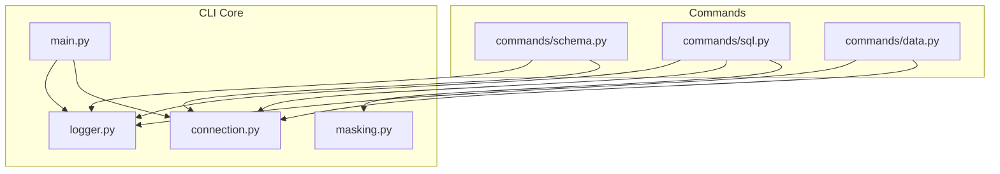
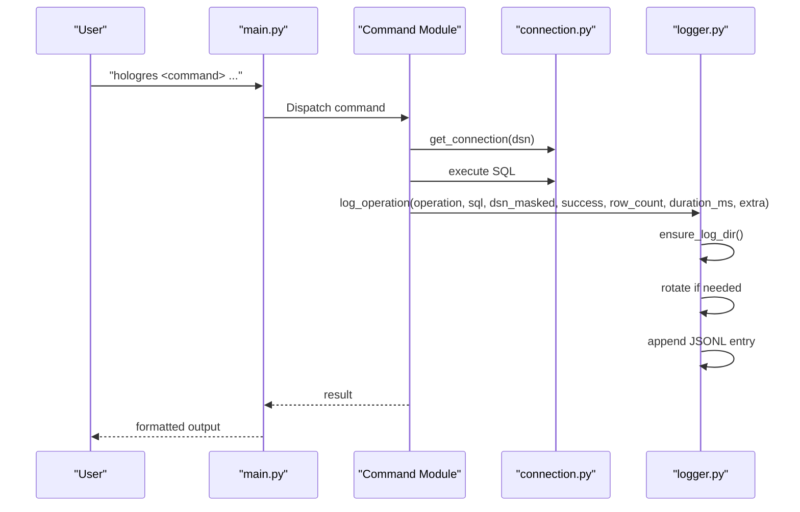
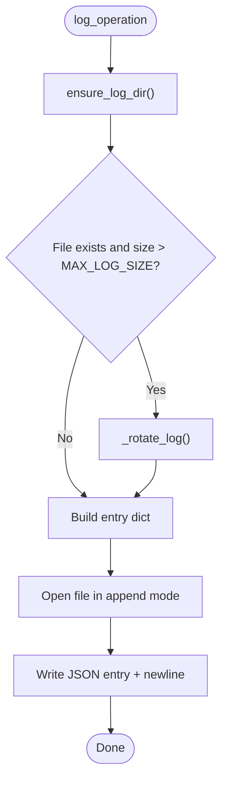
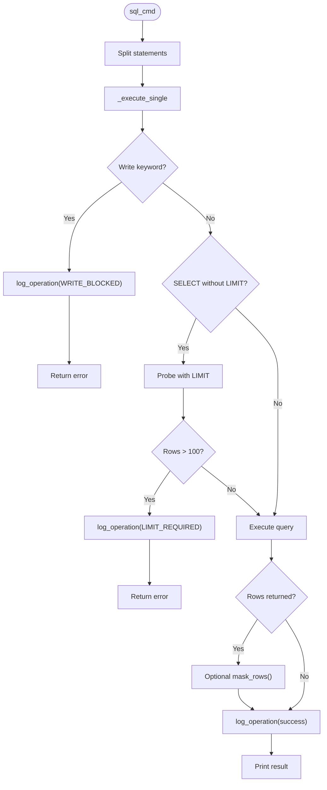
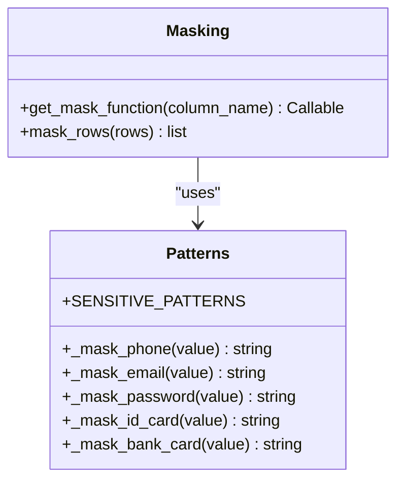
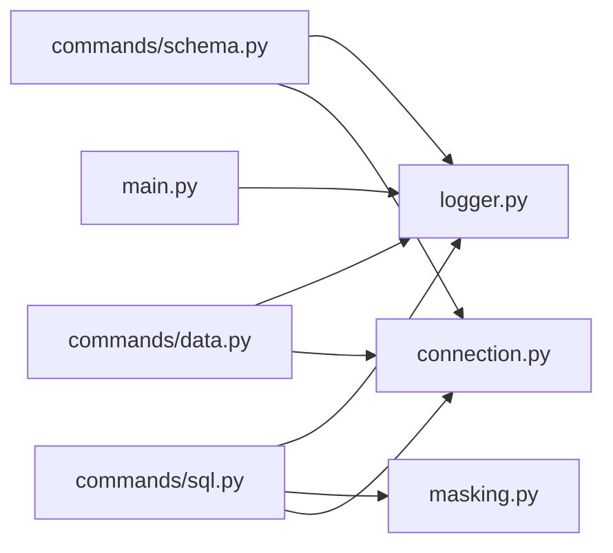

# Audit Logging and History Management

<cite>
**Referenced Files in This Document**
- [logger.py](file://hologres-cli/src/hologres_cli/logger.py)
- [masking.py](file://hologres-cli/src/hologres_cli/masking.py)
- [main.py](file://hologres-cli/src/hologres_cli/main.py)
- [schema.py](file://hologres-cli/src/hologres_cli/commands/schema.py)
- [sql.py](file://hologres-cli/src/hologres_cli/commands/sql.py)
- [data.py](file://hologres-cli/src/hologres_cli/commands/data.py)
- [connection.py](file://hologres-cli/src/hologres_cli/connection.py)
- [test_logger.py](file://hologres-cli/tests/test_logger.py)
- [test_masking.py](file://hologres-cli/tests/test_masking.py)
- [README.md](file://hologres-cli/README.md)
- [README.md](file://README.md)
- [pyproject.toml](file://hologres-cli/pyproject.toml)
</cite>

## Table of Contents
1. [Introduction](#introduction)
2. [Project Structure](#project-structure)
3. [Core Components](#core-components)
4. [Architecture Overview](#architecture-overview)
5. [Detailed Component Analysis](#detailed-component-analysis)
6. [Dependency Analysis](#dependency-analysis)
7. [Performance Considerations](#performance-considerations)
8. [Troubleshooting Guide](#troubleshooting-guide)
9. [Conclusion](#conclusion)
10. [Appendices](#appendices)

## Introduction
This document describes the audit logging and history management system for the Hologres CLI. It explains where logs are stored, the JSONL (JSON Lines) format, the log entry schema, and how all CLI operations are tracked. It also documents sensitive data masking, write-operation blocking, log rotation, and practical guidance for analysis, compliance, troubleshooting, and integration with external monitoring systems.

## Project Structure
The audit logging and history features are implemented primarily in the CLI’s core modules:
- Logger: writes JSONL entries, rotates logs, and reads recent entries
- Masking: sensitive field masking for output and logs
- Commands: schema, SQL, and data commands that call the logger
- Main: exposes the history command and CLI entry point
- Connection: provides masked DSN for logging

**Diagram sources**
- [main.py:1-111](file://hologres-cli/src/hologres_cli/main.py#L1-L111)
- [logger.py:1-105](file://hologres-cli/src/hologres_cli/logger.py#L1-L105)
- [masking.py:1-93](file://hologres-cli/src/hologres_cli/masking.py#L1-L93)
- [connection.py:1-229](file://hologres-cli/src/hologres_cli/connection.py#L1-L229)
- [schema.py:1-301](file://hologres-cli/src/hologres_cli/commands/schema.py#L1-L301)
- [sql.py:1-199](file://hologres-cli/src/hologres_cli/commands/sql.py#L1-L199)
- [data.py:1-266](file://hologres-cli/src/hologres_cli/commands/data.py#L1-L266)

**Section sources**
- [README.md:108-109](file://hologres-cli/README.md#L108-L109)
- [README.md:29](file://hologres-cli/README.md#L29)
- [pyproject.toml:23-26](file://hologres-cli/pyproject.toml#L23-L26)

## Core Components
- Log file location: ~/.hologres/sql-history.jsonl
- Format: JSON Lines (one JSON object per line)
- Rotation: when file size exceeds a threshold, current file is renamed to .old
- Read recent history: CLI history command reads last N entries
- Security: DSN passwords are masked; sensitive literals in SQL are redacted; sensitive fields in output are masked

**Section sources**
- [logger.py:11-13](file://hologres-cli/src/hologres_cli/logger.py#L11-L13)
- [logger.py:47-73](file://hologres-cli/src/hologres_cli/logger.py#L47-L73)
- [logger.py:76-86](file://hologres-cli/src/hologres_cli/logger.py#L76-L86)
- [logger.py:89-104](file://hologres-cli/src/hologres_cli/logger.py#L89-L104)
- [connection.py:173-175](file://hologres-cli/src/hologres_cli/connection.py#L173-L175)

## Architecture Overview
The CLI integrates logging into every command execution path. Each command measures execution time, determines success/failure, and invokes the logger with operation metadata, SQL (redacted), masked DSN, row counts, durations, and optional extras. The logger ensures the log directory exists, performs rotation if needed, and appends a newline-delimited JSON entry.

**Diagram sources**
- [main.py:86-95](file://hologres-cli/src/hologres_cli/main.py#L86-L95)
- [schema.py:68-80](file://hologres-cli/src/hologres_cli/commands/schema.py#L68-L80)
- [sql.py:66-134](file://hologres-cli/src/hologres_cli/commands/sql.py#L66-L134)
- [data.py:66-122](file://hologres-cli/src/hologres_cli/commands/data.py#L66-L122)
- [logger.py:36-73](file://hologres-cli/src/hologres_cli/logger.py#L36-L73)

## Detailed Component Analysis

### Logger: JSONL Audit Trail
- Location: ~/.hologres/sql-history.jsonl
- Rotation: when size exceeds threshold, rename to .old
- Redaction: sensitive literal patterns in SQL are replaced before logging
- Fields: timestamp, operation, success, optional sql, dsn, row_count, error_code, error_message, duration_ms, extra
- Read recent: tail-like reader for CLI history

**Diagram sources**
- [logger.py:36-86](file://hologres-cli/src/hologres_cli/logger.py#L36-L86)

**Section sources**
- [logger.py:11-13](file://hologres-cli/src/hologres_cli/logger.py#L11-L13)
- [logger.py:15-22](file://hologres-cli/src/hologres_cli/logger.py#L15-L22)
- [logger.py:36-73](file://hologres-cli/src/hologres_cli/logger.py#L36-L73)
- [logger.py:76-86](file://hologres-cli/src/hologres_cli/logger.py#L76-L86)
- [logger.py:89-104](file://hologres-cli/src/hologres_cli/logger.py#L89-L104)

### SQL Execution Guardrails and Logging
- Write operations are blocked (INSERT, UPDATE, DELETE, DROP, CREATE, ALTER, TRUNCATE, GRANT, REVOKE)
- Read queries require LIMIT for >100 rows unless disabled
- On success: log with row_count and duration_ms
- On failure: log with error_code and error_message

**Diagram sources**
- [sql.py:34-64](file://hologres-cli/src/hologres_cli/commands/sql.py#L34-L64)
- [sql.py:66-134](file://hologres-cli/src/hologres_cli/commands/sql.py#L66-L134)
- [masking.py:73-92](file://hologres-cli/src/hologres_cli/masking.py#L73-L92)

**Section sources**
- [sql.py:29-31](file://hologres-cli/src/hologres_cli/commands/sql.py#L29-L31)
- [sql.py:78-86](file://hologres-cli/src/hologres_cli/commands/sql.py#L78-L86)
- [sql.py:88-104](file://hologres-cli/src/hologres_cli/commands/sql.py#L88-L104)
- [sql.py:106-114](file://hologres-cli/src/hologres_cli/commands/sql.py#L106-L114)
- [sql.py:126-132](file://hologres-cli/src/hologres_cli/commands/sql.py#L126-L132)

### Schema Inspection Logging
- Lists tables, describes schema, dumps DDL, and reports sizes
- Logs include operation, SQL (redacted), masked DSN, success, row_count/duration_ms, and optional extras

**Section sources**
- [schema.py:42-80](file://hologres-cli/src/hologres_cli/commands/schema.py#L42-L80)
- [schema.py:83-152](file://hologres-cli/src/hologres_cli/commands/schema.py#L83-L152)
- [schema.py:155-220](file://hologres-cli/src/hologres_cli/commands/schema.py#L155-L220)
- [schema.py:223-300](file://hologres-cli/src/hologres_cli/commands/schema.py#L223-L300)

### Data Import/Export Logging
- Exports CSV via COPY, imports CSV via COPY, counts rows
- Logs include operation, SQL (redacted), masked DSN, success, row_count, duration_ms

**Section sources**
- [data.py:50-122](file://hologres-cli/src/hologres_cli/commands/data.py#L50-L122)
- [data.py:125-213](file://hologres-cli/src/hologres_cli/commands/data.py#L125-L213)
- [data.py:216-265](file://hologres-cli/src/hologres_cli/commands/data.py#L216-L265)

### History Command and Recent Reads
- CLI history command prints recent entries from the JSONL file
- Reader supports count limiting and skips invalid lines

**Section sources**
- [main.py:86-95](file://hologres-cli/src/hologres_cli/main.py#L86-L95)
- [logger.py:89-104](file://hologres-cli/src/hologres_cli/logger.py#L89-L104)

### Sensitive Data Masking
- SQL redaction: phone, email, ID card, bank card, and password/token assignments are redacted
- Field masking: columns detected by name patterns are masked in output rows
- Masking functions: phone, email, password/token, ID card, bank card

**Diagram sources**
- [masking.py:6-70](file://hologres-cli/src/hologres_cli/masking.py#L6-L70)
- [masking.py:73-92](file://hologres-cli/src/hologres_cli/masking.py#L73-L92)

**Section sources**
- [logger.py:15-22](file://hologres-cli/src/hologres_cli/logger.py#L15-L22)
- [masking.py:15-56](file://hologres-cli/src/hologres_cli/masking.py#L15-L56)
- [masking.py:66-70](file://hologres-cli/src/hologres_cli/masking.py#L66-L70)
- [masking.py:73-92](file://hologres-cli/src/hologres_cli/masking.py#L73-L92)

## Dependency Analysis
- Commands depend on logger for audit events
- Commands depend on connection for masked DSN and execution
- SQL command depends on masking for output rows
- Main depends on logger for history retrieval

**Diagram sources**
- [schema.py:12-13](file://hologres-cli/src/hologres_cli/commands/schema.py#L12-L13)
- [sql.py:11-13](file://hologres-cli/src/hologres_cli/commands/sql.py#L11-L13)
- [data.py:13-14](file://hologres-cli/src/hologres_cli/commands/data.py#L13-L14)
- [main.py:89-95](file://hologres-cli/src/hologres_cli/main.py#L89-L95)

**Section sources**
- [schema.py:12-13](file://hologres-cli/src/hologres_cli/commands/schema.py#L12-L13)
- [sql.py:11-13](file://hologres-cli/src/hologres_cli/commands/sql.py#L11-L13)
- [data.py:13-14](file://hologres-cli/src/hologres_cli/commands/data.py#L13-L14)
- [main.py:89-95](file://hologres-cli/src/hologres_cli/main.py#L89-L95)

## Performance Considerations
- JSONL append is O(1) per event; rotation is O(n) for file rename
- Redaction and masking occur only when logging SQL or output rows
- Duration_ms is computed around each command execution
- Large field truncation avoids oversized logs for binary/text blobs

[No sources needed since this section provides general guidance]

## Troubleshooting Guide
- Verify log location and permissions: ~/.hologres/sql-history.jsonl
- Check rotation: when file grows beyond the configured size, it is rotated to .old
- Inspect recent entries: use the CLI history command
- Validate DSN masking: ensure passwords are not exposed in logs
- Review error codes: CONNECTION_ERROR, QUERY_ERROR, LIMIT_REQUIRED, WRITE_BLOCKED

Common scenarios:
- History shows WRITE_BLOCKED: the query contained a write keyword
- History shows LIMIT_REQUIRED: a SELECT exceeded the row limit without LIMIT
- History shows QUERY_ERROR: SQL execution failed

**Section sources**
- [logger.py:11-13](file://hologres-cli/src/hologres_cli/logger.py#L11-L13)
- [logger.py:76-86](file://hologres-cli/src/hologres_cli/logger.py#L76-L86)
- [logger.py:89-104](file://hologres-cli/src/hologres_cli/logger.py#L89-L104)
- [connection.py:173-175](file://hologres-cli/src/hologres_cli/connection.py#L173-L175)
- [sql.py:78-86](file://hologres-cli/src/hologres_cli/commands/sql.py#L78-L86)
- [sql.py:91-101](file://hologres-cli/src/hologres_cli/commands/sql.py#L91-L101)
- [sql.py:126-132](file://hologres-cli/src/hologres_cli/commands/sql.py#L126-L132)

## Conclusion
The Hologres CLI provides robust audit logging via a JSONL file with strong privacy safeguards. Every command execution is recorded with rich metadata, sensitive data is masked/redacted, and write operations are blocked by default. The system supports rotation, easy retrieval via the history command, and straightforward integration with external monitoring and compliance workflows.

[No sources needed since this section summarizes without analyzing specific files]

## Appendices

### Log Entry Schema
- Required
  - timestamp: ISO 8601 UTC
  - operation: string identifying the command
  - success: boolean
- Optional
  - sql: string (redacted sensitive literals)
  - dsn: string (masked DSN)
  - row_count: integer
  - error_code: string
  - error_message: string
  - duration_ms: number (rounded to 2 decimals)
  - extra: object (command-specific metadata)

**Section sources**
- [logger.py:51-69](file://hologres-cli/src/hologres_cli/logger.py#L51-L69)

### Typical Log Entries by Operation Type
- Schema inspection
  - operation: "schema.tables"|"schema.describe"|"schema.dump"|"schema.size"
  - sql: query string (redacted)
  - row_count: number of rows returned
  - duration_ms: execution time
  - extra: optional (e.g., {"table": "..."} for dump/size)
- SQL execution
  - operation: "sql"
  - sql: query string (redacted)
  - success: true/false
  - row_count: number of rows
  - duration_ms: execution time
  - error_code/error_message: present on failure
- Data operations
  - operation: "data.export"|"data.import"|"data.count"
  - sql: COPY query (redacted)
  - row_count: number of rows processed
  - duration_ms: execution time
  - extra: optional (e.g., {"source": "..."} for export)

**Section sources**
- [schema.py:68-80](file://hologres-cli/src/hologres_cli/commands/schema.py#L68-L80)
- [schema.py:133-135](file://hologres-cli/src/hologres_cli/commands/schema.py#L133-L135)
- [schema.py:201-203](file://hologres-cli/src/hologres_cli/commands/schema.py#L201-L203)
- [schema.py:276-278](file://hologres-cli/src/hologres_cli/commands/schema.py#L276-L278)
- [sql.py:106-114](file://hologres-cli/src/hologres_cli/commands/sql.py#L106-L114)
- [data.py:106-108](file://hologres-cli/src/hologres_cli/commands/data.py#L106-L108)
- [data.py:197-199](file://hologres-cli/src/hologres_cli/commands/data.py#L197-L199)
- [data.py:250-252](file://hologres-cli/src/hologres_cli/commands/data.py#L250-L252)

### Security Features Integration
- DSN masking: password portion is redacted in logs
- SQL redaction: sensitive literals are replaced with placeholders
- Field masking: sensitive columns are masked in output rows
- Write blocking: prevents destructive operations by design

**Section sources**
- [connection.py:173-175](file://hologres-cli/src/hologres_cli/connection.py#L173-L175)
- [logger.py:15-22](file://hologres-cli/src/hologres_cli/logger.py#L15-L22)
- [masking.py:66-70](file://hologres-cli/src/hologres_cli/masking.py#L66-L70)
- [sql.py:78-86](file://hologres-cli/src/hologres_cli/commands/sql.py#L78-L86)

### Log Analysis and Compliance Reporting
- Use the history command to review recent activity
- Export and process the JSONL file for trend analysis and audits
- Filter by operation, error_code, or time window
- Combine with external SIEM/log aggregation platforms

**Section sources**
- [main.py:86-95](file://hologres-cli/src/hologres_cli/main.py#L86-L95)
- [logger.py:89-104](file://hologres-cli/src/hologres_cli/logger.py#L89-L104)

### Maintenance and Cleanup Policies
- Rotation: automatic when file size exceeds threshold; old file becomes .old
- Manual cleanup: remove .old file after verifying backup
- Storage considerations: monitor disk usage; consider log archival and retention

**Section sources**
- [logger.py:13](file://hologres-cli/src/hologres_cli/logger.py#L13)
- [logger.py:49-50](file://hologres-cli/src/hologres_cli/logger.py#L49-L50)
- [logger.py:76-86](file://hologres-cli/src/hologres_cli/logger.py#L76-L86)

### Integration with External Monitoring Systems
- Stream the JSONL file to log collectors (e.g., filebeat, Fluent Bit)
- Parse JSONL entries and enrich with metadata
- Alert on error_code patterns (e.g., WRITE_BLOCKED, QUERY_ERROR)
- Correlate with command outputs and durations for performance dashboards

**Section sources**
- [logger.py:11-13](file://hologres-cli/src/hologres_cli/logger.py#L11-L13)
- [logger.py:36-73](file://hologres-cli/src/hologres_cli/logger.py#L36-L73)