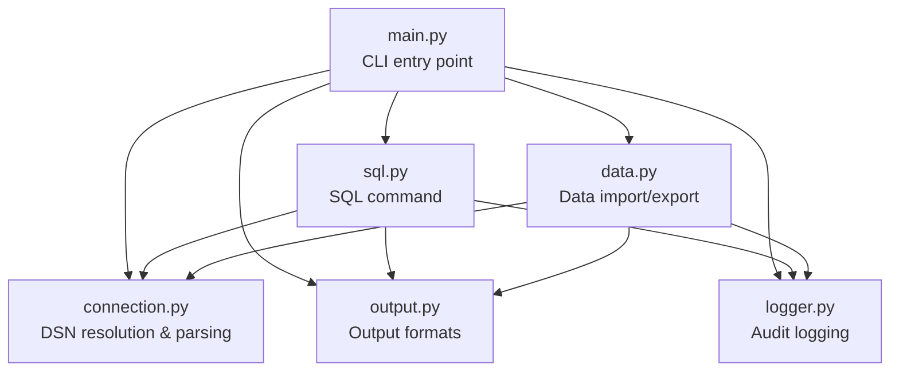
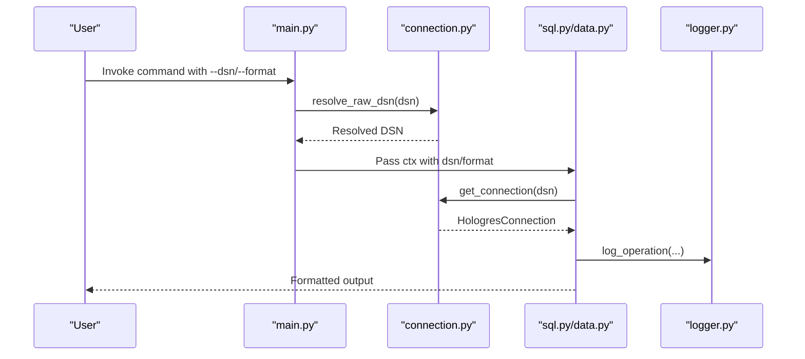
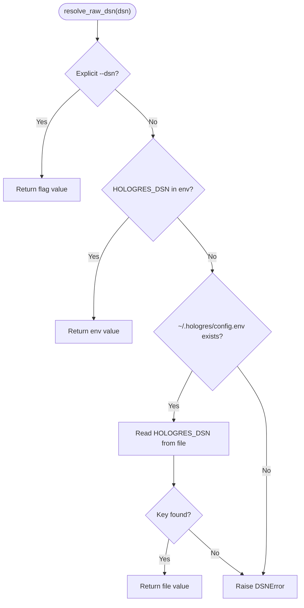
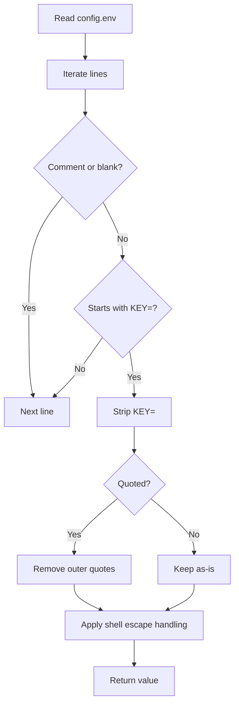
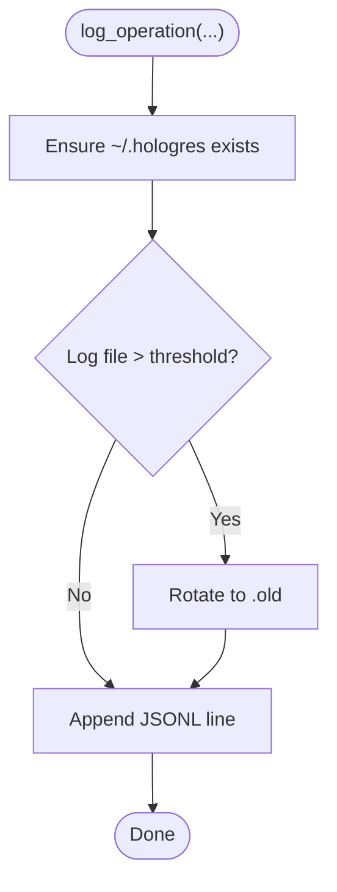
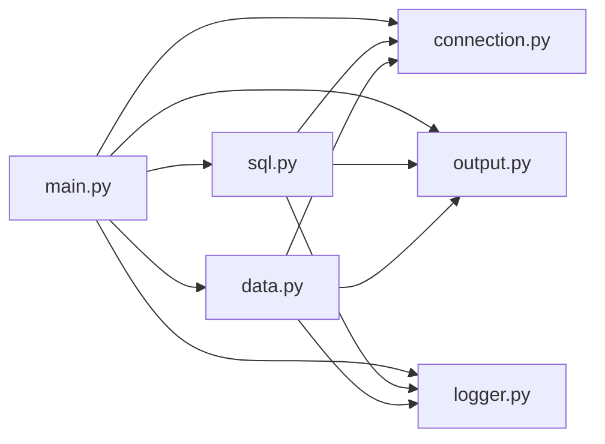

# Configuration and Environment

<cite>
**Referenced Files in This Document**
- [main.py](file://hologres-cli/src/hologres_cli/main.py)
- [connection.py](file://hologres-cli/src/hologres_cli/connection.py)
- [logger.py](file://hologres-cli/src/hologres_cli/logger.py)
- [output.py](file://hologres-cli/src/hologres_cli/output.py)
- [masking.py](file://hologres-cli/src/hologres_cli/masking.py)
- [sql.py](file://hologres-cli/src/hologres_cli/commands/sql.py)
- [data.py](file://hologres-cli/src/hologres_cli/commands/data.py)
- [pyproject.toml](file://hologres-cli/pyproject.toml)
- [README.md](file://hologres-cli/README.md)
- [configuration.md](file://agent-skills/skills/hologres-slow-query-analysis/references/configuration.md)
</cite>

## Table of Contents
1. [Introduction](#introduction)
2. [Project Structure](#project-structure)
3. [Core Components](#core-components)
4. [Architecture Overview](#architecture-overview)
5. [Detailed Component Analysis](#detailed-component-analysis)
6. [Dependency Analysis](#dependency-analysis)
7. [Performance Considerations](#performance-considerations)
8. [Troubleshooting Guide](#troubleshooting-guide)
9. [Conclusion](#conclusion)
10. [Appendices](#appendices)

## Introduction
This document explains how to configure and manage the Hologres CLI environment, focusing on:
- DSN (Data Source Name) format and resolution priority
- ~/.hologres/config.env structure and location
- Audit logging behavior and log entry format
- Environment-specific settings, custom output formats, and security policies
- Performance tuning options exposed via DSN query parameters
- Troubleshooting common configuration issues
- How configuration settings relate to CLI command behavior

## Project Structure
The CLI is organized around a small set of modules:
- Entry point and global options
- Connection management and DSN resolution
- Audit logging and sensitive data masking
- Command implementations that consume configuration
- Output formatting utilities

**Diagram sources**
- [main.py:15-49](file://hologres-cli/src/hologres_cli/main.py#L15-L49)
- [connection.py:39-229](file://hologres-cli/src/hologres_cli/connection.py#L39-L229)
- [logger.py:36-105](file://hologres-cli/src/hologres_cli/logger.py#L36-L105)
- [output.py:16-143](file://hologres-cli/src/hologres_cli/output.py#L16-L143)
- [sql.py:34-135](file://hologres-cli/src/hologres_cli/commands/sql.py#L34-L135)
- [data.py:50-214](file://hologres-cli/src/hologres_cli/commands/data.py#L50-L214)

**Section sources**
- [main.py:15-49](file://hologres-cli/src/hologres_cli/main.py#L15-L49)
- [connection.py:39-229](file://hologres-cli/src/hologres_cli/connection.py#L39-L229)
- [logger.py:36-105](file://hologres-cli/src/hologres_cli/logger.py#L36-L105)
- [output.py:16-143](file://hologres-cli/src/hologres_cli/output.py#L16-L143)
- [sql.py:34-135](file://hologres-cli/src/hologres_cli/commands/sql.py#L34-L135)
- [data.py:50-214](file://hologres-cli/src/hologres_cli/commands/data.py#L50-L214)

## Core Components
- DSN Resolution and Parsing
  - Priority order: CLI flag, environment variable, config file
  - DSN normalization and query parameter handling
- Audit Logging
  - Log file location and rotation
  - Redaction of sensitive literals
- Output Formatting
  - JSON, table, CSV, JSONL
- Security Policies
  - Write protection and row limit enforcement
  - Sensitive data masking
- Performance Tuning
  - Keepalives and connect timeout via DSN query parameters

**Section sources**
- [main.py:15-49](file://hologres-cli/src/hologres_cli/main.py#L15-L49)
- [connection.py:39-176](file://hologres-cli/src/hologres_cli/connection.py#L39-L176)
- [logger.py:36-105](file://hologres-cli/src/hologres_cli/logger.py#L36-L105)
- [output.py:16-143](file://hologres-cli/src/hologres_cli/output.py#L16-L143)
- [masking.py:15-93](file://hologres-cli/src/hologres_cli/masking.py#L15-L93)
- [sql.py:25-31](file://hologres-cli/src/hologres_cli/commands/sql.py#L25-L31)

## Architecture Overview
The CLI resolves configuration at startup and passes it to commands. Commands use the resolved DSN to establish a connection, enforce safety policies, and log operations.

**Diagram sources**
- [main.py:15-49](file://hologres-cli/src/hologres_cli/main.py#L15-L49)
- [connection.py:39-229](file://hologres-cli/src/hologres_cli/connection.py#L39-L229)
- [sql.py:66-135](file://hologres-cli/src/hologres_cli/commands/sql.py#L66-L135)
- [data.py:66-214](file://hologres-cli/src/hologres_cli/commands/data.py#L66-L214)
- [logger.py:36-105](file://hologres-cli/src/hologres_cli/logger.py#L36-L105)

## Detailed Component Analysis

### DSN Resolution and Priority
- Resolution order:
  1. CLI flag (--dsn)
  2. Environment variable (HOLOGRES_DSN)
  3. ~/.hologres/config.env (key HOLOGRES_DSN)
  4. Error if none found
- Named instances:
  - Resolve HOLOGRES_DSN_<name> from environment or config file
  - Environment takes precedence over config file
- DSN format:
  - Supported schemes: hologres://, postgresql://, postgres://
  - Normalized internally to postgresql:// for parsing
  - Required parts: host, database path
  - Optional: user, password, port, query parameters
- Query parameters affecting behavior:
  - keepalives, keepalives_idle, keepalives_interval, keepalives_count
  - connect_timeout, options
- Defaults:
  - Default port is applied when missing
  - Default keepalives are applied when not specified

**Diagram sources**
- [connection.py:39-64](file://hologres-cli/src/hologres_cli/connection.py#L39-L64)
- [connection.py:67-86](file://hologres-cli/src/hologres_cli/connection.py#L67-L86)

**Section sources**
- [main.py:15-49](file://hologres-cli/src/hologres_cli/main.py#L15-L49)
- [connection.py:39-176](file://hologres-cli/src/hologres_cli/connection.py#L39-L176)
- [README.md:89-106](file://hologres-cli/README.md#L89-L106)

### ~/.hologres/config.env Structure and Location
- Location: ~/.hologres/config.env
- Format: KEY=VALUE pairs per line
- Comments: Lines starting with # are ignored
- Quoted values: Leading/trailing quotes are stripped
- Shell escapes: Common shell escapes are handled during parsing
- Example keys:
  - HOLOGRES_DSN: primary DSN
  - HOLOGRES_DSN_<instance>: instance-specific DSNs

**Diagram sources**
- [connection.py:67-86](file://hologres-cli/src/hologres_cli/connection.py#L67-L86)

**Section sources**
- [connection.py:17-18](file://hologres-cli/src/hologres_cli/connection.py#L17-L18)
- [connection.py:67-86](file://hologres-cli/src/hologres_cli/connection.py#L67-L86)
- [README.md:97-106](file://hologres-cli/README.md#L97-L106)

### Audit Logging System
- Log file location: ~/.hologres/sql-history.jsonl
- Rotation:
  - Rotate when size exceeds threshold
  - Backup renamed to .jsonl.old
- Entry fields:
  - timestamp (UTC ISO format)
  - operation (e.g., "sql", "data.export", "data.import", "data.count", "status")
  - success (boolean)
  - sql (redacted)
  - dsn (masked)
  - row_count (optional)
  - error_code (optional)
  - error_message (optional)
  - duration_ms (optional)
  - extra (optional)
- Redaction:
  - Phone numbers, emails, ID cards, bank cards
  - Password-like tokens
- Reading history:
  - hologres history [-n N] lists recent entries

**Diagram sources**
- [logger.py:36-87](file://hologres-cli/src/hologres_cli/logger.py#L36-L87)

**Section sources**
- [logger.py:11-13](file://hologres-cli/src/hologres_cli/logger.py#L11-L13)
- [logger.py:36-105](file://hologres-cli/src/hologres_cli/logger.py#L36-L105)
- [main.py:86-95](file://hologres-cli/src/hologres_cli/main.py#L86-L95)
- [README.md:11-11](file://hologres-cli/README.md#L11-L11)

### Environment-Specific Settings and Instance DSNs
- Named instance resolution:
  - Key: HOLOGRES_DSN_<name>
  - Source priority: environment variable > ~/.hologres/config.env
  - Error if neither found
- Typical use:
  - Switch between development, staging, production endpoints without changing CLI invocations

**Section sources**
- [connection.py:89-117](file://hologres-cli/src/hologres_cli/connection.py#L89-L117)

### Custom Output Formats
- Supported formats: json, table, csv, jsonl
- Global flag: --format (-f)
- Commands honor the selected format for their output
- Response structure:
  - Success: {"ok": true, "data": ...}
  - Error: {"ok": false, "error": {"code", "message"}}

**Section sources**
- [output.py:16-54](file://hologres-cli/src/hologres_cli/output.py#L16-L54)
- [main.py:15-49](file://hologres-cli/src/hologres_cli/main.py#L15-L49)
- [README.md:200-234](file://hologres-cli/README.md#L200-L234)

### Security Policy Configuration
- Write protection:
  - All write operations (INSERT, UPDATE, DELETE, DROP, CREATE, ALTER, TRUNCATE, GRANT, REVOKE) are blocked by default
- Row limit protection:
  - SELECT without LIMIT returning >100 rows triggers LIMIT_REQUIRED
  - Override with --no-limit-check
- Sensitive data masking:
  - Automatic masking of phone, email, password-like tokens, ID cards, bank cards
  - Disable with --no-mask
- CLI-level masking:
  - DSN passwords are masked for logging

**Section sources**
- [sql.py:25-31](file://hologres-cli/src/hologres_cli/commands/sql.py#L25-L31)
- [sql.py:78-101](file://hologres-cli/src/hologres_cli/commands/sql.py#L78-L101)
- [masking.py:15-93](file://hologres-cli/src/hologres_cli/masking.py#L15-L93)
- [connection.py:173-175](file://hologres-cli/src/hologres_cli/connection.py#L173-L175)
- [README.md:235-287](file://hologres-cli/README.md#L235-L287)

### Performance Tuning Options
- Keepalives:
  - keepalives, keepalives_idle, keepalives_interval, keepalives_count
  - Integer values; invalid values cause DSNError
- Connect timeout:
  - connect_timeout (string)
- Options:
  - options (string)
- Defaults:
  - Default keepalives applied when not specified

**Section sources**
- [connection.py:120-170](file://hologres-cli/src/hologres_cli/connection.py#L120-L170)

### Relationship Between Configuration and CLI Command Behavior
- Global options:
  - --dsn sets the DSN for all commands
  - --format controls output format
- Command behavior:
  - sql: enforces write protection and row limit checks; logs operations
  - data export/import/count: use COPY protocol; log operations
  - status: connects and logs success/failure
- Error propagation:
  - DSN errors are caught and reported as CONNECTION_ERROR
  - Other exceptions are reported as INTERNAL_ERROR or QUERY_ERROR

**Section sources**
- [main.py:15-49](file://hologres-cli/src/hologres_cli/main.py#L15-L49)
- [sql.py:66-135](file://hologres-cli/src/hologres_cli/commands/sql.py#L66-L135)
- [data.py:66-214](file://hologres-cli/src/hologres_cli/commands/data.py#L66-L214)
- [README.md:262-270](file://hologres-cli/README.md#L262-L270)

## Dependency Analysis
- CLI entry point depends on:
  - connection module for DSN resolution
  - output module for formatting
  - logger module for auditing
  - command modules for functionality
- Commands depend on:
  - connection module for connectivity
  - logger module for audit logs
  - output module for formatting

**Diagram sources**
- [main.py:15-49](file://hologres-cli/src/hologres_cli/main.py#L15-L49)
- [connection.py:39-229](file://hologres-cli/src/hologres_cli/connection.py#L39-L229)
- [logger.py:36-105](file://hologres-cli/src/hologres_cli/logger.py#L36-L105)
- [output.py:16-143](file://hologres-cli/src/hologres_cli/output.py#L16-L143)
- [sql.py:34-135](file://hologres-cli/src/hologres_cli/commands/sql.py#L34-L135)
- [data.py:50-214](file://hologres-cli/src/hologres_cli/commands/data.py#L50-L214)

**Section sources**
- [main.py:15-49](file://hologres-cli/src/hologres_cli/main.py#L15-L49)
- [connection.py:39-229](file://hologres-cli/src/hologres_cli/connection.py#L39-L229)
- [logger.py:36-105](file://hologres-cli/src/hologres_cli/logger.py#L36-L105)
- [output.py:16-143](file://hologres-cli/src/hologres_cli/output.py#L16-L143)
- [sql.py:34-135](file://hologres-cli/src/hologres_cli/commands/sql.py#L34-L135)
- [data.py:50-214](file://hologres-cli/src/hologres_cli/commands/data.py#L50-L214)

## Performance Considerations
- Keepalives:
  - Tune keepalives_idle/interval/count to balance connection liveness and server load
- Connect timeout:
  - Use connect_timeout to avoid long hangs on network issues
- Logging overhead:
  - Audit logging is lightweight JSONL writes; rotation prevents unbounded growth
- Output formatting:
  - CSV/JSONL may be more efficient for large datasets depending on downstream consumers

[No sources needed since this section provides general guidance]

## Troubleshooting Guide
- No DSN configured
  - Symptom: DSNError indicating no DSN configured
  - Resolution: Provide --dsn, set HOLOGRES_DSN, or add HOLOGRES_DSN to ~/.hologres/config.env
- Invalid DSN scheme
  - Symptom: DSNError mentioning invalid scheme
  - Resolution: Use hologres://, postgresql://, or postgres://
- Missing hostname or database
  - Symptom: DSNError requiring hostname or database
  - Resolution: Ensure DSN includes host and non-root path
- Invalid keepalive integer
  - Symptom: DSNError for invalid integer value
  - Resolution: Provide valid integers for keepalives parameters
- Permission denied writing to ~/.hologres
  - Symptom: Failure to create directory or rotate log
  - Resolution: Ensure write permissions to home directory
- Large field truncation
  - Symptom: Long strings truncated in output
  - Resolution: Review data or adjust truncation behavior in masking
- Slow query logs (server-side)
  - Use server GUC parameters to tune slow query logging retention and thresholds

**Section sources**
- [connection.py:59-64](file://hologres-cli/src/hologres_cli/connection.py#L59-L64)
- [connection.py:130-144](file://hologres-cli/src/hologres_cli/connection.py#L130-L144)
- [connection.py:162-168](file://hologres-cli/src/hologres_cli/connection.py#L162-L168)
- [logger.py:49-50](file://hologres-cli/src/hologres_cli/logger.py#L49-L50)
- [masking.py:186-198](file://hologres-cli/src/hologres_cli/masking.py#L186-L198)
- [configuration.md:5-122](file://agent-skills/skills/hologres-slow-query-analysis/references/configuration.md#L5-L122)

## Conclusion
The Hologres CLI provides a robust, layered configuration model with clear priority rules, comprehensive audit logging, strong security guardrails, and flexible output formatting. Understanding DSN resolution, config file structure, and the interplay between environment variables and CLI flags ensures reliable and secure operations across diverse deployment scenarios.

[No sources needed since this section summarizes without analyzing specific files]

## Appendices

### DSN Format Reference
- Supported schemes: hologres://, postgresql://, postgres://
- Required: host, database path
- Optional: user, password, port, query parameters
- Query parameters:
  - keepalives, keepalives_idle, keepalives_interval, keepalives_count (integers)
  - connect_timeout (string)
  - options (string)

**Section sources**
- [connection.py:120-170](file://hologres-cli/src/hologres_cli/connection.py#L120-L170)
- [README.md:91-95](file://hologres-cli/README.md#L91-L95)

### Audit Log Entry Reference
- Fields: timestamp, operation, success, sql, dsn, row_count, error_code, error_message, duration_ms, extra
- Redaction: sensitive literals masked before logging

**Section sources**
- [logger.py:46-73](file://hologres-cli/src/hologres_cli/logger.py#L46-L73)
- [logger.py:15-22](file://hologres-cli/src/hologres_cli/logger.py#L15-L22)

### Security and Safety Reference
- Write protection keywords: INSERT, UPDATE, DELETE, DROP, CREATE, ALTER, TRUNCATE, GRANT, REVOKE
- Row limit default: 100 rows; override with --no-limit-check
- Sensitive data masking patterns for column names and literal values

**Section sources**
- [sql.py:25-31](file://hologres-cli/src/hologres_cli/commands/sql.py#L25-L31)
- [sql.py:88-101](file://hologres-cli/src/hologres_cli/commands/sql.py#L88-L101)
- [masking.py:15-93](file://hologres-cli/src/hologres_cli/masking.py#L15-L93)
- [README.md:235-287](file://hologres-cli/README.md#L235-L287)

### Performance GUCs (Server-side)
- log_min_duration_statement, log_min_duration_query_stats, log_min_duration_query_plan
- hg_query_log_retention_time_sec (V3.0.27+)
- Notes on scope, defaults, and usage

**Section sources**
- [configuration.md:5-122](file://agent-skills/skills/hologres-slow-query-analysis/references/configuration.md#L5-L122)