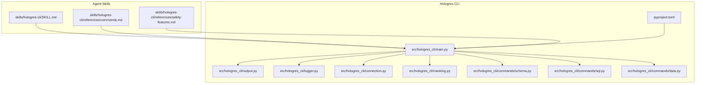
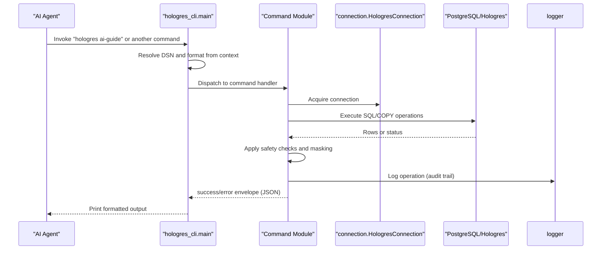
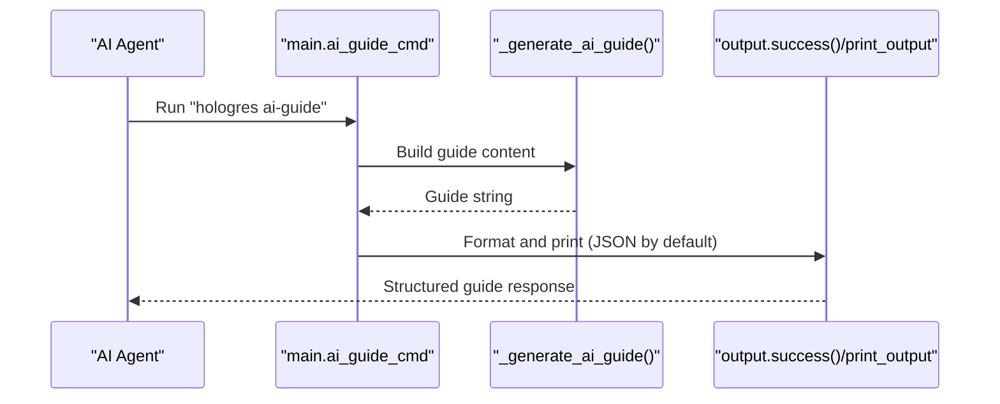
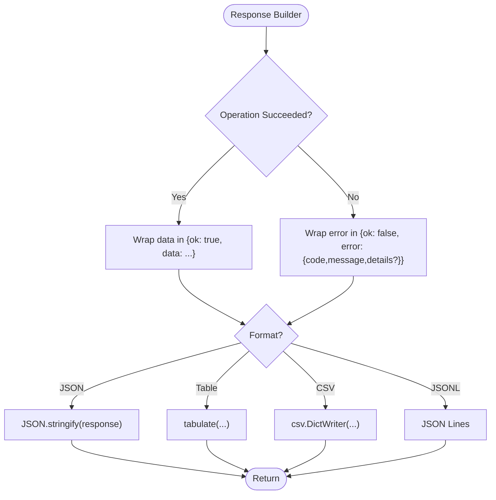
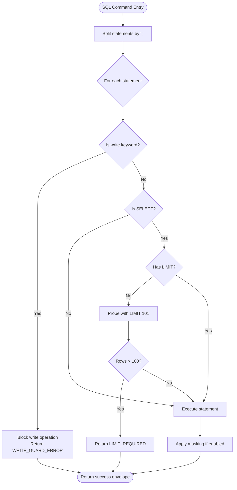
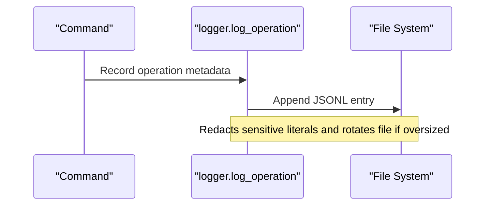
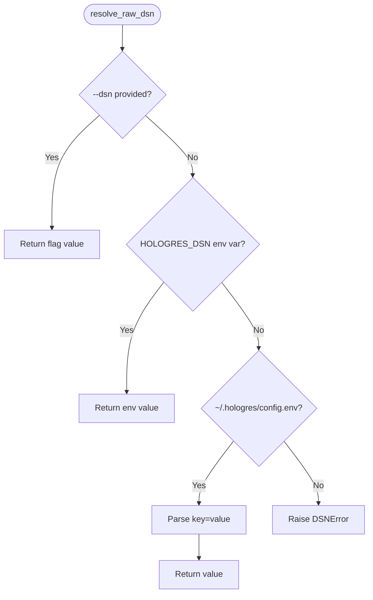
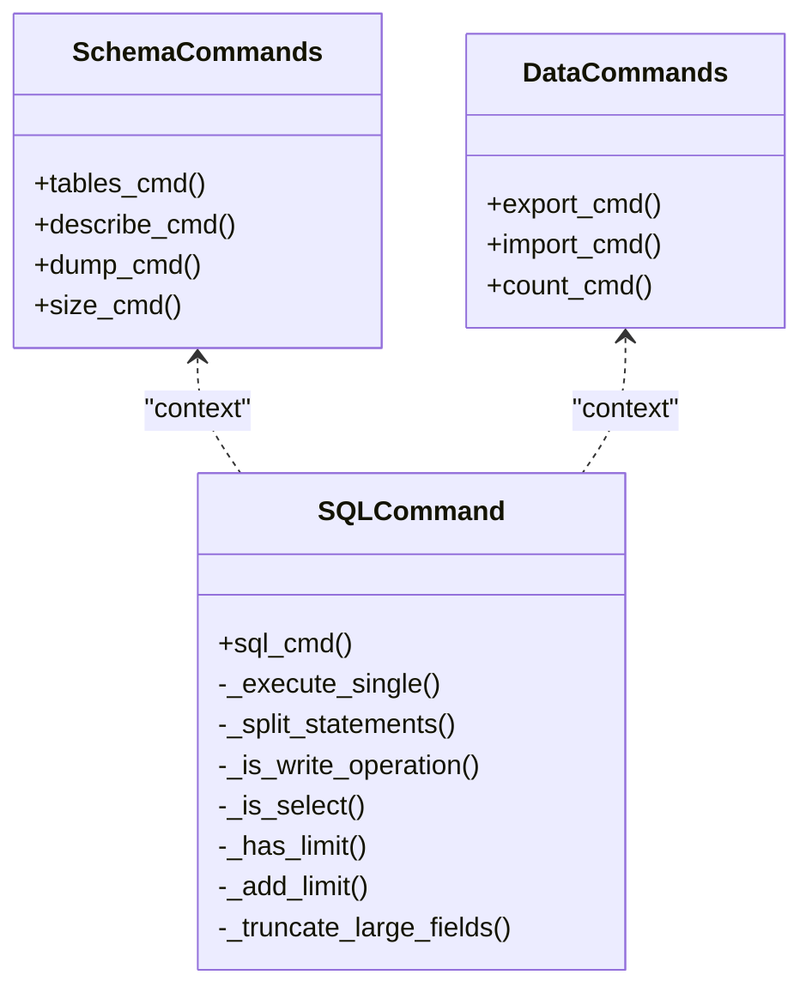
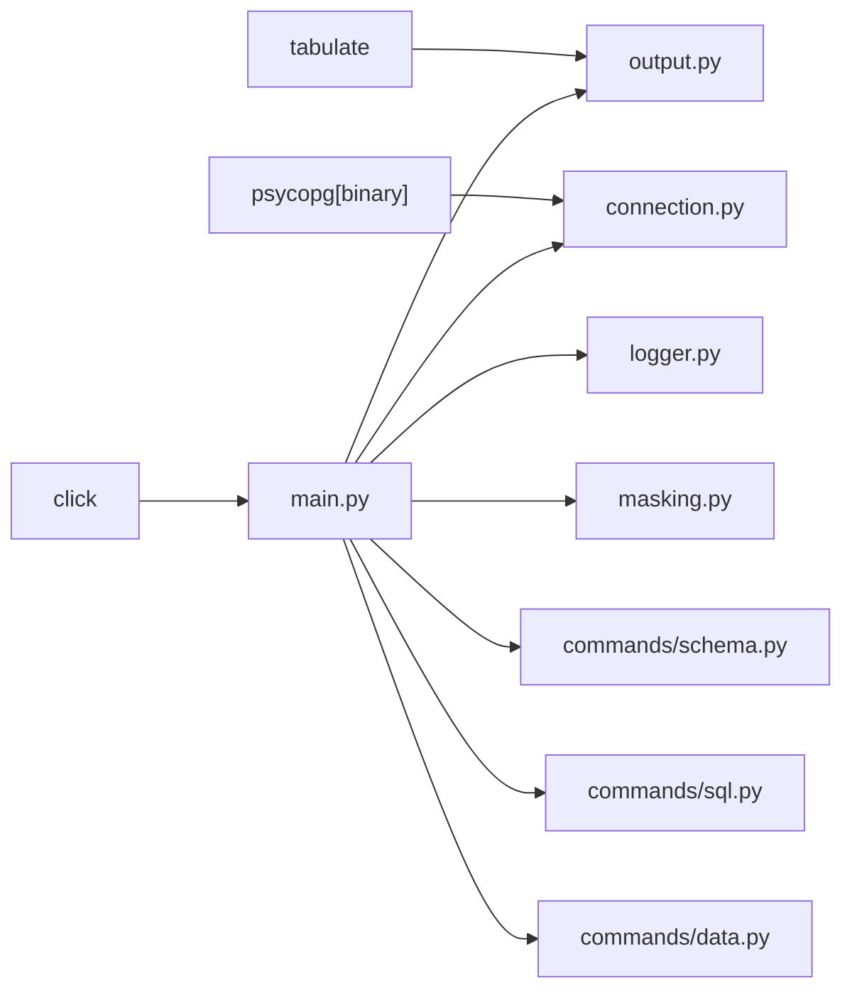

# AI Agent Integration

<cite>
**Referenced Files in This Document**
- [README.md](file://README.md)
- [SKILL.md](file://agent-skills/skills/hologres-cli/SKILL.md)
- [commands.md](file://agent-skills/skills/hologres-cli/references/commands.md)
- [safety-features.md](file://agent-skills/skills/hologres-cli/references/safety-features.md)
- [pyproject.toml](file://hologres-cli/pyproject.toml)
- [main.py](file://hologres-cli/src/hologres_cli/main.py)
- [output.py](file://hologres-cli/src/hologres_cli/output.py)
- [logger.py](file://hologres-cli/src/hologres_cli/logger.py)
- [connection.py](file://hologres-cli/src/hologres_cli/connection.py)
- [masking.py](file://hologres-cli/src/hologres_cli/masking.py)
- [schema.py](file://hologres-cli/src/hologres_cli/commands/schema.py)
- [sql.py](file://hologres-cli/src/hologres_cli/commands/sql.py)
- [data.py](file://hologres-cli/src/hologres_cli/commands/data.py)
</cite>

## Table of Contents
1. [Introduction](#introduction)
2. [Project Structure](#project-structure)
3. [Core Components](#core-components)
4. [Architecture Overview](#architecture-overview)
5. [Detailed Component Analysis](#detailed-component-analysis)
6. [Dependency Analysis](#dependency-analysis)
7. [Performance Considerations](#performance-considerations)
8. [Troubleshooting Guide](#troubleshooting-guide)
9. [Conclusion](#conclusion)
10. [Appendices](#appendices)

## Introduction
This document explains the AI agent integration capabilities of the Hologres CLI tool, focusing on:
- AI guide generation for agent orientation
- Structured JSON responses optimized for AI processing
- Safety guardrails and audit logging enabling reliable agent interactions
- Integration patterns with AI agent frameworks and platforms
- Automated database workflows and context management
- Performance considerations and best practices

The Hologres CLI is designed to be AI-agent-friendly with standardized output formats, safety protections, and a dedicated AI guide command to bootstrap agent workflows.

## Project Structure
The repository is organized into two primary areas:
- hologres-cli: A Python CLI with AI-friendly features, structured output, safety guardrails, and audit logging
- agent-skills: Prebuilt skills for AI coding assistants (IDE copilots) to provide domain-specific knowledge

**Diagram sources**
- [pyproject.toml:23-25](file://hologres-cli/pyproject.toml#L23-L25)
- [main.py:15-50](file://hologres-cli/src/hologres_cli/main.py#L15-L50)
- [output.py:16-20](file://hologres-cli/src/hologres_cli/output.py#L16-L20)
- [logger.py:11-13](file://hologres-cli/src/hologres_cli/logger.py#L11-L13)
- [connection.py:17-18](file://hologres-cli/src/hologres_cli/connection.py#L17-L18)
- [masking.py:8](file://hologres-cli/src/hologres_cli/masking.py#L8)
- [schema.py:36-39](file://hologres-cli/src/hologres_cli/commands/schema.py#L36-L39)
- [sql.py:34-41](file://hologres-cli/src/hologres_cli/commands/sql.py#L34-L41)
- [data.py:44-47](file://hologres-cli/src/hologres_cli/commands/data.py#L44-L47)

**Section sources**
- [README.md:5-16](file://README.md#L5-L16)
- [pyproject.toml:1-68](file://hologres-cli/pyproject.toml#L1-L68)

## Core Components
- AI Guide Generation: A dedicated command that emits a contextual guide for agents to interact with the CLI safely and effectively.
- Structured JSON Output: Unified response format with consistent success/error envelopes for machine parsing.
- Safety Guardrails: Row limit protection, write operation gating, dangerous write blocking, and sensitive data masking.
- Audit Logging: Persistent, redacted operation logs for traceability and debugging.
- Connection Management: Robust DSN resolution and connection pooling abstraction.

Key capabilities for AI agents:
- Predictable JSON responses enable reliable parsing and orchestration
- Safety features reduce risk during automated operations
- AI guide streamlines onboarding and reduces friction for agent workflows

**Section sources**
- [main.py:52-83](file://hologres-cli/src/hologres_cli/main.py#L52-L83)
- [output.py:23-63](file://hologres-cli/src/hologres_cli/output.py#L23-L63)
- [safety-features.md:1-145](file://agent-skills/skills/hologres-cli/references/safety-features.md#L1-L145)
- [logger.py:36-74](file://hologres-cli/src/hologres_cli/logger.py#L36-L74)

## Architecture Overview
The CLI exposes a Click-based command surface with modular command groups. Each command:
- Resolves DSN and output format from context
- Executes database operations via a connection wrapper
- Applies safety checks and masking
- Logs operations and returns structured JSON

**Diagram sources**
- [main.py:15-50](file://hologres-cli/src/hologres_cli/main.py#L15-L50)
- [schema.py:42-81](file://hologres-cli/src/hologres_cli/commands/schema.py#L42-L81)
- [sql.py:66-134](file://hologres-cli/src/hologres_cli/commands/sql.py#L66-L134)
- [data.py:50-123](file://hologres-cli/src/hologres_cli/commands/data.py#L50-L123)
- [logger.py:36-74](file://hologres-cli/src/hologres_cli/logger.py#L36-L74)

## Detailed Component Analysis

### AI Guide Generation
The AI guide command generates a concise, agent-oriented guide that covers:
- Connection setup (DSN via CLI flag, environment variable, or config file)
- Available commands and typical usage patterns
- Safety reminders and recommended output formats

**Diagram sources**
- [main.py:52-83](file://hologres-cli/src/hologres_cli/main.py#L52-L83)
- [output.py:23-28](file://hologres-cli/src/hologres_cli/output.py#L23-L28)

**Section sources**
- [main.py:52-83](file://hologres-cli/src/hologres_cli/main.py#L52-L83)
- [SKILL.md:6](file://agent-skills/skills/hologres-cli/SKILL.md#L6)
- [commands.md:211-220](file://agent-skills/skills/hologres-cli/references/commands.md#L211-L220)

### Structured JSON Responses
All commands return a consistent envelope:
- Success: { ok: true, data: ... }
- Error: { ok: false, error: { code, message, details? } }

Formats supported:
- JSON (default)
- Table
- CSV
- JSON Lines

**Diagram sources**
- [output.py:23-63](file://hologres-cli/src/hologres_cli/output.py#L23-L63)
- [output.py:91-117](file://hologres-cli/src/hologres_cli/output.py#L91-L117)

**Section sources**
- [output.py:16-20](file://hologres-cli/src/hologres_cli/output.py#L16-L20)
- [output.py:23-63](file://hologres-cli/src/hologres_cli/output.py#L23-L63)
- [commands.md:22-32](file://agent-skills/skills/hologres-cli/references/commands.md#L22-L32)

### Safety Guardrails and Activation Mechanisms
Safety features are enforced at runtime:
- Row limit protection: SELECT without LIMIT that returns >100 rows fails with a specific error code
- Write protection: All mutation statements are blocked unless explicitly permitted
- Dangerous write blocking: DELETE/UPDATE without WHERE clause are blocked
- Sensitive data masking: Auto-masks fields by column name patterns

Activation mechanisms:
- CLI flags toggle behaviors (e.g., disabling row limit checks)
- Command groups encapsulate related operations (schema, sql, data)

**Diagram sources**
- [sql.py:66-134](file://hologres-cli/src/hologres_cli/commands/sql.py#L66-L134)
- [sql.py:164-178](file://hologres-cli/src/hologres_cli/commands/sql.py#L164-L178)
- [masking.py:73-93](file://hologres-cli/src/hologres_cli/masking.py#L73-L93)

**Section sources**
- [safety-features.md:5-35](file://agent-skills/skills/hologres-cli/references/safety-features.md#L5-L35)
- [safety-features.md:36-54](file://agent-skills/skills/hologres-cli/references/safety-features.md#L36-L54)
- [safety-features.md:56-90](file://agent-skills/skills/hologres-cli/references/safety-features.md#L56-L90)
- [sql.py:25-27](file://hologres-cli/src/hologres_cli/commands/sql.py#L25-L27)
- [sql.py:78-86](file://hologres-cli/src/hologres_cli/commands/sql.py#L78-L86)
- [sql.py:89-104](file://hologres-cli/src/hologres_cli/commands/sql.py#L89-L104)

### Audit Logging and Context Management
- Logs are written to a JSON Lines file with redacted SQL and DSN
- Supports rotation and truncation to manage size
- Provides a history command to inspect recent operations

**Diagram sources**
- [logger.py:36-74](file://hologres-cli/src/hologres_cli/logger.py#L36-L74)
- [logger.py:89-104](file://hologres-cli/src/hologres_cli/logger.py#L89-L104)

**Section sources**
- [logger.py:11-13](file://hologres-cli/src/hologres_cli/logger.py#L11-L13)
- [logger.py:15-22](file://hologres-cli/src/hologres_cli/logger.py#L15-L22)
- [logger.py:36-74](file://hologres-cli/src/hologres_cli/logger.py#L36-L74)
- [main.py:86-95](file://hologres-cli/src/hologres_cli/main.py#L86-L95)

### Connection Management and DSN Resolution
- Resolves DSN from CLI flag, environment variable, or config file
- Parses and validates DSN, normalizes to PostgreSQL-compatible parameters
- Provides a connection wrapper with safe cursor and execution helpers

**Diagram sources**
- [connection.py:39-64](file://hologres-cli/src/hologres_cli/connection.py#L39-L64)
- [connection.py:67-86](file://hologres-cli/src/hologres_cli/connection.py#L67-L86)

**Section sources**
- [connection.py:39-64](file://hologres-cli/src/hologres_cli/connection.py#L39-L64)
- [connection.py:120-170](file://hologres-cli/src/hologres_cli/connection.py#L120-L170)
- [connection.py:178-228](file://hologres-cli/src/hologres_cli/connection.py#L178-L228)

### Command Modules and Workflows
- Schema commands: list tables, describe schema, dump DDL, get table size
- SQL command: execute read-only queries with safety checks
- Data commands: export/import data using COPY, count rows

**Diagram sources**
- [schema.py:42-301](file://hologres-cli/src/hologres_cli/commands/schema.py#L42-L301)
- [sql.py:34-199](file://hologres-cli/src/hologres_cli/commands/sql.py#L34-L199)
- [data.py:50-266](file://hologres-cli/src/hologres_cli/commands/data.py#L50-L266)

**Section sources**
- [schema.py:42-301](file://hologres-cli/src/hologres_cli/commands/schema.py#L42-L301)
- [sql.py:34-199](file://hologres-cli/src/hologres_cli/commands/sql.py#L34-L199)
- [data.py:50-266](file://hologres-cli/src/hologres_cli/commands/data.py#L50-L266)

## Dependency Analysis
External dependencies and internal coupling:
- Click: CLI framework for command definition and dispatch
- psycopg: PostgreSQL adapter for database connectivity
- tabulate: Human-readable table formatting
- Internal modules: output, logger, connection, masking, commands

**Diagram sources**
- [pyproject.toml:6-10](file://hologres-cli/pyproject.toml#L6-L10)
- [main.py:8-12](file://hologres-cli/src/hologres_cli/main.py#L8-L12)
- [output.py:14](file://hologres-cli/src/hologres_cli/output.py#L14)
- [connection.py:14](file://hologres-cli/src/hologres_cli/connection.py#L14)

**Section sources**
- [pyproject.toml:6-10](file://hologres-cli/pyproject.toml#L6-L10)
- [main.py:8-12](file://hologres-cli/src/hologres_cli/main.py#L8-L12)

## Performance Considerations
- Large result sets: Use LIMIT to avoid timeouts and excessive memory usage; the CLI enforces a row limit check for SELECT without LIMIT
- Field size limits: Long text/binary fields are truncated to prevent oversized payloads
- COPY protocol: Efficient streaming for export/import operations
- Connection keepalives: Tunable parameters to maintain stable connections
- Logging overhead: JSON Lines logging is append-only; consider log rotation and size limits

Best practices:
- Prefer explicit LIMIT clauses for ad-hoc queries
- Use JSON output for automation to minimize post-processing
- Batch operations with appropriate chunk sizes
- Monitor duration_ms in logs for performance diagnostics

[No sources needed since this section provides general guidance]

## Troubleshooting Guide
Common issues and resolutions:
- CONNECTION_ERROR: Verify DSN via CLI flag, environment variable, or config file
- QUERY_ERROR: Inspect SQL syntax and permissions
- LIMIT_REQUIRED: Add LIMIT or use the no-limit-check option for controlled scenarios
- WRITE_GUARD_ERROR: Use appropriate flags for write operations
- DANGEROUS_WRITE_BLOCKED: Include WHERE clauses for DELETE/UPDATE

Audit logs:
- Review recent operations and errors in the JSON Lines history file
- Use the history command to fetch recent entries programmatically

**Section sources**
- [output.py:125-142](file://hologres-cli/src/hologres_cli/output.py#L125-L142)
- [safety-features.md:136-145](file://agent-skills/skills/hologres-cli/references/safety-features.md#L136-L145)
- [logger.py:89-104](file://hologres-cli/src/hologres_cli/logger.py#L89-L104)
- [main.py:86-95](file://hologres-cli/src/hologres_cli/main.py#L86-L95)

## Conclusion
The Hologres CLI is engineered for reliable AI agent integration:
- Consistent structured JSON responses simplify orchestration
- Comprehensive safety guardrails mitigate risks during automated operations
- Audit logging enables traceability and debugging
- A dedicated AI guide accelerates agent onboarding and reduces friction

These features collectively support robust, scalable agent-driven database workflows.

[No sources needed since this section summarizes without analyzing specific files]

## Appendices

### AI Agent Integration Patterns
- Trigger phrases: The CLI skill defines trigger keywords to activate contextual assistance
- Command catalog: Use the AI guide and command reference to discover capabilities
- Output formats: Select JSON for automation, table/CSV for human review
- Safety-first workflows: Enforce row limits, write flags, and masking in agent scripts

**Section sources**
- [SKILL.md:6](file://agent-skills/skills/hologres-cli/SKILL.md#L6)
- [commands.md:211-220](file://agent-skills/skills/hologres-cli/references/commands.md#L211-L220)
- [output.py:16-20](file://hologres-cli/src/hologres_cli/output.py#L16-L20)