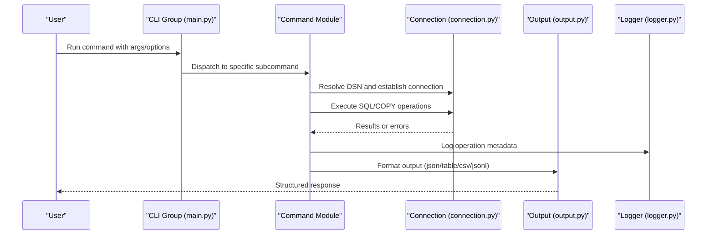
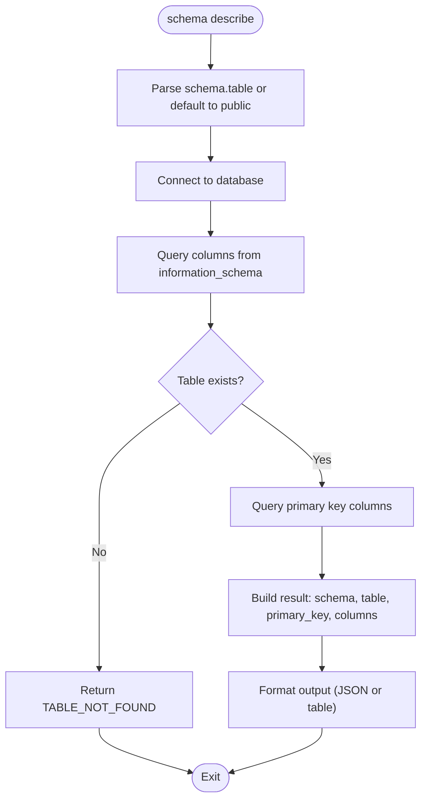
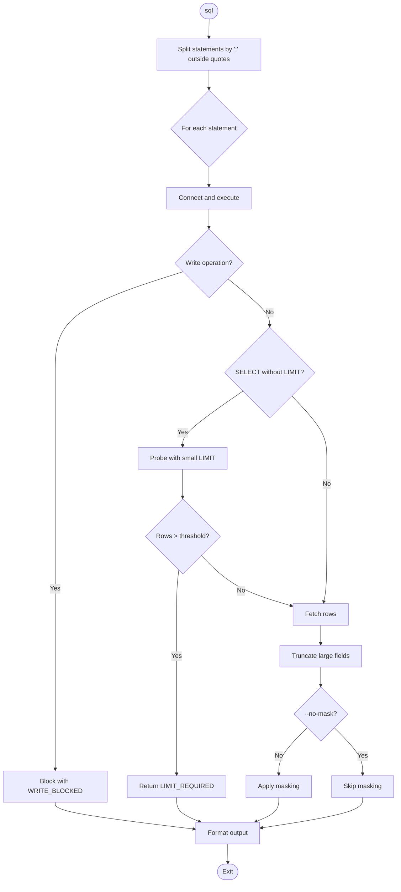
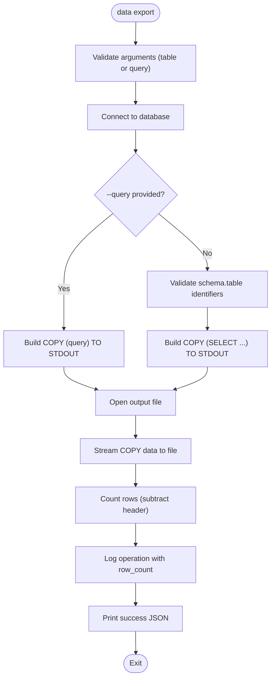
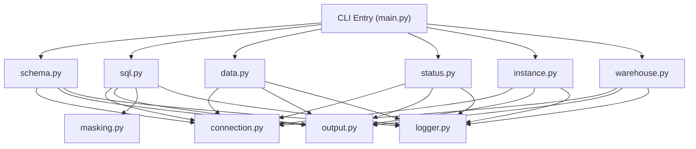

# Core CLI Commands

<cite>
**Referenced Files in This Document**
- [main.py](file://hologres-cli/src/hologres_cli/main.py)
- [schema.py](file://hologres-cli/src/hologres_cli/commands/schema.py)
- [sql.py](file://hologres-cli/src/hologres_cli/commands/sql.py)
- [data.py](file://hologres-cli/src/hologres_cli/commands/data.py)
- [status.py](file://hologres-cli/src/hologres_cli/commands/status.py)
- [instance.py](file://hologres-cli/src/hologres_cli/commands/instance.py)
- [warehouse.py](file://hologres-cli/src/hologres_cli/commands/warehouse.py)
- [connection.py](file://hologres-cli/src/hologres_cli/connection.py)
- [output.py](file://hologres-cli/src/hologres_cli/output.py)
- [masking.py](file://hologres-cli/src/hologres_cli/masking.py)
- [logger.py](file://hologres-cli/src/hologres_cli/logger.py)
- [README.md](file://hologres-cli/README.md)
</cite>

## Table of Contents
1. [Introduction](#introduction)
2. [Project Structure](#project-structure)
3. [Core Components](#core-components)
4. [Architecture Overview](#architecture-overview)
5. [Detailed Component Analysis](#detailed-component-analysis)
6. [Dependency Analysis](#dependency-analysis)
7. [Performance Considerations](#performance-considerations)
8. [Troubleshooting Guide](#troubleshooting-guide)
9. [Conclusion](#conclusion)
10. [Appendices](#appendices)

## Introduction
This document provides comprehensive documentation for all core CLI commands in the Hologres CLI tool. It explains the command structure built with Click decorators, argument parsing, and shared infrastructure for connection management, output formatting, and safety features. It covers the six main command groups: schema (tables, describe, dump, size), sql (read-only queries with guardrails), data (import, export, count), status, instance, and warehouse. For each command, you will find syntax, parameters, options, usage examples, and expected output formats. The document also explains command chaining patterns, integration with AI agents, best practices, and common usage patterns.

## Project Structure
The CLI is organized around a central entry point that registers command groups and subcommands. Each command group resides under commands/ and encapsulates its own Click decorators, argument parsing, and execution logic. Shared modules handle connection resolution, output formatting, masking, and audit logging.

```mermaid
graph TB
A["hologres-cli/src/hologres_cli/main.py<br/>Entry point and global options"] --> B["hologres-cli/src/hologres_cli/commands/schema.py<br/>schema tables/describe/dump/size"]
A --> C["hologres-cli/src/hologres_cli/commands/sql.py<br/>sql read-only with guardrails"]
A --> D["hologres-cli/src/hologres_cli/commands/data.py<br/>data import/export/count"]
A --> E["hologres-cli/src/hologres_cli/commands/status.py<br/>status"]
A --> F["hologres-cli/src/hologres_cli/commands/instance.py<br/>instance"]
A --> G["hologres-cli/src/hologres_cli/commands/warehouse.py<br/>warehouse"]
H["hologres-cli/src/hologres_cli/connection.py<br/>DSN resolution, connection wrapper"] --> B
H --> C
H --> D
H --> E
H --> F
H --> G
I["hologres-cli/src/hologres_cli/output.py<br/>Unified output formatting"] --> B
I --> C
I --> D
I --> E
I --> F
I --> G
J["hologres-cli/src/hologres_cli/masking.py<br/>Sensitive field masking"] --> C
K["hologres-cli/src/hologres_cli/logger.py<br/>Audit logging"] --> B
K --> C
K --> D
K --> E
K --> F
K --> G
```

**Diagram sources**
- [main.py:15-49](file://hologres-cli/src/hologres_cli/main.py#L15-L49)
- [schema.py:36-301](file://hologres-cli/src/hologres_cli/commands/schema.py#L36-L301)
- [sql.py:34-199](file://hologres-cli/src/hologres_cli/commands/sql.py#L34-L199)
- [data.py:44-266](file://hologres-cli/src/hologres_cli/commands/data.py#L44-L266)
- [status.py:14-62](file://hologres-cli/src/hologres_cli/commands/status.py#L14-L62)
- [instance.py:14-71](file://hologres-cli/src/hologres_cli/commands/instance.py#L14-L71)
- [warehouse.py:22-106](file://hologres-cli/src/hologres_cli/commands/warehouse.py#L22-L106)
- [connection.py:29-229](file://hologres-cli/src/hologres_cli/connection.py#L29-L229)
- [output.py:16-143](file://hologres-cli/src/hologres_cli/output.py#L16-L143)
- [masking.py:1-93](file://hologres-cli/src/hologres_cli/masking.py#L1-L93)
- [logger.py:1-105](file://hologres-cli/src/hologres_cli/logger.py#L1-L105)

**Section sources**
- [main.py:15-49](file://hologres-cli/src/hologres_cli/main.py#L15-L49)
- [README.md:108-314](file://hologres-cli/README.md#L108-L314)

## Core Components
- Global CLI group with shared options:
  - --dsn: Accepts a Hologres DSN via flag, environment variable, or config file.
  - --format/-f: Output format selector supporting json, table, csv, jsonl.
  - Version option and AI agent guide/history commands.
- Command registration:
  - Adds schema, sql, data, status, instance, and warehouse commands to the CLI group.
- Centralized error handling:
  - Catches DSN errors and generic exceptions, printing structured error responses.

**Section sources**
- [main.py:15-49](file://hologres-cli/src/hologres_cli/main.py#L15-L49)
- [main.py:98-111](file://hologres-cli/src/hologres_cli/main.py#L98-L111)
- [output.py:16-21](file://hologres-cli/src/hologres_cli/output.py#L16-L21)

## Architecture Overview
The CLI follows a layered architecture:
- Entry point defines the CLI group and global options.
- Each command module defines its own Click decorators and subcommands.
- Shared modules handle:
  - Connection management and DSN resolution.
  - Output formatting across multiple formats.
  - Sensitive data masking for SQL results.
  - Audit logging of operations.

**Diagram sources**
- [main.py:15-49](file://hologres-cli/src/hologres_cli/main.py#L15-L49)
- [connection.py:225-229](file://hologres-cli/src/hologres_cli/connection.py#L225-L229)
- [output.py:23-54](file://hologres-cli/src/hologres_cli/output.py#L23-L54)
- [logger.py:36-73](file://hologres-cli/src/hologres_cli/logger.py#L36-L73)

## Detailed Component Analysis

### Schema Commands
Group: schema
- Subcommands:
  - schema tables [--schema SCHEMA]
  - schema describe TABLE
  - schema dump SCHEMA.TABLE
  - schema size SCHEMA.TABLE

Key behaviors:
- Safe identifier validation prevents SQL injection for table and schema names.
- Uses psycopg.sql.Identifier for safe SQL construction.
- Logs operations with timing and row counts.
- Supports table format output for describe and dump.

Syntax and parameters:
- schema tables
  - Options: --schema SCHEMA_NAME
  - Output: rows with schema, table_name, owner; or JSON with ok/data.
- schema describe TABLE
  - Arguments: TABLE (supports schema.table or table)
  - Output: JSON with schema, table, primary_key, columns; or table format prints columns.
- schema dump SCHEMA.TABLE
  - Arguments: TABLE (schema qualified)
  - Output: JSON with schema, table, ddl; or raw DDL in table format.
- schema size SCHEMA.TABLE
  - Arguments: TABLE (schema qualified)
  - Output: JSON with size and size_bytes; or human-readable summary in table format.

Usage examples:
- List tables: hologres schema tables
- Filter by schema: hologres schema tables --schema myschema
- Describe table: hologres schema describe public.users
- Export DDL: hologres schema dump public.users
- Get table size: hologres schema size public.users

Expected output formats:
- Default JSON with ok/data; table/csv/jsonl supported globally.

Best practices:
- Always qualify table names for dump and size to avoid ambiguity.
- Use table format for quick inspection; JSON for programmatic consumption.

**Section sources**
- [schema.py:42-81](file://hologres-cli/src/hologres_cli/commands/schema.py#L42-L81)
- [schema.py:83-153](file://hologres-cli/src/hologres_cli/commands/schema.py#L83-L153)
- [schema.py:155-221](file://hologres-cli/src/hologres_cli/commands/schema.py#L155-L221)
- [schema.py:223-301](file://hologres-cli/src/hologres_cli/commands/schema.py#L223-L301)
- [output.py:31-54](file://hologres-cli/src/hologres_cli/output.py#L31-L54)
- [logger.py:36-73](file://hologres-cli/src/hologres_cli/logger.py#L36-L73)

#### Schema Flowchart (describe)

**Diagram sources**
- [schema.py:83-153](file://hologres-cli/src/hologres_cli/commands/schema.py#L83-L153)

### SQL Command (Read-only with Safety Guardrails)
Group: sql
- Purpose: Execute read-only SQL queries with safety guardrails.
- Guardrails:
  - Blocks all write operations (INSERT, UPDATE, DELETE, DROP, CREATE, ALTER, TRUNCATE, GRANT, REVOKE).
  - Enforces row limit checks for SELECT queries without explicit LIMIT.
  - Masks sensitive fields by default; can be disabled.
  - Supports multiple statements separated by semicolons.

Syntax and parameters:
- hologres sql QUERY [--with-schema] [--no-limit-check] [--no-mask]

Options:
- --with-schema: Include schema metadata alongside rows.
- --no-limit-check: Disable automatic row limit probing.
- --no-mask: Disable sensitive field masking.

Behavior:
- Splits multi-statement queries safely, respecting quoted strings.
- Probes with a small LIMIT to detect oversized queries; fails with LIMIT_REQUIRED if exceeds threshold.
- Applies truncation for large fields and optional masking.
- Returns structured JSON with ok/data or formatted table/csv/jsonl.

Usage examples:
- Read-only query with limit: hologres sql "SELECT * FROM users LIMIT 10"
- Disable limit check for large queries: hologres sql --no-limit-check "SELECT * FROM large_table"

Expected output formats:
- Default JSON with ok/data; supports table/csv/jsonl.

Best practices:
- Always add LIMIT for queries returning unknown or large result sets.
- Use --with-schema to inspect column types quickly.
- Combine --no-mask carefully to avoid exposing sensitive data.

**Section sources**
- [sql.py:34-199](file://hologres-cli/src/hologres_cli/commands/sql.py#L34-L199)
- [output.py:23-54](file://hologres-cli/src/hologres_cli/output.py#L23-L54)
- [masking.py:73-93](file://hologres-cli/src/hologres_cli/masking.py#L73-L93)
- [logger.py:36-73](file://hologres-cli/src/hologres_cli/logger.py#L36-L73)

#### SQL Execution Flow

**Diagram sources**
- [sql.py:66-135](file://hologres-cli/src/hologres_cli/commands/sql.py#L66-L135)

### Data Commands (Import/Export/Count)
Group: data
- Subcommands:
  - data export TABLE --file FILE [--query QUERY] [--delimiter DELIMITER]
  - data import TABLE --file FILE [--delimiter DELIMITER] [--truncate]
  - data count TABLE [--where WHERE_CLAUSE]

Key behaviors:
- Validates identifiers to prevent SQL injection.
- Uses COPY protocol for efficient import/export.
- Supports custom queries for export and optional WHERE clause for count.

Syntax and parameters:
- data export
  - Arguments: TABLE or --query QUERY (mutually exclusive)
  - Options: --file FILE_PATH, --delimiter DELIMITER (default comma)
  - Output: JSON with source, file, rows, duration_ms; or table format prints rows.
- data import
  - Arguments: TABLE
  - Options: --file FILE_PATH, --delimiter DELIMITER, --truncate
  - Output: JSON with table, file, rows, duration_ms.
- data count
  - Arguments: TABLE
  - Options: --where WHERE_CLAUSE
  - Output: JSON with table, count, duration_ms.

Usage examples:
- Export table: hologres data export users -f users.csv
- Export with custom query: hologres data export -q "SELECT * FROM users WHERE active=true" -f users.csv
- Import CSV: hologres data import users -f users.csv
- Import with truncate: hologres data import users -f users.csv --truncate
- Count rows: hologres data count users
- Count with filter: hologres data count users --where "status='active'"

Expected output formats:
- Default JSON with ok/data; supports table/csv/jsonl.

Best practices:
- Use --delimiter to match source CSV format.
- Prefer --truncate for initial loads to clear stale data.
- For large exports, consider filtering with --where to reduce payload.

**Section sources**
- [data.py:50-123](file://hologres-cli/src/hologres_cli/commands/data.py#L50-L123)
- [data.py:125-214](file://hologres-cli/src/hologres_cli/commands/data.py#L125-L214)
- [data.py:216-266](file://hologres-cli/src/hologres_cli/commands/data.py#L216-L266)
- [output.py:31-54](file://hologres-cli/src/hologres_cli/output.py#L31-L54)
- [logger.py:36-73](file://hologres-cli/src/hologres_cli/logger.py#L36-L73)

#### Data Export Flow

**Diagram sources**
- [data.py:50-123](file://hologres-cli/src/hologres_cli/commands/data.py#L50-L123)

### Status Command
Group: status
- Purpose: Show connection status and server information.
- Queries:
  - Hologres version via hg_version()
  - current_database() and current_user()
  - inet_server_addr() and inet_server_port() if available

Syntax and parameters:
- hologres status

Output:
- JSON with status, version, database, user, server_address, server_port, dsn.

Usage example:
- hologres status

Best practices:
- Use before running other commands to confirm connectivity and context.

**Section sources**
- [status.py:14-62](file://hologres-cli/src/hologres_cli/commands/status.py#L14-L62)
- [output.py:23-28](file://hologres-cli/src/hologres_cli/output.py#L23-L28)
- [logger.py:36-73](file://hologres-cli/src/hologres_cli/logger.py#L36-L73)

### Instance Command
Group: instance
- Purpose: Query Hologres instance information using named DSNs.
- Behavior:
  - Resolves DSN from environment variable HOLOGRES_DSN_<instance_name> or ~/.hologres/config.env.
  - Executes hg_version() and instance_max_connections().

Syntax and parameters:
- hologres instance INSTANCE_NAME

Output:
- JSON with instance, hg_version, max_connections.

Usage example:
- hologres instance my-instance

Best practices:
- Configure HOLOGRES_DSN_<instance_name> in environment or config file for named instances.

**Section sources**
- [instance.py:14-71](file://hologres-cli/src/hologres_cli/commands/instance.py#L14-L71)
- [connection.py:89-117](file://hologres-cli/src/hologres_cli/connection.py#L89-L117)
- [output.py:23-28](file://hologres-cli/src/hologres_cli/output.py#L23-L28)
- [logger.py:36-73](file://hologres-cli/src/hologres_cli/logger.py#L36-L73)

### Warehouse Command
Group: warehouse
- Purpose: Query Hologres warehouse (compute group) information.
- Behavior:
  - Lists all warehouses or filters by warehouse_name.
  - Enriches status and target_status numeric codes with human-readable descriptions.

Syntax and parameters:
- hologres warehouse [WAREHOUSE_NAME]

Output:
- JSON rows with warehouse metadata; table format supported.

Usage example:
- List all: hologres warehouse
- Query specific: hologres warehouse init_warehouse

Best practices:
- Use table format (-f table) for readability when exploring multiple warehouses.

**Section sources**
- [warehouse.py:22-106](file://hologres-cli/src/hologres_cli/commands/warehouse.py#L22-L106)
- [output.py:31-54](file://hologres-cli/src/hologres_cli/output.py#L31-L54)
- [logger.py:36-73](file://hologres-cli/src/hologres_cli/logger.py#L36-L73)

## Dependency Analysis
The CLI relies on a small set of shared modules to maintain consistency and safety across commands.

**Diagram sources**
- [main.py:42-49](file://hologres-cli/src/hologres_cli/main.py#L42-L49)
- [schema.py:12-22](file://hologres-cli/src/hologres_cli/commands/schema.py#L12-L22)
- [sql.py:11-23](file://hologres-cli/src/hologres_cli/commands/sql.py#L11-L23)
- [data.py:13-22](file://hologres-cli/src/hologres_cli/commands/data.py#L13-L22)
- [status.py:9-11](file://hologres-cli/src/hologres_cli/commands/status.py#L9-L11)
- [instance.py:9-11](file://hologres-cli/src/hologres_cli/commands/instance.py#L9-L11)
- [warehouse.py:10-19](file://hologres-cli/src/hologres_cli/commands/warehouse.py#L10-L19)

**Section sources**
- [main.py:42-49](file://hologres-cli/src/hologres_cli/main.py#L42-L49)

## Performance Considerations
- Use LIMIT clauses for queries that may return large datasets to avoid timeouts and excessive memory usage.
- Prefer table format for quick inspection; JSON is more suitable for programmatic consumption.
- For data import/export, leverage the COPY protocol for throughput; ensure appropriate delimiter settings.
- Audit logging writes append-only entries; consider rotation and size limits when running frequent operations.

[No sources needed since this section provides general guidance]

## Troubleshooting Guide
Common issues and resolutions:
- CONNECTION_ERROR
  - Cause: DSN not provided or invalid.
  - Resolution: Set --dsn, HOLOGRES_DSN, or configure ~/.hologres/config.env.
- QUERY_ERROR
  - Cause: SQL execution failure.
  - Resolution: Review query syntax and permissions; check logs for details.
- LIMIT_REQUIRED
  - Cause: SELECT without LIMIT exceeding row threshold.
  - Resolution: Add LIMIT or use --no-limit-check cautiously.
- TABLE_NOT_FOUND
  - Cause: schema.table does not exist.
  - Resolution: Verify table name and schema; use schema describe to confirm.
- INVALID_INPUT
  - Cause: Invalid identifier or malformed input.
  - Resolution: Ensure identifiers match allowed patterns; check quoting and delimiters.
- EXPORT_ERROR / IMPORT_ERROR
  - Cause: COPY operation failures.
  - Resolution: Validate file paths and permissions; check delimiter and header alignment.

**Section sources**
- [output.py:57-63](file://hologres-cli/src/hologres_cli/output.py#L57-L63)
- [connection.py:29-36](file://hologres-cli/src/hologres_cli/connection.py#L29-L36)
- [logger.py:36-73](file://hologres-cli/src/hologres_cli/logger.py#L36-L73)

## Conclusion
The Hologres CLI provides a robust, safety-focused interface for schema inspection, read-only SQL execution, and data import/export operations. Its modular design, unified output formatting, sensitive data masking, and audit logging enable reliable automation and integration with AI agents. By following the best practices outlined here—especially around LIMIT usage, safe identifier handling, and structured output—you can build efficient command chains and integrate the CLI seamlessly into automated workflows.

[No sources needed since this section summarizes without analyzing specific files]

## Appendices

### Command Chaining Patterns and AI Agent Integration
- Chain commands to build pipelines:
  - status → schema tables → schema describe → sql with LIMIT → data export
- AI agents can:
  - Discover tables, describe schemas, and generate queries.
  - Export results to CSV for downstream processing.
  - Use --format table for human-readable intermediate steps.
- Best practices:
  - Always include LIMIT for exploratory queries.
  - Use JSON output for machine parsing; table for quick review.
  - Mask sensitive fields by default; disable only when necessary.

**Section sources**
- [main.py:52-83](file://hologres-cli/src/hologres_cli/main.py#L52-L83)
- [README.md:289-314](file://hologres-cli/README.md#L289-L314)