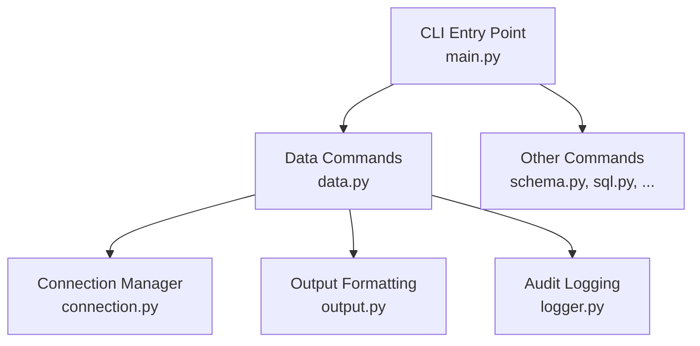
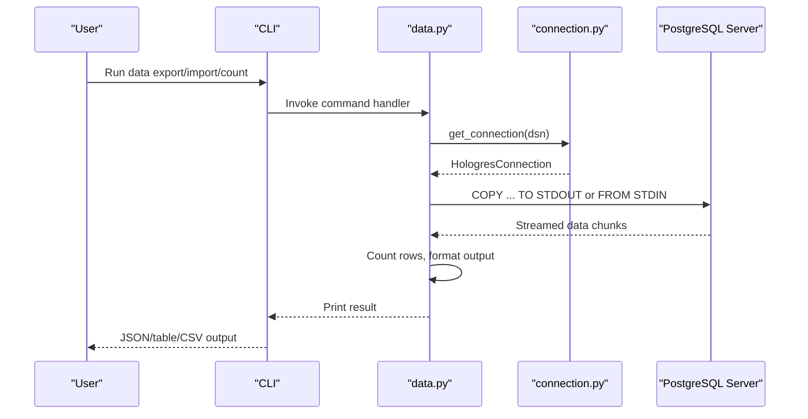
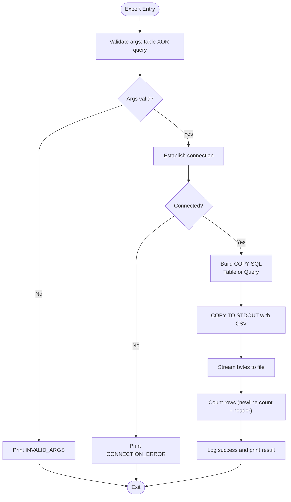
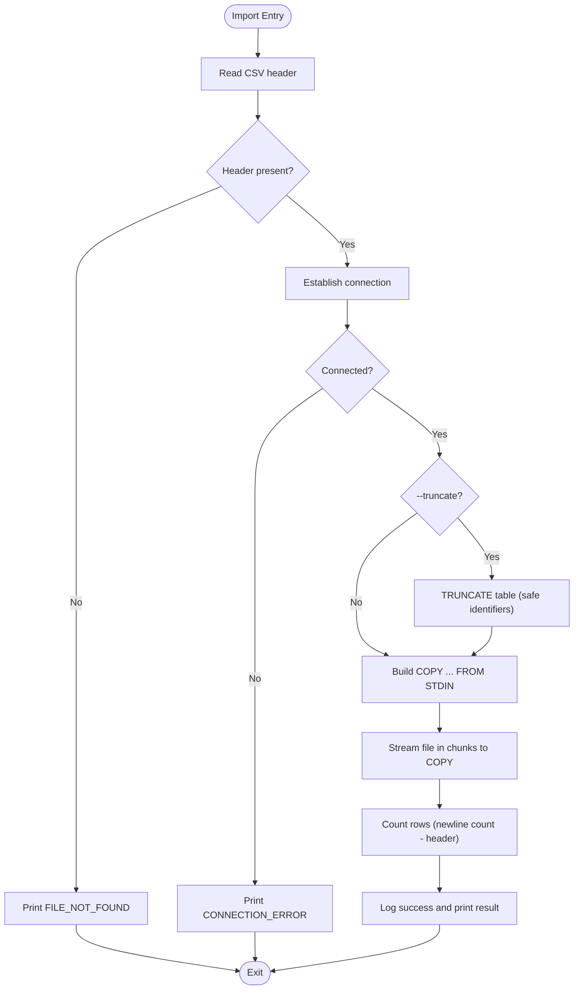
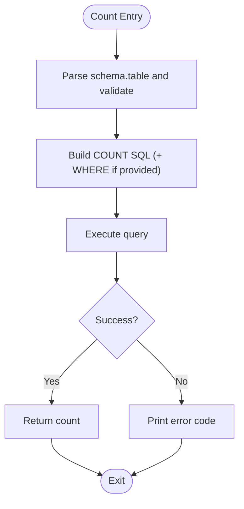
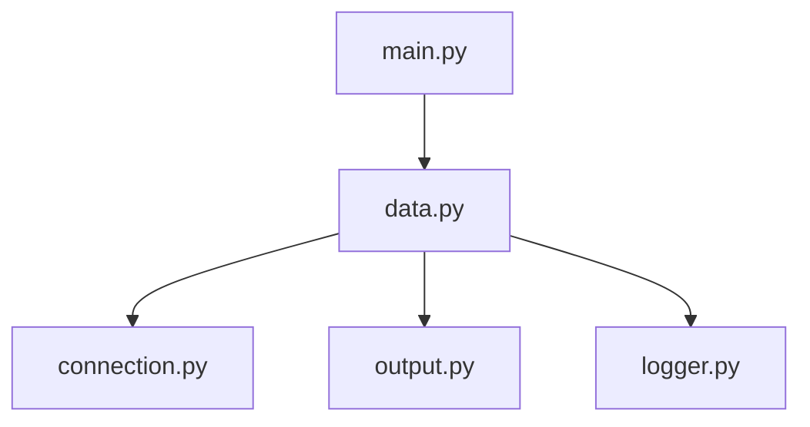

# Data Commands

<cite>
**Referenced Files in This Document**
- [data.py](file://hologres-cli/src/hologres_cli/commands/data.py)
- [main.py](file://hologres-cli/src/hologres_cli/main.py)
- [connection.py](file://hologres-cli/src/hologres_cli/connection.py)
- [output.py](file://hologres-cli/src/hologres_cli/output.py)
- [logger.py](file://hologres-cli/src/hologres_cli/logger.py)
- [commands.md](file://agent-skills/skills/hologres-cli/references/commands.md)
- [safety-features.md](file://agent-skills/skills/hologres-cli/references/safety-features.md)
- [test_data.py](file://hologres-cli/tests/test_commands/test_data.py)
</cite>

## Table of Contents
1. [Introduction](#introduction)
2. [Project Structure](#project-structure)
3. [Core Components](#core-components)
4. [Architecture Overview](#architecture-overview)
5. [Detailed Component Analysis](#detailed-component-analysis)
6. [Dependency Analysis](#dependency-analysis)
7. [Performance Considerations](#performance-considerations)
8. [Troubleshooting Guide](#troubleshooting-guide)
9. [Conclusion](#conclusion)
10. [Appendices](#appendices)

## Introduction
This document explains the data manipulation commands in the Hologres CLI, focusing on import/export operations, CSV handling, bulk data workflows, validation, and error handling. It covers command syntax, file format requirements, batch processing, performance characteristics, memory management for large datasets, and integration with external data sources. Practical examples and best practices for data integrity are included.

## Project Structure
The data commands are implemented under the CLI’s command group and integrate with connection management, output formatting, and audit logging.

**Diagram sources**
- [main.py:42-49](file://hologres-cli/src/hologres_cli/main.py#L42-L49)
- [data.py:44-47](file://hologres-cli/src/hologres_cli/commands/data.py#L44-L47)

**Section sources**
- [main.py:15-50](file://hologres-cli/src/hologres_cli/main.py#L15-L50)
- [data.py:44-47](file://hologres-cli/src/hologres_cli/commands/data.py#L44-L47)

## Core Components
- Data export: exports table or custom query results to CSV with configurable delimiter.
- Data import: imports CSV data into a table, with optional pre-truncate and column mapping from CSV header.
- Data count: counts rows in a table, optionally filtered by a WHERE clause.

Key behaviors:
- CSV format: header required; delimiter defaults to comma and can be customized.
- Bulk streaming: uses PostgreSQL COPY protocol for efficient streaming to/from files.
- Validation: validates identifiers and enforces safe SQL construction; rejects invalid identifiers.
- Error handling: standardized error codes and messages; logs operations with timing and row counts.

**Section sources**
- [data.py:50-123](file://hologres-cli/src/hologres_cli/commands/data.py#L50-L123)
- [data.py:125-213](file://hologres-cli/src/hologres_cli/commands/data.py#L125-L213)
- [data.py:216-266](file://hologres-cli/src/hologres_cli/commands/data.py#L216-L266)

## Architecture Overview
The data commands follow a consistent flow: parse arguments, establish a connection, build a safe SQL/COPY statement, stream data, and report results with timing and row counts.

**Diagram sources**
- [data.py:56-122](file://hologres-cli/src/hologres_cli/commands/data.py#L56-L122)
- [data.py:131-213](file://hologres-cli/src/hologres_cli/commands/data.py#L131-L213)
- [data.py:220-266](file://hologres-cli/src/hologres_cli/commands/data.py#L220-L266)
- [connection.py:225-229](file://hologres-cli/src/hologres_cli/connection.py#L225-L229)

## Detailed Component Analysis

### Data Export Command
Exports either a table or a custom query to a CSV file. Supports custom delimiter and writes streamed data to disk.

Command syntax:
- Export table: data export <table> --file <path>
- Export query: data export --query "<SQL>" --file <path>
- Custom delimiter: data export <table> --file <path> --delimiter "|"

Processing logic:
- Validates arguments: requires either table or query.
- Builds safe SQL for table export using identifier validation and parameterized identifiers.
- Uses COPY TO STDOUT with CSV format and optional delimiter.
- Streams bytes directly to file and counts rows by newline counting (excluding header).

Error handling:
- Invalid arguments produce INVALID_ARGS.
- Connection errors produce CONNECTION_ERROR.
- Validation errors produce INVALID_INPUT.
- General failures produce EXPORT_ERROR.

**Diagram sources**
- [data.py:56-122](file://hologres-cli/src/hologres_cli/commands/data.py#L56-L122)

**Section sources**
- [data.py:50-123](file://hologres-cli/src/hologres_cli/commands/data.py#L50-L123)
- [test_data.py:16-115](file://hologres-cli/tests/test_commands/test_data.py#L16-L115)

### Data Import Command
Imports CSV data into a table. Reads CSV header to determine target columns and streams data via COPY FROM STDIN.

Command syntax:
- Basic import: data import <table> --file <path>
- Truncate before import: data import <table> --file <path> --truncate
- Custom delimiter: data import <table> --file <path> --delimiter "|"

Processing logic:
- Reads first line to extract column names.
- Optionally truncates table before import (validated identifiers).
- Builds COPY statement with validated schema.table and column list.
- Streams file in chunks to COPY FROM STDIN and counts rows similarly.

Error handling:
- File not found produces FILE_NOT_FOUND.
- Connection errors produce CONNECTION_ERROR.
- Validation errors produce INVALID_INPUT.
- General failures produce IMPORT_ERROR.

**Diagram sources**
- [data.py:131-213](file://hologres-cli/src/hologres_cli/commands/data.py#L131-L213)

**Section sources**
- [data.py:125-213](file://hologres-cli/src/hologres_cli/commands/data.py#L125-L213)
- [test_data.py:117-206](file://hologres-cli/tests/test_commands/test_data.py#L117-L206)

### Data Count Command
Counts rows in a table, optionally filtered by a WHERE clause.

Command syntax:
- Count all: data count <table>
- Count with filter: data count <table> --where "<condition>"

Processing logic:
- Parses schema.table and validates identifiers.
- Builds a COUNT query and appends WHERE if provided.
- Executes and returns the count.

Error handling:
- Connection errors produce CONNECTION_ERROR.
- Query errors produce QUERY_ERROR.
- Validation errors produce INVALID_INPUT.

**Diagram sources**
- [data.py:220-266](file://hologres-cli/src/hologres_cli/commands/data.py#L220-L266)

**Section sources**
- [data.py:216-266](file://hologres-cli/src/hologres_cli/commands/data.py#L216-L266)
- [test_data.py:208-259](file://hologres-cli/tests/test_commands/test_data.py#L208-L259)

## Dependency Analysis
- data.py depends on:
  - connection.py for DSN resolution and connection creation.
  - output.py for unified output formatting and error wrappers.
  - logger.py for audit logging of operations with timing and row counts.
- main.py registers the data command group and passes DSN/format context to handlers.

**Diagram sources**
- [data.py:13-22](file://hologres-cli/src/hologres_cli/commands/data.py#L13-L22)
- [main.py:42-49](file://hologres-cli/src/hologres_cli/main.py#L42-L49)

**Section sources**
- [data.py:13-22](file://hologres-cli/src/hologres_cli/commands/data.py#L13-L22)
- [main.py:42-49](file://hologres-cli/src/hologres_cli/main.py#L42-L49)

## Performance Considerations
- Streaming COPY protocol:
  - Export reads server-side streamed bytes and writes to disk efficiently.
  - Import streams file chunks to the server, avoiding loading entire file into memory.
- Batch processing:
  - Import uses chunked reads (65536-byte blocks) to minimize memory overhead.
- Row counting:
  - Approximates row count by newline counting in received bytes; subtracts header.
- Memory management:
  - No in-memory accumulation of entire dataset; streaming minimizes RAM usage.
- Large datasets:
  - Prefer exporting via data export (not ad-hoc SQL) to leverage COPY streaming.
  - Use custom delimiters when needed; ensure CSV is properly escaped for the chosen delimiter.

[No sources needed since this section provides general guidance]

## Troubleshooting Guide
Common issues and resolutions:

- Connection problems:
  - Ensure DSN is configured via --dsn, HOLOGRES_DSN, or ~/.hologres/config.env.
  - Error code: CONNECTION_ERROR.

- Invalid arguments:
  - Export requires either table or query.
  - Error code: INVALID_ARGS.

- Invalid identifiers:
  - Schema/table names must match allowed pattern; disallow unsafe characters.
  - Error code: INVALID_INPUT.

- File not found (import):
  - Verify file path and permissions.
  - Error code: FILE_NOT_FOUND.

- Export/Import failures:
  - Check server connectivity and table/column existence.
  - Review audit logs for SQL, duration, and row counts.
  - Error codes: EXPORT_ERROR, IMPORT_ERROR.

- Audit logs:
  - Located at ~/.hologres/sql-history.jsonl.
  - Contains timestamps, operation, success, SQL (redacted), row counts, durations, and errors.

**Section sources**
- [data.py:62-122](file://hologres-cli/src/hologres_cli/commands/data.py#L62-L122)
- [data.py:140-213](file://hologres-cli/src/hologres_cli/commands/data.py#L140-L213)
- [logger.py:36-73](file://hologres-cli/src/hologres_cli/logger.py#L36-L73)

## Conclusion
The Hologres CLI data commands provide robust, secure, and efficient CSV import/export operations using PostgreSQL’s COPY protocol. They enforce safety through identifier validation, support custom delimiters, and offer streaming for large datasets. Unified output formatting and comprehensive audit logging enable reliable workflows and troubleshooting.

[No sources needed since this section summarizes without analyzing specific files]

## Appendices

### Command Syntax and Examples
- Export table to CSV:
  - hologres data export my_table -f output.csv
- Export with custom query:
  - hologres data export -q "SELECT * FROM users WHERE active=true" -f users.csv
- Import CSV to table:
  - hologres data import my_table -f input.csv
- Import with truncate:
  - hologres data import my_table -f input.csv --truncate
- Count rows:
  - hologres data count my_table
  - hologres data count my_table --where "status='active'"

**Section sources**
- [commands.md:161-195](file://agent-skills/skills/hologres-cli/references/commands.md#L161-L195)

### CSV Format Handling
- Header required: first line determines target columns for import.
- Delimiter defaults to comma; can be changed with --delimiter.
- Export always includes a header row.
- Special characters in CSV are handled by the underlying CSV writer.

**Section sources**
- [data.py:139-147](file://hologres-cli/src/hologres_cli/commands/data.py#L139-L147)
- [data.py:36-41](file://hologres-cli/src/hologres_cli/commands/data.py#L36-L41)

### Safety and Best Practices
- Use data export/import for large transfers; avoid ad-hoc SQL for bulk operations.
- Validate schema.table names; only alphanumeric, underscore, and hyphen allowed.
- Prefer explicit WHERE clauses for write operations; use --truncate cautiously.
- Monitor audit logs for timing and row counts to verify operations.

**Section sources**
- [safety-features.md:136-145](file://agent-skills/skills/hologres-cli/references/safety-features.md#L136-L145)
- [data.py:24-34](file://hologres-cli/src/hologres_cli/commands/data.py#L24-L34)