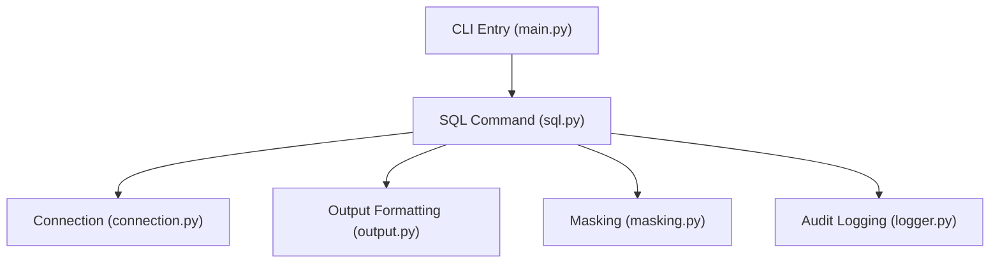
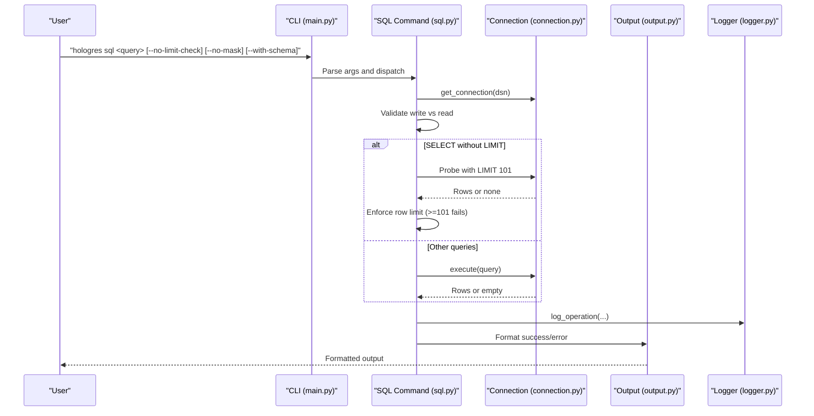
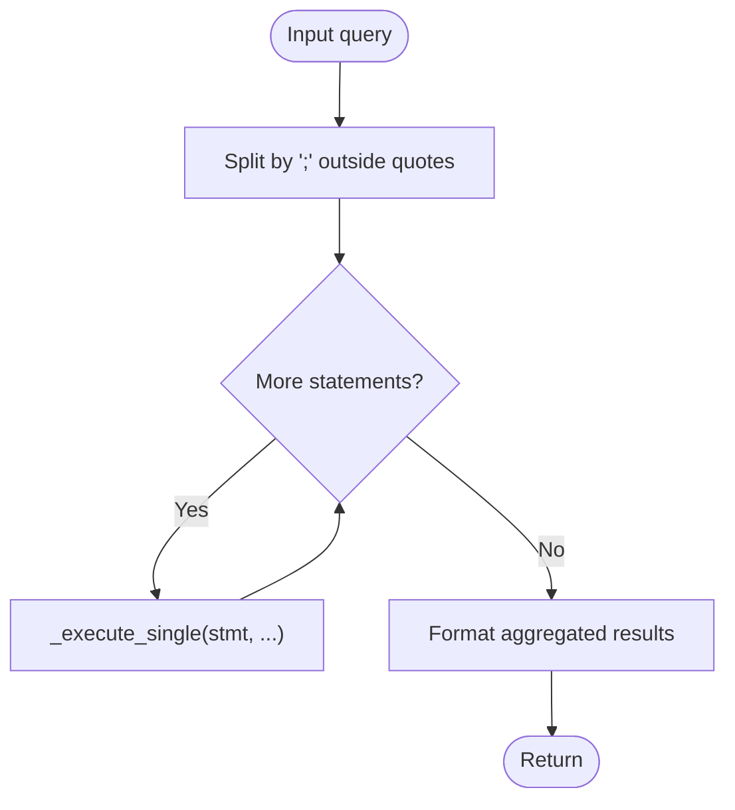
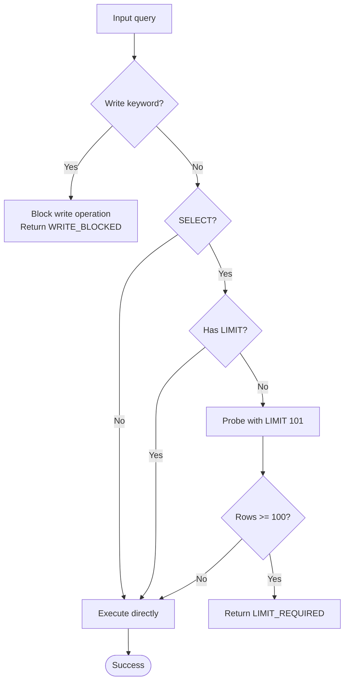
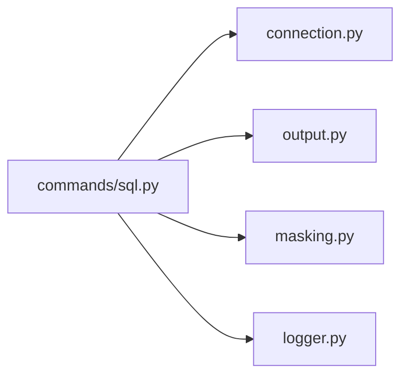

# SQL Commands

<cite>
**Referenced Files in This Document**
- [sql.py](file://hologres-cli/src/hologres_cli/commands/sql.py)
- [output.py](file://hologres-cli/src/hologres_cli/output.py)
- [masking.py](file://hologres-cli/src/hologres_cli/masking.py)
- [logger.py](file://hologres-cli/src/hologres_cli/logger.py)
- [connection.py](file://hologres-cli/src/hologres_cli/connection.py)
- [main.py](file://hologres-cli/src/hologres_cli/main.py)
- [commands.md](file://agent-skills/skills/hologres-cli/references/commands.md)
- [safety-features.md](file://agent-skills/skills/hologres-cli/references/safety-features.md)
- [test_sql.py](file://hologres-cli/tests/test_commands/test_sql.py)
- [integration_sql_live.py](file://hologres-cli/tests/integration/test_sql_live.py)
</cite>

## Table of Contents
1. [Introduction](#introduction)
2. [Project Structure](#project-structure)
3. [Core Components](#core-components)
4. [Architecture Overview](#architecture-overview)
5. [Detailed Component Analysis](#detailed-component-analysis)
6. [Dependency Analysis](#dependency-analysis)
7. [Performance Considerations](#performance-considerations)
8. [Troubleshooting Guide](#troubleshooting-guide)
9. [Conclusion](#conclusion)
10. [Appendices](#appendices)

## Introduction
This document explains the SQL execution command in the Hologres CLI, focusing on read-only execution, safety guardrails, output formatting, and integration with AI agent workflows. It covers command syntax, parameter handling, row limit enforcement, sensitive data masking, audit logging, error handling patterns, and best practices for safe SQL execution.

## Project Structure
The SQL command is implemented as part of the CLI’s command module and integrates with connection management, output formatting, masking, and logging utilities.

**Diagram sources**
- [main.py:15-50](file://hologres-cli/src/hologres_cli/main.py#L15-L50)
- [sql.py:34-64](file://hologres-cli/src/hologres_cli/commands/sql.py#L34-L64)
- [connection.py:225-229](file://hologres-cli/src/hologres_cli/connection.py#L225-L229)
- [output.py:23-55](file://hologres-cli/src/hologres_cli/output.py#L23-L55)
- [masking.py:73-93](file://hologres-cli/src/hologres_cli/masking.py#L73-L93)
- [logger.py:36-74](file://hologres-cli/src/hologres_cli/logger.py#L36-L74)

**Section sources**
- [main.py:15-50](file://hologres-cli/src/hologres_cli/main.py#L15-L50)
- [sql.py:34-64](file://hologres-cli/src/hologres_cli/commands/sql.py#L34-L64)

## Core Components
- SQL command definition and options
- Statement splitting and per-statement execution
- Safety guardrails: write blocking, row limit probing, sensitive field masking
- Output formatting across JSON, table, CSV, and JSONL
- Audit logging of operations with redacted SQL

Key behaviors:
- Read-only execution by default; write operations are blocked unless explicitly allowed
- Automatic row limit enforcement for SELECT queries without LIMIT
- Sensitive data masking disabled by default unless requested
- Unified error and success response formatting
- Operation audit logging with redacted SQL and metadata

**Section sources**
- [sql.py:34-64](file://hologres-cli/src/hologres_cli/commands/sql.py#L34-L64)
- [sql.py:66-135](file://hologres-cli/src/hologres_cli/commands/sql.py#L66-L135)
- [output.py:16-20](file://hologres-cli/src/hologres_cli/output.py#L16-L20)
- [output.py:23-55](file://hologres-cli/src/hologres_cli/output.py#L23-L55)
- [masking.py:73-93](file://hologres-cli/src/hologres_cli/masking.py#L73-L93)
- [logger.py:36-74](file://hologres-cli/src/hologres_cli/logger.py#L36-L74)

## Architecture Overview
End-to-end flow for a single SQL execution:

**Diagram sources**
- [main.py:42-49](file://hologres-cli/src/hologres_cli/main.py#L42-L49)
- [sql.py:34-64](file://hologres-cli/src/hologres_cli/commands/sql.py#L34-L64)
- [sql.py:66-135](file://hologres-cli/src/hologres_cli/commands/sql.py#L66-L135)
- [connection.py:225-229](file://hologres-cli/src/hologres_cli/connection.py#L225-L229)
- [output.py:23-55](file://hologres-cli/src/hologres_cli/output.py#L23-L55)
- [logger.py:36-74](file://hologres-cli/src/hologres_cli/logger.py#L36-L74)

## Detailed Component Analysis

### SQL Command Definition and Options
- Command: sql
- Subcommands:
  - sql run: Execute SQL queries with safety guardrails
  - sql explain: Show execution plan for a SQL query
- Arguments:
  - query: SQL statement string
- Options (sql run):
  - --with-schema: Include column schema in output
  - --no-limit-check: Disable row limit probing for SELECT
  - --no-mask: Disable sensitive data masking
- Behavior:
  - sql run: Supports multiple statements separated by semicolon; executes each statement individually and aggregates results when multiple statements are provided
  - sql explain: Prepends EXPLAIN to the query and returns the execution plan as a list of text lines

**Section sources**
- [sql.py:34-64](file://hologres-cli/src/hologres_cli/commands/sql.py#L34-L64)
- [commands.md:123-156](file://agent-skills/skills/hologres-cli/references/commands.md#L123-L156)

### Statement Splitting and Execution
- Splits input on semicolons while respecting quoted strings
- Executes each statement via a shared execution routine
- Aggregates results when multiple statements are present

**Diagram sources**
- [sql.py:137-161](file://hologres-cli/src/hologres_cli/commands/sql.py#L137-L161)
- [sql.py:54-63](file://hologres-cli/src/hologres_cli/commands/sql.py#L54-L63)

**Section sources**
- [sql.py:137-161](file://hologres-cli/src/hologres_cli/commands/sql.py#L137-L161)
- [test_sql.py:24-84](file://hologres-cli/tests/test_commands/test_sql.py#L24-L84)

### Safety Guardrails
- Write operation blocking:
  - Detects write keywords and blocks non-write operations by default
  - Logs blocked operations with error code
- Row limit protection:
  - For SELECT without LIMIT, probes with a small limit to estimate row count
  - Fails if estimated rows exceed threshold
- Sensitive data masking:
  - Auto-detects sensitive columns by name patterns and masks values
  - Can be disabled via flag

**Diagram sources**
- [sql.py:78-104](file://hologres-cli/src/hologres_cli/commands/sql.py#L78-L104)
- [sql.py:164-177](file://hologres-cli/src/hologres_cli/commands/sql.py#L164-L177)
- [sql.py:180-183](file://hologres-cli/src/hologres_cli/commands/sql.py#L180-L183)

**Section sources**
- [sql.py:78-104](file://hologres-cli/src/hologres_cli/commands/sql.py#L78-L104)
- [sql.py:164-177](file://hologres-cli/src/hologres_cli/commands/sql.py#L164-L177)
- [safety-features.md:5-35](file://agent-skills/skills/hologres-cli/references/safety-features.md#L5-L35)

### Output Formatting
- Supported formats: JSON, table, CSV, JSONL
- success and success_rows helpers format responses consistently
- Table and CSV outputs render human-readable or machine-readable formats
- JSONL streams rows as newline-delimited JSON

**Section sources**
- [output.py:16-20](file://hologres-cli/src/hologres_cli/output.py#L16-L20)
- [output.py:23-55](file://hologres-cli/src/hologres_cli/output.py#L23-L55)
- [output.py:91-117](file://hologres-cli/src/hologres_cli/output.py#L91-L117)

### Sensitive Data Masking
- Masks phone, email, password/token, ID card, and bank card fields
- Applies only when masking is enabled (default)
- Uses column name pattern matching to detect sensitive fields

**Section sources**
- [masking.py:15-57](file://hologres-cli/src/hologres_cli/masking.py#L15-L57)
- [masking.py:73-93](file://hologres-cli/src/hologres_cli/masking.py#L73-L93)

### Audit Logging
- Logs each operation to a JSONL history file with redacted SQL
- Captures timestamp, operation, success flag, row count, error code/message, and duration
- Redacts sensitive literals in SQL for privacy

**Section sources**
- [logger.py:36-74](file://hologres-cli/src/hologres_cli/logger.py#L36-L74)
- [logger.py:29-33](file://hologres-cli/src/hologres_cli/logger.py#L29-L33)
- [safety-features.md:115-134](file://agent-skills/skills/hologres-cli/references/safety-features.md#L115-L134)

### Error Handling Patterns
- Connection errors: surfaced as CONNECTION_ERROR
- Query execution errors: surfaced as QUERY_ERROR
- Safety violations: WRITE_BLOCKED, LIMIT_REQUIRED
- Large field truncation: internal cleanup to protect output readability

**Section sources**
- [sql.py:71-74](file://hologres-cli/src/hologres_cli/commands/sql.py#L71-L74)
- [sql.py:126-132](file://hologres-cli/src/hologres_cli/commands/sql.py#L126-L132)
- [output.py:125-134](file://hologres-cli/src/hologres_cli/output.py#L125-L134)

## Dependency Analysis
The SQL command depends on:
- Connection management for database connectivity
- Output formatting for consistent response rendering
- Masking for sensitive data protection
- Logger for audit trails

**Diagram sources**
- [sql.py:11-23](file://hologres-cli/src/hologres_cli/commands/sql.py#L11-L23)
- [connection.py:225-229](file://hologres-cli/src/hologres_cli/connection.py#L225-L229)
- [output.py:23-55](file://hologres-cli/src/hologres_cli/output.py#L23-L55)
- [masking.py:73-93](file://hologres-cli/src/hologres_cli/masking.py#L73-L93)
- [logger.py:36-74](file://hologres-cli/src/hologres_cli/logger.py#L36-L74)

**Section sources**
- [sql.py:11-23](file://hologres-cli/src/hologres_cli/commands/sql.py#L11-L23)

## Performance Considerations
- Row limit probing executes a bounded probe query to estimate row counts; keep queries selective to minimize probe cost
- Large field truncation prevents oversized outputs from slowing clients
- Prefer explicit LIMIT clauses for large datasets to avoid probe overhead

[No sources needed since this section provides general guidance]

## Troubleshooting Guide
Common issues and resolutions:
- LIMIT_REQUIRED: Add LIMIT to SELECT or use --no-limit-check to bypass (use cautiously)
- WRITE_BLOCKED: Use appropriate write operations with proper safeguards
- CONNECTION_ERROR: Verify DSN configuration via flag, environment, or config file
- QUERY_ERROR: Inspect SQL syntax and permissions
- Excessive output size: Enable masking and rely on truncation for large fields

Validation references:
- Tests demonstrate expected behaviors for limit checks, write guards, and output formats
- Integration tests confirm safety enforcement for write operations

**Section sources**
- [test_sql.py:453-475](file://hologres-cli/tests/test_commands/test_sql.py#L453-L475)
- [test_sql.py:476-498](file://hologres-cli/tests/test_commands/test_sql.py#L476-L498)
- [integration_sql_live.py:242-266](file://hologres-cli/tests/integration/test_sql_live.py#L242-L266)

## Conclusion
The Hologres CLI SQL command provides a secure, audited, and user-friendly way to execute read-only queries with strong guardrails. It enforces row limits, blocks unsafe write operations, masks sensitive data, and offers flexible output formats. Combined with audit logging, it supports safe AI agent workflows and operational transparency.

[No sources needed since this section summarizes without analyzing specific files]

## Appendices

### Command Syntax and Options
- Command: sql
- Arguments:
  - query: SQL statement (supports multiple statements separated by semicolon)
- Options:
  - --with-schema: Include schema metadata in output
  - --no-limit-check: Disable row limit probing
  - --no-mask: Disable sensitive data masking

Examples:
- Read-only queries with explicit limits
- Queries without LIMIT that return ≤100 rows succeed automatically
- Queries without LIMIT that return >100 rows fail with LIMIT_REQUIRED

**Section sources**
- [commands.md:123-156](file://agent-skills/skills/hologres-cli/references/commands.md#L123-L156)
- [safety-features.md:17-29](file://agent-skills/skills/hologres-cli/references/safety-features.md#L17-L29)

### Supported SQL Patterns
- Read-only patterns: SELECT with or without LIMIT
- Write patterns: INSERT, UPDATE, DELETE, DROP, CREATE, ALTER, TRUNCATE, GRANT, REVOKE
- Safety requirement: DELETE/UPDATE without WHERE are blocked

**Section sources**
- [sql.py:29](file://hologres-cli/src/hologres_cli/commands/sql.py#L29)
- [safety-features.md:56-90](file://agent-skills/skills/hologres-cli/references/safety-features.md#L56-L90)

### Output Formats
- json: Default structured response
- table: Human-readable table
- csv: Comma-separated values
- jsonl: Newline-delimited JSON for streaming

**Section sources**
- [output.py:16-20](file://hologres-cli/src/hologres_cli/output.py#L16-L20)
- [output.py:91-117](file://hologres-cli/src/hologres_cli/output.py#L91-L117)

### Security Features Summary
- Write blocking for mutation operations
- Row limit enforcement for SELECT
- Sensitive data masking by column name patterns
- Audit logging with redacted SQL and metadata

**Section sources**
- [sql.py:78-104](file://hologres-cli/src/hologres_cli/commands/sql.py#L78-L104)
- [masking.py:59-63](file://hologres-cli/src/hologres_cli/masking.py#L59-L63)
- [logger.py:29-33](file://hologres-cli/src/hologres_cli/logger.py#L29-L33)