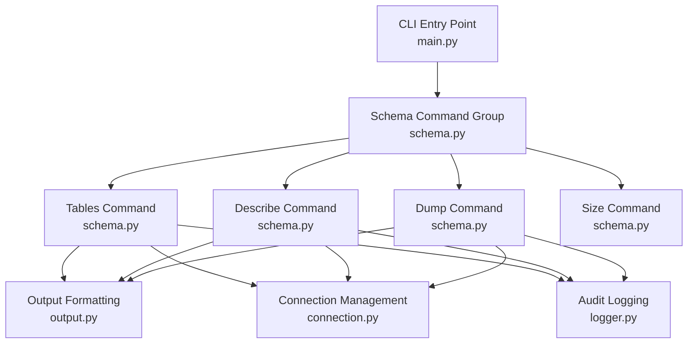
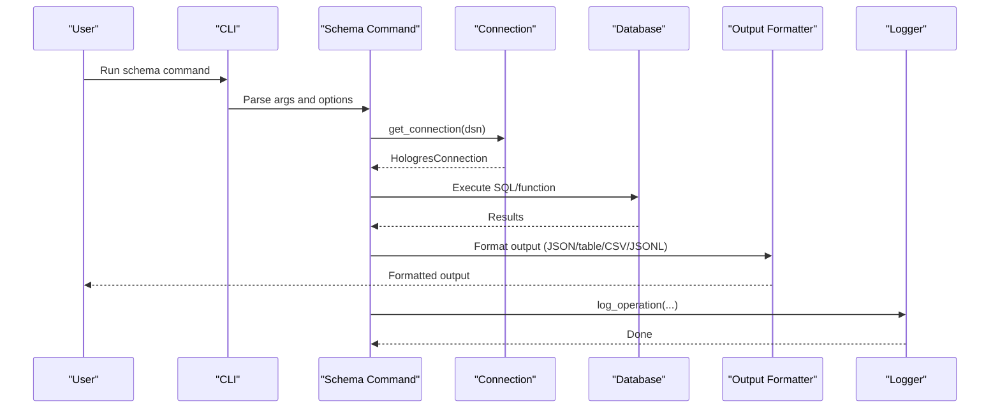
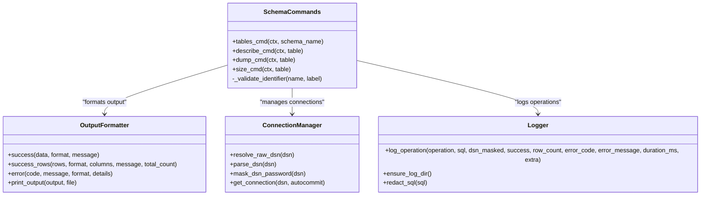
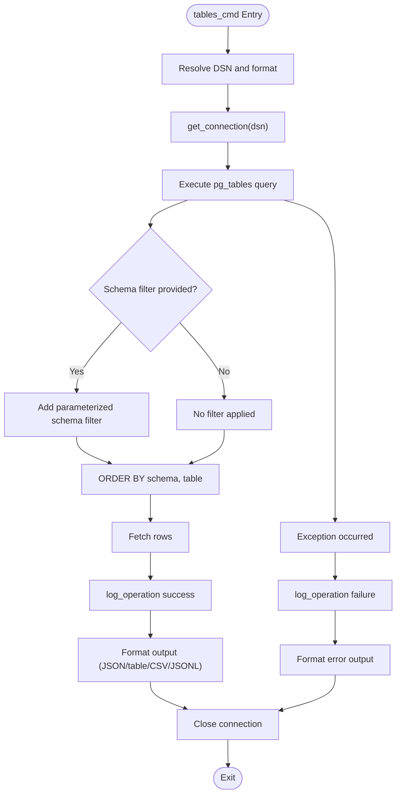
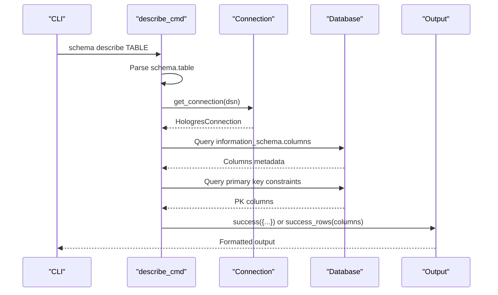
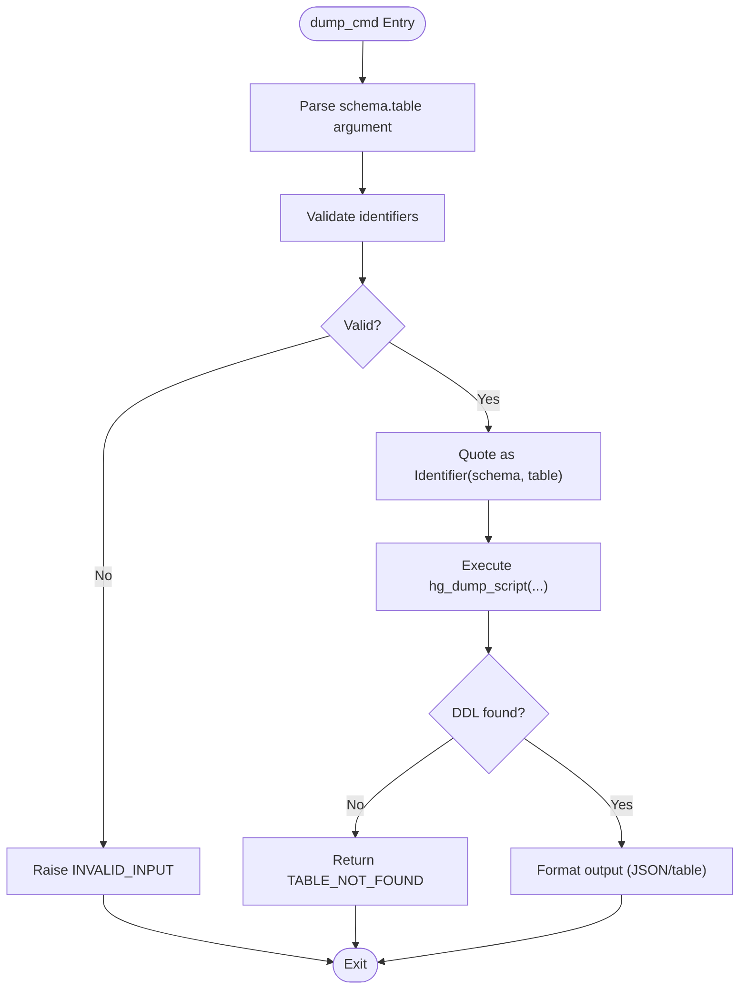
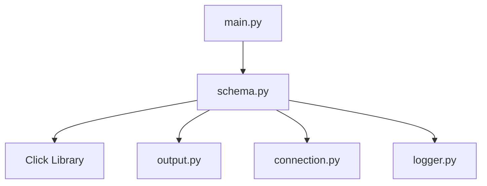

# Schema Commands

<cite>
**Referenced Files in This Document**
- [schema.py](file://hologres-cli/src/hologres_cli/commands/schema.py)
- [output.py](file://hologres-cli/src/hologres_cli/output.py)
- [main.py](file://hologres-cli/src/hologres_cli/main.py)
- [connection.py](file://hologres-cli/src/hologres_cli/connection.py)
- [logger.py](file://hologres-cli/src/hologres_cli/logger.py)
- [commands.md](file://agent-skills/skills/hologres-cli/references/commands.md)
- [safety-features.md](file://agent-skills/skills/hologres-cli/references/safety-features.md)
- [test_schema.py](file://hologres-cli/tests/test_commands/test_schema.py)
</cite>

## Table of Contents
1. [Introduction](#introduction)
2. [Project Structure](#project-structure)
3. [Core Components](#core-components)
4. [Architecture Overview](#architecture-overview)
5. [Detailed Component Analysis](#detailed-component-analysis)
6. [Dependency Analysis](#dependency-analysis)
7. [Performance Considerations](#performance-considerations)
8. [Troubleshooting Guide](#troubleshooting-guide)
9. [Conclusion](#conclusion)

## Introduction
This document provides comprehensive documentation for the schema inspection commands in the Hologres CLI tool. It covers the three primary sub-commands under the schema group:
- tables: Lists all database tables with optional schema filtering
- describe: Shows table structure including columns, data types, nullability, defaults, and comments
- dump: Exports DDL using the hg_dump_script function

For each command, you will find syntax, parameters, options, usage examples, and expected output formats. The document also explains identifier validation patterns, SQL injection prevention measures, and the differences between JSON and table output formats. Best practices for schema exploration and common troubleshooting scenarios are included.

## Project Structure
The schema commands are implemented as Click subcommands within the schema command group. They integrate with the CLI entry point, connection management, output formatting, and audit logging modules.

**Diagram sources**
- [main.py:42-49](file://hologres-cli/src/hologres_cli/main.py#L42-L49)
- [schema.py:36-301](file://hologres-cli/src/hologres_cli/commands/schema.py#L36-L301)
- [output.py:16-143](file://hologres-cli/src/hologres_cli/output.py#L16-L143)
- [connection.py:225-229](file://hologres-cli/src/hologres_cli/connection.py#L225-L229)
- [logger.py:36-73](file://hologres-cli/src/hologres_cli/logger.py#L36-L73)

**Section sources**
- [main.py:15-50](file://hologres-cli/src/hologres_cli/main.py#L15-L50)
- [schema.py:36-301](file://hologres-cli/src/hologres_cli/commands/schema.py#L36-L301)

## Core Components
- Schema command group: Defines the schema command namespace and registers subcommands.
- Tables command: Lists tables with optional schema filtering using a SQL query against pg_catalog.pg_tables.
- Describe command: Retrieves column metadata and primary key information for a given table using information_schema and pg_catalog views.
- Dump command: Executes hg_dump_script to export DDL for a table, returning either JSON or raw DDL depending on the output format.
- Output formatting: Provides unified formatting for JSON, table, CSV, and JSONL outputs.
- Connection management: Handles DSN resolution, parsing, and connection lifecycle.
- Audit logging: Logs operations with timing, success/failure, and sanitized SQL.

**Section sources**
- [schema.py:36-301](file://hologres-cli/src/hologres_cli/commands/schema.py#L36-L301)
- [output.py:16-143](file://hologres-cli/src/hologres_cli/output.py#L16-L143)
- [connection.py:225-229](file://hologres-cli/src/hologres_cli/connection.py#L225-L229)
- [logger.py:36-73](file://hologres-cli/src/hologres_cli/logger.py#L36-L73)

## Architecture Overview
The schema commands follow a consistent flow:
- Parse CLI arguments and options
- Resolve DSN and establish a connection
- Execute SQL queries or function calls
- Format and output results according to the selected format
- Log operation details for auditing

**Diagram sources**
- [main.py:19-39](file://hologres-cli/src/hologres_cli/main.py#L19-L39)
- [schema.py:45-80](file://hologres-cli/src/hologres_cli/commands/schema.py#L45-L80)
- [output.py:23-88](file://hologres-cli/src/hologres_cli/output.py#L23-L88)
- [logger.py:36-73](file://hologres-cli/src/hologres_cli/logger.py#L36-L73)

## Detailed Component Analysis

### Tables Command
Purpose: List all tables in the database, optionally filtered by schema.

Syntax:
- hologres schema tables [--schema SCHEMA]

Parameters:
- --schema, -s SCHEMA: Filter tables by schema name

Options:
- --format: Output format (json, table, csv, jsonl)

Behavior:
- Connects to the database using the resolved DSN
- Executes a query against pg_catalog.pg_tables to retrieve schema, table name, and owner
- Applies a filter for system schemas (excludes pg_catalog, information_schema, hologres, hg_internal)
- Optionally filters by the provided schema name
- Sorts results by schema and table name
- Logs the operation with timing and row count

Output formats:
- JSON: {"ok": true, "data": {"rows": [...], "count": N}}
- Table: Human-readable table with columns schema, table_name, owner
- CSV: Comma-separated values
- JSONL: One JSON object per row

Examples:
- hologres schema tables
- hologres --format table schema tables --schema public

Expected output:
- JSON: Rows include schema, table_name, owner
- Table: Tabular display of schema, table_name, owner

Identifier validation and safety:
- The schema filter is passed as a parameter to a SQL query, not concatenated directly. The implementation appends a parameterized condition and supplies the schema name as a parameter, preventing SQL injection.

Error handling:
- Connection errors produce a CONNECTION_ERROR
- Query execution errors produce a QUERY_ERROR
- Proper logging captures success/failure, SQL, and timing

**Section sources**
- [schema.py:42-81](file://hologres-cli/src/hologres_cli/commands/schema.py#L42-L81)
- [output.py:31-54](file://hologres-cli/src/hologres_cli/output.py#L31-L54)
- [test_schema.py:15-82](file://hologres-cli/tests/test_commands/test_schema.py#L15-L82)

### Describe Command
Purpose: Show table structure including columns, data types, nullability, defaults, ordinal position, and comments.

Syntax:
- hologres schema describe TABLE
- TABLE can be table_name or schema.table_name

Parameters:
- TABLE: Target table name (supports schema qualification)

Options:
- --format: Output format (json, table, csv, jsonl)

Behavior:
- Parses the table argument into schema and table name; defaults to public if not qualified
- Retrieves column metadata from information_schema.columns
- Joins with pg_catalog views to fetch comments/descriptions
- Identifies primary key columns using information_schema constraints and key usage
- Formats output differently based on format:
  - JSON: {"ok": true, "data": {"schema": "...", "table": "...", "primary_key": [...], "columns": [...]}}
  - Table: Displays column details in a table format

Output formats:
- JSON: Structured object containing schema, table, primary_key, and columns
- Table: Human-readable table with column details
- CSV/JSONL: As handled by the unified formatter

Examples:
- hologres schema describe users
- hologres schema describe public.users

Expected output:
- JSON: Top-level keys include schema, table, primary_key, and columns array
- Table: Each row corresponds to a column with attributes like name, type, nullable, default, ordinal position, comment

Identifier validation and safety:
- The schema and table names are parsed from the argument. While the implementation does not apply the same strict identifier validation as dump, it uses parameterized queries for the information_schema queries, which mitigates SQL injection risks.

Error handling:
- Connection errors produce a CONNECTION_ERROR
- Query execution errors produce a QUERY_ERROR
- Non-existent tables produce a TABLE_NOT_FOUND error

**Section sources**
- [schema.py:83-153](file://hologres-cli/src/hologres_cli/commands/schema.py#L83-L153)
- [output.py:23-88](file://hologres-cli/src/hologres_cli/output.py#L23-L88)
- [test_schema.py:84-157](file://hologres-cli/tests/test_commands/test_schema.py#L84-L157)

### Dump Command
Purpose: Export DDL for a table using hg_dump_script.

Syntax:
- hologres schema dump TABLE

Parameters:
- TABLE: Must be in schema.table_name format

Options:
- --format: Output format (json, table, csv, jsonl)

Behavior:
- Parses the table argument into schema and table name; validates both parts
- Validates identifiers using a strict pattern that allows letters, digits, underscores, and hyphens, with the first character restricted to letters or underscores
- Uses psycopg.sql.Identifier to safely quote the schema.table identifier in the hg_dump_script function call
- Executes the function and returns the DDL
- Formats output differently based on format:
  - JSON: {"ok": true, "data": {"schema": "...", "table": "...", "ddl": "..."}}
  - Table: Prints the raw DDL string

Output formats:
- JSON: {"schema": "...", "table": "...", "ddl": "..."}
- Table: Raw DDL string

Examples:
- hologres schema dump public.my_table
- hologres schema dump myschema.orders

Expected output:
- JSON: Contains schema, table, and ddl fields
- Table: Single string containing the DDL statement

Identifier validation and safety:
- Strict identifier validation prevents SQL injection by rejecting invalid characters
- Safe identifier quoting via psycopg.sql.Identifier ensures the schema.table is properly escaped

Error handling:
- Invalid input produces INVALID_INPUT
- Connection errors produce CONNECTION_ERROR
- Query execution errors produce QUERY_ERROR
- Non-existent tables produce TABLE_NOT_FOUND

**Section sources**
- [schema.py:155-221](file://hologres-cli/src/hologres_cli/commands/schema.py#L155-L221)
- [schema.py:24-34](file://hologres-cli/src/hologres_cli/commands/schema.py#L24-L34)
- [output.py:23-88](file://hologres-cli/src/hologres_cli/output.py#L23-L88)
- [test_schema.py:159-235](file://hologres-cli/tests/test_commands/test_schema.py#L159-L235)

### Identifier Validation Patterns
The dump command enforces strict identifier validation:
- Pattern: ^[a-zA-Z_][a-zA-Z0-9_-]*$
- Allows letters, digits, underscores, and hyphens
- First character must be a letter or underscore
- Raises ValueError for invalid identifiers

SQL injection prevention measures:
- Dump command validates identifiers and uses psycopg.sql.Identifier for safe quoting
- Describe and tables commands use parameterized queries for schema filtering
- Connection management parses DSN securely and masks passwords in logs

**Section sources**
- [schema.py:24-34](file://hologres-cli/src/hologres_cli/commands/schema.py#L24-L34)
- [schema.py:185-192](file://hologres-cli/src/hologres_cli/commands/schema.py#L185-L192)
- [connection.py:173-175](file://hologres-cli/src/hologres_cli/connection.py#L173-L175)

### Output Format Differences
- JSON: Standardized structure with ok flag, data/error objects, and row counts
- Table: Human-readable tables using tabulate
- CSV: Comma-separated values with headers
- JSONL: One JSON object per row

Best practices:
- Use JSON for machine consumption and automation
- Use table for quick human inspection
- Use CSV for importing into spreadsheets or external tools
- Use JSONL for streaming or batch processing

**Section sources**
- [output.py:16-143](file://hologres-cli/src/hologres_cli/output.py#L16-L143)
- [commands.md:63-122](file://agent-skills/skills/hologres-cli/references/commands.md#L63-L122)

## Architecture Overview
The schema commands share a common architecture:
- CLI registration in main.py
- Command implementation in schema.py
- Connection management via connection.py
- Output formatting via output.py
- Operation logging via logger.py

**Diagram sources**
- [schema.py:36-301](file://hologres-cli/src/hologres_cli/commands/schema.py#L36-L301)
- [output.py:23-143](file://hologres-cli/src/hologres_cli/output.py#L23-L143)
- [connection.py:225-229](file://hologres-cli/src/hologres_cli/connection.py#L225-L229)
- [logger.py:36-73](file://hologres-cli/src/hologres_cli/logger.py#L36-L73)

## Detailed Component Analysis

### Tables Command Flow

**Diagram sources**
- [schema.py:45-80](file://hologres-cli/src/hologres_cli/commands/schema.py#L45-L80)
- [logger.py:36-73](file://hologres-cli/src/hologres_cli/logger.py#L36-L73)
- [output.py:31-54](file://hologres-cli/src/hologres_cli/output.py#L31-L54)

### Describe Command Flow

**Diagram sources**
- [schema.py:86-152](file://hologres-cli/src/hologres_cli/commands/schema.py#L86-L152)
- [output.py:23-88](file://hologres-cli/src/hologres_cli/output.py#L23-L88)

### Dump Command Flow

**Diagram sources**
- [schema.py:158-220](file://hologres-cli/src/hologres_cli/commands/schema.py#L158-L220)
- [output.py:23-88](file://hologres-cli/src/hologres_cli/output.py#L23-L88)

## Dependency Analysis
- The schema command group depends on Click for CLI definition and argparse-like behavior.
- Each command depends on the connection manager for database connectivity.
- Output formatting is centralized in output.py, enabling consistent behavior across commands.
- Audit logging is centralized in logger.py, providing uniform operation logs.

**Diagram sources**
- [schema.py:36-301](file://hologres-cli/src/hologres_cli/commands/schema.py#L36-L301)
- [output.py:16-143](file://hologres-cli/src/hologres_cli/output.py#L16-L143)
- [connection.py:225-229](file://hologres-cli/src/hologres_cli/connection.py#L225-L229)
- [logger.py:36-73](file://hologres-cli/src/hologres_cli/logger.py#L36-L73)
- [main.py:42-49](file://hologres-cli/src/hologres_cli/main.py#L42-L49)

**Section sources**
- [schema.py:36-301](file://hologres-cli/src/hologres_cli/commands/schema.py#L36-L301)
- [output.py:16-143](file://hologres-cli/src/hologres_cli/output.py#L16-L143)
- [connection.py:225-229](file://hologres-cli/src/hologres_cli/connection.py#L225-L229)
- [logger.py:36-73](file://hologres-cli/src/hologres_cli/logger.py#L36-L73)
- [main.py:42-49](file://hologres-cli/src/hologres_cli/main.py#L42-L49)

## Performance Considerations
- The tables command queries pg_catalog.pg_tables, which is efficient for listing tables.
- The describe command performs two queries: one for columns and one for primary keys. Consider caching or batching if frequently executed.
- The dump command executes hg_dump_script, which may be slower for large tables. Prefer JSON output for automation and table output for manual inspection.
- Logging adds minimal overhead but provides valuable insights for debugging and monitoring.

## Troubleshooting Guide
Common issues and resolutions:
- Connection errors: Ensure DSN is configured via --dsn, HOLOGRES_DSN environment variable, or ~/.hologres/config.env. See DSN resolution and parsing logic.
- Query errors: Verify SQL syntax and permissions. Check audit logs for sanitized SQL and timing.
- TABLE_NOT_FOUND: Confirm the schema.table exists and is accessible.
- INVALID_INPUT: Ensure table names match the identifier pattern and use schema.table format for dump.
- Output format issues: Use --format json, table, csv, or jsonl as needed.

Best practices:
- Use JSON for programmatic consumption and automation
- Use table format for quick human inspection
- Use CSV for spreadsheet import
- Use JSONL for streaming or batch processing

**Section sources**
- [connection.py:39-64](file://hologres-cli/src/hologres_cli/connection.py#L39-L64)
- [connection.py:120-170](file://hologres-cli/src/hologres_cli/connection.py#L120-L170)
- [logger.py:36-73](file://hologres-cli/src/hologres_cli/logger.py#L36-L73)
- [output.py:16-143](file://hologres-cli/src/hologres_cli/output.py#L16-L143)
- [test_schema.py:15-82](file://hologres-cli/tests/test_commands/test_schema.py#L15-L82)
- [test_schema.py:84-157](file://hologres-cli/tests/test_commands/test_schema.py#L84-L157)
- [test_schema.py:159-235](file://hologres-cli/tests/test_commands/test_schema.py#L159-L235)

## Conclusion
The Hologres CLI schema commands provide a robust and secure way to inspect database schemas. The tables command offers quick enumeration, the describe command delivers detailed metadata, and the dump command exports DDL for replication or migration. The implementation emphasizes safety through identifier validation, parameterized queries, and careful output formatting. By following the best practices and troubleshooting tips outlined here, you can effectively explore and manage your Hologres schema.