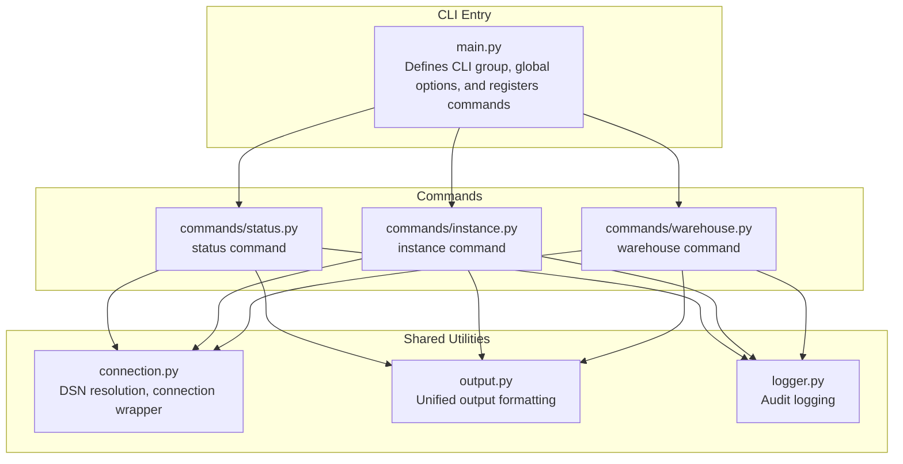
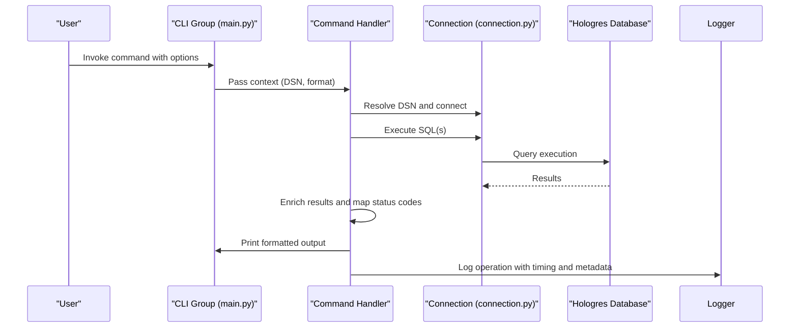
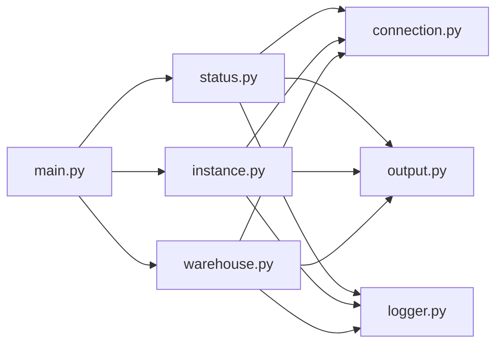

# System and Status Commands

<cite>
**Referenced Files in This Document**
- [main.py](file://hologres-cli/src/hologres_cli/main.py)
- [status.py](file://hologres-cli/src/hologres_cli/commands/status.py)
- [instance.py](file://hologres-cli/src/hologres_cli/commands/instance.py)
- [warehouse.py](file://hologres-cli/src/hologres_cli/commands/warehouse.py)
- [connection.py](file://hologres-cli/src/hologres_cli/connection.py)
- [output.py](file://hologres-cli/src/hologres_cli/output.py)
- [logger.py](file://hologres-cli/src/hologres_cli/logger.py)
- [README.md](file://hologres-cli/README.md)
- [pyproject.toml](file://hologres-cli/pyproject.toml)
- [test_status.py](file://hologres-cli/tests/test_commands/test_status.py)
- [test_instance.py](file://hologres-cli/tests/test_commands/test_instance.py)
- [test_warehouse.py](file://hologres-cli/tests/test_commands/test_warehouse.py)
- [test_status_live.py](file://hologres-cli/tests/integration/test_status_live.py)
- [test_instance_live.py](file://hologres-cli/tests/integration/test_instance_live.py)
- [test_warehouse_live.py](file://hologres-cli/tests/integration/test_warehouse_live.py)
</cite>

## Table of Contents
1. [Introduction](#introduction)
2. [Project Structure](#project-structure)
3. [Core Components](#core-components)
4. [Architecture Overview](#architecture-overview)
5. [Detailed Component Analysis](#detailed-component-analysis)
6. [Dependency Analysis](#dependency-analysis)
7. [Performance Considerations](#performance-considerations)
8. [Troubleshooting Guide](#troubleshooting-guide)
9. [Conclusion](#conclusion)
10. [Appendices](#appendices)

## Introduction
This document explains the system monitoring and administrative commands in the Hologres CLI focused on:
- Status: connection health checks and server information
- Instance: database instance metadata and configuration
- Warehouse: compute group resource management and status

It covers command syntax, output formats, monitoring intervals, audit logging, and operational workflows. It also provides best practices for system administration and troubleshooting.

## Project Structure
The CLI is organized around a Click-based command framework with modular command handlers, shared connection and output utilities, and audit logging.

**Diagram sources**
- [main.py:15-49](file://hologres-cli/src/hologres_cli/main.py#L15-L49)
- [status.py:14-61](file://hologres-cli/src/hologres_cli/commands/status.py#L14-L61)
- [instance.py:14-70](file://hologres-cli/src/hologres_cli/commands/instance.py#L14-L70)
- [warehouse.py:22-105](file://hologres-cli/src/hologres_cli/commands/warehouse.py#L22-L105)
- [connection.py:39-229](file://hologres-cli/src/hologres_cli/connection.py#L39-L229)
- [output.py:16-143](file://hologres-cli/src/hologres_cli/output.py#L16-L143)
- [logger.py:36-105](file://hologres-cli/src/hologres_cli/logger.py#L36-L105)

**Section sources**
- [main.py:15-49](file://hologres-cli/src/hologres_cli/main.py#L15-L49)
- [pyproject.toml:23-25](file://hologres-cli/pyproject.toml#L23-L25)

## Core Components
- Global CLI group with DSN and output format options
- Command modules for status, instance, and warehouse
- Connection management with DSN resolution and safe wrappers
- Unified output formatting across JSON, table, CSV, and JSONL
- Audit logging with sensitive data redaction and rotation

Key behaviors:
- DSN resolution supports CLI flag, environment variable, and config file
- All commands return structured JSON by default with ok/error envelopes
- Audit logs capture operation metadata, timing, and sanitized SQL

**Section sources**
- [main.py:15-49](file://hologres-cli/src/hologres_cli/main.py#L15-L49)
- [connection.py:39-117](file://hologres-cli/src/hologres_cli/connection.py#L39-L117)
- [output.py:16-55](file://hologres-cli/src/hologres_cli/output.py#L16-L55)
- [logger.py:36-74](file://hologres-cli/src/hologres_cli/logger.py#L36-L74)

## Architecture Overview
The CLI composes a global group with per-command modules. Each command resolves a DSN, opens a connection, executes queries, enriches results, and prints formatted output. Audit events are recorded with timing and optional error details.

**Diagram sources**
- [main.py:15-49](file://hologres-cli/src/hologres_cli/main.py#L15-L49)
- [status.py:16-61](file://hologres-cli/src/hologres_cli/commands/status.py#L16-L61)
- [instance.py:33-70](file://hologres-cli/src/hologres_cli/commands/instance.py#L33-L70)
- [warehouse.py:51-105](file://hologres-cli/src/hologres_cli/commands/warehouse.py#L51-L105)
- [connection.py:225-229](file://hologres-cli/src/hologres_cli/connection.py#L225-L229)
- [logger.py:36-74](file://hologres-cli/src/hologres_cli/logger.py#L36-L74)

## Detailed Component Analysis

### Status Command
Purpose:
- Validate connectivity and fetch server metadata (version, database, user, server address/port)
- Report connection latency and log audit events

Syntax:
- hologres status
- Supports global --format option for output

Behavior:
- Resolves DSN from CLI flag, environment, or config file
- Executes version, database, user, and server address/port queries
- On success, returns structured JSON with connection status and metadata
- On failure, returns error envelope with code and message
- Logs operation with duration and masked DSN

Output fields:
- status: "connected"
- version: short version string derived from server version
- database: current database
- user: current user
- server_address: server IP or N/A
- server_port: server port or N/A
- dsn: masked DSN

Monitoring and intervals:
- Single-shot query; no built-in periodic polling
- Use external schedulers to invoke at desired intervals

Operational workflow:
- Configure DSN via CLI flag, environment, or config file
- Run status to confirm connectivity and collect metadata
- Switch output format to table for human-readable inspection

Best practices:
- Prefer environment variables or config file for automation
- Use table format for quick checks
- Monitor duration_ms in audit logs for latency trends

**Section sources**
- [status.py:14-61](file://hologres-cli/src/hologres_cli/commands/status.py#L14-L61)
- [connection.py:39-117](file://hologres-cli/src/hologres_cli/connection.py#L39-L117)
- [output.py:23-28](file://hologres-cli/src/hologres_cli/output.py#L23-L28)
- [logger.py:36-74](file://hologres-cli/src/hologres_cli/logger.py#L36-L74)
- [test_status.py:18-110](file://hologres-cli/tests/test_commands/test_status.py#L18-L110)
- [test_status_live.py:17-49](file://hologres-cli/tests/integration/test_status_live.py#L17-L49)

### Instance Command
Purpose:
- Retrieve instance-level metadata: Hologres version and maximum connections
- Support named instances via environment variables or config file

Syntax:
- hologres instance <instance_name>
- Supports global --format option

Behavior:
- Resolves DSN for the named instance from environment or config file
- Queries server version and maximum connections
- Returns structured JSON with instance name, version, and max connections
- Handles empty results by marking fields as "Unknown"
- Logs operation with instance name and timing

Output fields:
- instance: provided instance name
- hg_version: server version string
- max_connections: maximum allowed connections

Operational workflow:
- Define HOLOGRES_DSN_<instance_name> in environment or ~/.hologres/config.env
- Run instance <name> to fetch metadata
- Use table format for concise display

Best practices:
- Keep instance DSNs centralized in config.env for team environments
- Validate max_connections against workload patterns
- Use audit logs to track instance-specific operations

**Section sources**
- [instance.py:14-70](file://hologres-cli/src/hologres_cli/commands/instance.py#L14-L70)
- [connection.py:89-117](file://hologres-cli/src/hologres_cli/connection.py#L89-L117)
- [output.py:23-28](file://hologres-cli/src/hologres_cli/output.py#L23-L28)
- [logger.py:36-74](file://hologres-cli/src/hologres_cli/logger.py#L36-L74)
- [test_instance.py:43-100](file://hologres-cli/tests/test_commands/test_instance.py#L43-L100)
- [test_instance_live.py:17-39](file://hologres-cli/tests/integration/test_instance_live.py#L17-L39)

### Warehouse Command
Purpose:
- List compute groups (warehouses) and filter by name
- Enrich status codes with human-readable descriptions

Syntax:
- hologres warehouse
- hologres warehouse <warehouse_name>
- Supports global --format option

Behavior:
- Connects using global DSN and queries hologres.hg_warehouses
- Filters by warehouse_name when provided
- Maps numeric status and target_status to descriptive labels
- Returns rows with enriched status fields and counts

Output fields (selected):
- warehouse_id, warehouse_name, cpu, mem
- cluster_min_count, cluster_max_count
- target_status, status, status_desc, target_status_desc
- is_default, config, comment

Operational workflow:
- Run warehouse to list all compute groups
- Filter by name to inspect a specific group
- Use table format for readability

Best practices:
- Use status_desc and target_status_desc for quick diagnostics
- Track is_default to avoid accidental changes to production compute group
- Combine with audit logs to trace changes over time

**Section sources**
- [warehouse.py:22-105](file://hologres-cli/src/hologres_cli/commands/warehouse.py#L22-L105)
- [output.py:31-54](file://hologres-cli/src/hologres_cli/output.py#L31-L54)
- [logger.py:36-74](file://hologres-cli/src/hologres_cli/logger.py#L36-L74)
- [test_warehouse.py:18-161](file://hologres-cli/tests/test_commands/test_warehouse.py#L18-L161)
- [test_warehouse_live.py:17-45](file://hologres-cli/tests/integration/test_warehouse_live.py#L17-L45)

### Output Formatting and Audit Logging
- Output formats: JSON (default), table, CSV, JSONL
- Response envelope: {"ok": true/false, "data": {...} | "error": {"code": "...", "message": "..."}}
- Audit logging: captures timestamp, operation, success, SQL (redacted), DSN (masked), row_count, duration_ms, and extra metadata

**Section sources**
- [output.py:16-143](file://hologres-cli/src/hologres_cli/output.py#L16-L143)
- [logger.py:36-105](file://hologres-cli/src/hologres_cli/logger.py#L36-L105)

## Dependency Analysis
The command modules depend on shared utilities for connection management, output formatting, and logging. The CLI registers commands and exposes a single executable entry point.

**Diagram sources**
- [main.py:42-49](file://hologres-cli/src/hologres_cli/main.py#L42-L49)
- [status.py:9-11](file://hologres-cli/src/hologres_cli/commands/status.py#L9-L11)
- [instance.py:9-11](file://hologres-cli/src/hologres_cli/commands/instance.py#L9-L11)
- [warehouse.py:10-19](file://hologres-cli/src/hologres_cli/commands/warehouse.py#L10-L19)

**Section sources**
- [main.py:42-49](file://hologres-cli/src/hologres_cli/main.py#L42-L49)
- [pyproject.toml:23-25](file://hologres-cli/pyproject.toml#L23-L25)

## Performance Considerations
- Connection reuse: The connection wrapper lazily creates and reuses a single connection per command invocation
- Query overhead: Each command executes a small number of lightweight queries; latency is dominated by network RTT
- Output formatting: Table and CSV rendering are efficient for moderate row counts
- Audit logging: JSONL append mode with automatic rotation prevents unbounded growth

Recommendations:
- For repeated checks, cache DSN resolution and avoid unnecessary reconnections
- Use table format for interactive checks; JSON for machine parsing
- Monitor duration_ms in audit logs to detect regressions

[No sources needed since this section provides general guidance]

## Troubleshooting Guide
Common issues and resolutions:
- Connection failures
  - Verify DSN via CLI flag, environment variable, or config file
  - Check network reachability and credentials
  - Review CONNECTION_ERROR messages and masked DSN in logs
- Query errors
  - Inspect QUERY_ERROR messages and SQL redaction in logs
  - Confirm required privileges and table existence
- Status command server address retrieval
  - Some environments may restrict server address/port queries; fallback returns N/A
- Warehouse table availability
  - Ensure the hologres.hg_warehouses table exists and is queryable

Operational tips:
- Use table format for quick visual checks
- Leverage audit logs to correlate timing and errors
- For instance commands, confirm HOLOGRES_DSN_<name> is present in environment or config file

**Section sources**
- [status.py:35-40](file://hologres-cli/src/hologres_cli/commands/status.py#L35-L40)
- [warehouse.py:62-67](file://hologres-cli/src/hologres_cli/commands/warehouse.py#L62-L67)
- [logger.py:36-74](file://hologres-cli/src/hologres_cli/logger.py#L36-L74)
- [test_status.py:61-77](file://hologres-cli/tests/test_commands/test_status.py#L61-L77)
- [test_warehouse.py:112-121](file://hologres-cli/tests/test_commands/test_warehouse.py#L112-L121)

## Conclusion
The Hologres CLI provides robust, structured monitoring and administrative capabilities:
- Status delivers fast connectivity verification and server metadata
- Instance surfaces critical configuration like version and max connections
- Warehouse offers visibility into compute group resources and lifecycle states

With unified output formats, audit logging, and safe defaults, these commands support both day-to-day operations and automated systems.

[No sources needed since this section summarizes without analyzing specific files]

## Appendices

### Command Reference and Examples
- Status
  - hologres status
  - Output: connection status, version, database, user, server address/port, masked DSN
- Instance
  - hologres instance <instance_name>
  - Output: instance name, hg_version, max_connections
- Warehouse
  - hologres warehouse
  - hologres warehouse <warehouse_name>
  - Output: compute group rows with status_desc and target_status_desc

Formatting:
- Use --format json|table|csv|jsonl globally

Audit logging location:
- ~/.hologres/sql-history.jsonl

**Section sources**
- [README.md:110-132](file://hologres-cli/README.md#L110-L132)
- [main.py:15-39](file://hologres-cli/src/hologres_cli/main.py#L15-L39)
- [logger.py:11-13](file://hologres-cli/src/hologres_cli/logger.py#L11-L13)

### Operational Workflows and Best Practices
- Health monitoring
  - Schedule status checks at regular intervals; record duration_ms from audit logs
- Capacity planning
  - Use instance max_connections alongside warehouse cpu/mem to assess headroom
- Change control
  - Treat is_default compute groups carefully; track changes via audit logs
- Automation
  - Export table formats for dashboards; parse JSON for scripts

[No sources needed since this section provides general guidance]