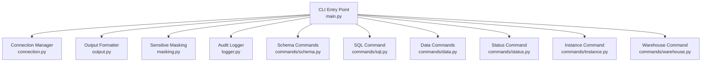
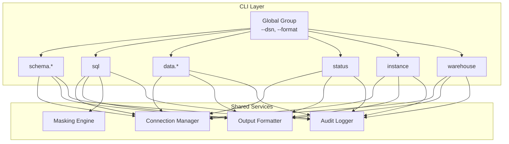
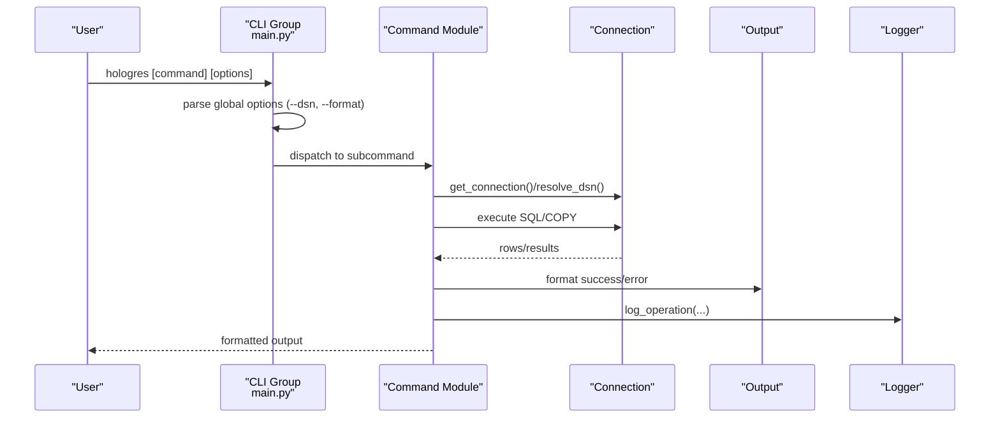
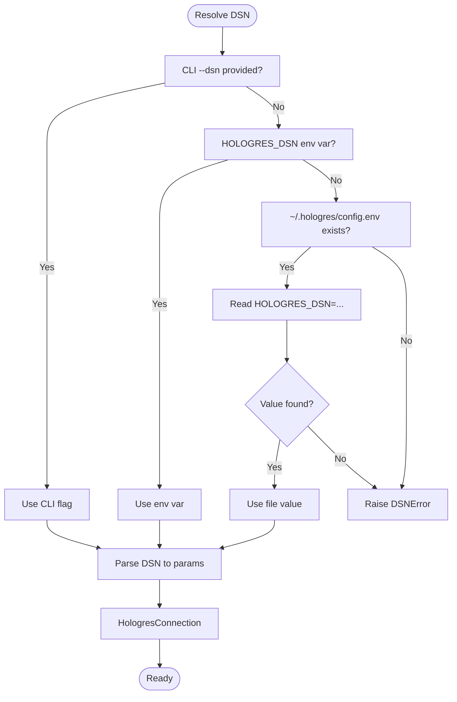
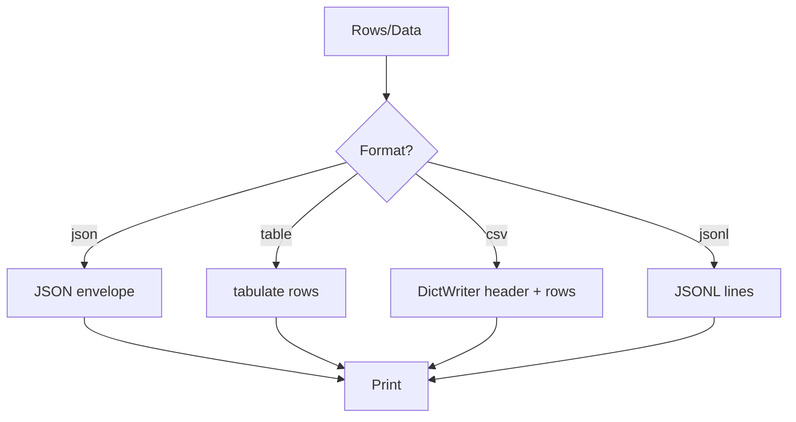
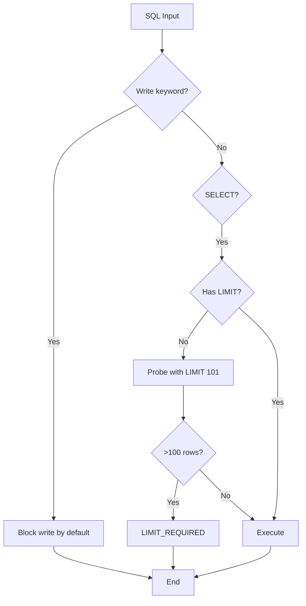
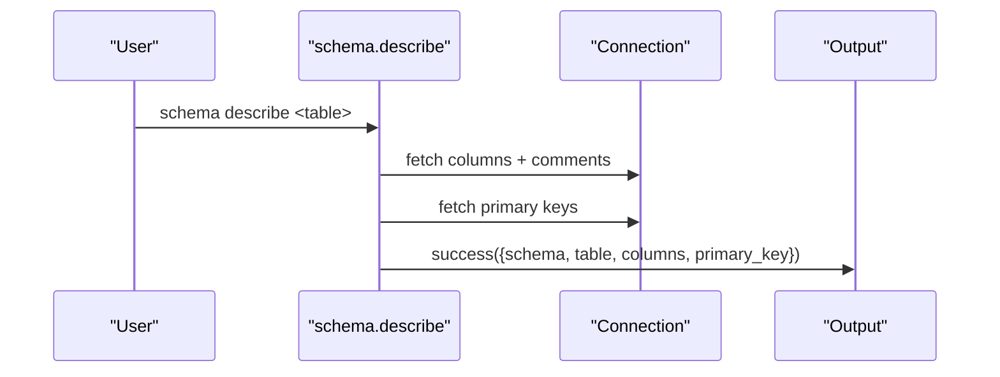
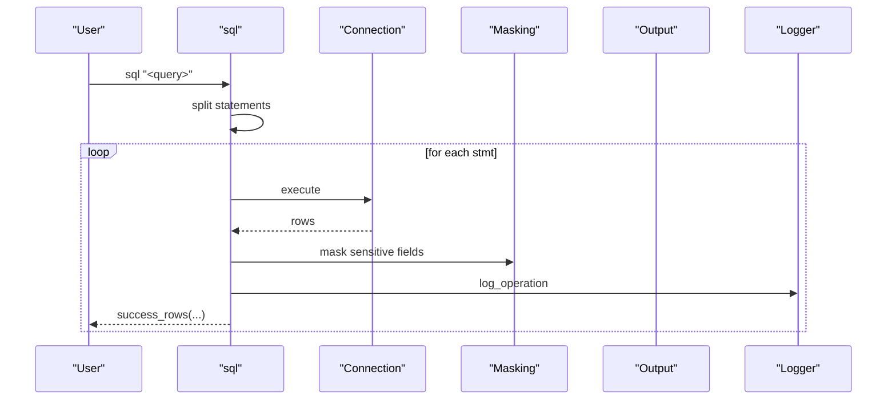
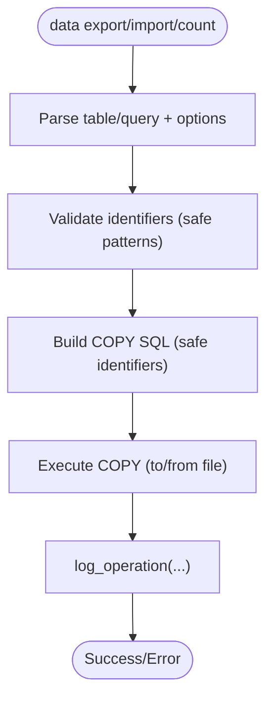
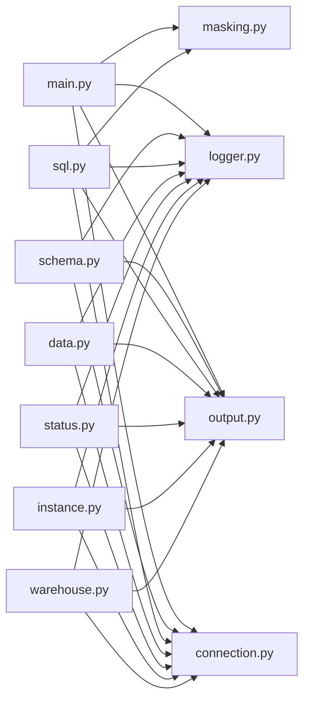

# Hologres CLI Tool

<cite>
**Referenced Files in This Document**
- [main.py](file://hologres-cli/src/hologres_cli/main.py)
- [connection.py](file://hologres-cli/src/hologres_cli/connection.py)
- [output.py](file://hologres-cli/src/hologres_cli/output.py)
- [masking.py](file://hologres-cli/src/hologres_cli/masking.py)
- [logger.py](file://hologres-cli/src/hologres_cli/logger.py)
- [schema.py](file://hologres-cli/src/hologres_cli/commands/schema.py)
- [sql.py](file://hologres-cli/src/hologres_cli/commands/sql.py)
- [data.py](file://hologres-cli/src/hologres_cli/commands/data.py)
- [status.py](file://hologres-cli/src/hologres_cli/commands/status.py)
- [instance.py](file://hologres-cli/src/hologres_cli/commands/instance.py)
- [warehouse.py](file://hologres-cli/src/hologres_cli/commands/warehouse.py)
- [README.md](file://hologres-cli/README.md)
- [SKILL.md](file://agent-skills/skills/hologres-cli/SKILL.md)
- [commands.md](file://agent-skills/skills/hologres-cli/references/commands.md)
- [safety-features.md](file://agent-skills/skills/hologres-cli/references/safety-features.md)
</cite>

## Table of Contents
1. [Introduction](#introduction)
2. [Project Structure](#project-structure)
3. [Core Components](#core-components)
4. [Architecture Overview](#architecture-overview)
5. [Detailed Component Analysis](#detailed-component-analysis)
6. [Dependency Analysis](#dependency-analysis)
7. [Performance Considerations](#performance-considerations)
8. [Troubleshooting Guide](#troubleshooting-guide)
9. [Conclusion](#conclusion)
10. [Appendices](#appendices)

## Introduction
The Hologres CLI is an AI-agent-friendly command-line interface designed for interacting with Hologres databases. It emphasizes safety through guardrails, structured JSON output for automation, and robust connection management. The CLI supports schema inspection, SQL execution (with strict read-only defaults), data import/export, instance information, and warehouse management. It also provides sensitive data masking, audit logging, and flexible output formatting.

## Project Structure
The CLI is organized around a central entry point that registers command groups and subcommands, each backed by dedicated modules for connection management, output formatting, masking, and logging.

**Diagram sources**
- [main.py:15-49](file://hologres-cli/src/hologres_cli/main.py#L15-L49)
- [connection.py:178-229](file://hologres-cli/src/hologres_cli/connection.py#L178-L229)
- [output.py:16-21](file://hologres-cli/src/hologres_cli/output.py#L16-L21)
- [masking.py:1-93](file://hologres-cli/src/hologres_cli/masking.py#L1-L93)
- [logger.py:1-105](file://hologres-cli/src/hologres_cli/logger.py#L1-L105)
- [schema.py:36-301](file://hologres-cli/src/hologres_cli/commands/schema.py#L36-L301)
- [sql.py:34-199](file://hologres-cli/src/hologres_cli/commands/sql.py#L34-L199)
- [data.py:44-266](file://hologres-cli/src/hologres_cli/commands/data.py#L44-L266)
- [status.py:14-62](file://hologres-cli/src/hologres_cli/commands/status.py#L14-L62)
- [instance.py:14-71](file://hologres-cli/src/hologres_cli/commands/instance.py#L14-L71)
- [warehouse.py:22-106](file://hologres-cli/src/hologres_cli/commands/warehouse.py#L22-L106)

**Section sources**
- [main.py:15-49](file://hologres-cli/src/hologres_cli/main.py#L15-L49)
- [README.md:108-184](file://hologres-cli/README.md#L108-L184)

## Core Components
- CLI entry point and global options: Initializes Click group, registers commands, exposes DSN and format options, and handles exceptions.
- Connection manager: Resolves DSN from CLI flag, environment variable, or config file; parses DSN into connection parameters; provides a connection wrapper with cursors and execution helpers.
- Output formatter: Provides unified JSON success/error responses and multiple output formats (JSON, table, CSV, JSONL).
- Sensitive data masking: Masks fields by column name patterns (phone, email, password, ID card, bank card).
- Audit logger: Logs operations to a rotating JSONL file with redacted SQL and metadata.
- Command modules: Implement schema inspection, SQL execution with guardrails, data import/export, status checks, instance info, and warehouse queries.

**Section sources**
- [main.py:15-111](file://hologres-cli/src/hologres_cli/main.py#L15-L111)
- [connection.py:39-229](file://hologres-cli/src/hologres_cli/connection.py#L39-L229)
- [output.py:16-143](file://hologres-cli/src/hologres_cli/output.py#L16-L143)
- [masking.py:8-93](file://hologres-cli/src/hologres_cli/masking.py#L8-L93)
- [logger.py:25-105](file://hologres-cli/src/hologres_cli/logger.py#L25-L105)

## Architecture Overview
The CLI follows a modular architecture:
- Central CLI group defines global options and subcommand registration.
- Each command module encapsulates its own logic, leveraging shared connection, output, masking, and logging utilities.
- Safety features are enforced at the command level (SQL guardrails) and globally (DSN resolution, masking, logging).

**Diagram sources**
- [main.py:15-49](file://hologres-cli/src/hologres_cli/main.py#L15-L49)
- [connection.py:178-229](file://hologres-cli/src/hologres_cli/connection.py#L178-L229)
- [output.py:23-63](file://hologres-cli/src/hologres_cli/output.py#L23-L63)
- [masking.py:73-93](file://hologres-cli/src/hologres_cli/masking.py#L73-L93)
- [logger.py:36-74](file://hologres-cli/src/hologres_cli/logger.py#L36-L74)

## Detailed Component Analysis

### CLI Entry Point and Commands
- Global options:
  - --dsn: Accepts a Hologres DSN; supports hologres://, postgresql://, or postgres:// schemes.
  - --format/-f: Output format selector among json, table, csv, jsonl.
  - Version option included.
- Subcommands registered:
  - schema (tables, describe, dump, size)
  - sql
  - data (export, import, count)
  - status
  - instance
  - warehouse
- Special commands:
  - ai-guide: Generates an AI agent guide tailored to the CLI.
  - history: Reads recent logs from the audit log file.

**Diagram sources**
- [main.py:15-49](file://hologres-cli/src/hologres_cli/main.py#L15-L49)
- [connection.py:225-229](file://hologres-cli/src/hologres_cli/connection.py#L225-L229)
- [output.py:23-63](file://hologres-cli/src/hologres_cli/output.py#L23-L63)
- [logger.py:36-74](file://hologres-cli/src/hologres_cli/logger.py#L36-L74)

**Section sources**
- [main.py:15-111](file://hologres-cli/src/hologres_cli/main.py#L15-L111)
- [SKILL.md:52-68](file://agent-skills/skills/hologres-cli/SKILL.md#L52-L68)

### Connection Management
- DSN resolution priority:
  1) CLI --dsn flag
  2) HOLOGRES_DSN environment variable
  3) ~/.hologres/config.env file
- Named instance resolution:
  - Supports HOLOGRES_DSN_<instance_name> via environment or config file.
- DSN parsing:
  - Normalizes hologres:// to postgresql://
  - Extracts host, port, dbname, user, password
  - Applies keepalives defaults and optional query parameters
- Connection wrapper:
  - psycopg3 connection with autocommit option
  - Cursor with dict row factory
  - Convenience methods: execute, execute_many, context manager support

**Diagram sources**
- [connection.py:39-117](file://hologres-cli/src/hologres_cli/connection.py#L39-L117)
- [connection.py:120-170](file://hologres-cli/src/hologres_cli/connection.py#L120-L170)
- [connection.py:178-229](file://hologres-cli/src/hologres_cli/connection.py#L178-L229)

**Section sources**
- [connection.py:39-117](file://hologres-cli/src/hologres_cli/connection.py#L39-L117)
- [connection.py:120-170](file://hologres-cli/src/hologres_cli/connection.py#L120-L170)
- [connection.py:178-229](file://hologres-cli/src/hologres_cli/connection.py#L178-L229)

### Output Formatting System
- Unified response envelopes:
  - Success: {"ok": true, "data": ...}
  - Error: {"ok": false, "error": {"code": "...", "message": "..."}}
- Supported formats:
  - JSON (default): Structured JSON with envelope
  - Table: Human-readable table via tabulate
  - CSV: Comma-separated values with header
  - JSONL: One JSON object per line
- Helpers:
  - success(), success_rows(), error()
  - print_output()

**Diagram sources**
- [output.py:23-118](file://hologres-cli/src/hologres_cli/output.py#L23-L118)

**Section sources**
- [output.py:16-143](file://hologres-cli/src/hologres_cli/output.py#L16-L143)

### Safety Features
- Row limit protection:
  - SELECT without LIMIT that returns >100 rows triggers LIMIT_REQUIRED error.
  - Probe with LIMIT 101 to detect large result sets; user can override with --no-limit-check.
- Write protection:
  - Blocks INSERT, UPDATE, DELETE, DROP, CREATE, ALTER, TRUNCATE, GRANT, REVOKE by default.
- Dangerous write blocking:
  - DELETE/UPDATE without WHERE clause are blocked; require WHERE clause.
- Sensitive data masking:
  - Masks by column name patterns (phone, email, password, ID card, bank card).
  - Can be disabled with --no-mask.
- Audit logging:
  - Logs all operations to ~/.hologres/sql-history.jsonl with redacted SQL and metadata.

**Diagram sources**
- [sql.py:66-135](file://hologres-cli/src/hologres_cli/commands/sql.py#L66-L135)
- [output.py:133-142](file://hologres-cli/src/hologres_cli/output.py#L133-L142)

**Section sources**
- [sql.py:25-31](file://hologres-cli/src/hologres_cli/commands/sql.py#L25-L31)
- [sql.py:66-135](file://hologres-cli/src/hologres_cli/commands/sql.py#L66-L135)
- [masking.py:8-93](file://hologres-cli/src/hologres_cli/masking.py#L8-L93)
- [logger.py:36-74](file://hologres-cli/src/hologres_cli/logger.py#L36-L74)

### Schema Management Commands
- schema tables:
  - Lists tables excluding internal schemas.
  - Optional --schema filter.
- schema describe:
  - Describes table structure (columns, types, nullability, defaults, comments).
  - Supports schema.table notation.
- schema dump:
  - Exports DDL via hg_dump_script() for a given table.
  - Validates identifiers safely.
- schema size:
  - Returns pretty-printed and byte size of a table.
  - Validates identifiers safely.

**Diagram sources**
- [schema.py:83-153](file://hologres-cli/src/hologres_cli/commands/schema.py#L83-L153)

**Section sources**
- [schema.py:42-81](file://hologres-cli/src/hologres_cli/commands/schema.py#L42-L81)
- [schema.py:83-153](file://hologres-cli/src/hologres_cli/commands/schema.py#L83-L153)
- [schema.py:155-221](file://hologres-cli/src/hologres_cli/commands/schema.py#L155-L221)
- [schema.py:223-301](file://hologres-cli/src/hologres_cli/commands/schema.py#L223-L301)

### SQL Execution Command
- Default behavior:
  - Read-only enforcement; write operations blocked.
  - Automatic row limit probing for SELECT without LIMIT.
  - Field truncation for large values; optional masking.
- Options:
  - --with-schema: Include inferred schema metadata in results.
  - --no-limit-check: Disable row limit probing.
  - --no-mask: Disable sensitive data masking.
- Multi-statement support:
  - Splits statements by semicolon, executes each individually.

**Diagram sources**
- [sql.py:34-64](file://hologres-cli/src/hologres_cli/commands/sql.py#L34-L64)
- [sql.py:66-135](file://hologres-cli/src/hologres_cli/commands/sql.py#L66-L135)
- [masking.py:73-93](file://hologres-cli/src/hologres_cli/masking.py#L73-L93)
- [logger.py:36-74](file://hologres-cli/src/hologres_cli/logger.py#L36-L74)

**Section sources**
- [sql.py:34-199](file://hologres-cli/src/hologres_cli/commands/sql.py#L34-L199)

### Data Import/Export Commands
- data export:
  - Exports table or custom SELECT query to CSV via COPY TO STDOUT.
  - Supports custom delimiter and header.
- data import:
  - Imports CSV to table via COPY FROM STDIN.
  - Optional --truncate to clear table before import.
  - Builds safe identifiers for table/columns.
- data count:
  - Counts rows with optional WHERE clause.
  - Uses safe identifier building.

**Diagram sources**
- [data.py:50-123](file://hologres-cli/src/hologres_cli/commands/data.py#L50-L123)
- [data.py:125-214](file://hologres-cli/src/hologres_cli/commands/data.py#L125-L214)
- [data.py:216-266](file://hologres-cli/src/hologres_cli/commands/data.py#L216-L266)

**Section sources**
- [data.py:50-123](file://hologres-cli/src/hologres_cli/commands/data.py#L50-L123)
- [data.py:125-214](file://hologres-cli/src/hologres_cli/commands/data.py#L125-L214)
- [data.py:216-266](file://hologres-cli/src/hologres_cli/commands/data.py#L216-L266)

### Status Command
- Retrieves Hologres version, current database, current user, and server address/port.
- Logs status operation with timing.

**Section sources**
- [status.py:14-62](file://hologres-cli/src/hologres_cli/commands/status.py#L14-L62)

### Instance Information Command
- Resolves a named instance DSN from environment or config file.
- Queries Hologres version and max connections for the instance.
- Logs instance operation with metadata.

**Section sources**
- [instance.py:14-71](file://hologres-cli/src/hologres_cli/commands/instance.py#L14-L71)

### Warehouse Management Command
- Lists all compute warehouses or filters by warehouse name.
- Enriches status and target status with human-readable descriptions.
- Logs warehouse operation with optional metadata.

**Section sources**
- [warehouse.py:22-106](file://hologres-cli/src/hologres_cli/commands/warehouse.py#L22-L106)

## Dependency Analysis
- Cohesion:
  - Each command module encapsulates related logic and depends on shared services.
- Coupling:
  - Commands depend on connection.py, output.py, masking.py, and logger.py.
  - Low coupling to external libraries via centralized wrappers.
- External dependencies:
  - psycopg3 for PostgreSQL-compatible connectivity
  - tabulate for table formatting
  - Click for CLI framework

**Diagram sources**
- [main.py:42-49](file://hologres-cli/src/hologres_cli/main.py#L42-L49)
- [connection.py:178-229](file://hologres-cli/src/hologres_cli/connection.py#L178-L229)
- [output.py:23-63](file://hologres-cli/src/hologres_cli/output.py#L23-L63)
- [masking.py:73-93](file://hologres-cli/src/hologres_cli/masking.py#L73-L93)
- [logger.py:36-74](file://hologres-cli/src/hologres_cli/logger.py#L36-L74)

**Section sources**
- [main.py:42-49](file://hologres-cli/src/hologres_cli/main.py#L42-L49)

## Performance Considerations
- Row limit probing:
  - Uses a small probe (LIMIT 101) to avoid transferring large datasets unnecessarily.
- COPY protocol:
  - Data export/import leverages binary streaming via COPY, minimizing memory overhead.
- Keepalives:
  - Default keepalive settings improve long-running connection stability.
- Output formatting:
  - JSONL and CSV are streamed; table formatting loads all rows into memory for rendering.

[No sources needed since this section provides general guidance]

## Troubleshooting Guide
- Connection errors:
  - Ensure DSN is provided via --dsn, HOLOGRES_DSN, or ~/.hologres/config.env.
  - Verify host, port, and database name in DSN.
- SQL execution errors:
  - For SELECT without LIMIT and >100 rows, add LIMIT or use --no-limit-check.
  - Write operations require appropriate flags or are blocked by design.
- Audit logs:
  - Review ~/.hologres/sql-history.jsonl for operation history and redacted SQL.
- Output formats:
  - Switch --format to table/csv/jsonl for different presentation needs.

**Section sources**
- [connection.py:39-64](file://hologres-cli/src/hologres_cli/connection.py#L39-L64)
- [output.py:133-142](file://hologres-cli/src/hologres_cli/output.py#L133-L142)
- [logger.py:89-105](file://hologres-cli/src/hologres_cli/logger.py#L89-L105)

## Conclusion
The Hologres CLI provides a robust, AI-agent-friendly interface with strong safety guardrails, structured JSON output, and comprehensive operational commands. Its modular design enables reliable schema inspection, controlled SQL execution, efficient data import/export, and insightful instance/warehouse management. The combination of DSN resolution, masking, and audit logging makes it suitable for both interactive use and automated workflows.

[No sources needed since this section summarizes without analyzing specific files]

## Appendices

### Command Reference and Usage
- Global options:
  - --dsn: Hologres DSN
  - -f/--format: json|table|csv|jsonl
  - --no-mask: Disable sensitive data masking
  - --no-limit-check: Disable row limit probing
- Commands:
  - status: Check connection and server info
  - instance <name>: Query instance version and max connections
  - warehouse [<name>]: List or query compute warehouses
  - schema tables [--schema]: List tables
  - schema describe <table>: Describe table structure
  - schema dump <schema.table>: Export DDL
  - schema size <schema.table>: Table size info
  - sql "<query>": Execute read-only SQL with guardrails
  - data export <table> -f <file> [--query] [-d]: Export CSV
  - data import <table> -f <file> [--delimiter] [--truncate]: Import CSV
  - data count <table> [--where]: Count rows
  - history [-n]: Show recent command history
  - ai-guide: Generate AI agent guide

**Section sources**
- [README.md:108-184](file://hologres-cli/README.md#L108-L184)
- [commands.md:5-220](file://agent-skills/skills/hologres-cli/references/commands.md#L5-L220)

### Safety Features Summary
- Row limit protection: SELECT without LIMIT returning >100 rows fails with LIMIT_REQUIRED.
- Write protection: INSERT/UPDATE/DELETE/DROP/CREATE/ALTER/TRUNCATE/GRANT/REVOKE blocked by default.
- Dangerous write blocking: DELETE/UPDATE without WHERE clause blocked.
- Sensitive data masking: Auto-masks by column name patterns; can be disabled.
- Audit logging: Logs to ~/.hologres/sql-history.jsonl with redacted SQL.

**Section sources**
- [safety-features.md:5-145](file://agent-skills/skills/hologres-cli/references/safety-features.md#L5-L145)

### Integration Patterns for AI Agents
- Use JSON output (-f json) for machine parsing.
- Employ ai-guide to generate tailored guidance for the current environment.
- Use history to track and replay operations.
- Prefer data export/import for large-scale data movement; leverage COPY protocol under the hood.

**Section sources**
- [main.py:52-83](file://hologres-cli/src/hologres_cli/main.py#L52-L83)
- [main.py:86-96](file://hologres-cli/src/hologres_cli/main.py#L86-L96)
- [README.md:193-199](file://hologres-cli/README.md#L193-L199)