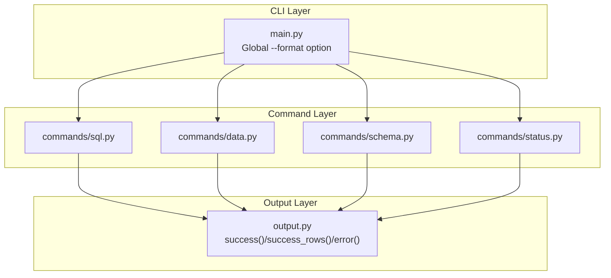
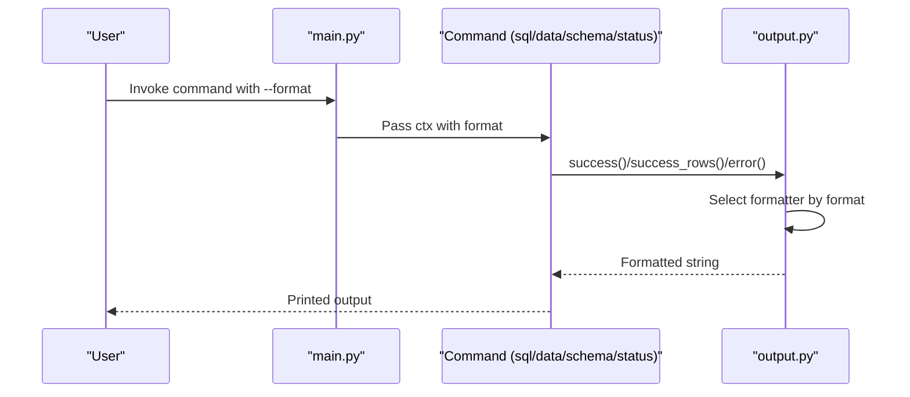
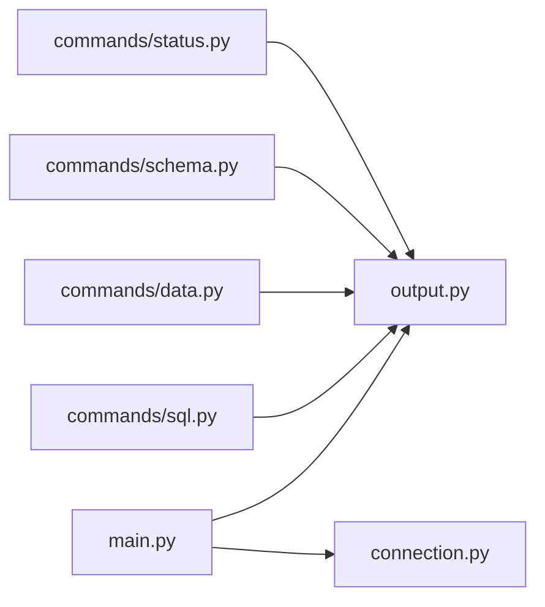

# Output Formatting and Response Structure

<cite>
**Referenced Files in This Document**
- [output.py](file://hologres-cli/src/hologres_cli/output.py)
- [main.py](file://hologres-cli/src/hologres_cli/main.py)
- [sql.py](file://hologres-cli/src/hologres_cli/commands/sql.py)
- [data.py](file://hologres-cli/src/hologres_cli/commands/data.py)
- [schema.py](file://hologres-cli/src/hologres_cli/commands/schema.py)
- [status.py](file://hologres-cli/src/hologres_cli/commands/status.py)
- [connection.py](file://hologres-cli/src/hologres_cli/connection.py)
- [test_output.py](file://hologres-cli/tests/test_output.py)
- [test_output_format_live.py](file://hologres-cli/tests/integration/test_output_format_live.py)
- [README.md](file://hologres-cli/README.md)
- [pyproject.toml](file://hologres-cli/pyproject.toml)
</cite>

## Table of Contents
1. [Introduction](#introduction)
2. [Project Structure](#project-structure)
3. [Core Components](#core-components)
4. [Architecture Overview](#architecture-overview)
5. [Detailed Component Analysis](#detailed-component-analysis)
6. [Dependency Analysis](#dependency-analysis)
7. [Performance Considerations](#performance-considerations)
8. [Troubleshooting Guide](#troubleshooting-guide)
9. [Conclusion](#conclusion)
10. [Appendices](#appendices)

## Introduction
This document explains the Hologres CLI output formatting system and standardized response structure. It covers:
- The unified response envelope with success/error indicators and data containers
- Supported output formats: JSON (default), table, CSV, and JSONL
- Format selection via the --format flag and environment configuration
- Machine-readable response structures suitable for AI agent integration
- Examples of formatted outputs for different command types
- Extension patterns for adding custom output formats
- Response schema validation and error handling in structured formats

## Project Structure
The output formatting system is implemented in a dedicated module and consumed by all CLI commands. The main CLI registers a global format option and passes it down to commands. Commands use the output module to produce consistent, structured responses.

**Diagram sources**
- [main.py:15-50](file://hologres-cli/src/hologres_cli/main.py#L15-L50)
- [sql.py:34-64](file://hologres-cli/src/hologres_cli/commands/sql.py#L34-L64)
- [data.py:44-47](file://hologres-cli/src/hologres_cli/commands/data.py#L44-L47)
- [schema.py:36-39](file://hologres-cli/src/hologres_cli/commands/schema.py#L36-L39)
- [status.py:14-16](file://hologres-cli/src/hologres_cli/commands/status.py#L14-L16)
- [output.py:23-63](file://hologres-cli/src/hologres_cli/output.py#L23-L63)

**Section sources**
- [main.py:15-50](file://hologres-cli/src/hologres_cli/main.py#L15-L50)
- [output.py:16-20](file://hologres-cli/src/hologres_cli/output.py#L16-L20)

## Core Components
- Unified output module: Provides functions to format success responses, success rows, and errors. Supports JSON, table, CSV, and JSONL.
- Global format option: Registered at the CLI level so all commands inherit the selected format.
- Command integration: Commands call success(), success_rows(), or error() to emit consistent responses.

Key behaviors:
- Success responses wrap data in a standardized envelope with ok: true and a data container.
- Error responses wrap error details in a standardized envelope with ok: false.
- Row-based commands use success_rows() to include rows and count; non-row commands use success() with a custom data payload.
- Specialized helpers provide consistent error messages for common failure modes.

**Section sources**
- [output.py:23-63](file://hologres-cli/src/hologres_cli/output.py#L23-L63)
- [main.py:15-40](file://hologres-cli/src/hologres_cli/main.py#L15-L40)

## Architecture Overview
The CLI defines a global --format option. Commands receive this format and delegate output formatting to the output module. The output module selects the appropriate formatter based on the chosen format.

**Diagram sources**
- [main.py:15-40](file://hologres-cli/src/hologres_cli/main.py#L15-L40)
- [sql.py:66-124](file://hologres-cli/src/hologres_cli/commands/sql.py#L66-L124)
- [output.py:66-88](file://hologres-cli/src/hologres_cli/output.py#L66-L88)

## Detailed Component Analysis

### Standardized Response Envelope
All commands use a consistent response envelope:
- Success: { ok: true, data: <payload>, message?: <optional> }
- Error: { ok: false, error: { code: <string>, message: <string>, details?: <object> } }

Row-based responses include rows and count in the data container. Non-row responses include a custom data payload.

Validation and behavior:
- JSON format always returns a valid JSON object.
- Table and CSV formats return human-readable strings for row data; non-row data is converted to a string.
- JSONL format emits one JSON object per line for row data; non-row data is serialized to a single JSON line.

**Section sources**
- [output.py:23-63](file://hologres-cli/src/hologres_cli/output.py#L23-L63)
- [sql.py:116-124](file://hologres-cli/src/hologres_cli/commands/sql.py#L116-L124)
- [data.py:109-110](file://hologres-cli/src/hologres_cli/commands/data.py#L109-L110)
- [schema.py:142-145](file://hologres-cli/src/hologres_cli/commands/schema.py#L142-L145)

### Supported Output Formats
- JSON (default): Structured JSON with the standardized envelope.
- Table: Human-readable ASCII table for row data; scalar values are printed as-is.
- CSV: Comma-separated values with header row; supports custom columns.
- JSONL: One JSON object per line for row data; preserves Unicode and large fields.

Format selection:
- CLI-level: --format/-f flag accepts one of the four formats.
- Environment configuration: Not directly used for format; DSN configuration supports environment variables and config files.

**Section sources**
- [output.py:16-20](file://hologres-cli/src/hologres_cli/output.py#L16-L20)
- [main.py:17](file://hologres-cli/src/hologres_cli/main.py#L17)
- [README.md:200-233](file://hologres-cli/README.md#L200-L233)

### Format Selection and Environment Configuration
- Global format option: Registered at the CLI group level and passed to all commands via ctx.obj.
- DSN configuration: Separate from format selection; supports CLI flag, environment variable, and config file.
- Commands read ctx.obj["format"] to decide how to format their output.

**Section sources**
- [main.py:15-40](file://hologres-cli/src/hologres_cli/main.py#L15-L40)
- [connection.py:39-64](file://hologres-cli/src/hologres_cli/connection.py#L39-L64)

### Machine-Readable Response Structures for AI Agents
- JSON format is ideal for AI agents due to its structured nature and consistent envelope.
- JSONL format is suitable for streaming row data and batch processing.
- Table and CSV formats are primarily for human readability; JSON remains the canonical machine-readable format.

Examples of envelopes:
- Success: { ok: true, data: { rows: [...], count: N }, message?: "..." }
- Error: { ok: false, error: { code: "...", message: "...", details?: {...} } }

**Section sources**
- [output.py:23-63](file://hologres-cli/src/hologres_cli/output.py#L23-L63)
- [README.md:211-233](file://hologres-cli/README.md#L211-L233)

### Examples of Formatted Outputs by Command Type
- SQL queries (row-based): success_rows(rows, format) produces either a table/CSV/JSONL string or a JSON envelope with rows/count.
- Data export/import: success() returns a JSON envelope with metadata such as source/file/rows/duration_ms.
- Schema describe: success() returns a JSON envelope with schema/table/columns/primary_key; non-JSON formats render column details as rows.
- Status: success() returns a JSON envelope with connection and server info.

Integration tests demonstrate CSV and JSONL behavior across commands.

**Section sources**
- [sql.py:116-124](file://hologres-cli/src/hologres_cli/commands/sql.py#L116-L124)
- [data.py:109-110](file://hologres-cli/src/hologres_cli/commands/data.py#L109-L110)
- [schema.py:142-145](file://hologres-cli/src/hologres_cli/commands/schema.py#L142-L145)
- [status.py:45-54](file://hologres-cli/src/hologres_cli/commands/status.py#L45-L54)
- [test_output_format_live.py:17-42](file://hologres-cli/tests/integration/test_output_format_live.py#L17-L42)

### Custom Output Format Development and Extension Patterns
To add a new output format:
- Define a new constant and extend VALID_FORMATS.
- Implement a new formatter function (e.g., _format_xyz()) in the output module.
- Update _format_output() to route the new format to your formatter.
- Optionally update success_rows() to support the new format for row data.
- Ensure error responses remain JSON for consistency.

This pattern maintains backward compatibility and keeps the envelope consistent.

**Section sources**
- [output.py:16-20](file://hologres-cli/src/hologres_cli/output.py#L16-L20)
- [output.py:66-88](file://hologres-cli/src/hologres_cli/output.py#L66-L88)
- [output.py:31-54](file://hologres-cli/src/hologres_cli/output.py#L31-L54)

### Response Schema Validation and Error Handling
- All errors are emitted as JSON with ok: false and a structured error object containing code, message, and optional details.
- Specialized helpers provide consistent error messages for common failures (e.g., connection errors, query errors, limit required, write guard).
- success_rows() adds total_count and message when provided, enabling richer metadata in JSON mode.

Validation behavior:
- JSON format always returns valid JSON.
- Table/CSV/JSONL formats handle row data gracefully; non-row data is converted to a string or serialized appropriately.

**Section sources**
- [output.py:57-63](file://hologres-cli/src/hologres_cli/output.py#L57-L63)
- [output.py:125-142](file://hologres-cli/src/hologres_cli/output.py#L125-L142)
- [sql.py:98-101](file://hologres-cli/src/hologres_cli/commands/sql.py#L98-L101)
- [data.py:115-120](file://hologres-cli/src/hologres_cli/commands/data.py#L115-L120)

## Dependency Analysis
The output module is a central dependency for all commands. The CLI registers the global format option and passes it to commands. The connection module provides DSN resolution, independent of output formatting.

**Diagram sources**
- [main.py:15-50](file://hologres-cli/src/hologres_cli/main.py#L15-L50)
- [output.py:16-20](file://hologres-cli/src/hologres_cli/output.py#L16-L20)
- [connection.py:225-228](file://hologres-cli/src/hologres_cli/connection.py#L225-L228)

**Section sources**
- [pyproject.toml:6-10](file://hologres-cli/pyproject.toml#L6-L10)

## Performance Considerations
- JSONL is efficient for streaming large datasets without buffering entire results.
- Table and CSV formatters rely on external libraries; they are optimized for readability and correctness rather than speed.
- success_rows() avoids unnecessary conversions by delegating to specialized formatters for each format.
- Large field truncation is applied for safety and readability in SQL responses.

[No sources needed since this section provides general guidance]

## Troubleshooting Guide
Common issues and resolutions:
- Invalid format: Ensure --format is one of json, table, csv, jsonl.
- JSON parsing errors: Verify that the output is treated as JSON when using JSON or JSONL.
- Row limit errors: Add LIMIT clauses or use --no-limit-check for controlled scenarios.
- Write operations blocked: Use --write flag for allowed write operations (if applicable) or refactor to read-only queries.
- Connection errors: Confirm DSN configuration via CLI flag, environment variable, or config file.

**Section sources**
- [output.py:125-142](file://hologres-cli/src/hologres_cli/output.py#L125-L142)
- [sql.py:91-101](file://hologres-cli/src/hologres_cli/commands/sql.py#L91-L101)
- [connection.py:39-64](file://hologres-cli/src/hologres_cli/connection.py#L39-L64)

## Conclusion
The Hologres CLI provides a robust, AI-agent-friendly output system with a standardized response envelope and multiple output formats. JSON is the default and canonical machine-readable format, while table, CSV, and JSONL offer human-friendly alternatives. The system’s design ensures consistent error handling, predictable schemas, and extensibility for future formats.

[No sources needed since this section summarizes without analyzing specific files]

## Appendices

### Appendix A: Response Envelope Reference
- Success: { ok: true, data: <payload>, message?: <string> }
- Error: { ok: false, error: { code: <string>, message: <string>, details?: <object> } }

Row-based success data: { rows: [...], count: N, total_count?: N, message?: <string> }

**Section sources**
- [output.py:23-63](file://hologres-cli/src/hologres_cli/output.py#L23-L63)
- [README.md:211-233](file://hologres-cli/README.md#L211-L233)

### Appendix B: Format Selection Reference
- CLI flag: --format/-f with choices: json, table, csv, jsonl
- Default: json
- Environment configuration: Not used for format selection; DSN configuration supports environment variables and config files

**Section sources**
- [main.py:17](file://hologres-cli/src/hologres_cli/main.py#L17)
- [connection.py:39-64](file://hologres-cli/src/hologres_cli/connection.py#L39-L64)

### Appendix C: Example Commands and Formats
- SQL with CSV: hologres -f csv sql "SELECT 1 AS id, 'test' AS name"
- SQL with JSONL: hologres -f jsonl sql "SELECT 1 AS id"
- Data count with CSV: hologres -f csv data count <table>
- Schema tables with JSONL: hologres -f jsonl schema tables

**Section sources**
- [test_output_format_live.py:17-42](file://hologres-cli/tests/integration/test_output_format_live.py#L17-L42)