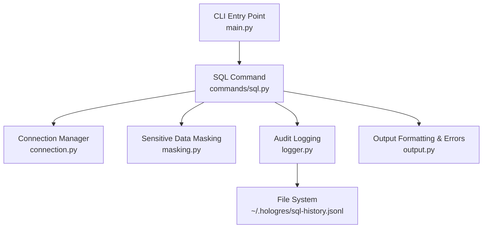
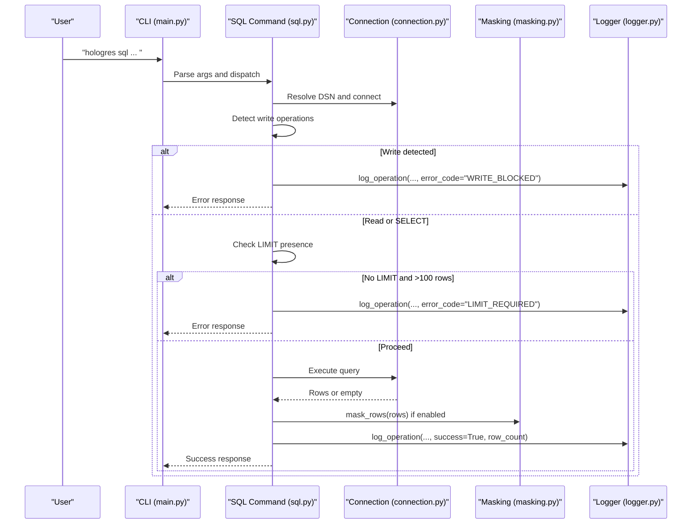
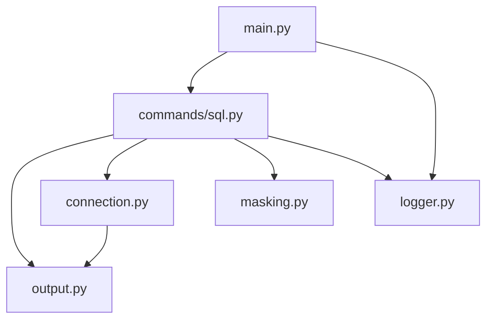

# Safety and Security Features

<cite>
**Referenced Files in This Document**
- [safety-features.md](file://agent-skills/skills/hologres-cli/references/safety-features.md)
- [README.md](file://hologres-cli/README.md)
- [main.py](file://hologres-cli/src/hologres_cli/main.py)
- [connection.py](file://hologres-cli/src/hologres_cli/connection.py)
- [logger.py](file://hologres-cli/src/hologres_cli/logger.py)
- [masking.py](file://hologres-cli/src/hologres_cli/masking.py)
- [output.py](file://hologres-cli/src/hologres_cli/output.py)
- [sql.py](file://hologres-cli/src/hologres_cli/commands/sql.py)
- [test_masking.py](file://hologres-cli/tests/test_masking.py)
- [test_logger.py](file://hologres-cli/tests/test_logger.py)
</cite>

## Table of Contents
1. [Introduction](#introduction)
2. [Project Structure](#project-structure)
3. [Core Components](#core-components)
4. [Architecture Overview](#architecture-overview)
5. [Detailed Component Analysis](#detailed-component-analysis)
6. [Dependency Analysis](#dependency-analysis)
7. [Performance Considerations](#performance-considerations)
8. [Troubleshooting Guide](#troubleshooting-guide)
9. [Conclusion](#conclusion)

## Introduction
This document explains the safety and security features of the Hologres CLI, focusing on:
- Row limit protection (default 100-row threshold)
- Write operation blocking
- Dangerous SQL detection patterns
- Sensitive data masking algorithms
- Password redaction in logs
- Audit logging system with timestamped operations and data redaction
- Safety guardrail configuration and customization options
- Examples of blocked operations and rationale
- Compliance considerations and security best practices for automated database operations

These features are implemented across several modules and enforced during SQL execution, logging, and output formatting.

## Project Structure
The safety and security features are implemented in the following modules:
- SQL command execution with guardrails
- Sensitive data masking
- Audit logging with redaction
- Output formatting and error codes
- Connection management and DSN handling

**Diagram sources**
- [main.py:15-50](file://hologres-cli/src/hologres_cli/main.py#L15-L50)
- [sql.py:34-64](file://hologres-cli/src/hologres_cli/commands/sql.py#L34-L64)
- [connection.py:178-229](file://hologres-cli/src/hologres_cli/connection.py#L178-L229)
- [masking.py:73-93](file://hologres-cli/src/hologres_cli/masking.py#L73-L93)
- [logger.py:36-74](file://hologres-cli/src/hologres_cli/logger.py#L36-L74)
- [output.py:23-63](file://hologres-cli/src/hologres_cli/output.py#L23-L63)

**Section sources**
- [README.md:1-12](file://hologres-cli/README.md#L1-L12)
- [main.py:15-50](file://hologres-cli/src/hologres_cli/main.py#L15-L50)

## Core Components
- Row limit protection: Enforces a default 100-row threshold for SELECT queries without LIMIT.
- Write protection: Blocks all write operations by default.
- Dangerous write detection: Prevents mass updates/deletes without WHERE clauses.
- Sensitive data masking: Masks phone, email, password, ID card, and bank card fields based on column names.
- Password redaction in logs: Redacts sensitive literals and assignments in SQL logs.
- Audit logging: Records timestamped operations with redacted SQL and optional metadata.
- Output formatting: Provides unified JSON responses with standardized error codes.

**Section sources**
- [safety-features.md:5-35](file://agent-skills/skills/hologres-cli/references/safety-features.md#L5-L35)
- [safety-features.md:36-90](file://agent-skills/skills/hologres-cli/references/safety-features.md#L36-L90)
- [safety-features.md:92-114](file://agent-skills/skills/hologres-cli/references/safety-features.md#L92-L114)
- [safety-features.md:115-135](file://agent-skills/skills/hologres-cli/references/safety-features.md#L115-L135)
- [sql.py:25-31](file://hologres-cli/src/hologres_cli/commands/sql.py#L25-L31)
- [sql.py:78-86](file://hologres-cli/src/hologres_cli/commands/sql.py#L78-L86)
- [sql.py:91-101](file://hologres-cli/src/hologres_cli/commands/sql.py#L91-L101)
- [masking.py:66-71](file://hologres-cli/src/hologres_cli/masking.py#L66-L71)
- [logger.py:29-33](file://hologres-cli/src/hologres_cli/logger.py#L29-L33)
- [logger.py:46-74](file://hologres-cli/src/hologres_cli/logger.py#L46-L74)

## Architecture Overview
The safety and security architecture integrates guardrails at the SQL command level, with masking and logging applied post-execution. Connections are managed centrally, and outputs are formatted consistently.

**Diagram sources**
- [main.py:42-49](file://hologres-cli/src/hologres_cli/main.py#L42-L49)
- [sql.py:66-135](file://hologres-cli/src/hologres_cli/commands/sql.py#L66-L135)
- [connection.py:225-229](file://hologres-cli/src/hologres_cli/connection.py#L225-L229)
- [masking.py:73-93](file://hologres-cli/src/hologres_cli/masking.py#L73-L93)
- [logger.py:36-74](file://hologres-cli/src/hologres_cli/logger.py#L36-L74)

## Detailed Component Analysis

### Row Limit Protection
Purpose:
- Prevents accidental retrieval of large result sets that could consume memory, slow clients, or transfer unnecessary data.

Behavior:
- Queries without LIMIT that return more than 100 rows fail with a LIMIT_REQUIRED error.
- Default threshold: 100 rows.
- A probe query adds a temporary LIMIT to detect row counts without retrieving full data.

Customization:
- Use the --no-limit-check option to bypass the check when explicitly intended (e.g., exporting full tables or aggregation queries).

Examples:
- SELECT without LIMIT on a large table fails.
- Adding LIMIT resolves the issue.
- Using --no-limit-check disables the check (use with caution).

Rationale:
- Protects against unintentional resource exhaustion and slow operations.

**Section sources**
- [safety-features.md:5-35](file://agent-skills/skills/hologres-cli/references/safety-features.md#L5-L35)
- [sql.py:25-31](file://hologres-cli/src/hologres_cli/commands/sql.py#L25-L31)
- [sql.py:91-101](file://hologres-cli/src/hologres_cli/commands/sql.py#L91-L101)
- [sql.py:180-184](file://hologres-cli/src/hologres_cli/commands/sql.py#L180-L184)

### Write Operation Blocking
Purpose:
- Prevents accidental write operations by requiring explicit intent.

Behavior:
- All write operations (INSERT, UPDATE, DELETE, DROP, CREATE, ALTER, TRUNCATE, GRANT, REVOKE) are blocked by default.
- Attempts to execute write operations fail with a WRITE_BLOCKED error.

Customization:
- Not applicable; write operations are intentionally blocked for safety.

Examples:
- INSERT without explicit permission fails.
- Correct usage requires appropriate permissions or alternative commands.

Rationale:
- Ensures read-only default behavior for safer automation.

**Section sources**
- [safety-features.md:36-55](file://agent-skills/skills/hologres-cli/references/safety-features.md#L36-L55)
- [sql.py:78-86](file://hologres-cli/src/hologres_cli/commands/sql.py#L78-L86)
- [output.py:137-138](file://hologres-cli/src/hologres_cli/output.py#L137-L138)

### Dangerous Write Detection Patterns
Purpose:
- Prevents mass data modifications that could cause data loss.

Behavior:
- DELETE without WHERE clause is blocked.
- UPDATE without WHERE clause is blocked.
- Returns DANGEROUS_WRITE_BLOCKED error.

Customization:
- Intentionally affecting all rows requires an explicit WHERE true or TRUNCATE.

Examples:
- DELETE/UPDATE without WHERE are blocked.
- Correct usage applies WHERE conditions to target specific rows.
- TRUNCATE is available for clearing tables.

Rationale:
- Protects against unintentional mass deletions or updates.

**Section sources**
- [safety-features.md:56-90](file://agent-skills/skills/hologres-cli/references/safety-features.md#L56-L90)
- [output.py:141-142](file://hologres-cli/src/hologres_cli/output.py#L141-L142)

### Sensitive Data Masking Algorithms
Purpose:
- Protects sensitive information from being displayed in query results.

Behavior:
- Auto-detects sensitive columns by name pattern and masks values:
  - Phone/mobile/tel: Partially masks digits.
  - Email: Masks local part while preserving domain.
  - Password/secret/token: Replaced with asterisks.
  - ID card/SSN: Partially masks middle digits.
  - Bank card/credit card: Masks leading digits, shows trailing digits.

Customization:
- Disable masking with --no-mask for specific queries.

Algorithms:
- Phone: Retains first 3 and last 4 digits; masks middle with asterisks.
- Email: Retains first character of local part; masks rest; preserves domain.
- Password/Secret/Token: Always masked to fixed length.
- ID Card: Retains first 3 and last 4 digits.
- Bank Card: Masks all but last 4 digits.

Validation:
- Tests confirm masking behavior for various inputs and edge cases.

**Section sources**
- [safety-features.md:92-114](file://agent-skills/skills/hologres-cli/references/safety-features.md#L92-L114)
- [masking.py:15-63](file://hologres-cli/src/hologres_cli/masking.py#L15-L63)
- [masking.py:66-71](file://hologres-cli/src/hologres_cli/masking.py#L66-L71)
- [masking.py:73-93](file://hologres-cli/src/hologres_cli/masking.py#L73-L93)
- [test_masking.py:18-455](file://hologres-cli/tests/test_masking.py#L18-L455)

### Password Redaction in Logs
Purpose:
- Prevents sensitive data exposure in audit logs.

Behavior:
- Redacts sensitive literals and assignments in SQL logs:
  - Phone numbers, emails, ID cards, bank cards.
  - Password, secret, token assignments.

Customization:
- Not configurable; redaction is automatic.

Validation:
- Tests verify redaction of multiple patterns and case-insensitive assignments.

**Section sources**
- [safety-features.md:115-135](file://agent-skills/skills/hologres-cli/references/safety-features.md#L115-L135)
- [logger.py:15-22](file://hologres-cli/src/hologres_cli/logger.py#L15-L22)
- [logger.py:29-33](file://hologres-cli/src/hologres_cli/logger.py#L29-L33)
- [test_logger.py:24-95](file://hologres-cli/tests/test_logger.py#L24-L95)

### Audit Logging System
Purpose:
- Maintains a history of all operations for accountability and debugging.

Behavior:
- All commands logged to ~/.hologres/sql-history.jsonl.
- Includes: timestamp, operation, SQL (redacted), result status, row count, duration, and optional error details.
- Automatic log rotation when file size exceeds a threshold.

Customization:
- Not configurable; logs are always enabled.

Log format:
- JSON Lines with timestamp in UTC ISO format.
- SQL content is redacted to protect sensitive data.

**Section sources**
- [safety-features.md:115-135](file://agent-skills/skills/hologres-cli/references/safety-features.md#L115-L135)
- [logger.py:11-13](file://hologres-cli/src/hologres_cli/logger.py#L11-L13)
- [logger.py:46-74](file://hologres-cli/src/hologres_cli/logger.py#L46-L74)
- [logger.py:76-87](file://hologres-cli/src/hologres_cli/logger.py#L76-L87)
- [logger.py:89-105](file://hologres-cli/src/hologres_cli/logger.py#L89-L105)

### Safety Guardrail Configuration and Customization Options
Options exposed by the CLI:
- --no-limit-check: Bypass row limit protection for SELECT queries.
- --no-mask: Disable sensitive data masking for specific queries.
- --dsn: Provide DSN via CLI flag.
- --format: Change output format (JSON, table, CSV, JSONL).

Notes:
- Write operations remain blocked regardless of configuration.
- Dangerous write detection cannot be disabled; use WHERE true or TRUNCATE for intentional full-table operations.

**Section sources**
- [safety-features.md:31-35](file://agent-skills/skills/hologres-cli/references/safety-features.md#L31-L35)
- [safety-features.md:108-114](file://agent-skills/skills/hologres-cli/references/safety-features.md#L108-L114)
- [sql.py:37-40](file://hologres-cli/src/hologres_cli/commands/sql.py#L37-L40)
- [main.py:16-18](file://hologres-cli/src/hologres_cli/main.py#L16-L18)

### Examples of Blocked Operations and Rationale
- SELECT without LIMIT on a large table: Blocked to prevent resource exhaustion; add LIMIT or use --no-limit-check.
- INSERT/UPDATE/DELETE without explicit permission: Blocked to enforce read-only default behavior.
- DELETE/UPDATE without WHERE: Blocked to prevent mass data loss; use WHERE conditions or TRUNCATE.

Rationale:
- All blocks aim to prevent accidental data loss, performance degradation, and exposure of sensitive data.

**Section sources**
- [safety-features.md:17-29](file://agent-skills/skills/hologres-cli/references/safety-features.md#L17-L29)
- [safety-features.md:46-54](file://agent-skills/skills/hologres-cli/references/safety-features.md#L46-L54)
- [safety-features.md:66-90](file://agent-skills/skills/hologres-cli/references/safety-features.md#L66-L90)

### Compliance Considerations and Security Best Practices
- Principle of least privilege: Use read-only operations by default; enable write operations only when necessary.
- Data minimization: Apply WHERE clauses to limit affected rows; avoid broad operations.
- Logging hygiene: Rely on built-in redaction; avoid printing sensitive data to logs.
- Automation safeguards: Prefer explicit LIMITs and WHERE clauses; use --no-limit-check and --no-mask sparingly.
- DSN management: Store DSN securely via environment variables or config files; mask passwords in logs.

**Section sources**
- [README.md:235-270](file://hologres-cli/README.md#L235-L270)
- [connection.py:173-176](file://hologres-cli/src/hologres_cli/connection.py#L173-L176)
- [logger.py:29-33](file://hologres-cli/src/hologres_cli/logger.py#L29-L33)

## Dependency Analysis
The safety and security features depend on:
- SQL command module for enforcement of guardrails
- Masking module for sensitive data protection
- Logger module for audit trails with redaction
- Output module for standardized error codes
- Connection module for DSN resolution and masking

**Diagram sources**
- [sql.py:11-23](file://hologres-cli/src/hologres_cli/commands/sql.py#L11-L23)
- [main.py:42-49](file://hologres-cli/src/hologres_cli/main.py#L42-L49)

**Section sources**
- [sql.py:11-23](file://hologres-cli/src/hologres_cli/commands/sql.py#L11-L23)
- [main.py:42-49](file://hologres-cli/src/hologres_cli/main.py#L42-L49)

## Performance Considerations
- Row limit probe: Uses a small LIMIT to estimate row counts without fetching large datasets.
- Field truncation: Limits overly large fields to prevent rendering overhead.
- Log rotation: Prevents log files from growing indefinitely.

[No sources needed since this section provides general guidance]

## Troubleshooting Guide
Common issues and resolutions:
- LIMIT_REQUIRED: Add LIMIT to reduce result size or use --no-limit-check when appropriate.
- WRITE_BLOCKED: Use appropriate commands or permissions; write operations are intentionally blocked.
- QUERY_ERROR: Fix SQL syntax or execution errors; review logs for redacted details.
- CONNECTION_ERROR: Verify DSN configuration via CLI flag, environment variable, or config file.

**Section sources**
- [output.py:133-134](file://hologres-cli/src/hologres_cli/output.py#L133-L134)
- [output.py:137-138](file://hologres-cli/src/hologres_cli/output.py#L137-L138)
- [output.py:125-130](file://hologres-cli/src/hologres_cli/output.py#L125-L130)
- [main.py:98-107](file://hologres-cli/src/hologres_cli/main.py#L98-L107)

## Conclusion
The Hologres CLI implements robust safety and security features to prevent accidental data loss, protect sensitive information, and maintain auditability. Guardrails include row limit protection, write operation blocking, dangerous write detection, sensitive data masking, and comprehensive audit logging with redaction. These defaults can be customized selectively (e.g., disabling row limit checks or masking) while maintaining strong safeguards for automated operations.