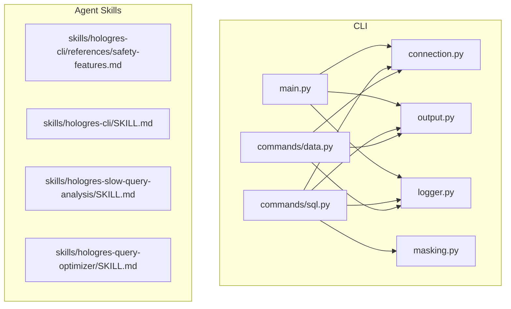
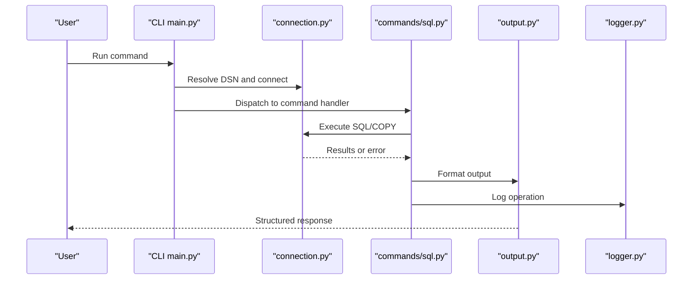
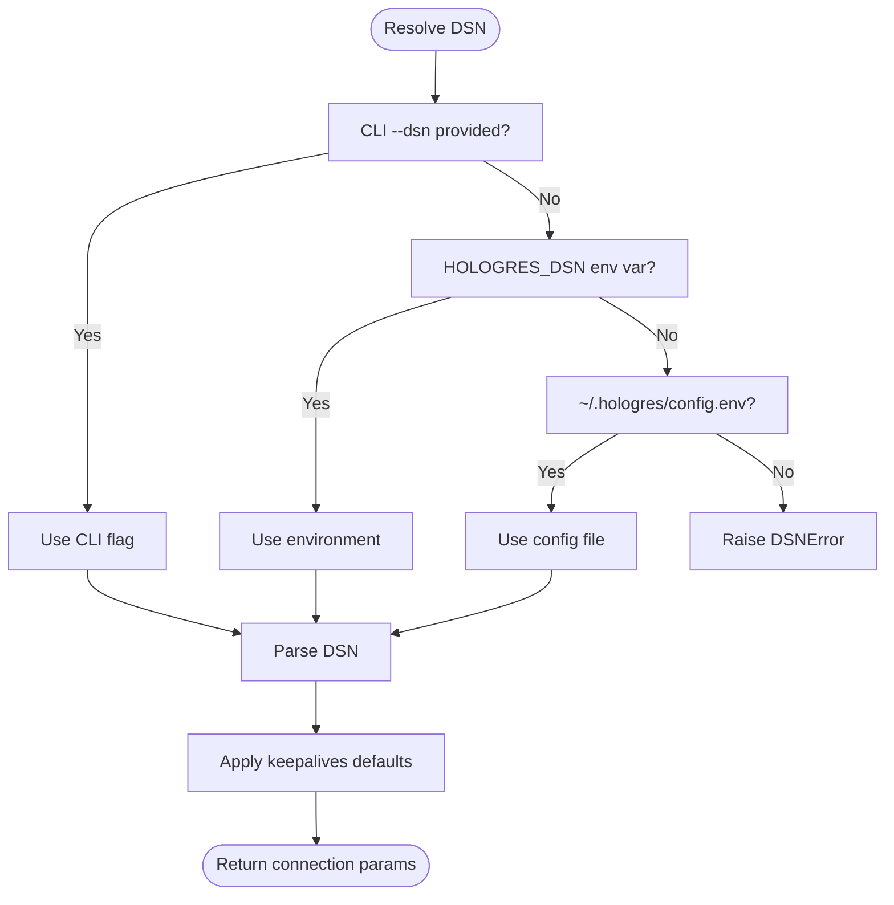
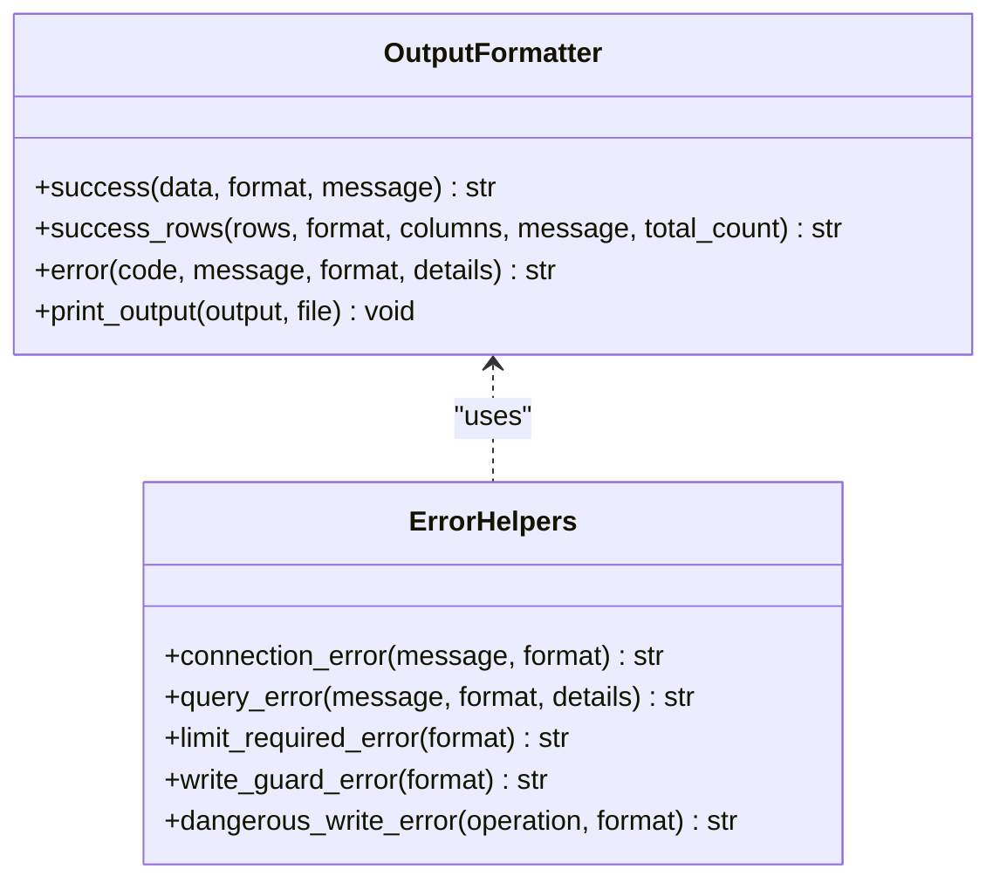
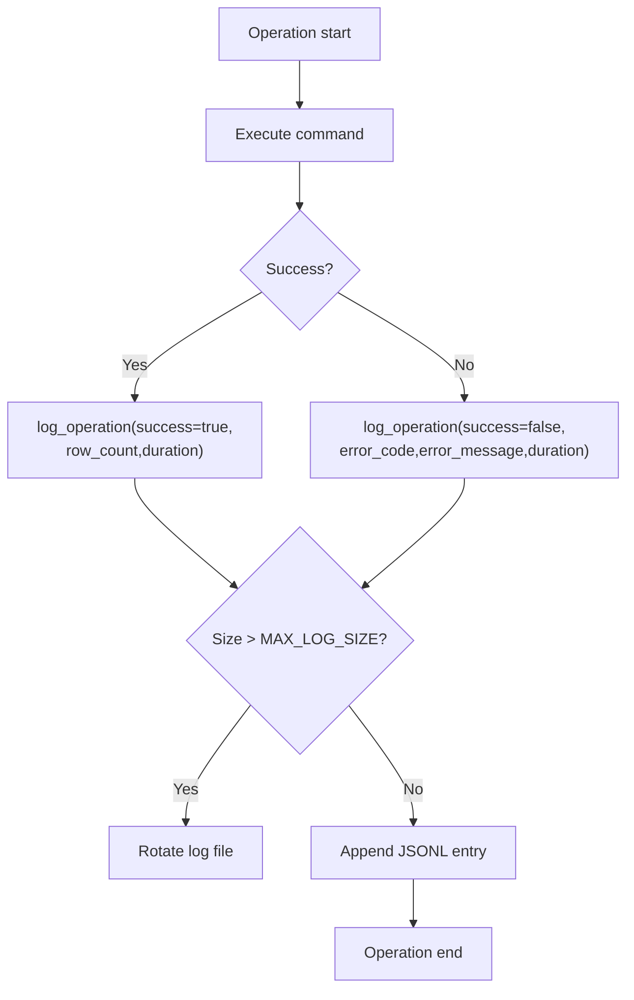
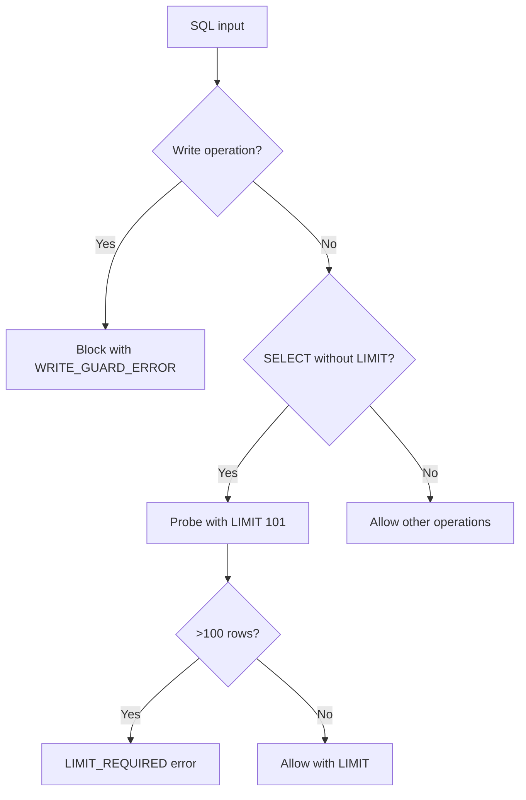
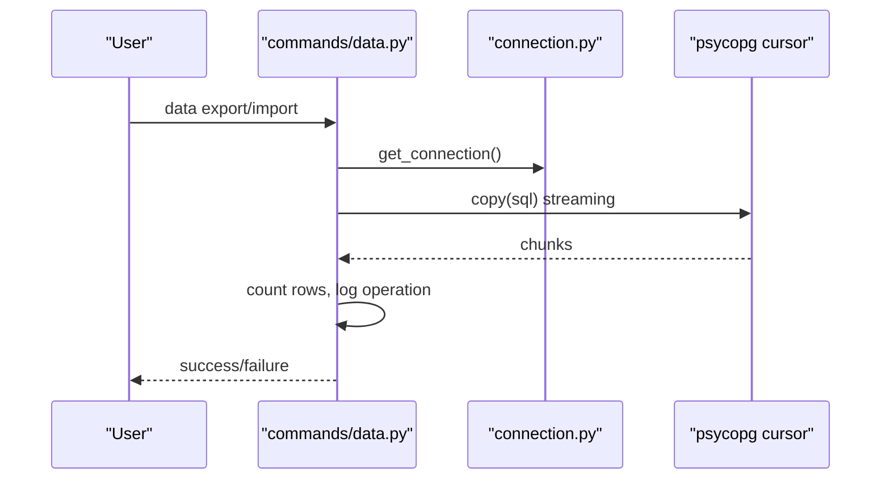
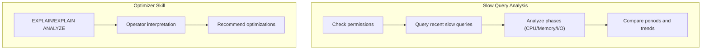
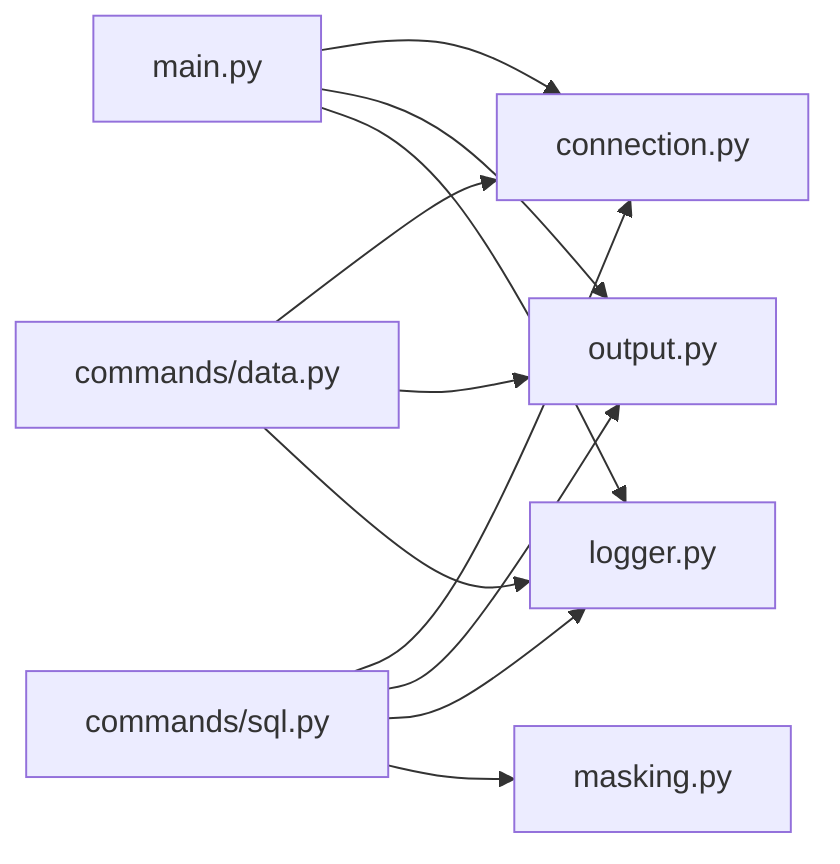

# Troubleshooting and FAQ

<cite>
**Referenced Files in This Document**
- [README.md](file://README.md)
- [main.py](file://hologres-cli/src/hologres_cli/main.py)
- [connection.py](file://hologres-cli/src/hologres_cli/connection.py)
- [logger.py](file://hologres-cli/src/hologres_cli/logger.py)
- [output.py](file://hologres-cli/src/hologres_cli/output.py)
- [masking.py](file://hologres-cli/src/hologres_cli/masking.py)
- [sql.py](file://hologres-cli/src/hologres_cli/commands/sql.py)
- [data.py](file://hologres-cli/src/hologres_cli/commands/data.py)
- [safety-features.md](file://agent-skills/skills/hologres-cli/references/safety-features.md)
- [SKILL.md](file://agent-skills/skills/hologres-cli/SKILL.md)
- [SLOW_QUERY_ANALYSIS_SKILL.md](file://agent-skills/skills/hologres-slow-query-analysis/SKILL.md)
- [SLOW_QUERY_DIAGNOSTIC_QUERIES.md](file://agent-skills/skills/hologres-slow-query-analysis/references/diagnostic-queries.md)
- [QUERY_OPTIMIZER_SKILL.md](file://agent-skills/skills/hologres-query-optimizer/SKILL.md)
- [OPTIMIZATION_PATTERNS.md](file://agent-skills/skills/hologres-query-optimizer/references/optimization-patterns.md)
- [test_connection.py](file://hologres-cli/tests/test_connection.py)
- [test_output.py](file://hologres-cli/tests/test_output.py)
</cite>

## Table of Contents
1. [Introduction](#introduction)
2. [Project Structure](#project-structure)
3. [Core Components](#core-components)
4. [Architecture Overview](#architecture-overview)
5. [Detailed Component Analysis](#detailed-component-analysis)
6. [Dependency Analysis](#dependency-analysis)
7. [Performance Considerations](#performance-considerations)
8. [Troubleshooting Guide](#troubleshooting-guide)
9. [Conclusion](#conclusion)
10. [Appendices](#appendices)

## Introduction
This document provides comprehensive troubleshooting and FAQ guidance for Hologres AI Plugins. It focuses on diagnosing and resolving common issues such as connection failures, authentication errors, permission problems, timeouts, CLI command failures, output formatting issues, and audit logging concerns. It also includes performance optimization tips for slow queries, large data operations, and memory usage, along with safety features, output format options, and AI agent integration guidance. Diagnostic commands and tools are provided to identify configuration problems, and practical guidance is included for interpreting error messages and log entries.

## Project Structure
The repository consists of:
- A Python CLI for Hologres database operations with safety guardrails and structured output
- AI agent skills for CLI usage, query optimization, and slow query analysis
- Tests validating connection, output formatting, and safety features

**Diagram sources**
- [main.py:1-111](file://hologres-cli/src/hologres_cli/main.py#L1-L111)
- [connection.py:1-229](file://hologres-cli/src/hologres_cli/connection.py#L1-L229)
- [output.py:1-143](file://hologres-cli/src/hologres_cli/output.py#L1-L143)
- [logger.py:1-105](file://hologres-cli/src/hologres_cli/logger.py#L1-L105)
- [masking.py:1-93](file://hologres-cli/src/hologres_cli/masking.py#L1-L93)
- [sql.py:1-199](file://hologres-cli/src/hologres_cli/commands/sql.py#L1-L199)
- [data.py:1-266](file://hologres-cli/src/hologres_cli/commands/data.py#L1-L266)
- [safety-features.md:1-145](file://agent-skills/skills/hologres-cli/references/safety-features.md#L1-L145)
- [SKILL.md:1-155](file://agent-skills/skills/hologres-cli/SKILL.md#L1-L155)
- [SLOW_QUERY_ANALYSIS_SKILL.md:1-160](file://agent-skills/skills/hologres-slow-query-analysis/SKILL.md#L1-L160)
- [QUERY_OPTIMIZER_SKILL.md:1-187](file://agent-skills/skills/hologres-query-optimizer/SKILL.md#L1-L187)

**Section sources**
- [README.md:1-142](file://README.md#L1-L142)
- [main.py:1-111](file://hologres-cli/src/hologres_cli/main.py#L1-L111)

## Core Components
- CLI entry point and command routing
- Connection management with DSN resolution and keepalive defaults
- Output formatting (JSON, table, CSV, JSONL) and standardized error responses
- Audit logging with sensitive data redaction and rotation
- Safety features: row limit protection, write guardrails, dangerous write blocking, and sensitive data masking
- Data import/export using COPY protocol with validation and truncation support
- Slow query analysis and query optimization skills for performance diagnosis

**Section sources**
- [main.py:1-111](file://hologres-cli/src/hologres_cli/main.py#L1-L111)
- [connection.py:1-229](file://hologres-cli/src/hologres_cli/connection.py#L1-L229)
- [output.py:1-143](file://hologres-cli/src/hologres_cli/output.py#L1-L143)
- [logger.py:1-105](file://hologres-cli/src/hologres_cli/logger.py#L1-L105)
- [masking.py:1-93](file://hologres-cli/src/hologres_cli/masking.py#L1-L93)
- [sql.py:1-199](file://hologres-cli/src/hologres_cli/commands/sql.py#L1-L199)
- [data.py:1-266](file://hologres-cli/src/hologres_cli/commands/data.py#L1-L266)
- [safety-features.md:1-145](file://agent-skills/skills/hologres-cli/references/safety-features.md#L1-L145)
- [SKILL.md:1-155](file://agent-skills/skills/hologres-cli/SKILL.md#L1-L155)

## Architecture Overview
The CLI orchestrates commands, manages connections, applies safety checks, formats output, and logs operations. The slow query and optimization skills complement CLI operations by providing performance diagnostics and recommendations.

**Diagram sources**
- [main.py:98-111](file://hologres-cli/src/hologres_cli/main.py#L98-L111)
- [connection.py:225-229](file://hologres-cli/src/hologres_cli/connection.py#L225-L229)
- [sql.py:66-135](file://hologres-cli/src/hologres_cli/commands/sql.py#L66-L135)
- [output.py:23-63](file://hologres-cli/src/hologres_cli/output.py#L23-L63)
- [logger.py:36-74](file://hologres-cli/src/hologres_cli/logger.py#L36-L74)

## Detailed Component Analysis

### Connection Management and DSN Resolution
- DSN resolution priority: CLI flag, environment variable, config file
- Supported schemes: hologres://, postgresql://, postgres://
- Keepalive defaults applied automatically
- Password masking for logging and safe display

**Diagram sources**
- [connection.py:39-170](file://hologres-cli/src/hologres_cli/connection.py#L39-L170)

**Section sources**
- [connection.py:1-229](file://hologres-cli/src/hologres_cli/connection.py#L1-L229)
- [test_connection.py:22-119](file://hologres-cli/tests/test_connection.py#L22-L119)

### Output Formatting and Error Responses
- Standardized JSON response structure with ok/error fields
- Support for table, CSV, JSONL formats
- Dedicated helpers for safety and connection errors

**Diagram sources**
- [output.py:23-143](file://hologres-cli/src/hologres_cli/output.py#L23-L143)

**Section sources**
- [output.py:1-143](file://hologres-cli/src/hologres_cli/output.py#L1-L143)
- [test_output.py:29-338](file://hologres-cli/tests/test_output.py#L29-L338)

### Audit Logging and Sensitive Data Redaction
- Logs stored in JSON Lines format with rotation
- Automatic redaction of sensitive literals and patterns
- Operation metadata includes timing, row counts, and error details

**Diagram sources**
- [logger.py:36-104](file://hologres-cli/src/hologres_cli/logger.py#L36-L104)

**Section sources**
- [logger.py:1-105](file://hologres-cli/src/hologres_cli/logger.py#L1-L105)
- [masking.py:1-93](file://hologres-cli/src/hologres_cli/masking.py#L1-L93)

### Safety Features and Guardrails
- Row limit protection for SELECT queries
- Write guard requiring explicit --write flag
- Dangerous write blocking for DELETE/UPDATE without WHERE
- Sensitive data masking by column pattern

**Diagram sources**
- [sql.py:66-135](file://hologres-cli/src/hologres_cli/commands/sql.py#L66-L135)
- [safety-features.md:5-90](file://agent-skills/skills/hologres-cli/references/safety-features.md#L5-L90)

**Section sources**
- [sql.py:1-199](file://hologres-cli/src/hologres_cli/commands/sql.py#L1-L199)
- [safety-features.md:1-145](file://agent-skills/skills/hologres-cli/references/safety-features.md#L1-L145)

### Data Import/Export Operations
- COPY protocol for efficient CSV import/export
- Identifier validation to prevent SQL injection
- Truncate option and delimiter customization

**Diagram sources**
- [data.py:50-213](file://hologres-cli/src/hologres_cli/commands/data.py#L50-L213)

**Section sources**
- [data.py:1-266](file://hologres-cli/src/hologres_cli/commands/data.py#L1-L266)

### Slow Query Analysis and Query Optimization
- Use hg_query_log for diagnosing slow and failed queries
- Phase analysis (optimization/startup/execution)
- Optimization patterns and GUC parameter guidance

**Diagram sources**
- [SLOW_QUERY_ANALYSIS_SKILL.md:1-160](file://agent-skills/skills/hologres-slow-query-analysis/SKILL.md#L1-L160)
- [QUERY_OPTIMIZER_SKILL.md:1-187](file://agent-skills/skills/hologres-query-optimizer/SKILL.md#L1-L187)

**Section sources**
- [SLOW_QUERY_ANALYSIS_SKILL.md:1-160](file://agent-skills/skills/hologres-slow-query-analysis/SKILL.md#L1-L160)
- [SLOW_QUERY_DIAGNOSTIC_QUERIES.md:1-176](file://agent-skills/skills/hologres-slow-query-analysis/references/diagnostic-queries.md#L1-L176)
- [QUERY_OPTIMIZER_SKILL.md:1-187](file://agent-skills/skills/hologres-query-optimizer/SKILL.md#L1-L187)
- [OPTIMIZATION_PATTERNS.md:1-165](file://agent-skills/skills/hologres-query-optimizer/references/optimization-patterns.md#L1-L165)

## Dependency Analysis
- CLI main depends on connection, output, and logger modules
- SQL command depends on connection, output, logger, and masking
- Data command depends on connection, output, and logger
- Tests validate connection parsing, DSN resolution, and output formatting

**Diagram sources**
- [main.py:10-49](file://hologres-cli/src/hologres_cli/main.py#L10-L49)
- [sql.py:11-23](file://hologres-cli/src/hologres_cli/commands/sql.py#L11-L23)
- [data.py:13-22](file://hologres-cli/src/hologres_cli/commands/data.py#L13-L22)

**Section sources**
- [main.py:1-111](file://hologres-cli/src/hologres_cli/main.py#L1-L111)
- [sql.py:1-199](file://hologres-cli/src/hologres_cli/commands/sql.py#L1-L199)
- [data.py:1-266](file://hologres-cli/src/hologres_cli/commands/data.py#L1-L266)
- [test_connection.py:1-385](file://hologres-cli/tests/test_connection.py#L1-L385)
- [test_output.py:1-355](file://hologres-cli/tests/test_output.py#L1-L355)

## Performance Considerations
- Use LIMIT clauses for large result sets to avoid memory pressure
- Prefer data export/import via COPY for bulk operations
- Enable and tune GUC parameters for aggregation and join order
- Monitor slow query logs and focus on high CPU/memory phases
- Apply optimization patterns: statistics updates, distribution keys, indexes, and PQE-to-HQE rewrites

[No sources needed since this section provides general guidance]

## Troubleshooting Guide

### Connection Problems
Symptoms
- CLI exits with CONNECTION_ERROR
- Network connectivity or credential issues

Diagnostic steps
- Verify DSN via CLI flag, environment variable, or config file
- Confirm host, port, and database name are correct
- Check keepalive parameters and connection timeouts
- Inspect masked DSN in audit logs for visibility

Resolution
- Set HOLOGRES_DSN environment variable or CLI flag
- Ensure config file exists at ~/.hologres/config.env with proper key/value
- Adjust connect_timeout and keepalives parameters in DSN query string

**Section sources**
- [connection.py:39-170](file://hologres-cli/src/hologres_cli/connection.py#L39-L170)
- [logger.py:36-74](file://hologres-cli/src/hologres_cli/logger.py#L36-L74)
- [test_connection.py:22-119](file://hologres-cli/tests/test_connection.py#L22-L119)

### Authentication Failures
Symptoms
- Authentication errors when connecting to database
- Incorrect username/password or missing credentials

Diagnostic steps
- Confirm DSN includes user and password
- Check URL-decoded credentials if special characters are present
- Validate database user privileges

Resolution
- Rebuild DSN with correct credentials
- Use environment variable or config file for secure storage
- Ensure database user has required access

**Section sources**
- [connection.py:120-170](file://hologres-cli/src/hologres_cli/connection.py#L120-L170)
- [test_connection.py:25-105](file://hologres-cli/tests/test_connection.py#L25-L105)

### Permission Errors
Symptoms
- Access denied for slow query log or statistics
- Failure to read hg_query_log

Diagnostic steps
- Verify superuser or pg_read_all_stats privileges
- Check SPM model grants for current database
- Confirm account has access to target database

Resolution
- Grant appropriate privileges to cloud account
- Use SPM grant procedure for database-scoped access
- Re-test with elevated privileges

**Section sources**
- [SLOW_QUERY_ANALYSIS_SKILL.md:24-35](file://agent-skills/skills/hologres-slow-query-analysis/SKILL.md#L24-L35)

### Timeout Issues
Symptoms
- Connection or query timeouts during long operations

Diagnostic steps
- Increase connect_timeout in DSN
- Adjust keepalives_idle/interval/count in DSN
- Monitor slow query logs for long-running phases

Resolution
- Tune DSN keepalive parameters for persistent connections
- Use shorter queries with LIMIT or pagination
- Optimize query execution plan and statistics

**Section sources**
- [connection.py:120-170](file://hologres-cli/src/hologres_cli/connection.py#L120-L170)
- [QUERY_OPTIMIZER_SKILL.md:155-167](file://agent-skills/skills/hologres-query-optimizer/SKILL.md#L155-L167)

### CLI Command Failures
Symptoms
- Unexpected error codes in JSON output
- Output not formatted as expected

Diagnostic steps
- Check error.code and error.message in response
- Verify output format (-f json|table|csv|jsonl)
- Review audit log for operation metadata

Resolution
- Address specific error codes (see Error Code Reference)
- Adjust output format for downstream consumption
- Use history command to inspect recent operations

**Section sources**
- [output.py:57-63](file://hologres-cli/src/hologres_cli/output.py#L57-L63)
- [main.py:86-96](file://hologres-cli/src/hologres_cli/main.py#L86-L96)
- [logger.py:89-104](file://hologres-cli/src/hologres_cli/logger.py#L89-L104)

### Output Formatting Problems
Symptoms
- Unexpected table/CSV/JSONL output
- Missing columns or truncated fields

Diagnostic steps
- Confirm selected format with -f flag
- Check for large field truncation (>1000 chars)
- Validate CSV header matches expected columns

Resolution
- Change format to desired output type
- Use JSON for machine parsing or table for human readability
- Review truncation behavior and adjust queries accordingly

**Section sources**
- [output.py:91-117](file://hologres-cli/src/hologres_cli/output.py#L91-L117)
- [sql.py:186-199](file://hologres-cli/src/hologres_cli/commands/sql.py#L186-L199)
- [test_output.py:46-141](file://hologres-cli/tests/test_output.py#L46-L141)

### Audit Logging Issues
Symptoms
- History not showing recent commands
- Log file not rotating or missing sensitive redaction

Diagnostic steps
- Check ~/.hologres/sql-history.jsonl existence and size
- Verify log rotation threshold and backup handling
- Ensure sensitive literal patterns are detected

Resolution
- Increase --count for history command
- Manually rotate or clear old logs if needed
- Confirm redaction patterns for passwords and PII

**Section sources**
- [logger.py:25-104](file://hologres-cli/src/hologres_cli/logger.py#L25-L104)
- [masking.py:15-63](file://hologres-cli/src/hologres_cli/masking.py#L15-L63)

### Safety Feature Errors
Symptoms
- LIMIT_REQUIRED, WRITE_GUARD_ERROR, or DANGEROUS_WRITE_BLOCKED

Diagnostic steps
- Review safety-features documentation for behavior
- Determine if --no-limit-check or --write flag is appropriate
- Ensure WHERE clause for DELETE/UPDATE operations

Resolution
- Add LIMIT to SELECT queries
- Use --write flag for DML operations
- Include WHERE clause for mass updates/deletes

**Section sources**
- [safety-features.md:5-90](file://agent-skills/skills/hologres-cli/references/safety-features.md#L5-L90)
- [output.py:125-143](file://hologres-cli/src/hologres_cli/output.py#L125-L143)
- [sql.py:66-135](file://hologres-cli/src/hologres_cli/commands/sql.py#L66-L135)

### Error Code Reference
- CONNECTION_ERROR: Cannot connect to database; verify DSN, network, and credentials
- QUERY_ERROR: SQL syntax or execution error; fix SQL statement
- LIMIT_REQUIRED: SELECT without LIMIT returning >100 rows; add LIMIT or use --no-limit-check
- WRITE_GUARD_ERROR: Write operation without --write flag; add --write flag
- DANGEROUS_WRITE_BLOCKED: DELETE/UPDATE without WHERE clause; add WHERE clause

**Section sources**
- [safety-features.md:136-145](file://agent-skills/skills/hologres-cli/references/safety-features.md#L136-L145)
- [output.py:125-143](file://hologres-cli/src/hologres_cli/output.py#L125-L143)

### Performance Optimization Tips
- Slow queries: Use hg_query_log to identify top CPU/memory consumers and analyze phases
- Large data operations: Prefer COPY-based import/export and paginated queries
- Memory usage: Monitor peak memory in logs and reduce result set sizes with LIMIT and filters
- Query plans: Use EXPLAIN ANALYZE and apply optimization patterns (statistics, distribution keys, indexes, PQE-to-HQE rewrites)

**Section sources**
- [SLOW_QUERY_ANALYSIS_SKILL.md:60-160](file://agent-skills/skills/hologres-slow-query-analysis/SKILL.md#L60-L160)
- [QUERY_OPTIMIZER_SKILL.md:139-187](file://agent-skills/skills/hologres-query-optimizer/SKILL.md#L139-L187)
- [OPTIMIZATION_PATTERNS.md:1-165](file://agent-skills/skills/hologres-query-optimizer/references/optimization-patterns.md#L1-L165)

### Frequently Asked Questions

Q1: How do I integrate with AI agents?
- Use JSON output format for structured responses
- Load skills for CLI usage, query optimization, and slow query analysis
- Leverage ai-guide command for agent guidance

Q2: What output formats are supported?
- JSON (default), table, CSV, JSONL
- Choose format with -f flag for downstream consumption

Q3: How does safety work?
- Row limit protection, write guardrails, dangerous write blocking, and sensitive data masking
- Configure behavior with flags and review safety-features documentation

Q4: How do I diagnose slow queries?
- Use hg_query_log queries to find heavy queries and analyze phases
- Compare periods and check engine types for PQE vs HQE

Q5: How do I interpret error messages?
- Check error.code and error.message in JSON responses
- Review audit logs for timestamps, durations, and row counts

**Section sources**
- [SKILL.md:69-155](file://agent-skills/skills/hologres-cli/SKILL.md#L69-L155)
- [safety-features.md:1-145](file://agent-skills/skills/hologres-cli/references/safety-features.md#L1-L145)
- [SLOW_QUERY_ANALYSIS_SKILL.md:1-160](file://agent-skills/skills/hologres-slow-query-analysis/SKILL.md#L1-L160)
- [QUERY_OPTIMIZER_SKILL.md:1-187](file://agent-skills/skills/hologres-query-optimizer/SKILL.md#L1-L187)

### Diagnostic Commands and Tools
- Connection status: hologres status
- Command history: hologres history [-n count]
- AI agent guide: hologres ai-guide
- Slow query analysis: Use diagnostic queries from slow query analysis skill
- Query optimization: EXPLAIN/EXPLAIN ANALYZE followed by operator interpretation

**Section sources**
- [main.py:52-96](file://hologres-cli/src/hologres_cli/main.py#L52-L96)
- [SLOW_QUERY_DIAGNOSTIC_QUERIES.md:1-176](file://agent-skills/skills/hologres-slow-query-analysis/references/diagnostic-queries.md#L1-L176)

## Conclusion
This guide consolidates troubleshooting workflows, error code interpretations, and performance optimization strategies for Hologres AI Plugins. By leveraging structured output, audit logging, safety guardrails, and the provided diagnostic commands, users can quickly identify and resolve issues while maintaining secure and efficient database operations.

[No sources needed since this section summarizes without analyzing specific files]

## Appendices

### Configuration Checklist
- DSN configured via CLI flag, environment variable, or config file
- Proper credentials and database access
- Output format selected for use case
- Safety flags used appropriately (--write, --no-limit-check)
- Audit logging enabled and monitored

**Section sources**
- [connection.py:39-170](file://hologres-cli/src/hologres_cli/connection.py#L39-L170)
- [output.py:16-21](file://hologres-cli/src/hologres_cli/output.py#L16-L21)
- [logger.py:25-74](file://hologres-cli/src/hologres_cli/logger.py#L25-L74)